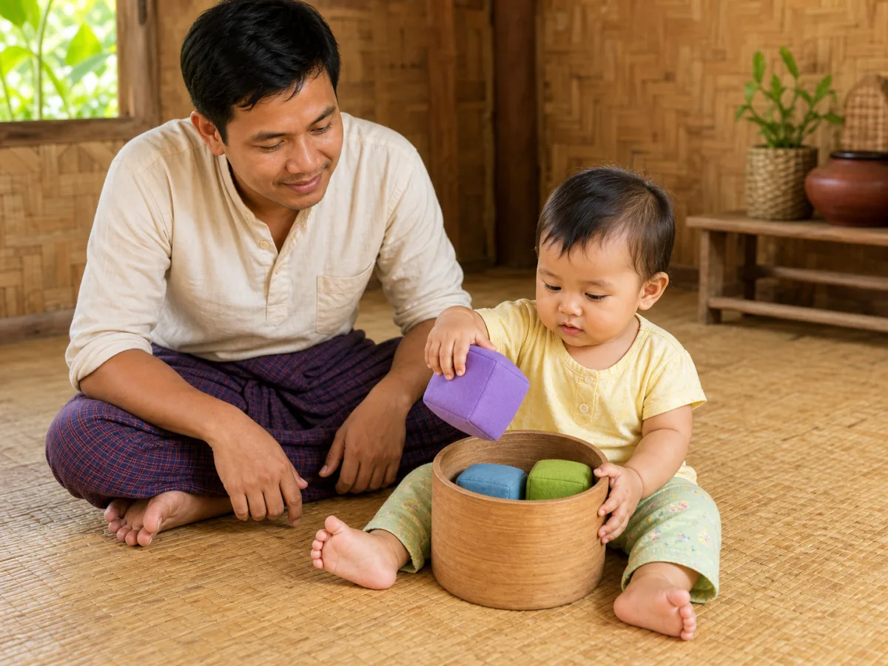
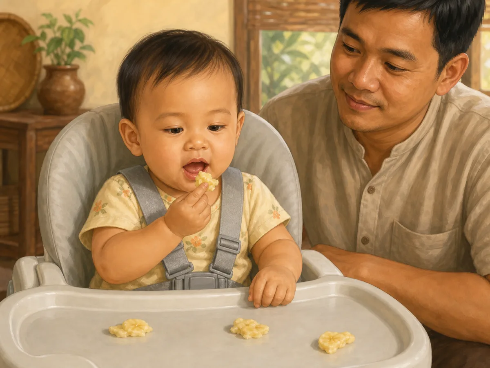

# ACE Child Grow — 10–12 Month Milestone Illustration Review

Status: **OWNER APPROVED — NOT DEPLOYED**

Source of truth: Production Convex `libraryContent`, filtered to `type = milestone`, `ageGroupKey = 10_12m`, and `clinicalStatus = published`. Read on 2026-08-02. Production contains exactly two published records for this age group. `summaryMm`, `summaryEn`, and `category` are unavailable for both records.

Each illustration was generated through one separate Built-in ImageGen call, clinically reviewed, and saved as a unique wordless 1200×900 WebP under 500 KB. Every exact slug maps directly to one exact asset with no domain/category fallback.

## 1. `ms_10_12m_problem_solving_2`

- Myanmar title: ဘူးထဲ ထည့်၍ ပြန်ထုတ်ခြင်း
- English title: Putting things in and taking them out
- observeMm: ကလေးသည် ပစ္စည်းကို ဘူး သို့မဟုတ် ခွက်ထဲ ထည့်ပြီး ပြန်ထုတ်ပါသလား။
- observeEn: Does she drop things into a box or cup and take them out again?
- Meaning: ဤအရွယ်တွင် ကလေးသည် အကြောင်းနှင့် အကျိုးကို စမ်းသပ်လေ့ရှိသည် — ချလိုက်၊ ရိုက်လိုက်၊ ထည့်လိုက်၊ ထုတ်လိုက် လုပ်ခြင်းဖြင့် ကမ္ဘာကို သင်ယူသည်။ တစ်ခုပြီး တစ်ခု ထပ်ခါထပ်ခါ လုပ်ခြင်းသည် ငြီးငွေ့ဖွယ် မဟုတ်ဘဲ သင်ယူမှု ဖြစ်သည်။ / At this age babies test cause and effect — dropping, banging, filling and emptying is how they learn how the world works. The endless repetition is not boredom, it is study.
- Domain: `problem_solving`
- Asset: `/milestones/10_12m/ms_10_12m_problem_solving_2.da7b3eb098.webp`

QA: **READY FOR OWNER REVIEW** — one hand lifts a soft cube out while the other steadies the wide container and two cubes remain visible inside; all pieces are too large to swallow. Age, anatomy, hands, feet, gaze, safety, cultural fit, uniqueness, and wordless output pass; no throwing, banging, stacking, or unrelated action.

## 2. `ms_10_12m_self_help_1`

- Myanmar title: လက်ဖြင့် ကိုယ်တိုင်စားခြင်း
- English title: Finger-feeds self
- observeMm: နူးညံ့ပြီး အရွယ်သင့်အောင် ပြင်ဆင်ထားသော အစားအစာများကို လက်ဖြင့် ကောက်စားပါသလား။
- observeEn: Picks up small soft foods to eat?
- Meaning: ကိုယ်တိုင်စားခြင်းသည် လွတ်လပ်မှုနှင့် လက်ကျွမ်းကျင်မှုကို လေ့ကျင့်စေသည်။ / Self-feeding builds independence and hand skill.
- Domain: `self_help`
- Asset: `/milestones/10_12m/ms_10_12m_self_help_1.f2da50ecc2.webp`

QA: **READY FOR OWNER REVIEW** — baby independently uses an early thumb-and-index grasp to bring a moist mashable morsel to the mouth while securely strapped upright and closely supervised. No hard, round, or choking-risk food; no spoon, cup, bottle, caregiver feeding, or unrelated action. Anatomy and all content checks pass.

## Engineering and application verification

- Exact slug mapping: **PASS**
- Unique asset paths: **PASS** — two slugs resolve to two unique files
- Existing asset files: **PASS** — both files are 1200×900 WebP and 72–120 KB
- Next/Previous image navigation through both milestones: **PASS** — automated component navigation test
- Full unit suite: **PASS** — 910 tests
- Type check and lint: **PASS**
- Production build: **PASS** — no asset-related warning, missing import, missing image, or broken route
- PWA precache: **PASS** — both exact 10–12 month assets appear in `dist/sw.js`
- Mobile/desktop browser screenshots: **BLOCKED** — the in-app browser refused the local preview because its admin-enforced security policy could not be verified. The security control was not bypassed. Visual owner review remains available through the two previews above.
- Deployment: **NOT ALLOWED / NOT PERFORMED**
