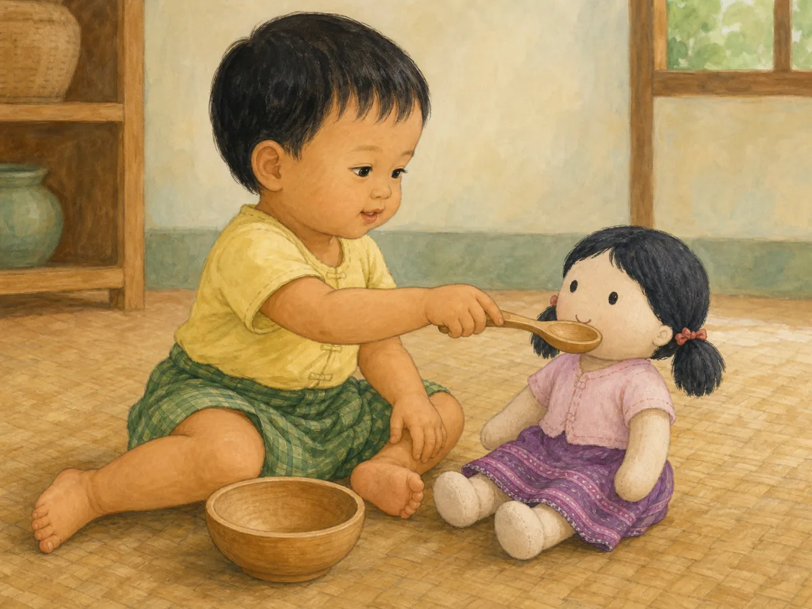
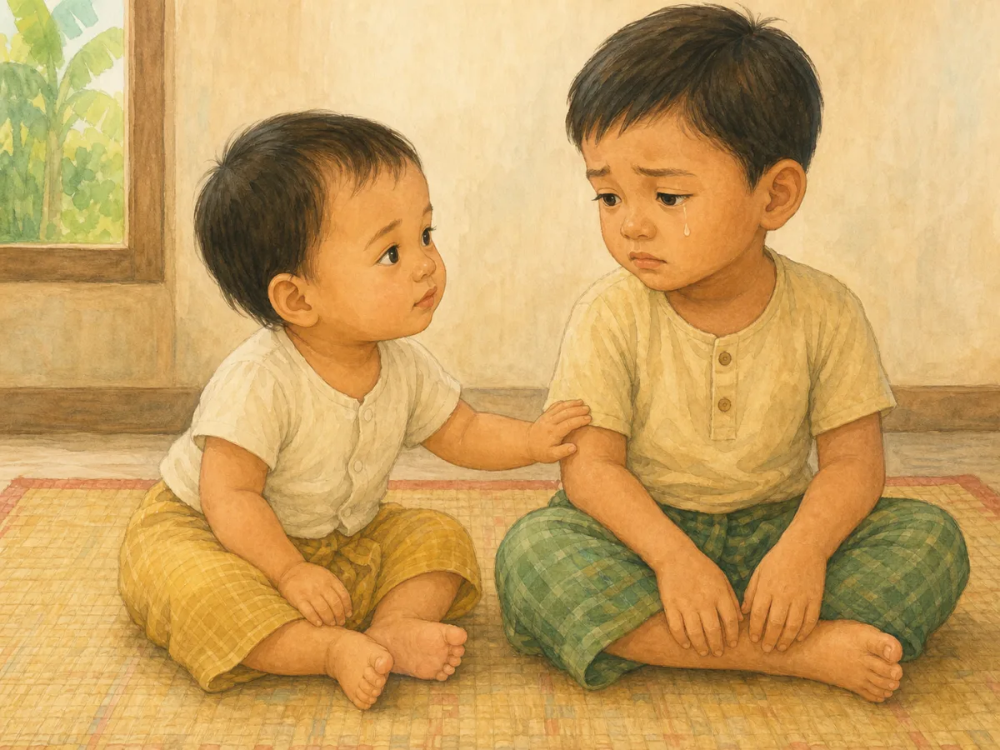
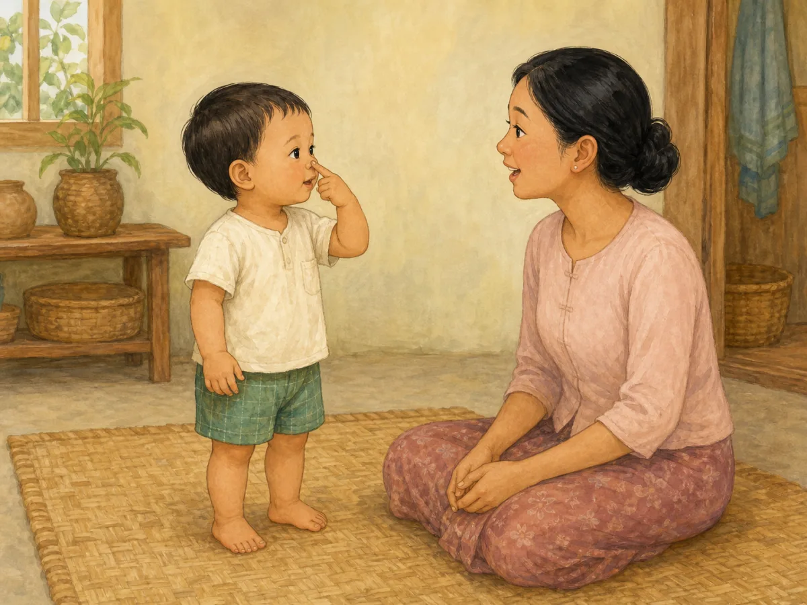
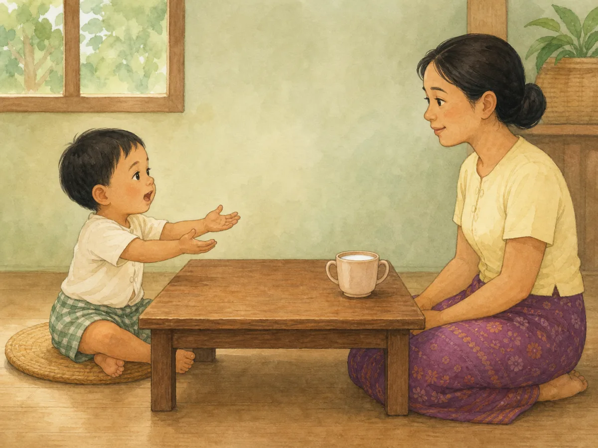

# ACE Child Grow — 19–24 Month Milestone Illustration Review

Status: **OWNER APPROVED — NOT DEPLOYED**

Source of truth: Production Convex `libraryContent`, filtered to `type = milestone`, `ageGroupKey = 19_24m`, and `clinicalStatus = published`. Read on 2026-08-02. Production contains exactly four published records for this age group. `summaryMm`, `summaryEn`, `category`, and `safety` are unavailable for all four records.

Each milestone was generated independently with Built-in ImageGen, clinically reviewed, and saved as a unique wordless 1200×900 WebP under 500 KB. Every exact slug maps directly to one exact asset with no domain/category fallback.

## 1. `ms_19_24m_play_1`

- Myanmar title: ဟန်ဆောင်ကစားခြင်း
- English title: Pretend play
- observeMm: အရုပ်ကို ကျွေးသည်ဟန်၊ ဖုန်းပြောသည်ဟန် ကစားပါသလား။
- observeEn: Pretends to feed a doll or talk on a phone?
- Meaning: ဟန်ဆောင်ကစားခြင်းသည် စိတ်ကူးဉာဏ်နှင့် ဘာသာစကားကို ကြီးထွားစေသည်။ / Pretend play grows imagination and language.
- Domain: `play`
- Asset: `/milestones/19_24m/ms_19_24m_play_1.a15630e326.webp`

QA: **READY FOR OWNER REVIEW** — toddler brings one empty child-safe spoon to the doll’s mouth beside one empty bowl. Age, anatomy, hands, feet, gaze, imagination, cultural fit, safety, uniqueness, and wordless output pass; no real food, self-feeding, phone action, additional toy, or choking hazard.

## 2. `ms_19_24m_emotional_1`

- Myanmar title: အခြားသူများ၏ ခံစားမှုကို သတိပြုခြင်း
- English title: Notices others’ feelings
- observeMm: တစ်ယောက်ငိုပါက စိတ်ဝင်စား/စိုးရိမ်ဟန် ပြပါသလား။
- observeEn: Reacts when someone is upset?
- Meaning: ဤသည်မှာ သူတစ်ပါး၏ ခံစားချက်ကို နားလည်စာနာတတ်လာခြင်း၏ အစဖြစ်သည်။ / This is the beginning of empathy.
- Domain: `emotional`
- Asset: `/milestones/19_24m/ms_19_24m_emotional_1.e9b1022f05.webp`

QA: **READY FOR OWNER REVIEW** — toddler clearly notices the older sibling’s sad face and single tear, makes attentive eye contact, and gently touches the sibling’s arm. Age, anatomy, emotion, cultural fit, safety, uniqueness, and wordless output pass; no injury, fight, dramatic event, toy, or unrelated action.

## 3. `ms_19_24m_cognitive_1`

- Myanmar title: ခန္ဓာကိုယ် အစိတ်အပိုင်း ညွှန်ပြခြင်း
- English title: Points to body parts
- observeMm: “နှာခေါင်း ဘယ်မှာလဲ” ဆိုလျှင် ညွှန်ပြပါသလား။
- observeEn: Points to nose/eyes when asked?
- Meaning: ဤသည်မှာ စကားလုံးများကို အရာဝတ္ထုနှင့် ချိတ်ဆက်ခြင်းဖြစ်သည်။ / This links words to things.
- Domain: `cognitive`
- Asset: `/milestones/19_24m/ms_19_24m_cognitive_1.bfa90577f1.webp`

QA: **READY FOR OWNER REVIEW** — toddler uses one index finger to touch only their own nose while the mother asks without pointing or modeling. Age, standing posture, anatomy, hands, feet, gaze, cultural fit, safety, uniqueness, and wordless output pass; no other body part, imitation, prop, or unrelated action.

## 4. `ms_19_24m_language_1`

- Myanmar title: စကားလုံး နှစ်လုံး ပေါင်းပြောခြင်း
- English title: Puts two words together
- observeMm: “ရေ သောက်” ကဲ့သို့ နှစ်လုံးတွဲ ပြောပါသလား။
- observeEn: Says two-word phrases like “want milk”?
- Meaning: ဤသည်မှာ ဝါကျ တည်ဆောက်မှု၏ အစဖြစ်သည်။ / This is the start of building sentences.
- Domain: `language`
- Asset: `/milestones/19_24m/ms_19_24m_language_1.30e68ca87a.webp`

QA: **READY FOR OWNER REVIEW** — toddler purposefully looks toward the milk cup and silent listening mother while forming a short request and holding both empty hands forward. Age, anatomy, hands, feet, gaze, cultural fit, supervision, uniqueness, and wordless output pass; no drinking, modeling, repetition cue, babbling, food, bottle, or unrelated action.

## Engineering and application verification

- Exact slug mapping: **PASS**
- Unique asset paths: **PASS** — four slugs resolve to four unique files
- Existing asset files: **PASS** — all four files are 1200×900 WebP and 102–123 KB
- Next/Previous image navigation: **PASS** — automated component test traverses all four exact-slug images and returns to the preceding image
- Full unit suite: **PASS** — 918 tests
- Type check and lint: **PASS**
- Production build: **PASS** — no asset-related warning, missing import, missing image, or broken route; the existing unrelated bundle-size advisory remains
- PWA precache: **PASS** — all four exact 19–24 month assets appear in `dist/sw.js`
- Mobile/desktop browser screenshots: **BLOCKED** — the in-app browser refused the local preview because its admin-enforced security policy could not be verified. The security control was not bypassed. Visual owner review remains available through the four previews above.
- Deployment: **NOT ALLOWED / NOT PERFORMED**
