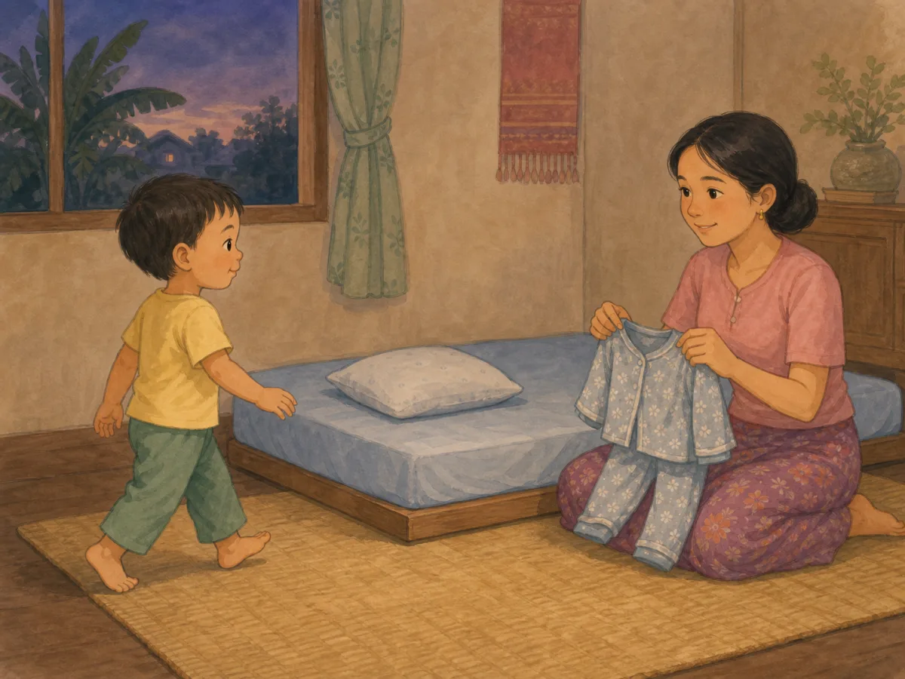
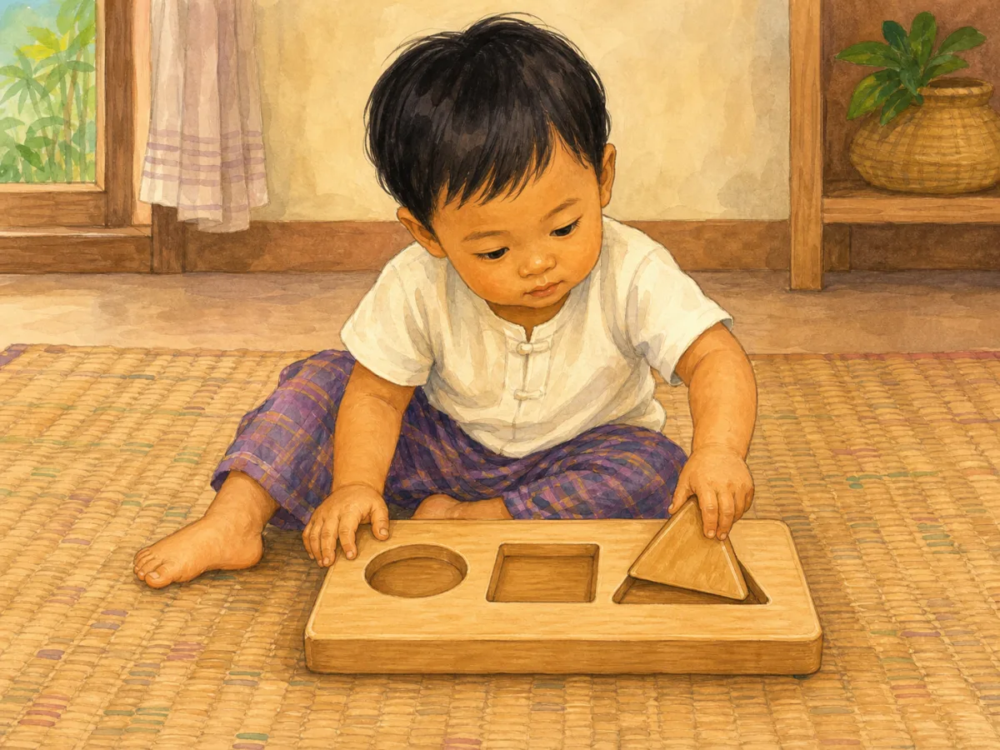
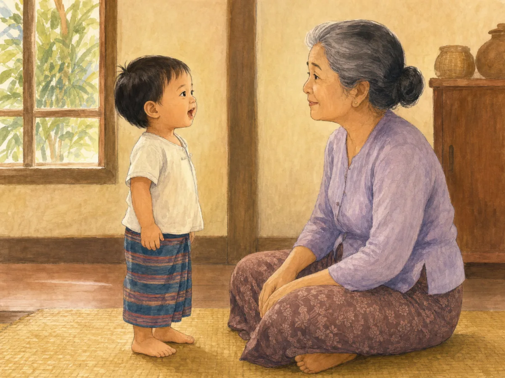
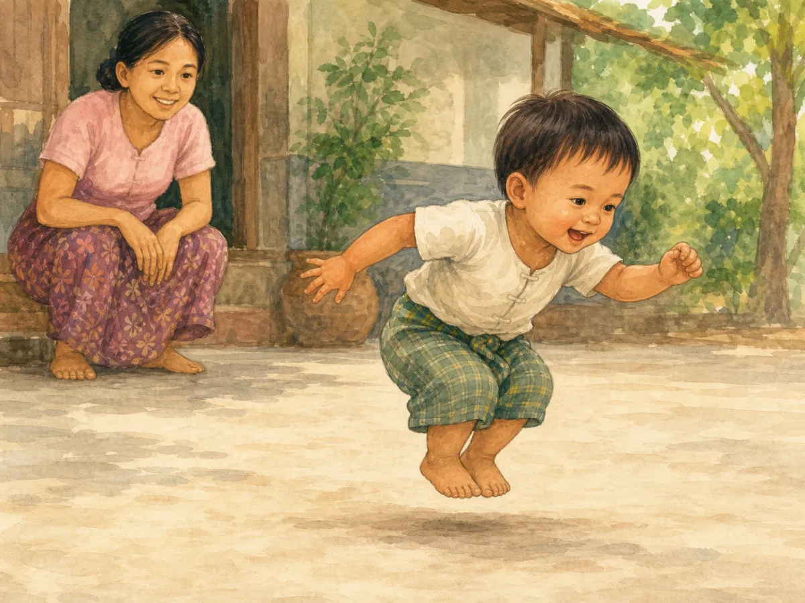

# ACE Child Grow — 2 Year Milestone Illustration Review

Status: **OWNER APPROVED — NOT DEPLOYED**

Source of truth: Production Convex `libraryContent`, filtered to `type = milestone`, exact `ageGroupKey = 2y`, and `clinicalStatus = published`. Read on 2026-08-02. Production contains exactly four published records for this age group. `summaryMm`, `summaryEn`, `category`, and `safety` are unavailable for all four records.

Each milestone was generated independently with Built-in ImageGen, clinically reviewed, and saved as a unique wordless 1200×900 WebP under 500 KB. Two gross-motor variants were rejected because they did not show both forward running momentum and a low two-foot jump; neither was saved as final. Every exact slug maps directly to one exact asset with no domain/category fallback.

## 1. `ms_2y_daily_routine_1`

- Myanmar title: နေ့စဉ် လုပ်ရိုးလုပ်စဉ်ကို မျှော်လင့်ခြင်း
- English title: Anticipates routines
- observeMm: ရေချိုးချိန်၊ အိပ်ချိန်ကဲ့သို့ အစီအစဉ်ကို သိရှိပါသလား။
- observeEn: Knows what comes next in daily routines?
- Meaning: ပုံမှန် လုပ်ရိုးလုပ်စဉ်သည် ကလေးကို လုံခြုံစိတ်ချစေသည်။ / Predictable routines help children feel secure.
- Domain: `daily_routine`
- Asset: `/milestones/2y/ms_2y_daily_routine_1.cb1b07b0e4.webp`

QA: **READY FOR OWNER REVIEW** — child recognizes the evening and pajamas cue and independently moves toward the low bed before dressing or sleeping begins. Age, anatomy, hands, feet, gaze, secure expression, cultural fit, uniqueness, and wordless output pass; no screen, toy, bath, toothbrush, or unrelated routine action.

## 2. `ms_2y_problem_solving_1`

- Myanmar title: ရိုးရှင်းသော ပဟေဠိ တပ်ဆင်ခြင်း
- English title: Simple puzzles / shapes
- observeMm: ပုံသဏ္ဌာန်ရိုးရိုးများကို နေရာတကျ ထည့်နိုင်ပါသလား။
- observeEn: Fits simple shapes into a sorter?
- Meaning: ဤသည်မှာ တွေးခေါ်မှုနှင့် ကြိုးစားမှုကို လေ့ကျင့်စေသည်။ / This builds thinking and persistence.
- Domain: `problem_solving`
- Asset: `/milestones/2y/ms_2y_problem_solving_1.69c00a09db.webp`

QA: **READY FOR OWNER REVIEW** — child steadies one sorter and precisely inserts one large rounded triangle into the matching opening. Age, anatomy, hands, feet, focus, cultural fit, floor safety, uniqueness, and wordless output pass; no small piece, stacking, throwing, adult guidance, or unrelated toy.

## 3. `ms_2y_speech_1`

- Myanmar title: မိသားစုက နားလည်နိုင်သော စကားပြောခြင်း
- English title: Speech family understands
- observeMm: ကလေးပြောသည့် တစ်ဝက်ခန့်ကို မိသားစုက နားလည်ပါသလား။
- observeEn: Family understands about half of their speech?
- Meaning: ရှင်းလင်းမှု တဖြည်းဖြည်း တိုးလာသည်။ / Clarity grows steadily.
- Domain: `speech`
- Asset: `/milestones/2y/ms_2y_speech_1.4737cf9104.webp`

QA: **READY FOR OWNER REVIEW** — child speaks directly without an explanatory object or gesture while grandmother listens silently with clear understanding. Age, anatomy, mouth shape, gaze, cultural fit, uniqueness, and wordless output pass; no repetition cue, babbling, pointing, prop, or unrelated action.

## 4. `ms_2y_gross_motor_1`

- Myanmar title: ပြေးခြင်းနှင့် ခုန်ခြင်း
- English title: Runs and jumps
- observeMm: ပြေးနိုင်၍ နေရာတွင် ခုန်နိုင်ပါသလား။
- observeEn: Runs and jumps in place?
- Meaning: ဤသည်မှာ ခြေထောက် ခိုင်မာမှုနှင့် ဟန်ချက်ကို ပြသည်။ / This shows leg strength and balance.
- Domain: `gross_motor`
- Asset: `/milestones/2y/ms_2y_gross_motor_1.0cb00a9f38.webp`

QA: **READY FOR OWNER REVIEW** — forward body lean and opposite arm balance show running momentum while both feet remain together and leave the ground simultaneously in a low age-appropriate jump. Age, anatomy, hands, feet, facial expression, flat landing area, close supervision, cultural fit, uniqueness, and wordless output pass; no high jump, obstacle, ledge, assistance, other child, or unrelated action.

## Engineering and application verification

- Exact slug mapping: **PASS**
- Unique asset paths: **PASS** — four slugs resolve to four unique files
- Existing asset files: **PASS** — all four files are 1200×900 WebP and 93–147 KB
- Next/Previous image navigation: **PASS** — automated component test traverses all four exact-slug images and returns to the preceding image
- Full unit suite: **PASS** — 922 tests
- Type check and lint: **PASS**
- Production build: **PASS** — no asset-related warning, missing import, missing image, or broken route; the existing unrelated bundle-size advisory remains
- PWA precache: **PASS** — all four exact 2-year assets appear in `dist/sw.js`
- Mobile/desktop browser screenshots: **BLOCKED** — the in-app browser refused the local preview because its admin-enforced security policy could not be verified. The security control was not bypassed. Visual owner review remains available through the four previews above.
- Deployment: **NOT ALLOWED / NOT PERFORMED**
