# ACE Child Grow — 3–4 Month Milestone Illustration Review

Status: **OWNER APPROVED 2026-08-02 — PRODUCTION DEPLOYMENT AUTHORIZED**  
Source of milestone text: Production Convex `libraryContent`, published `ageGroupKey = 3_4m` records, read 2026-08-02.  
Asset standard: unique 1200×900 (4:3) WebP, wordless, each under 500 KB.

## `ms_3_4m_cognitive_1`

- Myanmar title: ရွေ့လျားနေသော အရာကို မျက်လုံးဖြင့် လိုက်ကြည့်ခြင်း
- English title: Follows a moving object with the eyes
- observeMm: ပစ္စည်းတစ်ခုကို ဖြည်းညှင်းစွာ ရွှေ့ပြလျှင် မျက်လုံးဖြင့် လိုက်ကြည့်ပါသလား။ ကိုယ့်လက်ကို စိုက်ကြည့်တတ်ပါသလား။
- observeEn: Do the eyes follow an object moved slowly? Does your baby stare at her own hands?
- Meaning: Tracking and hand-watching show growing attention and body awareness.
- Asset: `/milestones/3_4m/ms_3_4m_cognitive_1.a9264cd057.webp` (88,016 bytes)
- QA: PASS — gaze tracks one slowly presented high-contrast card; age, anatomy, hands, feet, expression and cultural setting are appropriate; no unrelated action or text.

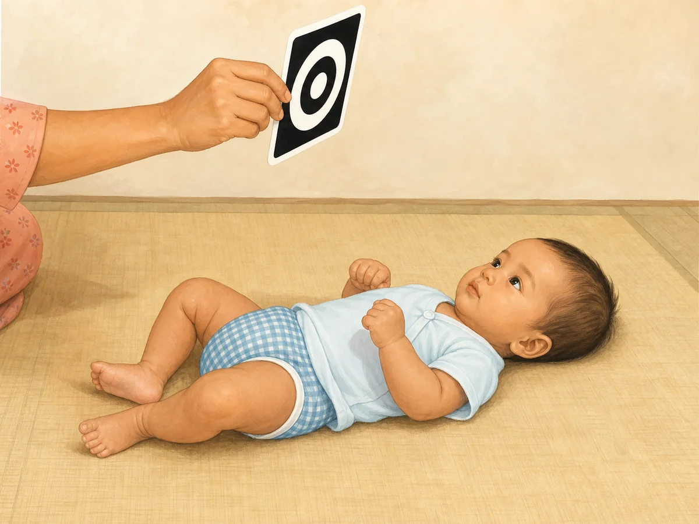

## `ms_3_4m_communication_1`

- Myanmar title: “အူး”၊ “အား” အသံများ ထွက်ခြင်း
- English title: Coos and makes sounds
- observeMm: “အူး” “အာ” ကဲ့သို့ အသံများ ထုတ်ပါသလား။
- observeEn: Makes cooing sounds like “ooh”, “aah”?
- Meaning: These early sounds are practice for speech.
- Asset: `/milestones/3_4m/ms_3_4m_communication_1.6d8057889e.webp` (104,628 bytes)
- QA: PASS — safely supported baby makes a rounded cooing expression while interacting with mother; no extra activity or text.

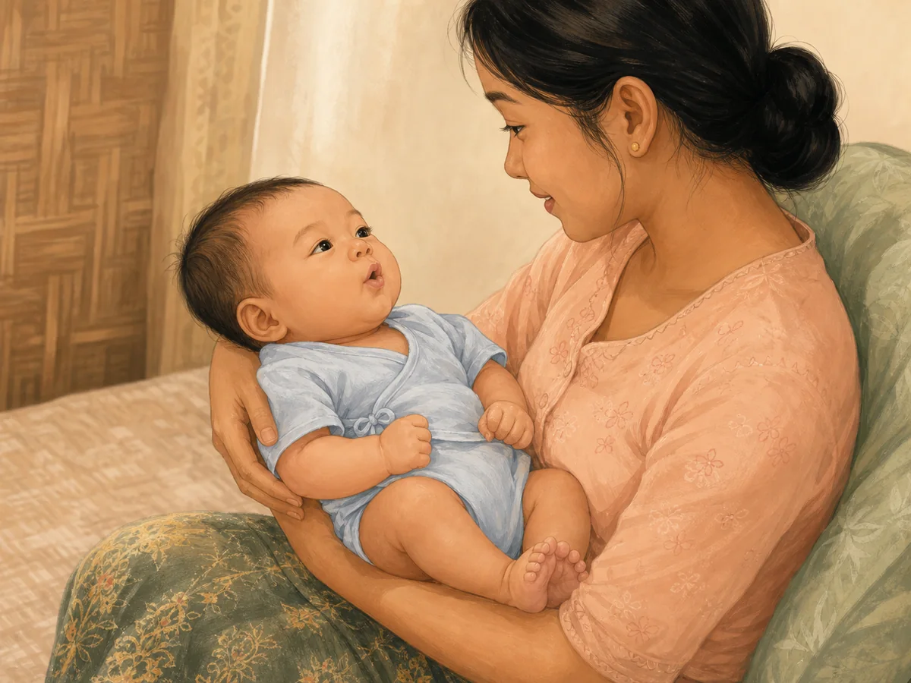

## `ms_3_4m_emotional_1`

- Myanmar title: ပျော်ရွှင်မှု ဖော်ပြခြင်း
- English title: Shows joy
- observeMm: ရင်းနှီးသူများကို မြင်ရပါက ပျော်ရွှင်ဟန် ပြပါသလား။
- observeEn: Shows delight seeing familiar people?
- Meaning: Expressing feelings strengthens bonding.
- Asset: `/milestones/3_4m/ms_3_4m_emotional_1.a7772f3ec2.webp` (87,514 bytes)
- QA: PASS — baby visibly delights on seeing a familiar grandmother; pose and support are age-appropriate; no unrelated action or text.

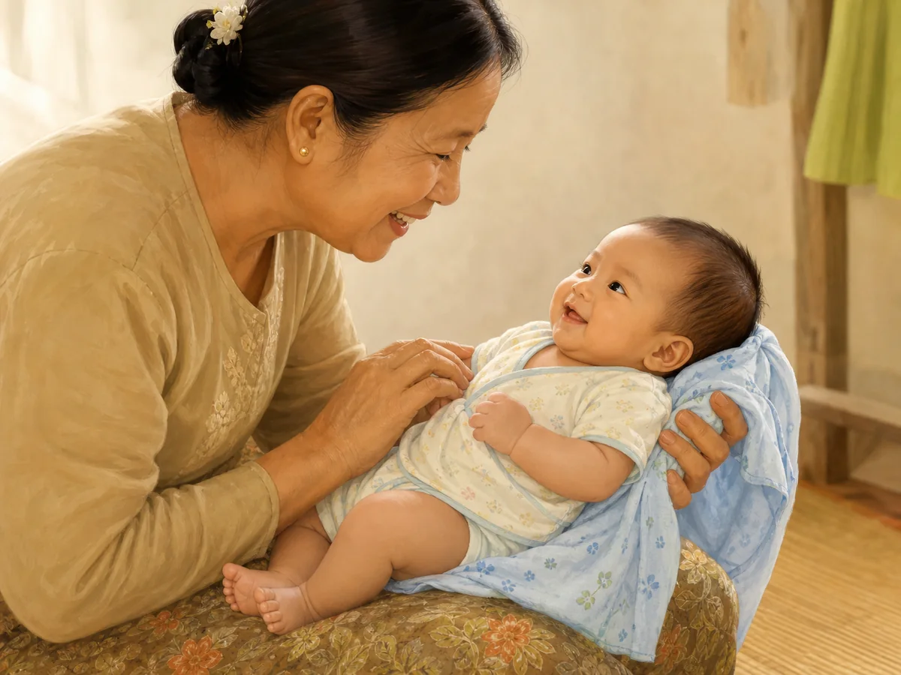

## `ms_3_4m_fine_motor_1`

- Myanmar title: လက်များကို ဆုံစည်းခြင်း
- English title: Brings hands together
- observeMm: လက်နှစ်ဖက်ကို အလယ်တွင် ဆုံစည်းပါသလား။
- observeEn: Brings both hands together at the middle?
- Meaning: Using both hands together begins the skills needed for grasping.
- Asset: `/milestones/3_4m/ms_3_4m_fine_motor_1.d2f7b8d01d.webp` (81,030 bytes)
- QA: PASS — both hands meet clearly at the chest midline; anatomy and finger count appear natural; no object or unrelated action.

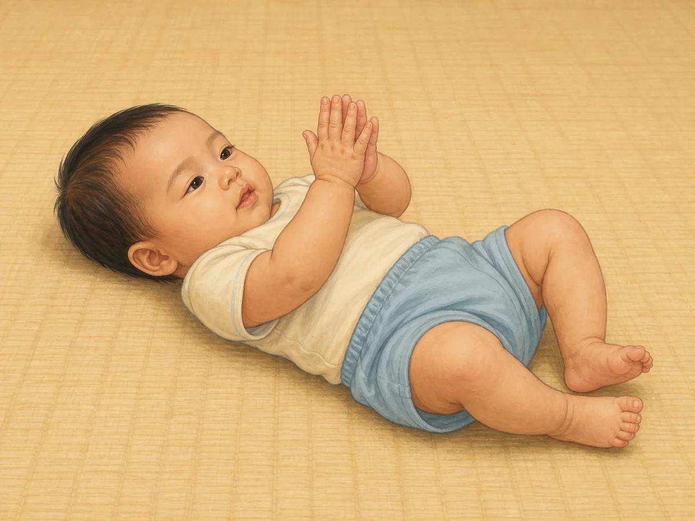

## `ms_3_4m_fine_motor_2`

- Myanmar title: လက်နှစ်ဖက်ကို အလယ်တွင် ပေါင်း၍ ပစ္စည်းကို ရိုက်ကြည့်ခြင်း
- English title: Brings hands together and swipes at objects
- observeMm: လက်နှစ်ဖက်ကို ရင်ဘတ်အလယ်တွင် ပေါင်းတတ်ပါသလား။ ရှေ့တွင် ချိတ်ဆွဲထားသော ပစ္စည်းကို ရိုက်ကြည့်ပါသလား။
- observeEn: Do the hands come together in the middle? Does your baby swipe at something held in front?
- Meaning: This is a step towards reaching and holding.
- Asset: `/milestones/3_4m/ms_3_4m_fine_motor_2.7b0951f771.webp` (122,028 bytes)
- QA: PASS after one regeneration — hands remain near midline while one hand swipes at a large soft ring held by mother; no grasping or choking hazard.

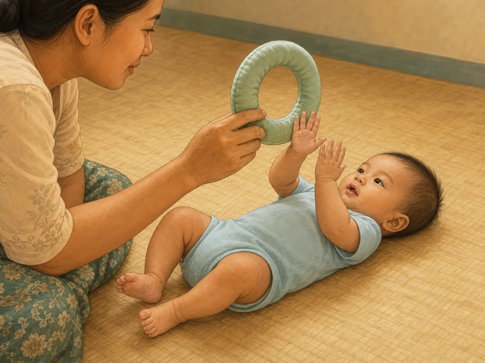

## `ms_3_4m_gross_motor_1`

- Myanmar title: ခေါင်းကို တည်ငြိမ်စွာ ထိန်းခြင်း
- English title: Holds head steady
- observeMm: မတ်မတ်ချီထားစဉ် ခေါင်းကို တည်ငြိမ်စွာ ထိန်းနိုင်ပါသလား။
- observeEn: Holds head steady when held upright?
- Meaning: Head control develops toward later sitting skills.
- Asset: `/milestones/3_4m/ms_3_4m_gross_motor_1.0b181806be.webp` (91,390 bytes)
- QA: PASS — father securely supports the upright baby's torso and lower body while the head remains steady; baby is not sitting independently.

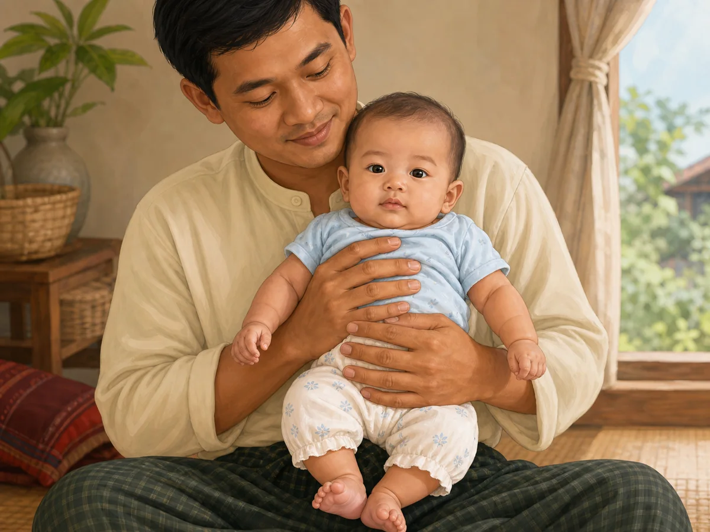

## `ms_3_4m_gross_motor_2`

- Myanmar title: မှောက်ချထားစဉ် လက်မောင်းဖြင့် ထောက်၍ ရင်ဘတ် မြှင့်နိုင်ခြင်း
- English title: Pushes up on the forearms during tummy time
- observeMm: မှောက်ချထားစဉ် လက်မောင်းနှစ်ဖက်ဖြင့် ထောက်ပြီး ရင်ဘတ်ကို ကြမ်းပြင်မှ မြှင့်နိုင်ပါသလား။
- observeEn: During tummy time, does your baby push up on both forearms and lift the chest off the floor?
- Meaning: This develops shoulder and back strength as a base for rolling and sitting.
- Asset: `/milestones/3_4m/ms_3_4m_gross_motor_2.b99c2e8ca3.webp` (75,224 bytes)
- QA: PASS — supervised tummy time shows both forearms planted and chest lifted; no rolling, sitting or unrelated object.

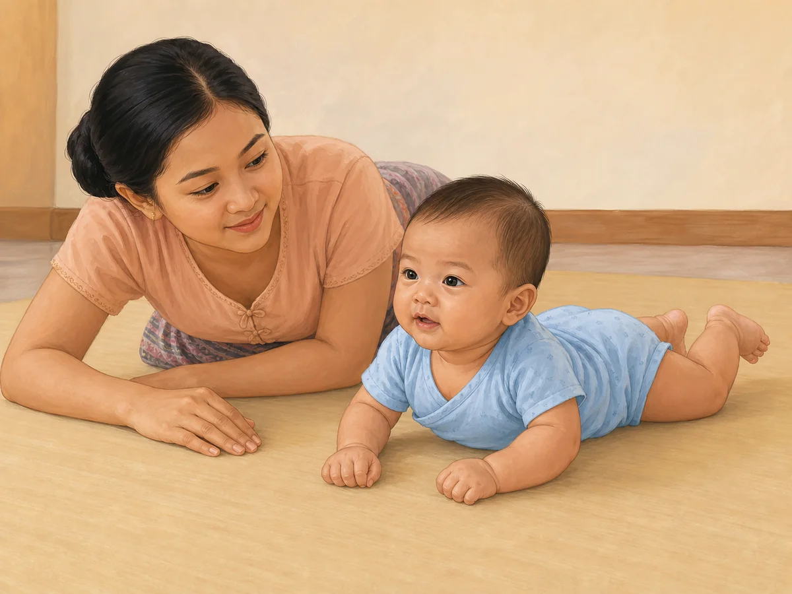

## `ms_3_4m_language_1`

- Myanmar title: အသံလာရာဘက်သို့ လှည့်ကြည့်ခြင်း
- English title: Turns towards a voice or sound
- observeMm: သင် ဘေးမှ ခေါ်လိုက်လျှင် ကလေး ခေါင်းလှည့်ကြည့်ပါသလား။
- observeEn: If you speak from the side, does your baby turn to look?
- Meaning: Locating a sound begins hearing-based language learning.
- Asset: `/milestones/3_4m/ms_3_4m_language_1.565e8a5290.webp` (88,910 bytes)
- QA: PASS — baby turns head and gaze toward father speaking gently from the side; no clapping, musical toy or extra sound source.

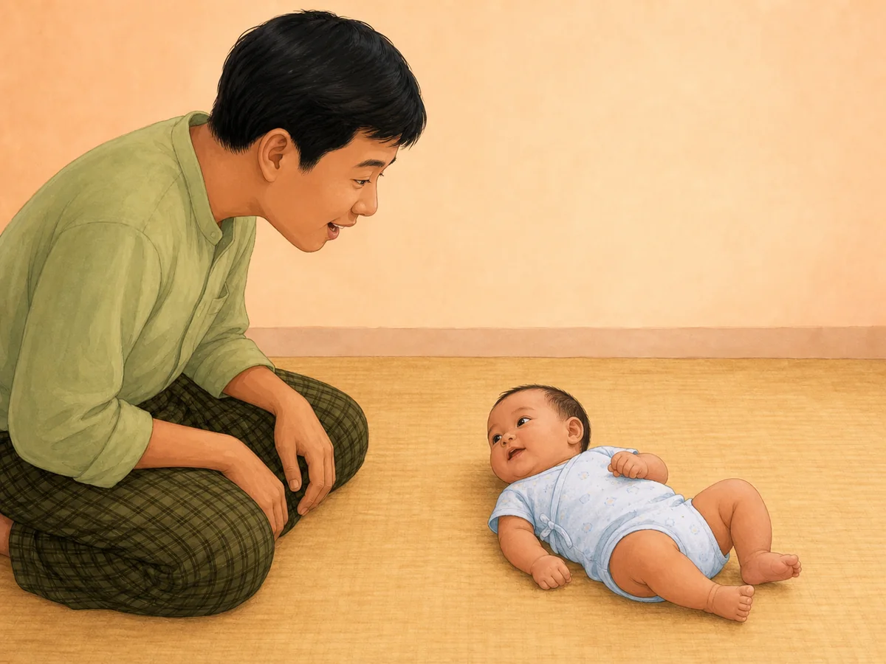

## `ms_3_4m_nutrition_1`

- Myanmar title: မိခင်နို့တစ်မျိုးတည်း ဆက်လက် စို့ခြင်း
- English title: Still feeding on milk alone
- observeMm: ကလေးသည် နို့တစ်မျိုးတည်းဖြင့် ကျေနပ်နေပါသလား။ ကိုယ်အလေးချိန် တဖြည်းဖြည်း တက်နေပါသလား။
- observeEn: Is your baby content on milk alone? Is weight rising steadily?
- Meaning: Exclusive breastfeeding is recommended to around six months; solids are not yet needed.
- Asset: `/milestones/3_4m/ms_3_4m_nutrition_1.60b9f3515e.webp` (114,316 bytes)
- QA: PASS after a policy-safe regeneration — fully clothed mother uses an opaque nursing cover and supports the baby in safe alignment; no bottle, solids or self-feeding.

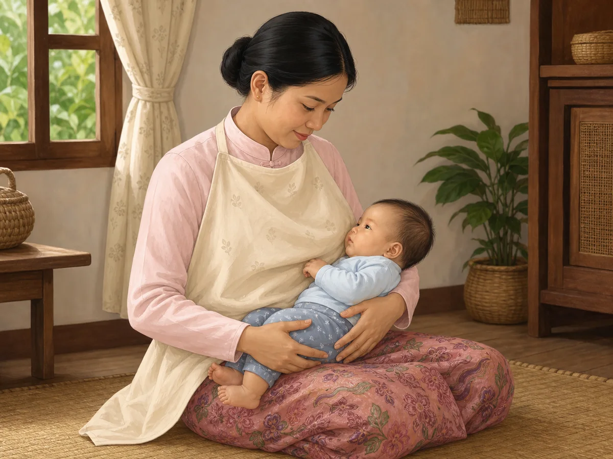

## `ms_3_4m_sleep_1`

- Myanmar title: ညအိပ်ချိန် ပိုရှည်လာခြင်း
- English title: Night sleep starts to lengthen
- observeMm: ညဘက်တွင် အိပ်ချိန် ပိုရှည်လာပါသလား။ နေ့နှင့် ည ခွဲခြားလာပါသလား။
- observeEn: Are night stretches getting longer? Is a day–night difference appearing?
- Meaning: Babies aged 4–11 months typically need 12–16 hours including naps, and waking remains normal.
- Asset: `/milestones/3_4m/ms_3_4m_sleep_1.d987b6bfb1.webp` (78,392 bytes)
- QA: PASS — baby sleeps on the back on a flat, firm, empty cot mattress; no pillow, blanket, bumper, toy or loose cloth.

## `ms_3_4m_social_1`

- Myanmar title: လူကို မြင်လျှင် ပြုံးပြီး ဆက်ဆံလိုခြင်း
- English title: Smiles at people and enjoys interaction
- observeMm: သင့်ကို မြင်လျှင် ပြုံးပါသလား။ ကစားရပ်လိုက်လျှင် ဆက်လုပ်ရန် တောင်းဆိုပါသလား။
- observeEn: Does your baby smile when she sees you? Does she protest when play stops?
- Meaning: Social smiling is a foundation for reciprocal interaction.
- Asset: `/milestones/3_4m/ms_3_4m_social_1.4d752e92a8.webp` (144,646 bytes)
- QA: PASS — securely supported baby exchanges a clear social smile with father and shows eager open arms; anatomy is natural and no toy is present.

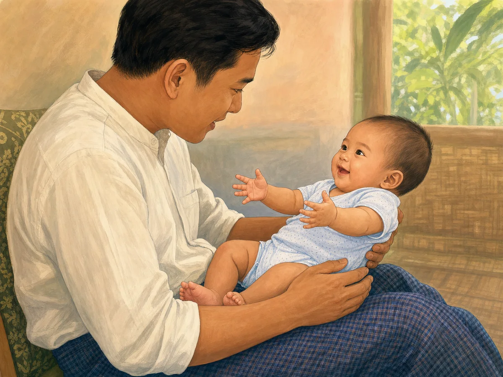

## `ms_3_4m_speech_1`

- Myanmar title: အသံငယ်များ ထွက်ခြင်းနှင့် ရယ်မောခြင်း
- English title: Coos, gurgles and laughs out loud
- observeMm: "အာ"၊ "အူ" ကဲ့သို့ အသံငယ်များ ထွက်ပါသလား။ ကစားနေစဉ် ရယ်မောပါသလား။
- observeEn: Do you hear cooing sounds like "ah" and "oo"? Does your baby laugh during play?
- Meaning: These sounds are speech practice and increase when a parent answers.
- Asset: `/milestones/3_4m/ms_3_4m_speech_1.50d2277f1f.webp` (74,088 bytes)
- QA: PASS — safely held baby gives a clear open-mouth laugh during reciprocal face-to-face play; hands, feet and expression are natural; no toy or text.

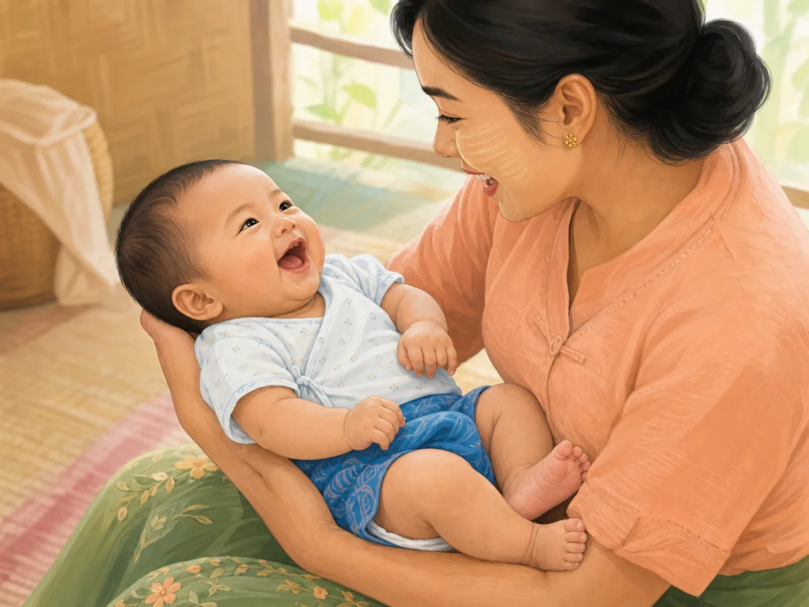

## Approval

All 12 candidates passed behaviour, age, anatomy, hand, foot, expression, object, cultural and wordless-image review. The owner explicitly approved production deployment on 2026-08-02.

## Engineering verification

- Exact-slug mapping: PASS — 12/12 unique hashed WebP paths; no category/domain/shared fallback.
- Image format: PASS — 12/12 are 1200×900 (4:3), and the largest is 144,646 bytes.
- Previous/Next mapping test: PASS — all 12 cards advance to the correct unique image and Previous returns to the prior image.
- Full unit suite: PASS — 80 test files, 898 tests.
- Type check: PASS.
- Lint: PASS.
- Production build: PASS; all 12 assets are included in the output and PWA precache.
- Asset-related warnings: none. The build retains an existing unrelated JavaScript chunk-size warning, and the wider test suite retains existing React test `act(...)` warnings.
- Live browser screenshots: BLOCKED — the managed in-app browser could not verify its admin security policy for the local app URL, so access was denied. No security control was bypassed. This visual browser step must be rerun before deployment.
