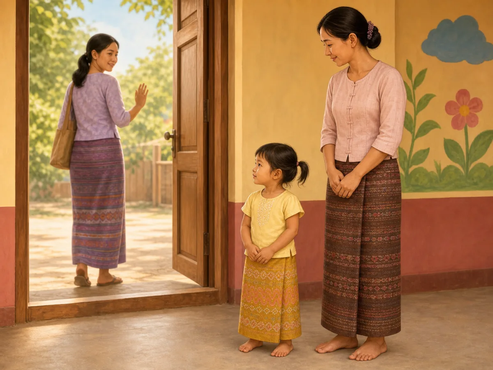
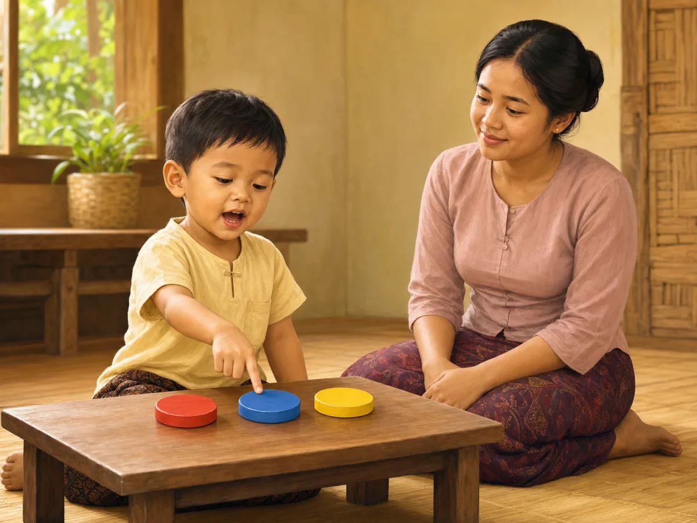

# ACE Child Grow — 3 Year Milestone Illustration Review

Status: **OWNER APPROVED — NOT DEPLOYED**

Source of truth: Production Convex `libraryContent`, filtered to `type = milestone`, exact `ageGroupKey = 3y`, and `clinicalStatus = published`. Read on 2026-08-03. Production contains exactly four published records for this age group. `summaryMm`, `summaryEn`, `category`, and `safety` are unavailable for all four records.

Each milestone was generated independently with Built-in ImageGen, clinically reviewed, and saved as a unique wordless 1200×900 WebP under 500 KB. Every exact slug maps directly to one exact asset with no domain/category fallback.

## 1. `ms_3y_school_readiness_1`

- Myanmar title: မိဘနှင့် ခွဲ၍ ခဏနေနိုင်ခြင်း
- English title: Separates from parent briefly
- observeMm: ရင်းနှီးသူနှင့် ခဏခွဲနေရသည်ကို လက်ခံနိုင်ပါသလား။
- observeEn: Copes with brief separation from a caregiver?
- Meaning: ဤသည်မှာ ကျောင်း/မူကြိုအတွက် အသင့်ဖြစ်မှု အစိတ်အပိုင်းဖြစ်သည်။ / This is part of readiness for preschool.
- Domain: `school_readiness`
- Asset: `/milestones/3y/ms_3y_school_readiness_1.71617709a6.webp`

QA: **READY FOR OWNER REVIEW** — child calmly watches the departing parent while remaining beside a familiar preschool caregiver. Age, anatomy, hands, feet, gaze, relaxed expression, cultural fit, uniqueness, and wordless output pass; no crying, clinging, pursuit, distraction, unrelated activity, or unsafe object.

## 2. `ms_3y_social_1`

- Myanmar title: အခြားကလေးများနှင့် အတူ ကစားခြင်း
- English title: Plays with other children
- observeMm: အခြားကလေးများနှင့် ဝေမျှ၍ ကစားရန် ကြိုးစားပါသလား။
- observeEn: Tries to play and share with other children?
- Meaning: အတူကစားခြင်းသည် လူမှုကျွမ်းကျင်မှုကို လေ့ကျင့်စေသည်။ / Playing together builds social skills.
- Domain: `social`
- Asset: `/milestones/3y/ms_3y_social_1.6b352a869e.webp`

QA: **READY FOR OWNER REVIEW** — exactly two age-matched children look at each other while directly sharing one safe toy. Age, anatomy, hands, feet, gaze, cooperative expressions, cultural fit, uniqueness, and wordless output pass; no adult prompt, solitary or parallel play, conflict, extra toy, or unrelated action.

## 3. `ms_3y_cognitive_1`

- Myanmar title: အရောင်/အရေအတွက် အနည်းငယ် သိရှိခြင်း
- English title: Knows some colors / counting
- observeMm: အရောင် အနည်းငယ်ကို အမည်တပ်၍ “၃” အထိ ရေတွက်ပါသလား။
- observeEn: Names a few colors and counts to three?
- Meaning: ဤသည်မှာ အခြေခံ သင်ယူမှု စွမ်းရည်ကို ပြသည်။ / This shows early learning skills.
- Domain: `cognitive`
- Asset: `/milestones/3y/ms_3y_cognitive_1.d43382817f.webp`

QA: **READY FOR OWNER REVIEW** — child points to and speaks about exactly three distinct colored discs while the parent listens silently without giving answers. Age, anatomy, pointing hand, feet, mouth shape, gaze, cultural fit, uniqueness, and wordless output pass; no written number, letter, finger-counting, extra object, or unrelated action.

## 4. `ms_3y_gross_motor_1`

- Myanmar title: ခြေထောက်တစ်ဖက်ဖြင့် ခဏရပ်ခြင်း
- English title: Balances on one foot briefly
- observeMm: ခြေထောက်တစ်ဖက်ဖြင့် စက္ကန့်အနည်းငယ် ရပ်နိုင်ပါသလား။
- observeEn: Stands on one foot for a second or two?
- Meaning: ဟန်ချက်သည် ပြေးခုန်ခြင်းများကို ပိုမိုကောင်းစေသည်။ / Balance improves running and climbing.
- Domain: `gross_motor`
- Asset: `/milestones/3y/ms_3y_gross_motor_1.accf96bde0.webp`

QA: **READY FOR OWNER REVIEW** — child remains stationary with one supporting foot flat and the other foot clearly lifted while arms naturally assist balance. Age, anatomy, hands, feet, focused expression, clear safe floor, cultural fit, uniqueness, and wordless output pass; no running, hopping, jumping, dancing, climbing, tiptoeing, prop, or fall hazard.

## Engineering and application verification

- Exact slug mapping: **PASS**
- Unique asset paths: **PASS** — four slugs resolve to four unique files
- Existing asset files: **PASS** — all four files are 1200×900 WebP and 35–99 KB
- Next/Previous image navigation: **PASS** — automated component test traverses all four exact-slug images and returns to the preceding image
- Full unit suite: **PASS** — 930 tests; existing unrelated React test-timing notices remain
- Type check and lint: **PASS**
- Production build: **PASS** — no asset-related warning, missing import, missing image, or broken route; the existing unrelated bundle-size advisory remains
- PWA precache: **PASS** — all four exact 3-year assets appear in `dist/sw.js`
- Mobile/desktop browser screenshots: **BLOCKED** — the in-app browser refused the local preview because its admin-enforced security policy could not be verified. The security control was not bypassed. Visual owner review remains available through the four previews above.
- Deployment: **NOT ALLOWED / NOT PERFORMED**
