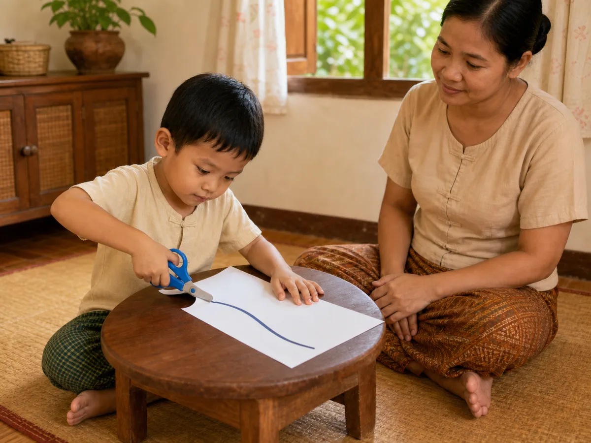

# ACE Child Grow — 4.5 Year Milestone Illustration Review

Status: **READY FOR OWNER REVIEW — NOT DEPLOYED**

Source of truth: Production Convex `libraryContent`, filtered to `type = milestone`, exact `ageGroupKey = 4_5y`, and `clinicalStatus = published`. Read directly on 2026-08-03. Production contains exactly three published records for this age group. The observed behaviour and milestone meaning are stored in each record's nested `data.observeMm`, `data.observeEn`, `data.whyMm`, and `data.whyEn` fields. `summaryMm`, `summaryEn`, `category`, and safety information are unavailable for all three records.

## Pre-generation review table

| Slug | Myanmar title | English title | Exact behaviour | Image scene | Must not show | Status |
| --- | --- | --- | --- | --- | --- | --- |
| `ms_4_5y_cognitive_1` | အရာဝတ္ထုများကို အမျိုးအစားခွဲခြင်း | Sorts by category | Child independently sorts objects by one visible property: color. | A Myanmar/Southeast Asian 4.5-year-old seated safely on a floor mat, placing the red cube beside the red cylinder; the separate blue group contains the same cube-and-cylinder pair, so color is the only sorting rule. | Sorting by two rules at once; adult help; counting; letters/numbers; puzzle assembly; unrelated play; excessive objects. | **READY FOR OWNER REVIEW** |
| `ms_4_5y_daily_routine_1` | ကိုယ်တိုင် ဝတ်စားဆင်ယင်ခြင်း | Dresses with little help | Child puts on a shirt mostly independently, with only minimal caregiver help. | A Myanmar/Southeast Asian 4.5-year-old standing safely, independently guiding one arm through the remaining sleeve; caregiver steadies only the shirt's back-collar fabric, away from the child's arms. | Caregiver dressing the child; buttons/zips as a second skill; undressing; shoes; unsafe balancing; nudity; unrelated grooming. | **READY FOR OWNER REVIEW** |
| `ms_4_5y_fine_motor_1` | ကတ်ကြေးဖြင့် ဖြတ်ခြင်း | Cuts with child scissors | Child cuts paper along one clearly visible line using rounded-tip child scissors and coordinated two-hand use. | A Myanmar/Southeast Asian 4.5-year-old seated at a low table, one hand holding a single sheet and the other using short blunt rounded-tip child scissors to cut directly along one thick curved line; caregiver supervises nearby without touching. | Sharp adult scissors; no supervision; cutting away from the line; craft result; glue/crayons; letters/numbers; clutter; unrelated drawing. | **READY FOR OWNER REVIEW** |

## Production record details

### `ms_4_5y_cognitive_1`

- Myanmar title: အရာဝတ္ထုများကို အမျိုးအစားခွဲခြင်း
- English title: Sorts by category
- observeMm: ပစ္စည်းများကို အရောင်/ပုံသဏ္ဌာန်ဖြင့် ခွဲခြားပါသလား။
- observeEn: Sorts objects by color or shape?
- Meaning: ဤသည်မှာ သင်္ချာနှင့် ယုတ္တိတွေးခေါ်မှု၏ အခြေခံဖြစ်သည်။ / This is the base for math and logic.
- Age group: `4_5y`
- Domain: `cognitive`
- Publication status: `published`
- Asset: `/milestones/4_5y/ms_4_5y_cognitive_1.2d89fcc54f.webp`

QA: **READY FOR OWNER REVIEW** — behaviour matches both titles and observations: the child independently places a red cube beside a red cylinder while the separate blue group contains the same cube-and-cylinder pair, making color the single visible rule. Age, anatomy, hands, fingers, legs, feet, gaze, focused expression, safe floor-level setting, cultural fit, uniqueness, and wordless output pass. No adult help, counting, letters, numbers, labels, containers, puzzle assembly, unsorted pile, or unrelated play. The first version was rejected because the red pieces used overly similar shapes and was not saved as final.

### `ms_4_5y_daily_routine_1`

- Myanmar title: ကိုယ်တိုင် ဝတ်စားဆင်ယင်ခြင်း
- English title: Dresses with little help
- observeMm: အင်္ကျီ/ဘောင်းဘီကို အများအားဖြင့် ကိုယ်တိုင် ဝတ်နိုင်ပါသလား။
- observeEn: Dresses with minimal help?
- Meaning: ဤသည်မှာ လွတ်လပ်မှုနှင့် ယုံကြည်မှုကို တည်ဆောက်ပေးသည်။ / This builds independence and confidence.
- Age group: `4_5y`
- Domain: `daily_routine`
- Publication status: `published`
- Asset: `/milestones/4_5y/ms_4_5y_daily_routine_1.2eeb66618c.webp`

QA: **READY FOR OWNER REVIEW** — behaviour matches both titles and observations: the child stands steadily and independently guides the remaining arm through the shirt sleeve while the caregiver supplies minimal help only by stabilizing back-collar fabric away from the child's arms. Age, anatomy, hands, fingers, legs, feet, gaze, calm expression, safe posture, cultural fit, uniqueness, and wordless output pass. No caregiver-led dressing, buttons, zipper, shoes, mirror, nudity, unsafe balancing, or unrelated grooming. Two earlier versions were rejected because caregiver assistance was visually ambiguous and were not saved as final.

### `ms_4_5y_fine_motor_1`

- Myanmar title: ကတ်ကြေးဖြင့် ဖြတ်ခြင်း
- English title: Cuts with child scissors
- observeMm: ကလေးကတ်ကြေးဖြင့် စက္ကူကို မျဉ်းအတိုင်း ဖြတ်ပါသလား။
- observeEn: Cuts along a line with safe scissors?
- Meaning: ဤသည်မှာ လက်နှစ်ဖက် ပေါင်းစပ်မှုကို လေ့ကျင့်စေသည်။ / This builds two-hand coordination.
- Age group: `4_5y`
- Domain: `fine_motor`
- Publication status: `published`
- Asset: `/milestones/4_5y/ms_4_5y_fine_motor_1.d1214c3b04.webp`

QA: **READY FOR OWNER REVIEW** — behaviour matches both titles and observations: the child uses coordinated hands to hold one sheet and cut directly along its single curved line using one pair of short, blunt, visibly rounded-tip child scissors while a caregiver supervises without touching. Age, anatomy, hands, fingers, legs, feet, gaze, concentrated expression, scissor grip, safety, cultural fit, uniqueness, and wordless output pass. No sharp adult scissors, second tool, glue, crayon, finished craft, letters, numbers, arrows, labels, clutter, or unrelated action. The first version was rejected because its blade tips appeared pointed and was not saved as final.

## Verification

- Exact slug-to-asset mapping: **PASS** — three published slugs, three unique versioned WebP paths, and every file exists.
- Asset format: **PASS** — all files are 1200×900 landscape 4:3 WebP and each is under 100 KB.
- Next/Previous and wording: **PASS** — the component navigation test cycles through all three unique images, restores the correct prior image, and verifies the exact published Myanmar titles/observations plus the English title/observation rendering.
- Focused tests: **PASS** — 39 tests.
- Full test suite: **PASS** — 943 tests across 91 files.
- Typecheck and lint: **PASS**.
- Production build and PWA precache: **PASS** — each new exact asset appears once in the generated service worker; no asset-related warning or missing import/file.
- Browser screenshots: **BLOCKED BY ENVIRONMENT** — the in-app browser-control runtime is unavailable under the current managed desktop policy, so it could not attach to the local preview. The application flow is covered by the component navigation test; the three final text-source fields and illustration previews are included in this document.
- Deployment: **NOT PERFORMED**.
