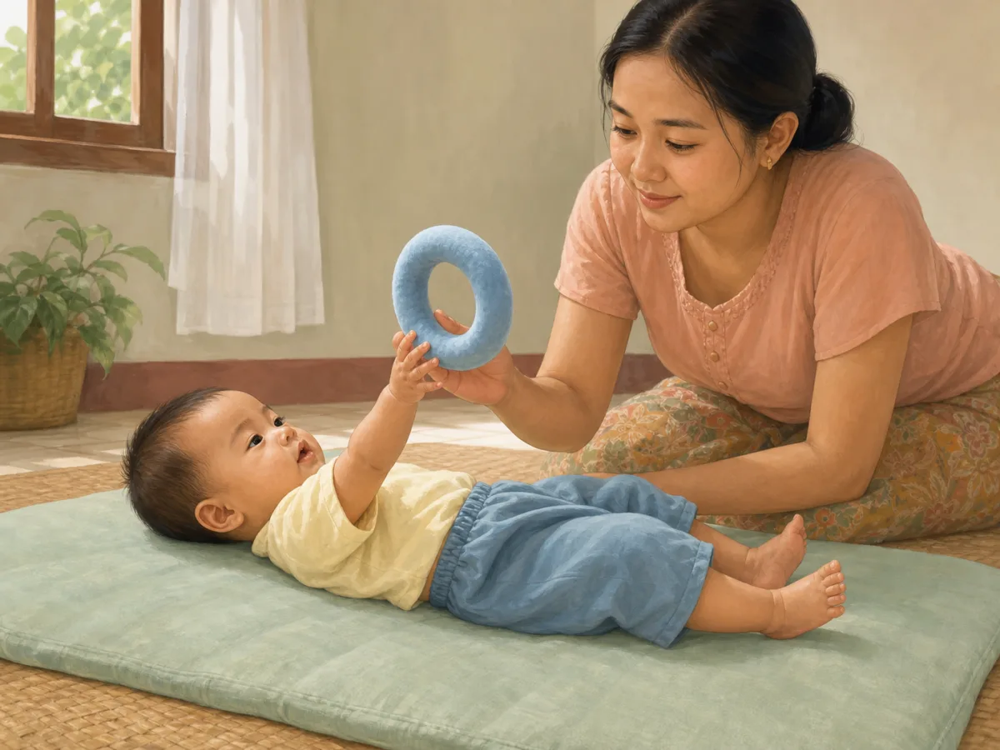
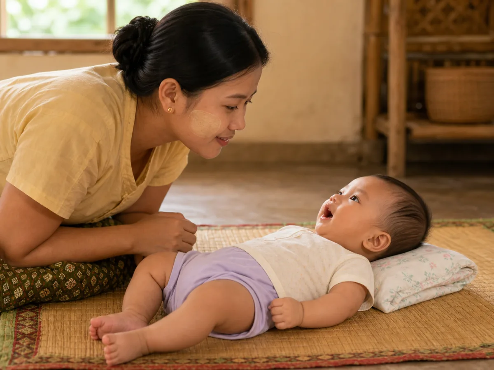
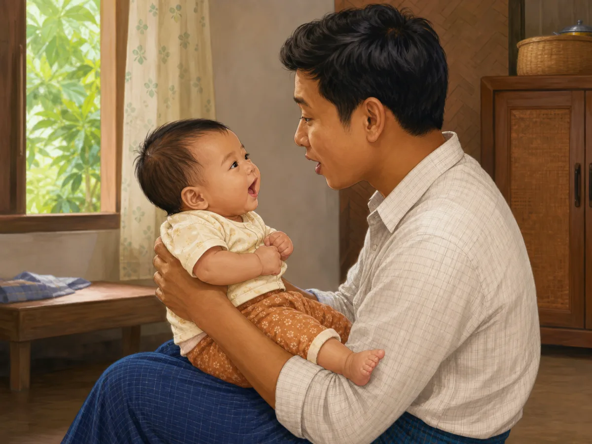

# ACE Child Grow — 5–6 Month Milestone Illustration Review

Status: **OWNER APPROVED — NOT DEPLOYED**

Source of truth: Production Convex `libraryContent`, filtered to `type = milestone`, `ageGroupKey = 5_6m`, and `clinicalStatus = published`. Read on 2026-08-02. All 12 records are published; `summaryMm` and `summaryEn` are unavailable for every record.

Every illustration is a unique, wordless 1200×900 WebP under 500 KB and maps directly from its exact slug. No domain/category fallback is used.

## 1. `ms_5_6m_cognitive_1`

- Myanmar title: ပစ္စည်းများကို လက်လှမ်း၍ ကိုင်ခြင်း
- English title: Reaches for objects
- observeMm: အနီးက ကစားစရာကို လက်လှမ်း၍ ဆွဲကိုင်ပါသလား။
- observeEn: Reaches and grabs a nearby toy?
- Meaning: လက်လှမ်းခြင်းသည် မျက်စိနှင့် လက် ပေါင်းစပ်မှုကို လေ့ကျင့်စေသည်။ / Reaching builds eye–hand coordination.
- Domain: `cognitive`
- Asset: `/milestones/5_6m/ms_5_6m_cognitive_1.9ee0b12d23.webp`

QA: **READY FOR OWNER REVIEW** — exact reach-and-grab behaviour; age, gaze, anatomy, hands, feet, expression, cultural fit, object safety, uniqueness, and wordless output pass.

## 2. `ms_5_6m_cognitive_2`

- Myanmar title: ကျသွားသော ပစ္စည်းကို လိုက်ရှာကြည့်ခြင်း
- English title: Looking for a dropped object
- observeMm: ပစ္စည်း ကျသွားလျှင် အောက်သို့ လိုက်ကြည့်ပါသလား။ ပစ္စည်းကို လှုပ်၍ ဘာဖြစ်မလဲ စမ်းကြည့်ပါသလား။
- observeEn: Does she look down when something falls? Does she shake things to see what happens?
- Meaning: ဤသည် အကြောင်းအကျိုး နားလည်မှု၏ အစ ဖြစ်သည်။ ထပ်ခါထပ်ခါ လုပ်ကြည့်ခြင်းဖြင့် သင်ယူသည်။ / This is the beginning of cause and effect. Repetition is how it is learned.
- Domain: `cognitive`
- Asset: `/milestones/5_6m/ms_5_6m_cognitive_2.a42e2af6ac.webp`

QA: **READY FOR OWNER REVIEW** — baby safely reclined and visually follows the dropped object; no sitting, reaching, or unrelated action; all anatomy and content checks pass.

## 3. `ms_5_6m_fine_motor_1`

- Myanmar title: ပစ္စည်းကို လက်တစ်ဖက်မှ တစ်ဖက်သို့ ပြောင်းကိုင်ခြင်း
- English title: Passing an object from one hand to the other
- observeMm: ကိုင်ထားသော ပစ္စည်းကို အခြားလက်သို့ ပြောင်းကိုင်ပါသလား။ လက်ဖဝါးတစ်ခုလုံးဖြင့် ဆုပ်ကိုင်ပါသလား။
- observeEn: Does she move a toy from one hand to the other? Does she grab with the whole palm?
- Meaning: ဤအရွယ်တွင် အလိုရှိသလို လှမ်းယူနိုင်လာပြီး လက်နှစ်ဖက် ပူးတွဲ အသုံးပြုမှု စတင်သည်။ ကိုင်မိသမျှကို ပါးစပ်ထဲ ထည့်ခြင်းသည် သင်ယူမှု ဖြစ်သည်။ / Reaching becomes deliberate and the two hands start working together. Mouthing what she catches is learning, not a problem.
- Domain: `fine_motor`
- Asset: `/milestones/5_6m/ms_5_6m_fine_motor_1.7013846ea0.webp`

QA: **READY FOR OWNER REVIEW** — deliberate two-hand transfer at midline; whole-palm grasp, fingers, limbs, age, safety, and uniqueness pass.

## 4. `ms_5_6m_gross_motor_1`

- Myanmar title: တစ်ဘက်မှ တစ်ဘက်သို့ လှိမ့်ခြင်း
- English title: Rolls over
- observeMm: ကျောမှ ဗိုက်ဘက်သို့ သို့မဟုတ် ပြန်၍ လှိမ့်နိုင်ပါသလား။
- observeEn: Rolls from back to tummy or the reverse?
- Meaning: လှိမ့်ခြင်းသည် ခန္ဓာကိုယ် ထိန်းချုပ်မှု တိုးတက်ကြောင်း ပြသည်။ / Rolling shows growing body control.
- Domain: `gross_motor`
- Asset: `/milestones/5_6m/ms_5_6m_gross_motor_1.db946852f8.webp`

QA: **READY FOR OWNER REVIEW** — back-to-tummy roll on a floor-level mat; no fall hazard or older movement; anatomy and all content checks pass.

## 5. `ms_5_6m_gross_motor_2`

- Myanmar title: တစ်ဖက်မှ တစ်ဖက်သို့ လှိမ့်ခြင်း
- English title: Rolling from back to front and front to back
- observeMm: ကလေးသည် ပက်လက်မှ မှောက်သို့၊ မှောက်မှ ပက်လက်သို့ လှိမ့်နိုင်ပါသလား။
- observeEn: Can your baby roll from back to front, and from front to back?
- Meaning: လှိမ့်ခြင်းသည် များသောအားဖြင့် ၄ လမှ ၆ လကြားတွင် စတတ်ပြီး ကွာဟမှု ကျယ်ပါသည်။ တစ်ဖက်ကို အရင်တတ်ပြီး နောက်တစ်ဖက်ကို နောက်မှ တတ်တတ်သည်။ / Rolling usually appears between about 4 and 6 months, with wide variation. One direction often comes well before the other.
- Domain: `gross_motor`
- Asset: `/milestones/5_6m/ms_5_6m_gross_motor_2.ee65454cd3.webp`

QA: **READY FOR OWNER REVIEW** — distinct tummy-to-back roll on a safe floor mat; no unrelated action, hazard, or duplicate composition; all checks pass.

## 6. `ms_5_6m_language_1`

- Myanmar title: နာမည်ခေါ်လျှင် လှည့်ကြည့်ခြင်း
- English title: Turning when her name is called
- observeMm: နာမည်ခေါ်လျှင် လှည့်ကြည့်ပါသလား။ အသံအနေအထား ပြောင်းလျှင် တုံ့ပြန်ပါသလား။
- observeEn: Does she turn when you call her name? Does she react to changes in your tone?
- Meaning: ဤသည် ဘာသာစကား နားလည်မှု၏ အစောဆုံး လက္ခဏာ ဖြစ်သည်။ အားလုံး တစ်ချိန်တည်း မတတ်ကြပါ — ကွာဟမှု ရှိသည်။ / This is one of the earliest signs of language understanding. Babies get there at different times.
- Domain: `language`
- Asset: `/milestones/5_6m/ms_5_6m_language_1.b819179478.webp`

QA: **READY FOR OWNER REVIEW** — head and gaze turn toward the caregiver's gentle voice; no sound-producing object, text, or extra behaviour; all checks pass.

## 7. `ms_5_6m_nutrition_1`

- Myanmar title: အစားအစာ စတင်ရန် အသင့်ဖြစ်မှု လက္ခဏာများ
- English title: Signs of readiness for first foods
- observeMm: ထောက်ပံ့ပေးလျှင် ထိုင်နိုင်ပြီး ခေါင်းကို မတ်မတ် ထားနိုင်ပါသလား။ အစားအစာကို စိတ်ဝင်စားပါသလား။ ကိုယ်တိုင် ပါးစပ်ထဲ ထည့်နိုင်ပါသလား။
- observeEn: Can she sit with support and hold her head steady? Is she interested in food? Can she bring food to her mouth?
- Meaning: အသက် ၆ လဝန်းကျင်တွင် အစားအစာ စတင်ရန် အကြံပြုထားသည်။ ဤလက္ခဏာ သုံးမျိုးစလုံး ရှိမှသာ စသင့်သည်။ ထို့နောက်တွင်လည်း နို့ကို ၂ နှစ်အထိ ဆက်တိုက်ကျွေးနိုင်သည်။ / Starting solids is recommended at around 6 months, when all three signs are present. Milk continues alongside — breastfeeding can carry on to 2 years and beyond.
- Domain: `nutrition`
- Asset: `/milestones/5_6m/ms_5_6m_nutrition_1.0a0fc7293d.webp`

QA: **READY FOR OWNER REVIEW** — fully supported upright posture, steady head, supervised interest in a tiny spoon of smooth puree; no force-feeding, chunks, choking hazard, or independent sitting; all checks pass.

## 8. `ms_5_6m_play_1`

- Myanmar title: ကစားစရာများကို ပါးစပ်ဖြင့် စူးစမ်းခြင်း
- English title: Explores toys by mouthing
- observeMm: ကစားစရာများကို ကိုင်ပြီး ပါးစပ်သို့ ယူပါသလား။
- observeEn: Brings toys to the mouth to explore?
- Meaning: ဤသည်မှာ ပုံမှန်စူးစမ်းမှုဖြစ်၍ ဘေးကင်းသော ပစ္စည်းများသာ ပေးပါ။ / Mouthing is normal exploring — offer only safe objects.
- Domain: `play`
- Asset: `/milestones/5_6m/ms_5_6m_play_1.868c7bfd9e.webp`

QA: **READY FOR OWNER REVIEW** — supervised mouthing of one large, one-piece safe ring; no small parts, unrelated play, or unsafe objects; anatomy and all content checks pass.

## 9. `ms_5_6m_sleep_1`

- Myanmar title: အိပ်စက်မှု ပုံစံ ပိုမို ခိုင်မာလာခြင်း
- English title: A clearer sleep pattern
- observeMm: နေ့အိပ်ချိန်များ ပိုမှန်လာပါသလား။ ညဘက် အိပ်ချိန် ရှည်လာပါသလား။
- observeEn: Are naps becoming more regular? Are night stretches longer?
- Meaning: အသက် ၄–၁၁ လအရွယ်တွင် စုစုပေါင်း အိပ်ချိန် ၁၂–၁၆ နာရီခန့် (နေ့အိပ် အပါအဝင်) ဖြစ်တတ်သည်။ ညဘက် နိုးခြင်းသည် ဤအရွယ်တွင်လည်း ပုံမှန် ဖြစ်သည်။ ကလေး လှိမ့်နိုင်လာသဖြင့် အိပ်ရာကို ပိုလုံခြုံအောင် ထားရန် လိုသည်။ / Total sleep at 4–11 months is commonly about 12–16 hours including naps. Night waking is still normal. Now that she rolls, the sleep space matters even more.
- Domain: `sleep`
- Asset: `/milestones/5_6m/ms_5_6m_sleep_1.f947d9af6d.webp`

QA: **READY FOR OWNER REVIEW** — baby on back on a flat firm mattress in an empty cot; no pillow, blanket, bumper, stuffed toy, or loose cloth; anatomy and all content checks pass.

## 10. `ms_5_6m_social_1`

- Myanmar title: အသိမျက်နှာနှင့် အသစ်ကို ခွဲခြားလာခြင်း
- English title: Telling familiar people from strangers
- observeMm: အသိမိသားစုဝင်များကို မြင်လျှင် ပိုပျော်ပါသလား။ အသစ်တွေ့သူများကို ကြည့်နေတတ်ပါသလား။
- observeEn: Is she happier with familiar people? Does she stare at new faces?
- Meaning: အသစ်တွေ့သူကို သတိထားခြင်းသည် ဆက်နွယ်မှု ကောင်းမွန်နေခြင်း၏ လက္ခဏာ ဖြစ်သည် — ပြဿနာ မဟုတ်ပါ။ / Wariness of new people is a sign of healthy attachment, not a problem.
- Domain: `social`
- Asset: `/milestones/5_6m/ms_5_6m_social_1.a52a346682.webp`

QA: **READY FOR OWNER REVIEW** — familiar caregiver closeness and calm attention toward a new face are clear; no distress, toy, or unrelated action; all checks pass.

## 11. `ms_5_6m_speech_1`

- Myanmar title: ဗျည်းသံများ တွဲရွတ်ခြင်း
- English title: Babbles with consonants
- observeMm: “ဘ” “မ” “ဒ” ကဲ့သို့ အသံများ ထုတ်ပါသလား။
- observeEn: Makes sounds like “ba”, “ma”, “da”?
- Meaning: ဗျည်းသံ တွဲရွတ်ခြင်းသည် ပထမဆုံးစကားလုံးများ၏ အခြေခံဖြစ်သည်။ / Consonant babbling is the base for first words.
- Domain: `speech`
- Asset: `/milestones/5_6m/ms_5_6m_speech_1.99f99149e2.webp`

QA: **READY FOR OWNER REVIEW** — single consonant-babble attempt with attentive caregiver; no speech bubble, toy, clapping, or unrelated action; mouth, gaze, anatomy, and all content checks pass.

## 12. `ms_5_6m_speech_2`

- Myanmar title: "ဘ"၊ "ဒ" ကဲ့သို့ ဗျည်းသံများ ပေါင်းစပ် မြည်တွန်ခြင်း
- English title: Babbling with consonant sounds like "ba" and "da"
- observeMm: "ဘဘဘ"၊ "ဒဒဒ" ကဲ့သို့ အသံများ ထွက်ပါသလား။
- observeEn: Do you hear strings like "ba-ba-ba" or "da-da-da"?
- Meaning: “ဘဘ”၊ “မမ” ကဲ့သို့ ဗျည်းသံတွဲများ ထပ်ခါတလဲလဲ ထွက်လာခြင်းသည် နောက်ပိုင်း စကားပြောနိုင်ရန် အသံထွက်လေ့ကျင့်နေခြင်း ဖြစ်သည်။ အဓိပ္ပာယ်ရှိသော စကားလုံး မဟုတ်သေးသော်လည်း အရေးကြီးသော ဖွံ့ဖြိုးမှုအဆင့်တစ်ခု ဖြစ်သည်။ / Consonant babble is the practice run for speech. It does not carry meaning yet, but it is an important step.
- Domain: `speech`
- Asset: `/milestones/5_6m/ms_5_6m_speech_2.99d7babf62.webp`

QA: **READY FOR OWNER REVIEW** — fully supported baby and caregiver show distinct reciprocal repeated babbling; no unsupported sitting, text, speech bubble, toy, or extra action; all checks pass.

## Engineering and application verification

- Exact slug mapping: **PASS**
- Unique asset paths: **PASS** — 12 slugs resolve to 12 unique files
- Existing asset files: **PASS** — all files are 1200×900 WebP and 48–112 KB
- Next/Previous image navigation through all 12 milestones: **PASS** — automated component navigation test
- Full unit suite: **PASS** — 902 tests
- Type check and lint: **PASS**
- Production build: **PASS** — no asset-related warning, missing import, missing image, or broken route
- PWA precache: **PASS** — all 12 exact 5–6 month assets appear in `dist/sw.js`
- Mobile/desktop browser screenshots: **BLOCKED** — the in-app browser refused the local preview because its admin-enforced security policy could not be verified. The security control was not bypassed. Visual owner review remains available through the 12 previews above.
- Deployment: **NOT ALLOWED / NOT PERFORMED**
