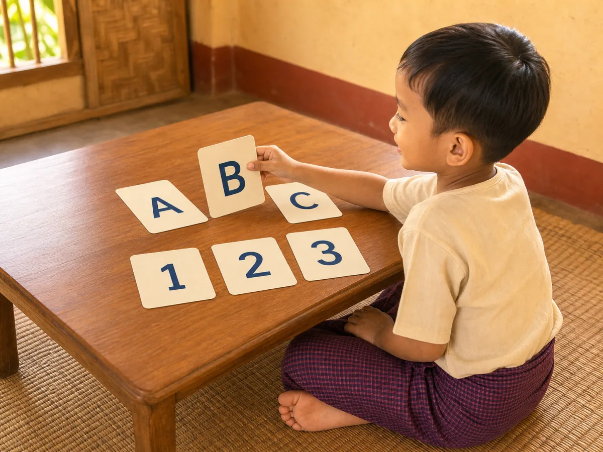

# ACE Child Grow — 5 Year Milestone Illustration Review

Status: **READY FOR OWNER REVIEW — NOT DEPLOYED**

Source of truth: Production Convex `libraryContent`, filtered to `type = milestone`, exact `ageGroupKey = 5y`, and `clinicalStatus = published`. Read directly on 2026-08-03. Production contains exactly four published records for this age group. The observed behaviour and milestone meaning are stored in each record's nested `data.observeMm`, `data.observeEn`, `data.whyMm`, and `data.whyEn` fields. `summaryMm`, `summaryEn`, `category`, and safety information are unavailable for all four records.

## Pre-generation review table

| Slug | Myanmar title | English title | Exact behaviour | Image scene | Must not show | Status |
| --- | --- | --- | --- | --- | --- | --- |
| `ms_5y_gross_motor_1` | ခုန်ကျော်၊ ဟန်ချက်ညီ လှုပ်ရှားခြင်း | Skips and balances well | Child skips with coordinated alternating movement and good balance. | One Myanmar/Southeast Asian 5-year-old mid-skip on a flat safe courtyard: one foot makes a light landing, the opposite knee lifts, and opposite arms naturally counterbalance; full body and focused forward gaze visible. | Hopping on one foot in place; running; jumping over an object; ball/toy; balance beam; fall hazard; another movement skill. | **READY FOR OWNER REVIEW** |
| `ms_5y_language_1` | ရှင်းလင်းသော ဝါကျ အပြည့်အစုံ ပြောခြင်း | Speaks in clear full sentences | Child speaks clearly enough for a less-familiar adult to understand. | One Myanmar/Southeast Asian 5-year-old speaks confidently to a new classroom teacher; child uses one natural conversational hand gesture while the teacher listens, makes eye contact, and shows clear understanding without prompting. | Speech bubble; written sentence; parent interpreting; teacher prompting/correcting; storytelling cards; reading; unrelated classroom task. | **READY FOR OWNER REVIEW** |
| `ms_5y_school_readiness_1` | အက္ခရာ/ဂဏန်း အများစုကို သိရှိခြင်း | Knows most letters / numbers | Child recognizes most letters and numbers. | With the owner-approved narrow exception, child confidently places `B` between `A` and `C`; the second row contains `1`, `2`, and `3`, all upright in the shared child/viewer orientation. | Full alphabet; worksheet; writing; counting objects; wrong/reversed characters; words; labels; unrelated school task. | **READY FOR OWNER REVIEW — OWNER-APPROVED CHARACTER EXCEPTION** |
| `ms_5y_self_help_1` | အိမ်သာ/လက်ဆေးခြင်း ကိုယ်တိုင်လုပ်ခြင်း | Manages toilet and handwashing | Child independently completes toileting hygiene and washes hands. | One fully clothed Myanmar/Southeast Asian 5-year-old independently washing both soapy hands at a child-height sink; a clean toilet with lid down is visible behind to establish the completed toileting routine, with no caregiver assistance. | Exposed body; child seated on toilet; open/dirty toilet; caregiver help; unsafe stool; overflowing water; unrelated bathing or toothbrushing. | **READY FOR OWNER REVIEW** |

## Production record details

### `ms_5y_gross_motor_1`

- Myanmar title: ခုန်ကျော်၊ ဟန်ချက်ညီ လှုပ်ရှားခြင်း
- English title: Skips and balances well
- observeMm: ခုန်ကျော်နိုင်၍ ဟန်ချက်ညီစွာ လှုပ်ရှားပါသလား။
- observeEn: Skips and moves with good balance?
- Meaning: ဤသည်မှာ ကစားနှင့် အားကစားအတွက် အသင့်ဖြစ်ခြင်းဖြစ်သည်။ / This supports active play and sport.
- Age group: `5y`
- Domain: `gross_motor`
- Publication status: `published`
- Asset: `/milestones/5y/ms_5y_gross_motor_1.f8f458aa4a.webp`

QA: **READY FOR OWNER REVIEW** — child demonstrates a controlled step-hop phase with upright torso, one light forefoot landing, opposite knee lifted, and arms counterbalancing. Age, anatomy, hands, fingers, legs, knees, ankles, feet, forward gaze, facial expression, safe flat ground, cultural fit, uniqueness, and wordless output pass. No running lean, two-foot jump, obstacle, equipment, toy, extra person, arrow, or unrelated movement.

### `ms_5y_language_1`

- Myanmar title: ရှင်းလင်းသော ဝါကျ အပြည့်အစုံ ပြောခြင်း
- English title: Speaks in clear full sentences
- observeMm: အစိမ်းလူများ နားလည်နိုင်စွာ ဝါကျ အပြည့်အစုံ ပြောပါသလား။
- observeEn: Uses clear sentences strangers understand?
- Meaning: ဤသည်မှာ ကျောင်းတွင် ဆက်သွယ်ရန် အသင့်ဖြစ်ခြင်းဖြစ်သည်။ / This is readiness to communicate at school.
- Age group: `5y`
- Domain: `language`
- Publication status: `published`
- Asset: `/milestones/5y/ms_5y_language_1.3ea3bd519e.webp`

QA: **READY FOR OWNER REVIEW** — child is the only speaker, with natural mid-sentence mouth shape, direct gaze, relaxed posture, and one conversational hand gesture; a new teacher listens silently at eye level and shows understanding without prompting. Age, anatomy, hands, fingers, legs, feet, faces, gaze, expression, cultural fit, uniqueness, and wordless output pass. No speech bubble, written sentence, parent interpretation, correction, teaching material, reading, singing, or unrelated task.

### `ms_5y_school_readiness_1`

- Myanmar title: အက္ခရာ/ဂဏန်း အများစုကို သိရှိခြင်း
- English title: Knows most letters / numbers
- observeMm: အက္ခရာ/ဂဏန်း အများစုကို မှတ်မိပါသလား။
- observeEn: Recognizes most letters and numbers?
- Meaning: ဤသည်မှာ စာဖတ်ခြင်းနှင့် သင်္ချာ၏ အခြေခံဖြစ်သည်။ / This is the base for reading and math.
- Age group: `5y`
- Domain: `school_readiness`
- Publication status: `published`
- Owner exception: explicitly approved for this milestone only. Exactly `A`, `B`, `C`, `1`, `2`, and `3` may appear once each; every other text/character remains prohibited.
- Asset: `/milestones/5y/ms_5y_school_readiness_1.33e2dded35.webp`

QA: **READY FOR OWNER REVIEW — OWNER-APPROVED CHARACTER EXCEPTION** — the over-the-shoulder camera shares the child's reading orientation. The child independently places upright `B` between upright `A` and `C`; the completed second row contains upright `1`, `2`, and `3`. Exactly six approved characters appear once each, with no reversal, duplication, malformation, ambiguity, or other text. Age, anatomy, hands, fingers, seated legs, visible foot, gaze, focused expression, cultural fit, uniqueness, and output pass. No alphabet chart, worksheet, writing tool, counting objects, adult help, label, word, logo, or unrelated task.

### `ms_5y_self_help_1`

- Myanmar title: အိမ်သာ/လက်ဆေးခြင်း ကိုယ်တိုင်လုပ်ခြင်း
- English title: Manages toilet and handwashing
- observeMm: အိမ်သာသုံးပြီး လက်ကို ကိုယ်တိုင် ဆေးနိုင်ပါသလား။
- observeEn: Uses the toilet and washes hands alone?
- Meaning: ဤသည်မှာ ကျန်းမာရေးနှင့် ကျောင်းအတွက် အရေးကြီးသည်။ / This matters for health and school.
- Age group: `5y`
- Domain: `self_help`
- Publication status: `published`
- Asset: `/milestones/5y/ms_5y_self_help_1.2a1e95020f.webp`

QA: **READY FOR OWNER REVIEW** — a fully clothed child independently rubs both soapy hands beneath gentle running water; a clean toilet with lid down establishes the completed toileting routine without depicting private use. Age, anatomy, hands, fingers, legs, feet, gaze, expression, privacy, dry-floor safety, cultural fit, uniqueness, and wordless output pass. No exposed body, open or dirty toilet, caregiver, stool, spill, bathing, toothbrushing, towel action, label, or unrelated hygiene task.

All four candidate assets are now mapped directly by exact slug for application verification. No Production or deployment change has been made.

## Verification

- Exact slug-to-asset mapping: **PASS** — four published slugs, four unique versioned WebP paths, and every file exists; no domain/category fallback.
- Asset format: **PASS** — all files are 1200×900 landscape 4:3 WebP and each is under 140 KB.
- Next/Previous and wording: **PASS** — the component navigation test cycles through all four unique images, restores the correct prior image, and verifies the exact published Myanmar titles/observations plus English title/observation rendering.
- Focused tests: **PASS** — 42 tests.
- Full test suite: **PASS** — 948 tests across 92 files.
- Typecheck and lint: **PASS**.
- Production build and PWA precache: **PASS** — each new exact asset appears once in the generated service worker; no asset-related warning or missing import/file.
- Browser screenshots: **BLOCKED BY ENVIRONMENT** — the in-app browser-control runtime is unavailable under the current managed desktop policy, so it could not attach to the local preview. The application flow is covered by the component navigation test; every final illustration preview and Production wording is included in this document.
- Deployment: **NOT PERFORMED**.
