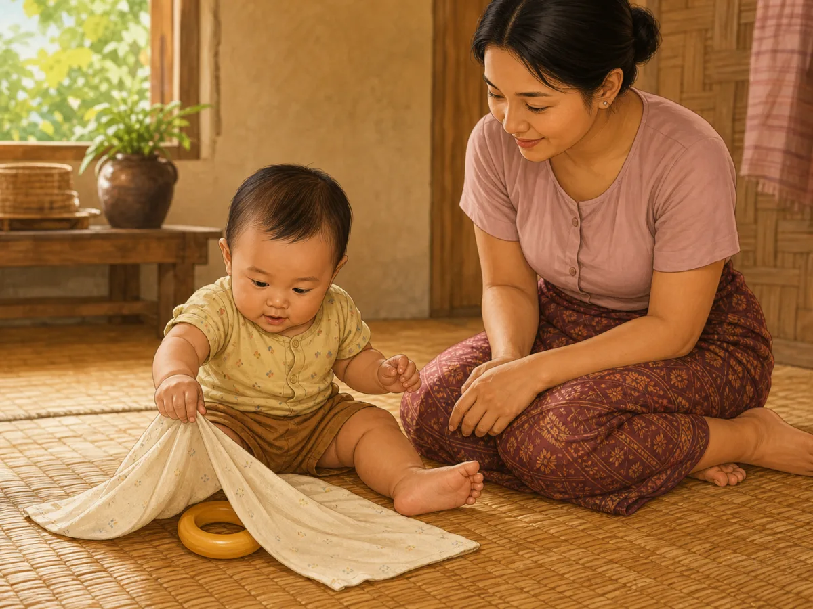
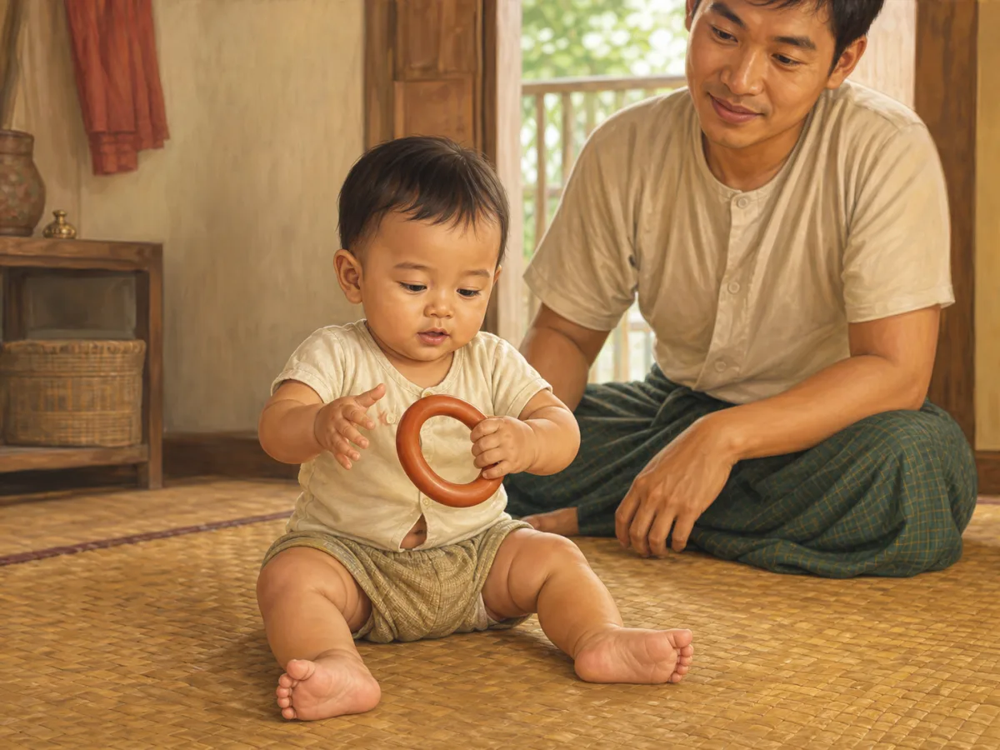
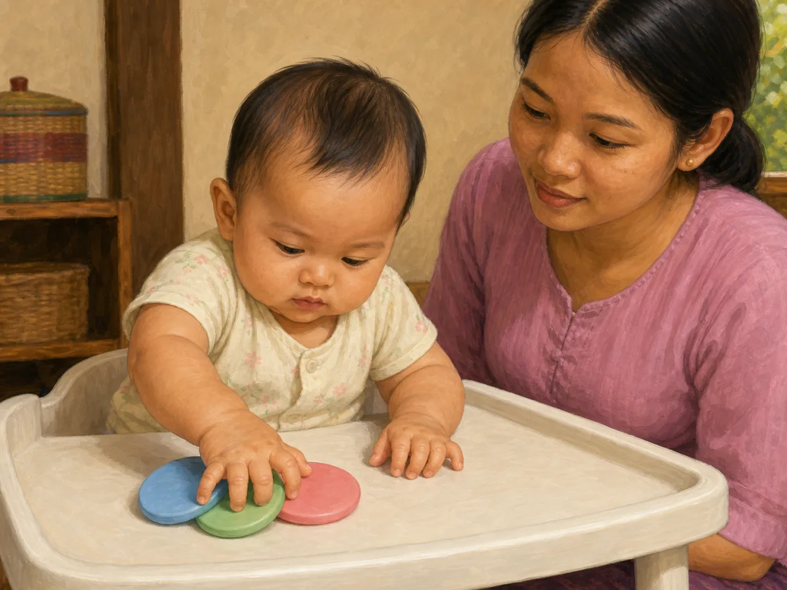
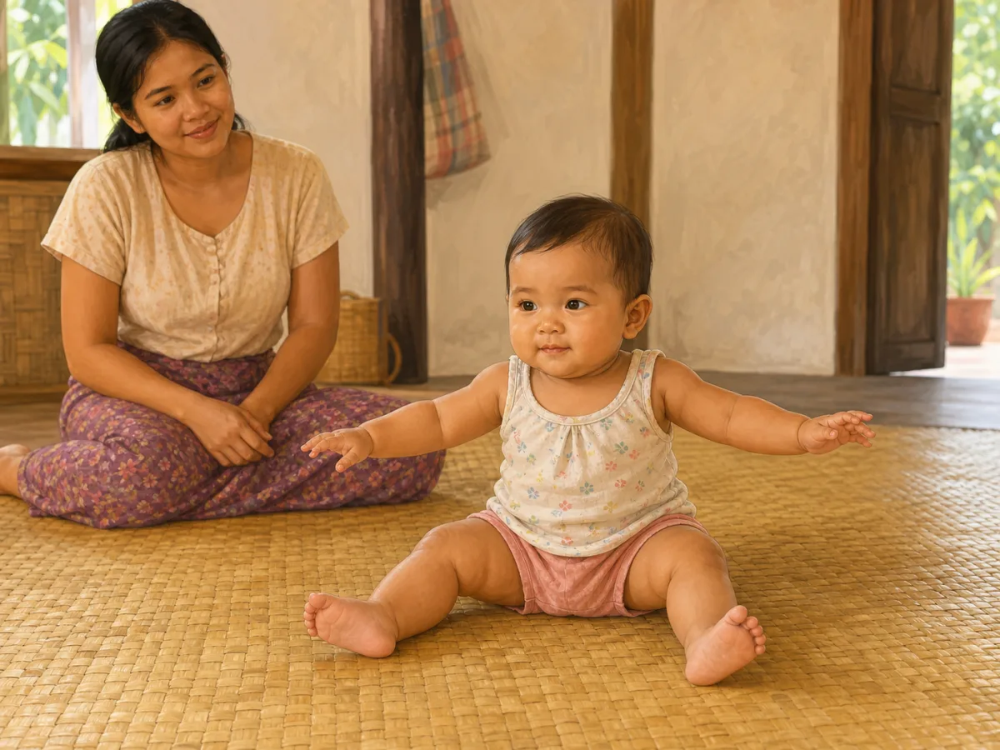
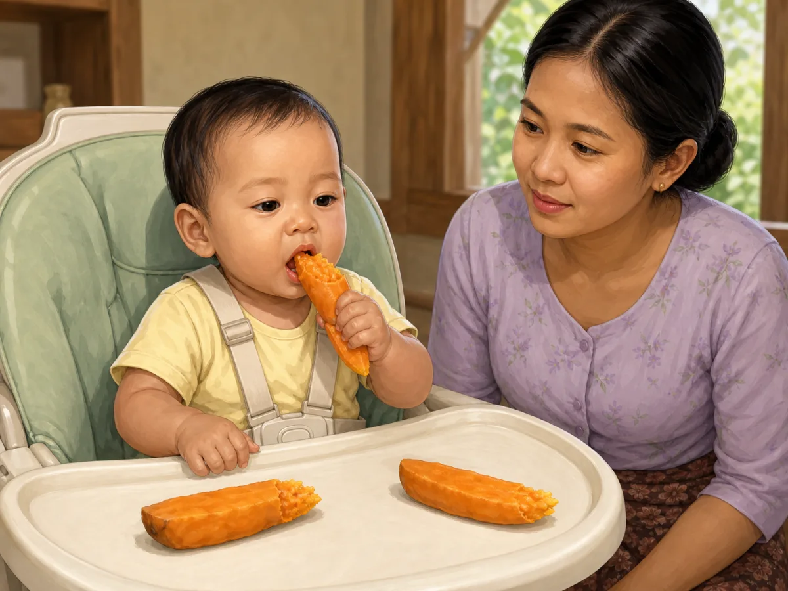
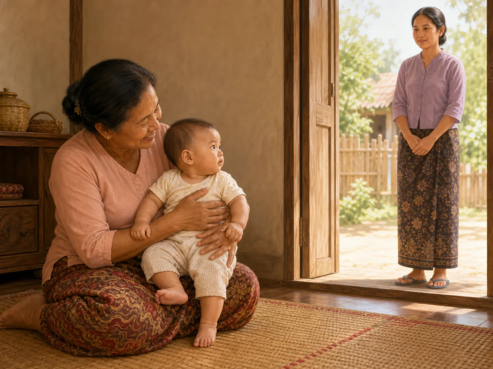
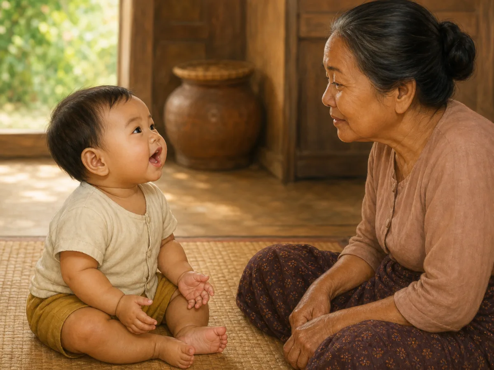

# ACE Child Grow — 7–9 Month Milestone Illustration Review

Status: **OWNER APPROVED — NOT DEPLOYED**

Source of truth: Production Convex `libraryContent`, filtered to `type = milestone`, `ageGroupKey = 7_9m`, and `clinicalStatus = published`. Read on 2026-08-02. All 12 records are published; `summaryMm`, `summaryEn`, and `category` are unavailable for every record.

Every illustration was generated through one separate Built-in ImageGen call, clinically reviewed, and saved as a unique wordless 1200×900 WebP under 500 KB. Every exact slug maps directly to one exact asset with no domain/category fallback.

## 1. `ms_7_9m_cognitive_1`

- Myanmar title: ဖုံးကွယ်ထားသော ပစ္စည်းကို လိုက်ရှာခြင်း
- English title: Looking for a hidden object
- observeMm: ကစားစရာကို အဝတ်ဖြင့် ဖုံးလိုက်လျှင် ကလေးက လှန်ရှာပါသလား။
- observeEn: If you cover a toy with a cloth, does she pull the cloth off to find it?
- Meaning: ၇ လမှ ၉ လကြားတွင် "မမြင်ရသော်လည်း ရှိနေသေးသည်" ဟူသော အသိ စတင် ဖြစ်ပေါ်လာသည်။ ဤအသိသည် ဖုံးပြီးပြန်ဖွင့်ခြင်း ကစားနည်းများကို ကလေး ကြိုက်နှစ်သက်စေသည်။ / Between 7 and 9 months babies begin to grasp that things still exist when out of sight, which is why hiding games become so enjoyable.
- Domain: `cognitive`
- Asset: `/milestones/7_9m/ms_7_9m_cognitive_1.179faf6080.webp`

QA: **READY FOR OWNER REVIEW** — lifts a cloth corner and looks directly at the revealed ring; cloth remains away from the face; age, anatomy, hands, feet, gaze, safety, cultural fit, uniqueness, and wordless output pass.

## 2. `ms_7_9m_fine_motor_1`

- Myanmar title: ပစ္စည်းကို လက်တစ်ဖက်မှ တစ်ဖက်သို့ ကူးခြင်း
- English title: Passes objects hand to hand
- observeMm: ကစားစရာကို လက်တစ်ဖက်မှ အခြားတစ်ဖက်သို့ ကူးပါသလား။
- observeEn: Moves a toy from one hand to the other?
- Meaning: ဤသည်မှာ ပိုမိုတိကျသော ကိုင်တွယ်မှုကို လေ့ကျင့်စေသည်။ / This practices more precise handling.
- Domain: `fine_motor`
- Asset: `/milestones/7_9m/ms_7_9m_fine_motor_1.af2a44e004.webp`

QA: **READY FOR OWNER REVIEW** — one hand releases while the other receives the same ring at midline; no mouthing, banging, extra toy, or unrelated action; all anatomy and content checks pass.

## 3. `ms_7_9m_fine_motor_2`

- Myanmar title: ပစ္စည်းငယ်များကို လက်ဖြင့် ဆွဲယူခြင်း
- English title: Raking and picking up small objects
- observeMm: ကလေးသည် ပစ္စည်းငယ်ကို လက်ချောင်းများဖြင့် ဆွဲယူရန် ကြိုးစားပါသလား။ ပစ္စည်းနှစ်ခုကို ရိုက်ခတ်ပါသလား။
- observeEn: Does she rake small objects towards her with her fingers, or bang two things together?
- Meaning: ၇ လမှ ၉ လကြားတွင် လက်ဝါးတစ်ခုလုံးဖြင့် ဆွဲယူရာမှ လက်မနှင့် လက်ညှိုးဖြင့် ညှပ်ယူခြင်းသို့ တဖြည်းဖြည်း ကူးပြောင်းသည်။ ၉ လဝန်းကျင်တွင် အစောပိုင်း ညှပ်ကိုင်မှု စတင်တတ်သည်။ / Between 7 and 9 months a whole-hand rake gradually becomes a thumb-and-finger pinch; an early pincer grasp often appears around 9 months.
- Domain: `fine_motor`
- Asset: `/milestones/7_9m/ms_7_9m_fine_motor_2.803dd30b9c.webp`

QA: **READY FOR OWNER REVIEW** — whole-hand rake is clear; three broad soft pieces are visibly too large to swallow; no mature pincer, mouthing, or banging; supervised safety and anatomy pass. One earlier reaching-only attempt was rejected.

## 4. `ms_7_9m_gross_motor_1`

- Myanmar title: အထောက်မပါဘဲ ထိုင်ခြင်း
- English title: Sits without support
- observeMm: ခဏတာ တစ်ယောက်တည်း ထိုင်နိုင်ပါသလား။
- observeEn: Sits alone for a short while?
- Meaning: တည်ငြိမ်စွာ ထိုင်ခြင်းသည် လက်နှစ်ဖက်ဖြင့် ကစားရန် လွတ်လပ်စေသည်။ / Steady sitting frees both hands to play.
- Domain: `gross_motor`
- Asset: `/milestones/7_9m/ms_7_9m_gross_motor_1.d8f1df216d.webp`

QA: **READY FOR OWNER REVIEW** — brief unsupported sitting with arms out for balance on a safe floor mat; no hand prop, caregiver support, toy, fall hazard, or older movement; all checks pass.

## 5. `ms_7_9m_gross_motor_2`

- Myanmar title: မမှီဘဲ ထိုင်နိုင်ခြင်း
- English title: Sitting without support
- observeMm: ကလေးသည် လက်ဖြင့် မထောက်ဘဲ ခဏ ထိုင်နိုင်ပါသလား။
- observeEn: Can your baby sit for a while without propping on her hands?
- Meaning: မမှီဘဲ ထိုင်နိုင်ခြင်းသည် များသောအားဖြင့် ၆ လမှ ၉ လကြားတွင် ဖြစ်လာပြီး ကွာဟမှု ကျယ်ပါသည်။ အစပိုင်းတွင် လက်ဖြင့် ထောက်ထိုင်ပြီး နောက်မှ လက်လွတ် ထိုင်နိုင်လာသည်။ / Sitting without support usually appears between about 6 and 9 months, with wide variation. Babies first prop on their hands, then let go.
- Domain: `gross_motor`
- Asset: `/milestones/7_9m/ms_7_9m_gross_motor_2.464f9e0276.webp`

QA: **READY FOR OWNER REVIEW** — distinct side-view steady sitting with both hands off the floor; no prop, support, toy, or extra movement; age and anatomy pass.

## 6. `ms_7_9m_language_1`

- Myanmar title: မိမိနာမည်ကို တုံ့ပြန်ခြင်း
- English title: Responds to own name
- observeMm: နာမည်ခေါ်ပါက လှည့်ကြည့်ပါသလား။
- observeEn: Turns when you call their name?
- Meaning: နာမည်ကို မှတ်မိခြင်းသည် ဘာသာစကား နားလည်မှု၏ အစဖြစ်သည်။ / Knowing their name starts language understanding.
- Domain: `language`
- Asset: `/milestones/7_9m/ms_7_9m_language_1.1f405c9f0f.webp`

QA: **READY FOR OWNER REVIEW** — torso remains forward while head and gaze turn toward the side-positioned speaking mother; no sound toy, gesture command, or written name; all checks pass.

## 7. `ms_7_9m_language_2`

- Myanmar title: ရိုးရှင်းသော စကားလုံးများကို နားလည်လာခြင်း
- English title: Understanding simple words
- observeMm: "မလုပ်နဲ့"၊ "လာ" ကဲ့သို့ စကားလုံးများကို တုံ့ပြန်ပါသလား။ နာမည်ခေါ်လျှင် လှည့်ကြည့်ပါသလား။
- observeEn: Does she respond to words like "no" or "come", and turn when her name is called?
- Meaning: နားလည်မှုသည် ပြောဆိုမှုထက် စောပါသည်။ ၇ လမှ ၉ လကြားတွင် အသုံးများသော စကားလုံးအချို့ကို နားလည်လာပြီး မိဘ၏ လေသံနှင့် အမူအရာကိုလည်း ဖတ်တတ်လာသည်။ / Understanding comes before talking. Between 7 and 9 months babies begin to recognise a few familiar words, and they read tone and gesture too.
- Domain: `language`
- Asset: `/milestones/7_9m/ms_7_9m_language_2.faf2fef331.webp`

QA: **READY FOR OWNER REVIEW** — baby remains seated, makes eye contact, and raises both forearms in response to the mother's open-arms cue; no crawling, standing, pointing, waving, text, or name-call duplicate; all checks pass.

## 8. `ms_7_9m_nutrition_1`

- Myanmar title: တစ်နေ့ အစာ နှစ်နပ်မှ သုံးနပ် စားနိုင်လာခြင်း
- English title: Moving to two or three meals a day
- observeMm: ကလေးသည် တစ်နေ့လျှင် အစားအစာ နှစ်နပ်မှ သုံးနပ် စားနေပါသလား။ အသားညက်၊ ပဲ၊ အသည်း ကဲ့သို့ သံဓာတ်ပါသော အစာများ ပါဝင်ပါသလား။
- observeEn: Is she eating two to three meals a day, including iron-rich foods such as minced meat, liver, beans or eggs?
- Meaning: ၆ လမှ ၈ လကြားတွင် ကမ္ဘာ့ကျန်းမာရေးအဖွဲ့က တစ်နေ့လျှင် အစာ နှစ်နပ်မှ သုံးနပ် အကြံပြုပြီး နို့တိုက်ခြင်းကို ဆက်လက် လုပ်ရန် ဖြစ်သည်။ ဤအရွယ်တွင် သံဓာတ် လိုအပ်ချက် မြင့်တက်လာသည်။ / WHO guidance for 6–8 months is two to three meals a day alongside continued breastfeeding; iron needs rise sharply at this age.
- Domain: `nutrition`
- Asset: `/milestones/7_9m/ms_7_9m_nutrition_1.eb7d394693.webp`

QA: **READY FOR OWNER REVIEW** — securely strapped upright posture and supervised soft mashed iron-rich food; no hard/round chunks, force-feeding, reclined feeding, self-feeding, or unrelated object; all checks pass.

## 9. `ms_7_9m_self_help_1`

- Myanmar title: လက်ဖြင့် ကိုယ်တိုင် စားနိုင်လာခြင်း
- English title: Starting to feed herself with her hands
- observeMm: ကလေးသည် ပျော့သော အစာတုံးများကို ကိုယ်တိုင် ကောက်စားပါသလား။ ခွက်ကို ကိုင်ကြည့်ပါသလား။
- observeEn: Does she pick up soft finger foods herself, or hold a cup?
- Meaning: ၈ လဝန်းကျင်တွင် ပျော့သော အစာတုံးများကို ကိုယ်တိုင် ကောက်စားနိုင်လာသည်။ ကိုယ်တိုင် စားခြင်းသည် လက်ကြွက်သားများနှင့် အစားအစာ လက်ခံမှုကို တစ်ပြိုင်နက် လေ့ကျင့်ပေးသည်။ / Around 8 months many babies can pick up soft finger foods. Self-feeding builds hand skills and food acceptance at the same time.
- Domain: `self_help`
- Asset: `/milestones/7_9m/ms_7_9m_self_help_1.a1102d3b03.webp`

QA: **READY FOR OWNER REVIEW** — baby independently holds a long thick steamed wedge with a visibly soft mashed end; caregiver supervision and upright strapped posture pass; no hard, round, tiny, or choking-risk food. One earlier hard-looking attempt was rejected.

## 10. `ms_7_9m_social_1`

- Myanmar title: ရင်းနှီးသူ/မရင်းနှီးသူ ခွဲခြားခြင်း
- English title: Knows familiar people
- observeMm: ရင်းနှီးသူနှင့် အစိမ်းလူကို ကွဲပြားစွာ တုံ့ပြန်ပါသလား။
- observeEn: Reacts differently to familiar vs. new people?
- Meaning: ဤသည်မှာ လူမှုမှတ်ဉာဏ် ဖွံ့ဖြိုးလာခြင်း ဖြစ်သည်။ / This shows growing social memory.
- Domain: `social`
- Asset: `/milestones/7_9m/ms_7_9m_social_1.16d0f8134d.webp`

QA: **READY FOR OWNER REVIEW** — baby leans securely into the familiar grandmother while cautiously studying a new visitor at respectful distance; no stranger contact, toy, crowd, or separation crying; all checks pass.

## 11. `ms_7_9m_social_2`

- Myanmar title: မိဘနှင့် ခွဲခွာရသည်ကို စိုးရိမ်လာခြင်း
- English title: Showing separation anxiety
- observeMm: မိဘ ခွာသွားလျှင် ငိုပါသလား။ အသိမဟုတ်သူ ချီလျှင် တွန့်ဆုတ်ပါသလား။
- observeEn: Does she cry when you leave, or hold back from unfamiliar people?
- Meaning: ၈ လမှ ၁၀ လကြားတွင် ခွဲခွာမှု စိုးရိမ်ခြင်းသည် အများဆုံး ဖြစ်တတ်သည်။ ၎င်းသည် ပြဿနာ မဟုတ်ဘဲ ကလေးက မိဘကို အထူးပုဂ္ဂိုလ်အဖြစ် မှတ်မိလာပြီ ဟူသော ကျန်းမာသည့် အချက်ပြမှု ဖြစ်သည်။ / Separation anxiety usually peaks between about 8 and 10 months. It is not a problem — it is a healthy sign that she now knows you are someone special.
- Domain: `social`
- Asset: `/milestones/7_9m/ms_7_9m_social_2.9a7056968b.webp`

QA: **READY FOR OWNER REVIEW** — one reaching arm, small tear, and mild concern clearly respond to the departing mother; father remains immediately present and supportive; no abandonment, stranger pickup, severe panic, or bye-bye gesture; all checks pass.

## 12. `ms_7_9m_speech_1`

- Myanmar title: ဗျည်းသံ အစဉ်လိုက် မြည်တွန်ခြင်း
- English title: Babbling long strings of sounds
- observeMm: ကလေးသည် "ဘဘဘ"၊ "ဒဒဒ" ကဲ့သို့ အသံများကို ဆက်တိုက် ထွက်ပါသလား။
- observeEn: Does she make long strings such as "bababa" or "dadada"?
- Meaning: ၇ လမှ ၉ လကြားတွင် ဗျည်းသံများ ထပ်ခါထပ်ခါ ပေါင်းစပ်ခြင်း ပိုများလာသည်။ "မာမာ"၊ "ဒါဒါ" ဟု ဆိုသော်လည်း လူကို ရည်ညွှန်း၍ မဟုတ်သေးပါ — ၎င်းသည် ပုံမှန် ဖြစ်သည်။ / Repeated consonant strings become common between 7 and 9 months. "Mama" and "dada" may appear without yet meaning a person, which is normal.
- Domain: `speech`
- Asset: `/milestones/7_9m/ms_7_9m_speech_1.96e17c6029.webp`

QA: **READY FOR OWNER REVIEW** — baby independently sits and produces an animated sustained babble while grandmother listens with closed mouth; no caregiver imitation, speech bubble, toy, clapping, or singing; all checks pass.

## Engineering and application verification

- Exact slug mapping: **PASS**
- Unique asset paths: **PASS** — 12 slugs resolve to 12 unique files
- Existing asset files: **PASS** — all files are 1200×900 WebP and 77–130 KB
- Next/Previous image navigation through all 12 milestones: **PASS** — automated component navigation test
- Full unit suite: **PASS** — 906 tests
- Type check and lint: **PASS**
- Production build: **PASS** — no asset-related warning, missing import, missing image, or broken route
- PWA precache: **PASS** — all 12 exact 7–9 month assets appear in `dist/sw.js`
- Mobile/desktop browser screenshots: **BLOCKED** — the in-app browser refused the local preview because its admin-enforced security policy could not be verified. The security control was not bypassed. Visual owner review remains available through the 12 previews above.
- Deployment: **NOT ALLOWED / NOT PERFORMED**
