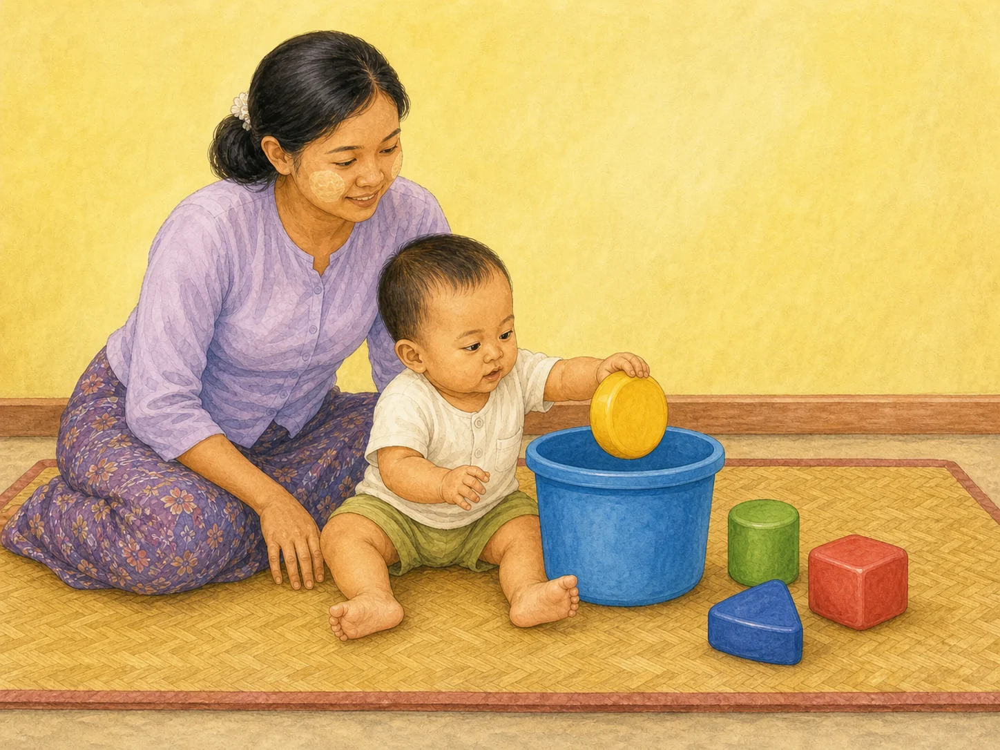
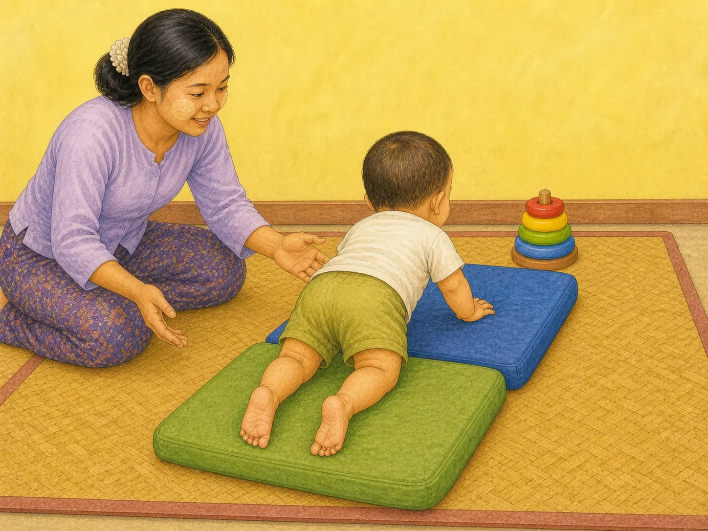
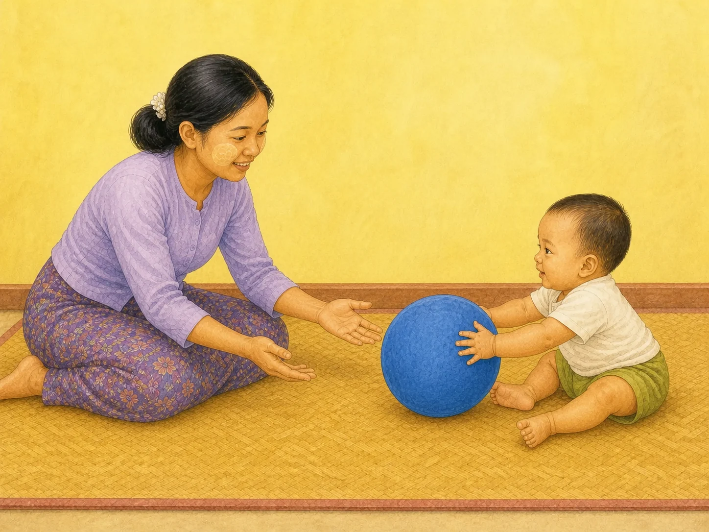

# ACE Child Grow — 10–12 Month Published Activity Illustration Review

Status: **READY FOR OWNER REVIEW — NOT DEPLOYED**

Source of truth: Production Convex `libraryContent`, filtered to `type = activity`, exact `ageGroupKey = 10_12m`, and `clinicalStatus = published`. Read directly from Production on 2026-08-09. Production contains exactly three matching published records. Every available record field was read; Production data was read only and was not modified.

## Pre-generation review

| Slug | Myanmar title | English title | Exact behaviour | Image scene | Must not show | Status |
|---|---|---|---|---|---|---|
| `act_container_in_and_out` | ဗူးထဲ ထည့်၊ ပြန်ထုတ် | In and out of the container | Baby puts one mouth-safe oversized object into a container and may take it out again. | Stable 10–12 month baby sits on a floor mat and puts one of four oversized pieces into one wide container while a Myanmar caregiver supervises immediately beside the baby. | Coins, buttons, batteries, magnets, beans, beads, mouth-size pieces, plastic bag, unsupervised play, crawling, standing, feeding, text, or extra toys. | READY |
| `act_obstacle_crawl` | ခေါင်းအုံး အတားအဆီး တွားကစားခြင်း | Pillow obstacle crawl | Baby crawls over a very low stable soft course toward one motivating toy. | Rear three-quarter floor scene: 10–12 month baby crawls on hands and knees over exactly two broad low cushions while a Myanmar caregiver remains within arm's reach. | Bed, sofa, elevated surface, tall or unstable pile, loose blanket over baby, steps, water, road, sitting, standing, walking, extra toys, text, or fall hazards. | READY |
| `act_roll_the_ball_back` | ဘောလုံး လှိမ့်ပေး လှိမ့်ပြန် | Roll the ball back | Seated baby rolls one large soft ball back to the facing caregiver for an early turn-taking exchange. | Baby and Myanmar caregiver sit face to face on a clear floor; baby uses both hands to roll one large soft ball toward the caregiver's open hands. | Mouth-size ball, balloon, multiple balls, road, water, steps, crawling, standing, throwing, clapping, feeding, extra objects, arrows, or text. | READY |

## Pre-generation confirmation

- Each scene illustrates only the published activity: **PASS**
- Behaviour, posture and independence are appropriate for 10–12 months: **PASS**
- Unrelated developmental actions are excluded: **PASS**
- Choking, movement and supervision requirements are identified: **PASS**
- Every concept is understandable without text: **PASS**
- One exact slug receives one unique image; no age/domain/category fallback: **PASS**

The table was completed before any image was generated. Built-in ImageGen was called separately for each candidate. Failed candidates were rejected and never saved as final.

## Owner review cards

### `act_container_in_and_out`

- Myanmar title: **ဗူးထဲ ထည့်၊ ပြန်ထုတ်**
- English title: **In and out of the container**
- Summary MM: ပစ္စည်းများကို ဘူးထဲထည့်ပြီး ပြန်ထုတ်ကစားခြင်းဖြင့် လက်ချောင်းလှုပ်ရှားမှုနှင့် အကြောင်းအကျိုးဆက်စပ်မှုကို နားလည်လာစေသည်။
- Summary EN: Putting objects into a container and taking them out builds hand skills and an understanding of where things go.
- Age / domain / publication: `10_12m` / `fine_motor` / `published`
- Materials/setup matched: one large container and four objects that are visibly too large for the baby's mouth; baby seated on the floor; caregiver directly supervising.
- Safety matched: no coin, button, battery, magnet, bean, plastic bag or mouth-size piece; no unsupervised play.
- Asset: `/activities/10_12m/act_container_in_and_out.69ff724ffa.webp` — 1448×1086, 245,750 bytes

QA: behaviour ✓ · age ✓ · anatomy ✓ · hands ✓ · feet ✓ · gaze/expression ✓ · exactly one container/four oversized pieces ✓ · caregiver supervision ✓ · no choking hazards ✓ · culturally appropriate ✓ · wordless ✓

**READY FOR OWNER REVIEW**

### `act_obstacle_crawl`

- Myanmar title: **ခေါင်းအုံး အတားအဆီး တွားကစားခြင်း**
- English title: **Pillow obstacle crawl**
- Summary MM: ပျော့ပျောင်းသော ခေါင်းအုံးများကို ကျော်တွားစေပြီး ကိုယ်လက်လှုပ်ရှားမှုနှင့် ဟန်ချက်ကို လေ့ကျင့်ပေးခြင်း။
- Summary EN: Gross-motor practice crawling over soft pillows.
- Age / domain / publication: `10_12m` / `gross_motor` / `published`
- Materials/setup matched: exactly two broad low cushions form a stable floor course; one large motivating toy is at the end.
- Safety matched: caregiver remains within arm's reach; no elevated surface, tall pile, steps, water or fall hazard.
- Asset: `/activities/10_12m/act_obstacle_crawl.459e65a32d.webp` — 1448×1086, 272,964 bytes

QA: behaviour ✓ · age ✓ · anatomy ✓ · hands ✓ · both feet/toes visible ✓ · crawl posture ✓ · gaze/expression ✓ · floor-course safety ✓ · caregiver supervision ✓ · no extra action ✓ · culturally appropriate ✓ · wordless ✓

Rejected candidates: attempt 1 hid one foot under the baby; attempt 2 again obscured one foot. Neither was saved. Attempt 3 uses a rear three-quarter view with both feet clearly visible and passed QA.

**READY FOR OWNER REVIEW**

### `act_roll_the_ball_back`

- Myanmar title: **ဘောလုံး လှိမ့်ပေး လှိမ့်ပြန်**
- English title: **Roll the ball back**
- Summary MM: ဘောလုံးကို အပြန်အလှန် လှိမ့်ခြင်းဖြင့် အလှည့်ကျ ကစားခြင်းနှင့် လက်–မျက်စိ ညှိနှိုင်းမှုကို လေ့ကျင့်ပေးသည်။
- Summary EN: Rolling a ball back and forth practises turn-taking and hand–eye coordination.
- Age / domain / publication: `10_12m` / `social` / `published`
- Materials/setup matched: one soft ball large enough to require both baby hands; caregiver and baby sit face to face on a clear floor.
- Safety matched: no mouth-size ball, balloon, road, water or steps; caregiver directly participates.
- Asset: `/activities/10_12m/act_roll_the_ball_back.5a37c8d923.webp` — 1448×1086, 217,588 bytes

QA: behaviour ✓ · age ✓ · anatomy ✓ · hands ✓ · feet ✓ · shared gaze/expression ✓ · one large safe ball ✓ · no extra objects/actions ✓ · culturally appropriate ✓ · wordless ✓

**READY FOR OWNER REVIEW**

## Mapping and application verification

- Three published Production slugs map directly to three different versioned WebP files: **PASS**
- Every asset exists, is 4:3, and is below 500 KB: **PASS**
- Age-group/domain/category/unknown fallback does not resolve for `10_12m`: **PASS**
- Previously approved activity mappings remain unchanged: **PASS**
- Component-level `/content/<exact-slug>` route rendering shows the exact Production Myanmar title, summary, image `src`, and image `alt`: **PASS — 3/3**
- Local running application signed-out authentication gate: **PASS**
- Authenticated mobile/desktop browser review: **PENDING OWNER REVIEW** — no test credential was used or bypassed during this draft run.
- Production Convex records were read only; no Production data was changed: **PASS**

## Engineering verification

- Focused mapping and exact ContentDetail rendering tests: **PASS — 12/12**
- Full unit test suite: **PASS — 1,117/1,117 across 112 test files**
- Typecheck: **PASS**
- Lint: **PASS**
- Production build and PWA precache: **PASS — 222 precache entries; no missing image or asset-related warning**
- Existing unrelated React Testing Library `act(...)` warnings remain in older milestone/Learn/AgeBand tests; this batch adds no new warning and its focused tests are clean.

## Deployment authorization

Owner approval: **NOT YET RECEIVED FOR THIS BATCH**

Final review result: **READY FOR OWNER REVIEW — DO NOT DEPLOY**

This batch changes only the three exact 10–12 month activity illustrations, their exact slug mappings, related tests, and this review record.
