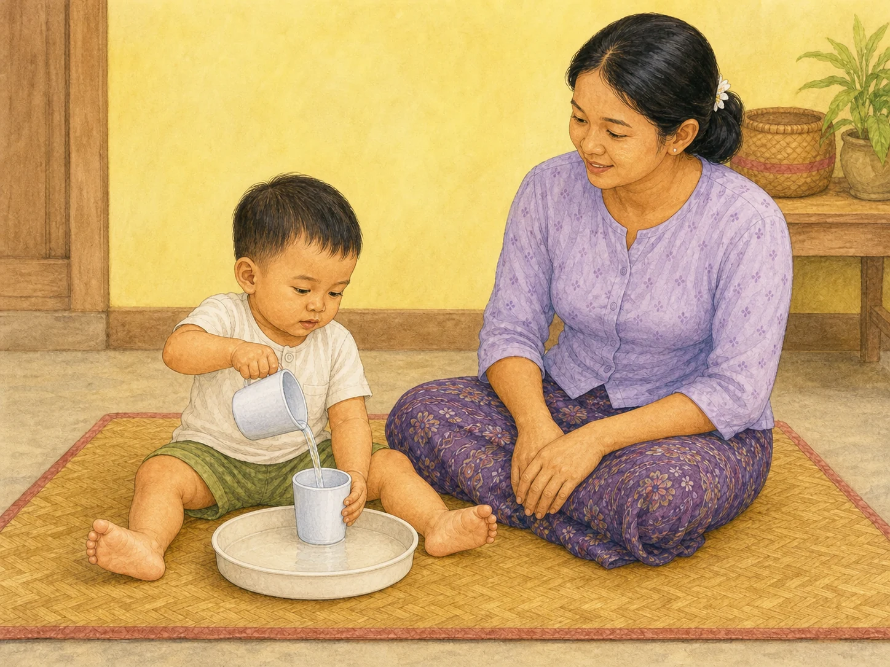

# ACE Child Grow — 2-Year Published Activity Illustration Review

Status: **READY FOR OWNER REVIEW — NOT DEPLOYED**

Source of truth: Production Convex `libraryContent`, filtered to exact `type = activity`, `ageGroupKey = 2y`, and `clinicalStatus = published`. Read directly from Production on 2026-08-09. Production contains exactly one matching published record. Every available record field was read; Production data was read only and was not modified.

## Pre-generation review

| Slug | Myanmar title | English title | Exact behaviour | Image scene | Must not show | Status |
|---|---|---|---|---|---|---|
| `act_water_pouring` | ရေ လောင်း/ကူးကစားခြင်း | Water pouring play | Child pours a small amount of water from one cup into another, practising controlled hand movement and volume concepts. | Developmentally accurate two-year-old Myanmar child pours water between exactly two cups inside a shallow tray while a Myanmar caregiver supervises immediately beside the child. | Drinking, bathing, food, bottle, spoon, faucet, bucket, extra containers, unrelated toys, parent pouring for the child, splashing, puddle, slippery floor, elevated surface, text, or UI. | READY |

## Pre-generation confirmation

- Scene illustrates only the published pouring behaviour: **PASS**
- Body size, stable floor posture and independence are appropriate for two years: **PASS**
- No unrelated developmental action is included: **PASS**
- Water supervision and slip-prevention requirements are identified: **PASS**
- Concept is understandable without text: **PASS**
- Exact slug receives one unique image; no age/domain/category fallback: **PASS**

The table was completed before generation. Built-in ImageGen was called once for this milestone after the Production review. The approved candidate passed the full QA checklist.

## Complete Production record used for review

- Slug: `act_water_pouring`
- Myanmar title: **ရေ လောင်း/ကူးကစားခြင်း**
- English title: **Water pouring play**
- Summary MM: ခွက်တစ်လုံးမှ တစ်လုံးသို့ ရေလောင်းကာ လက်ထိန်းချုပ်မှုနှင့် ပြဿနာဖြေရှင်းနိုင်စွမ်းကို လေ့ကျင့်ပေးခြင်း။
- Summary EN: Build fine-motor and problem-solving by pouring water.
- Age / primary domain / publication: `2y` / `fine_motor` / `published`
- Domains: `fine_motor`, `problem_solving`
- Difficulty / duration / offline: `medium` / 15 minutes / `true`
- Context flags: indoor `true`; outdoor `true`; one child `true`; parent–child `true`; group `false`; low cost `true`
- Materials MM: ခွက် ၂ လုံး၊ ရေ၊ ပန်းကန်ဗန်း။
- Materials EN: Two cups, water, a tray.
- Setup MM: ဗန်းပေါ်တွင် ရေအနည်းငယ်ထည့်၍ ကစားပါ။
- Setup EN: Set up on a tray with a little water.
- Instruction MM: ခွက်တစ်လုံးမှ တစ်လုံးသို့ ရေ လောင်းစေပါ။
- Instruction EN: Let the child pour water between cups.
- Safety MM: ရေအနီး အမြဲ ကြီးကြပ်ပါ။ ကြမ်းပြင် ချောနေ၍ လဲနိုင်သည်။
- Safety EN: Always supervise near water; watch slippery floors.
- Outcome MM: ထိန်းချုပ်မှု၊ အတိုင်းအတာ နားလည်မှု။
- Outcome EN: Control and volume concepts.
- Variations: none published
- Review scope: `education`
- Reviewer: ACE Child Grow Owner / Education Reviewer — MEd (Early Childhood and Special Education)
- Review note: Education and special-needs professional review completed. This is not medical or clinical approval; medical guidance remains general, evidence-based information.
- Source: ACE Child Grow editorial draft — general developmental guidance, pending native-Myanmar and clinical review
- Version: `1`

## Owner review card

### `act_water_pouring`

- Asset: `/activities/2y/act_water_pouring.3ba2a48346.webp`
- File: 1448×1086 landscape 4:3 WebP, 325,014 bytes
- Scene match: exactly two cups; child pours a small visible stream into the receiving cup; shallow tray contains the water; parent supervises with empty hands.
- Safety match: floor-level dry setting, water contained in tray, no puddle/slip hazard, no elevated surface, no unsupervised water play.

QA: behaviour ✓ · two-year age/body/posture ✓ · anatomy ✓ · both child hands/fingers ✓ · both child legs/feet ✓ · focused gaze/expression ✓ · exactly two cups/one tray ✓ · small contained water amount ✓ · caregiver supervision ✓ · no extra action ✓ · no unsafe object ✓ · culturally appropriate ✓ · wordless ✓

**READY FOR OWNER REVIEW**

## Mapping and application verification

- Published Production slug maps directly to its new versioned WebP: **PASS**
- Asset exists, is exact 4:3, has a content-hash filename, and is below 500 KB: **PASS**
- No age-group/domain/category/unknown fallback resolves for `2y`: **PASS**
- Previously approved activity mappings remain unchanged: **PASS**
- Component-level `/content/act_water_pouring` rendering shows the exact Production Myanmar title, summary, image `src`, and image `alt`: **PASS — 1/1**
- Local running application signed-out authentication gate: **PASS**
- Vercel draft-preview asset: **PASS** — browser loaded the exact hashed WebP with `complete = true`, natural size 1448×1086, no horizontal overflow, and zero console errors.
- Authenticated text-plus-image card and mobile/desktop review: **BLOCKED** — signed-in Chrome passed Vercel preview protection, but the preview origin correctly showed the ACE application sign-in gate. No application credential was entered and no authentication control was bypassed. Exact title/summary/image rendering remains covered by the component test and the embedded owner-review preview above.
- Production Convex records were read only; no Production data was changed: **PASS**

## Engineering verification

- Focused mapping and exact ContentDetail rendering tests: **PASS — 10/10**
- Full unit test suite: **PASS — 1,121/1,121 across 114 test files**
- Typecheck: **PASS**
- Lint: **PASS**
- Production build and PWA precache: **PASS — 224 precache entries; no missing image or asset-related warning**
- GitHub CI: **PASS** — Playwright 1m20s; typecheck/lint/unit/build 1m46s; Vercel preview READY in 16s
- Existing unrelated React Testing Library `act(...)` warnings remain in older milestone/Learn/AgeBand tests; this batch adds no new warning and its focused tests are clean.

## Deployment authorization

Owner approval: **NOT YET RECEIVED FOR THIS BATCH**

Final review result: **READY FOR OWNER REVIEW — DO NOT DEPLOY**

This batch changes only the exact published 2-year activity illustration, its exact slug mapping, related tests, and this review record.
