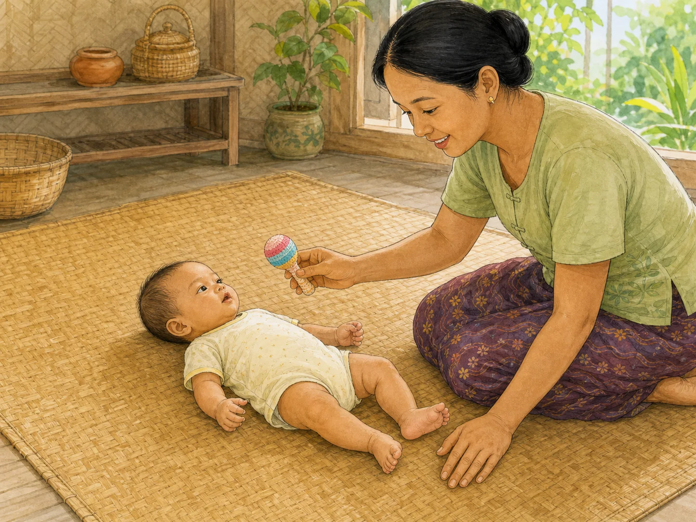
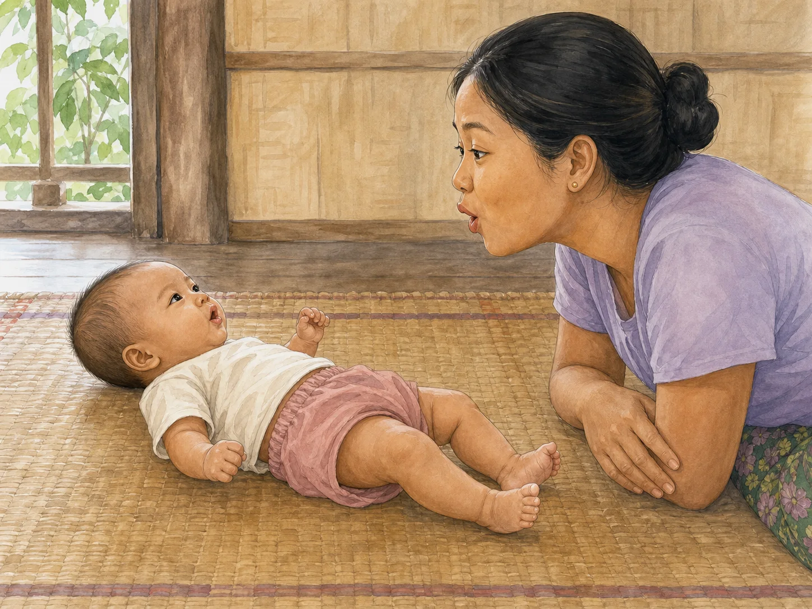
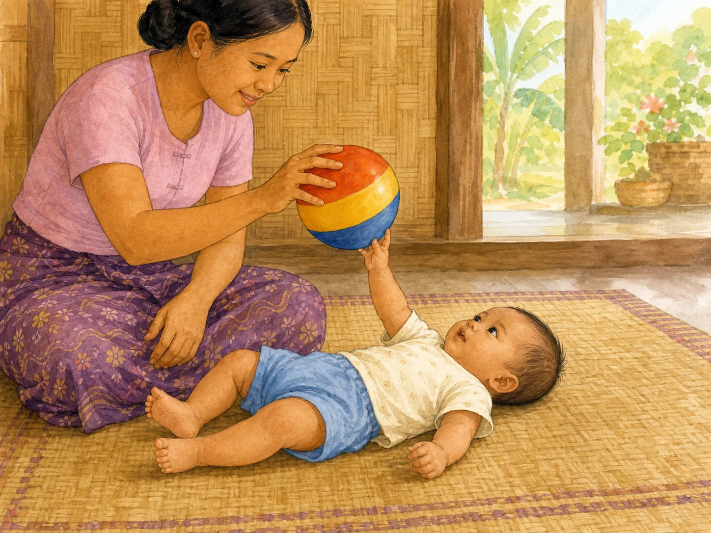
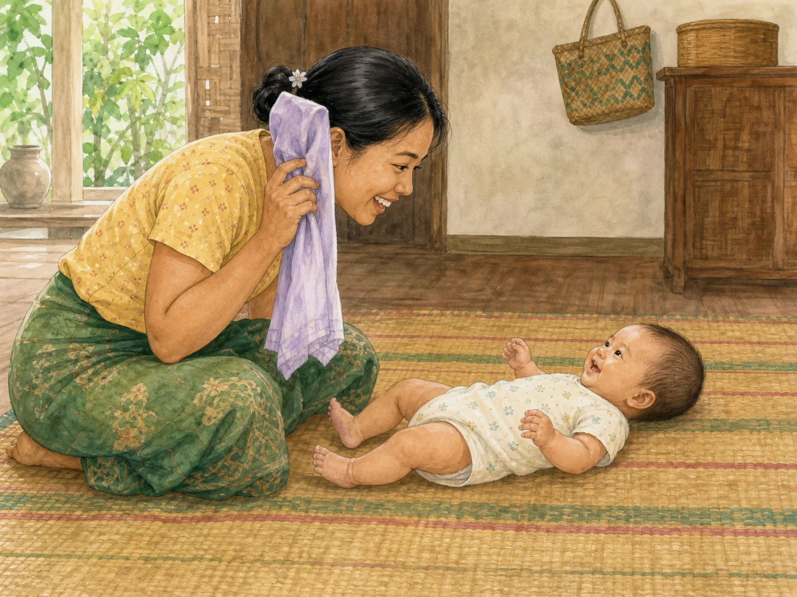
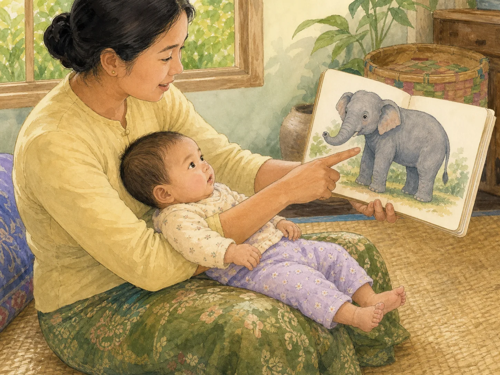
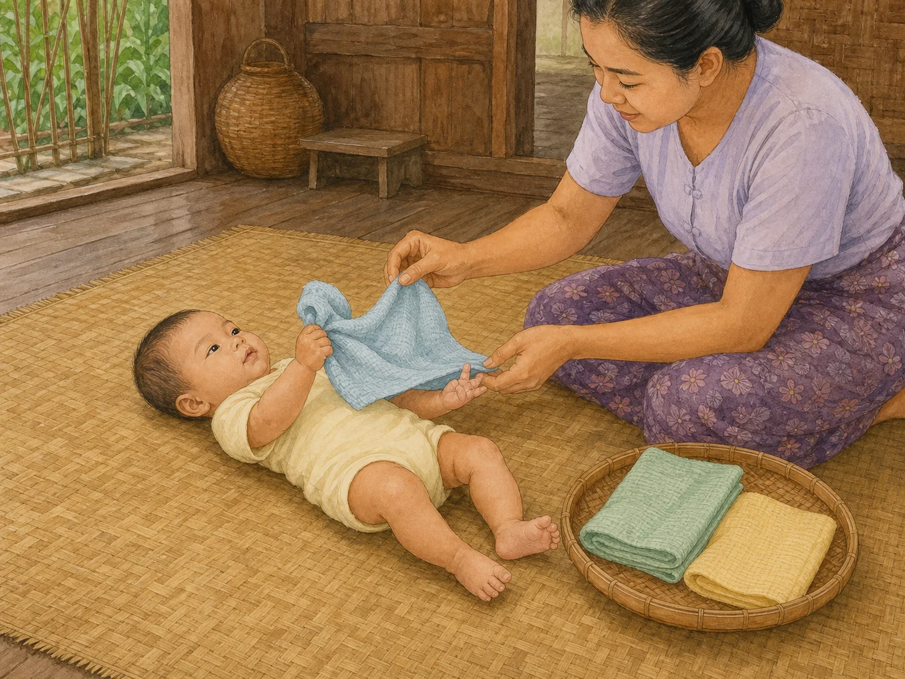

# ACE Child Grow — 3–4 Month Published Activity Illustration Review

Status: **OWNER APPROVED — PRODUCTION DEPLOYMENT AUTHORIZED**

Source of truth: Production Convex `libraryContent`, filtered to `type = activity`, exact `ageGroupKey = 3_4m`, and `clinicalStatus = published`. Read directly from Production on 2026-08-03. Production contains exactly seven matching published records. Production data was read only and was not modified.

## Pre-generation review

| Slug | Myanmar title | English title | Exact behaviour | Image scene | Must not show | Status |
|---|---|---|---|---|---|---|
| `act_sound_tracking` | အသံလိုက် လှည့်ကြည့်ကစားခြင်း | Sound-tracking play | Awake baby lies on the back and turns the head and gaze toward one gentle sound made at the side; caregiver smiles after the turn. | Floor-level 3–4 month baby, caregiver beside the mat holding one soft rattle away from the ear. | Loud sound, clapping, sound beside the ear, music player, overhead reaching, sitting, rolling, or unrelated toy play. | READY |
| `act_copy_my_sound` | အသံ အတုယူ ကစားခြင်း | Copy-my-sound game | Baby makes a small vowel-like sound; caregiver mirrors the mouth shape, then pauses for the baby's next turn. | Quiet face-to-face scene at 20–30 cm with clear reciprocal mouth expressions and eye contact. | Text, speech bubbles, sound symbols, loud voice, clapping, book, toy, feeding, sitting, rolling, or tired/distressed baby. | READY |
| `act_reach_for_the_toy` | ကစားစရာကို လှမ်းယူခြင်း | Reach for the toy | Baby lies on the back, looks at one large safe toy held 20–30 cm above the chest, and swipes/reaches toward it. | Firm flat floor mat; caregiver holds one mouth-safe-size toy while one baby hand reaches. | Small parts, long cord, several toys, toy at the mouth, unsupported sitting, rolling, tummy time, or grasp ability older than 3–4 months. | READY |
| `act_peek_a_boo_cloth` | အဝတ်ဖြင့် "ဘူး" ကစားခြင်း | Peek-a-boo with a cloth | Caregiver reveals their own smiling face after briefly hiding it; awake baby watches and reacts. | Face-to-face floor scene at the reveal moment, light cloth held beside the caregiver's face only. | Cloth on or above the baby's face, plastic, baby hidden under cloth, sleep, sitting, grabbing the cloth, or unrelated action. | READY |
| `act_picture_book_naming` | ပုံစာအုပ် ကြည့်၍ အမည်ခေါ်ခြင်း | Naming pictures in a book | Supported baby looks at one large picture while caregiver points to it and names it, then pauses for a look or sound. | Baby securely reclined on caregiver's lap; sturdy book about 30 cm away with one clear wordless picture. | Printed words, screen, loose/torn paper, binding cord, baby mouthing/holding the book, independent sitting, or unrelated toy. | READY |
| `act_rhythm_and_rock` | သီချင်းဆို၍ ယိမ်းပေးခြင်း | Sing and sway | Awake caregiver fully supports the baby's head and neck, sings softly, and sways slowly; baby remains awake and responsive. | Warm Myanmar home, secure close hold with a subtle gentle sway and calm reciprocal expression. | Shaking, vigorous movement, unsupported head/neck, sleep in arms, bed/sofa sleep, instrument, toy, feeding, or unrelated action. | READY |
| `act_texture_basket_infant` | အထိအတွေ့ အမျိုးမျိုး လေ့လာခြင်း | Exploring different textures | Baby safely grasps one large clean fabric while caregiver gently introduces its texture to the hand or foot, one fabric at a time. | 3–4 month baby on the back or securely supported; one large fabric in hand and other large safe fabrics kept with caregiver. | Fabric over the face, plastic, long cord, small decoration, small/swallowable cloth, multiple cloths piled on baby, no supervision, or unrelated toy. | READY |

## Pre-generation confirmations

- Every scene illustrates only the published observed activity: **PASS**
- 3–4 month posture, head control, reach, and independence are age-correct: **PASS**
- Safety constraints are identified for sound, choking, cloth, head support, and sleep transfer: **PASS**
- Every concept is visually distinct and understandable without reading: **PASS**
- One exact slug will receive one unique 4:3 wordless illustration: **PASS**

## `act_sound_tracking`

- Myanmar title: အသံလိုက် လှည့်ကြည့်ကစားခြင်း
- English title: Sound-tracking play
- Myanmar summary: ကွဲပြားသော အသံများဆီ လှည့်ကြည့်ရန် အားပေးခြင်း။
- English summary: Encourage turning toward different sounds.
- Materials: နူးညံ့ အသံထွက်ကစားစရာ။ / Soft rattle or bell.
- Setup: ကလေးကို ပက်လက်အနေအထားဖြင့်ထားပြီး ဘေးတစ်ဖက်မှ အသံတိုးတိုး ပြုပါ။ / Lay baby down and make a soft sound to one side.
- Exact action: အသံဆီ လှည့်ကြည့်ပါက ပြုံး၍ ချီးမွမ်းပါ။ / Praise with a smile when baby turns to the sound.
- Safety: အသံ ကျယ်လွန်းခြင်း ရှောင်ပါ။ / Avoid loud sounds.
- Outcome: အကြားအာရုံ၊ ဂရုပြုမှု။ / Listening and attention.
- Age/domain/status: `3_4m` / `communication` / `published`
- Asset: `/activities/3_4m/act_sound_tracking.4cc5e73a1c.webp`

QA: **PASS** — awake 3–4 month baby on back; head and gaze turn toward one side sound; rattle remains away from the ear; full body and natural hands/feet; no loud action, reaching, sitting, rolling, second toy, text, or watermark.

## `act_copy_my_sound`

- Myanmar title: အသံ အတုယူ ကစားခြင်း
- English title: Copy-my-sound game
- Myanmar summary: ကလေးထွက်သော အသံကို ပြန်အတုယူပြီး အလှည့်ကျ စကားပြောခြင်း။
- English summary: Copy the sounds your baby makes and take turns.
- Materials: မလိုအပ်ပါ — သင့်အသံနှင့် မျက်နှာသာ။ / None — just your voice and face.
- Setup: ကလေးကို မျက်နှာချင်းဆိုင် ၂၀–၃၀ စင်တီမီတာ အကွာတွင် ထားပါ။ တိတ်ဆိတ်သော နေရာ ရွေးပါ။ / Sit face to face about 20–30 cm away, in a quiet spot.
- Exact action: ကလေး အသံထွက်သည်ကို စောင့်ပါ ("အူး"၊ "အာ")။ ထိုအသံအတိုင်း ပြန်ဆိုပါ။ ၅ စက္ကန့်ခန့် ရပ်နား၍ ကလေး ပြန်ထွက်လျှင် ထပ်ဆိုပါ။ ကလေး မျက်နှာလွှဲ သို့မဟုတ် မောပုံရလျှင် ရပ်ပါ။ / Wait for a sound, copy that exact sound, pause for about five seconds, copy again when baby answers, and stop when baby looks away or seems tired.
- Safety: အသံ ကျယ်လောင်စွာ မထွက်ပါနှင့်။ မောပန်းသည့် လက္ခဏာကို လေးစားပါ။ / Keep your voice soft, never loud. Respect tired cues.
- Outcomes: အလှည့်ကျ ဆက်သွယ်ခြင်းနှင့် အသံထွက်မှုကို အားပေးရန်။ မျက်လုံးချင်းဆိုင်မှုနှင့် ပူးတွဲ အာရုံစိုက်မှု တိုးလာခြင်း။ / Build vocal turn-taking, encourage more sounds, eye contact, and shared attention.
- Age/domain/status: `3_4m` / `speech` / `published`
- Asset: `/activities/3_4m/act_copy_my_sound.0f2257dcb6.webp`

QA: **PASS** — matching gentle rounded mouth shapes and eye contact clearly show vocal imitation; baby calm on back and fully visible; natural anatomy; no sound symbols, loud voice, clapping, toy, book, feeding, older movement, text, or watermark.

## `act_reach_for_the_toy`

- Myanmar title: ကစားစရာကို လှမ်းယူခြင်း
- English title: Reach for the toy
- Myanmar summary: ကလေးရှေ့တွင် ပစ္စည်းတစ်ခု ကိုင်ပြပြီး လှမ်းရန် ဖိတ်ခေါ်ခြင်း။
- English summary: Hold a toy within reach and invite your baby to swipe and grasp.
- Materials: ပါးစပ်ထဲ မဝင်နိုင်လောက်အောင် ကြီးသော ကစားစရာ တစ်ခု။ / One toy too large to fit in the mouth.
- Setup: ကလေးကို ပြားသော မျက်နှာပြင်ပေါ် ပက်လက် လှဲပါ။ / Lay your baby on the back on a flat surface.
- Exact action: ကစားစရာကို ရင်ဘတ်အထက် ၂၀–၃၀ စင်တီမီတာတွင် ကိုင်ပါ။ ကလေး မြင်သည်အထိ စောင့်ပြီး ဖြေးညှင်းစွာ ဘယ်/ညာ ရွှေ့ပါ။ ကလေး လှမ်းလာလျှင် ကိုင်ခွင့်ပေး၍ ချီးကျူးပါ။ / Hold the toy 20–30 cm above the chest, wait for the look, move slowly left and right, and let baby take hold when baby swipes.
- Safety: အသေးစား ပစ္စည်း လုံးဝ မသုံးပါနှင့်။ ကြိုးရှည် တပ်ထားသော ပစ္စည်း မသုံးပါနှင့်။ တစ်ယောက်တည်း မထားပါနှင့်။ / Never use a mouth-sized object or long cord; never leave baby alone with it.
- Outcomes: မျက်စိနှင့် လက် ညှိနှိုင်းမှု၊ လှမ်းယူမှုနှင့် လက်နှစ်ဖက် ရင်ဘတ်အလယ်တွင် ဆုံစည်းမှု တိုးလာခြင်း။ / Develop eye–hand coordination, reaching, and hands-to-midline activity.
- Age/domain/status: `3_4m` / `fine_motor` / `published`
- Asset: `/activities/3_4m/act_reach_for_the_toy.70d1608428.webp`

QA: **PASS** — baby on back looks at and reaches one hand toward exactly one large cord-free toy; full body and natural anatomy; no mouth contact, small part, sitting, rolling, tummy time, second toy, text, or watermark.

## `act_peek_a_boo_cloth`

- Myanmar title: အဝတ်ဖြင့် "ဘူး" ကစားခြင်း
- English title: Peek-a-boo with a cloth
- Myanmar summary: ပါးလွှာသော အဝတ်ဖြင့် မျက်နှာဖုံး၍ ပြန်ဖော်ပြခြင်း — ပျော်ရွှင်မှုနှင့် ခန့်မှန်းတတ်မှု။
- English summary: Hide and reveal your face with a light cloth — delight plus prediction.
- Materials: ပါးလွှာသော အဝတ်စ တစ်ထည်။ / One light cloth.
- Setup: ကလေးကို မျက်နှာချင်းဆိုင် ထားပါ။ ကလေး နိုးနေပြီး ကျေနပ်နေချိန် ရွေးပါ။ / Sit face to face when baby is awake and content.
- Exact action: သင်၏ မျက်နှာကို အဝတ်ဖြင့် ခဏဖုံးပြီး "ဘူး" ဟု ပြောရင်း ပြန်ဖော်ပါ။ တုံ့ပြန်မှုကို စောင့်ကြည့်ကာ တူညီစွာ ထပ်လုပ်ပြီး မောလာလျှင် ရပ်ပါ။ / Briefly cover only your own face, reveal it, watch the reaction, repeat consistently, and stop when baby tires.
- Safety: ကလေး၏ မျက်နှာကို အဝတ်ဖြင့် လုံးဝ မဖုံးပါနှင့် — သင်၏ မျက်နှာကိုသာ ဖုံးပါ။ ပလတ်စတစ် မသုံးပါနှင့်။ / Never cover the baby's face; cover only your own. Never use plastic.
- Outcomes: လူမှုဆက်ဆံမှု၊ အစောပိုင်း ခန့်မှန်းတတ်မှု၊ ပြုံးခြင်းနှင့် ရယ်မောခြင်း တုံ့ပြန်မှု တိုးလာခြင်း။ / Build social engagement, early prediction, smiles, and laughter.
- Age/domain/status: `3_4m` / `social` / `published`
- Asset: `/activities/3_4m/act_peek_a_boo_cloth.e45d080f3e.webp`

QA: **PASS** — exact reveal moment with caregiver's full smiling face and delighted awake baby; cloth remains beside caregiver and far from baby; full baby body and natural limbs; no plastic, face covering, cloth grabbing, sleep, older movement, text, or watermark.

## `act_picture_book_naming`

- Myanmar title: ပုံစာအုပ် ကြည့်၍ အမည်ခေါ်ခြင်း
- English title: Naming pictures in a book
- Myanmar summary: ပုံစာအုပ်ကို အတူလှန်ကြည့်ပြီး ပုံများကို အမည်ခေါ်ခြင်း။
- English summary: Look at a picture book together and name what you see.
- Materials: ပုံကြီးကြီး၊ အရောင်ရှင်းရှင်းရှိသော စာအုပ် သို့မဟုတ် အိမ်လုပ် ပုံကတ်။ / A book with large clear pictures, or home-made picture cards.
- Setup: ကလေးကို ပေါင်ပေါ် မှီထားပြီး စာအုပ်ကို မျက်နှာမှ ၃၀ စင်တီမီတာခန့်တွင် ကိုင်ပါ။ / Support baby on your lap and hold the book about 30 cm from the face.
- Exact action: စာမျက်နှာတစ်ခု ဖွင့်၍ ပုံကို လက်ညှိုးထိုးပြီး အမည်ခေါ်ပါ။ ကလေး၏ အသံ သို့မဟုတ် ကြည့်မှုတုံ့ပြန်ချက်ကို စောင့်ပြီး လှည့်ထွက်လျှင် ရပ်ပါ။ / Open one page, point to and clearly name the picture, pause for a sound or look, and stop when baby turns away.
- Safety: စက္ကူစ ကွာမလာစေရန် ကြည့်ပါ။ အသေးစား စာအုပ်တွဲ ကြိုးများကို ဖယ်ပါ။ ဖန်သားပြင်ဖြင့် အစားမထိုးပါနှင့်။ / Prevent torn-off pages, remove small binding cords, and do not substitute a screen.
- Outcomes: ဘာသာစကား ကြားနာမှု၊ ပူးတွဲ အာရုံစိုက်မှုနှင့် စာအုပ်နှင့် အစောပိုင်း ရင်းနှီးမှု တိုးလာခြင်း။ / Increase language exposure, shared attention, and early familiarity with books.
- Age/domain/status: `3_4m` / `language` / `published`
- Asset: `/activities/3_4m/act_picture_book_naming.4df4715aae.webp`

QA: **PASS** — baby deeply reclined with head, neck, and back supported; complete body and both hands/feet visible; caregiver points to one wordless elephant picture while baby looks; no independent sitting, hidden limb, printed text, screen, torn paper, cord, mouthing, or watermark. First output rejected for an obscured baby hand and insufficiently clear support; only this corrected output is final.

## `act_rhythm_and_rock`

- Myanmar title: သီချင်းဆို၍ ယိမ်းပေးခြင်း
- English title: Sing and sway
- Myanmar summary: မြန်မာ ကလေးသီချင်းများကို ဆိုရင်း ဖြေးညှင်းစွာ ယိမ်းပေးခြင်း။
- English summary: Sing familiar Myanmar rhymes while gently swaying.
- Materials: မလိုအပ်ပါ — သင့်အသံသာ။ / None — just your voice.
- Setup: ကလေးကို ခေါင်းနှင့် လည်ပင်းကို ထောက်ပံ့ပေးလျက် ပွေ့ချီပါ။ / Hold your baby with head and neck supported.
- Exact action: သီချင်းကို နူးညံ့စွာဆို၍ စည်းချက်အတိုင်း ဖြေးညှင်းစွာ ယိမ်းပါ။ တူညီသော သီချင်းများကို ထပ်ဆိုပြီး ကလေးတုံ့ပြန်လျှင် ရပ်နား၍ ပြန်တုံ့ပြန်ပါ။ / Sing softly, sway slowly with the rhythm, repeat familiar songs, and pause to answer baby's response.
- Safety: လုံးဝ မလှုပ်ခါပါနှင့်။ ခေါင်းနှင့် လည်ပင်းကို အမြဲထောက်ပံ့ပါ။ အိပ်ပျော်လျှင် ကိုယ်ပိုင်အိပ်ရာတွင် ပက်လက်ပြောင်းပေးပါ။ / Never shake; always support head and neck; if baby sleeps, transfer onto the back in baby's own sleep space.
- Outcomes: အသံအနေအထား၊ စည်းချက်ကို ခံစားစေပြီး စိတ်ငြိမ်စေရန်နှင့် အိပ်ရာဝင်အစီအစဉ် ခိုင်မာစေရန်။ / Experience rhythm and tone, settle, and strengthen the bedtime routine.
- Age/domain/status: `3_4m` / `emotional` / `published`
- Asset: `/activities/3_4m/act_rhythm_and_rock.547948f6a7.webp`

QA: **PASS** — baby awake and responsive; caregiver hand visibly supports head/neck while the other arm supports the lower body; both arms, legs, hands, and feet visible; no shaking, vigorous movement, sleep, instrument, toy, feeding, unsafe surface, text, or watermark.

## `act_texture_basket_infant`

- Myanmar title: အထိအတွေ့ အမျိုးမျိုး လေ့လာခြင်း
- English title: Exploring different textures
- Myanmar summary: လုံခြုံသော အဝတ်စ အမျိုးမျိုးကို ကိုင်တွယ် ထိတွေ့စေခြင်း။
- English summary: Let your baby touch and hold a few safe, different fabrics.
- Materials: သန့်ရှင်းသော အဝတ်စ ၃–၄ မျိုး — အသေးစား မဟုတ်ရ။ / Three or four clean fabric pieces — none small enough to swallow.
- Setup: ကလေးကို ပက်လက် သို့မဟုတ် ပေါင်ပေါ် မှီ၍ ထားပါ။ / Lay baby on the back or support baby on your lap.
- Exact action: အဝတ်စတစ်ခုကို လက်ထဲထည့်၍ အထိအတွေ့ကို ပြောပြပါ။ လက်၊ ခြေထောက်၊ ပါးတွင် နူးညံ့စွာ တစ်မျိုးချင်း ထိပေးပြီး မကြိုက်လျှင် ရပ်ပါ။ / Place one fabric in the hand, describe the feel, gently touch hand, foot, and cheek one fabric at a time, and stop if baby dislikes it.
- Safety: မျက်နှာပေါ် အဝတ်မတင်ပါနှင့်။ ပလတ်စတစ်အိတ်၊ ကြိုးရှည်၊ အသေးစား အလှဆင်ပစ္စည်း မသုံးပါနှင့်။ ကလေးကို အဝတ်များနှင့် တစ်ယောက်တည်း မထားပါနှင့်။ / Never cover the face; no plastic, long cords, or small decorations; never leave baby alone with fabrics.
- Outcomes: ထိတွေ့ခံစားမှု အမျိုးမျိုးကို လေ့လာစေပြီး ကိုင်တွယ်မှုနှင့် အထိအတွေ့ဆိုင်ရာ စကားလုံး ကြားနာမှု တိုးလာခြင်း။ / Explore touch, encourage grasping, and hear texture words.
- Age/domain/status: `3_4m` / `fine_motor` / `published`
- Asset: `/activities/3_4m/act_texture_basket_infant.e670cf7869.webp`

QA: **PASS** — baby safely grasps one large clean fabric while caregiver guides the same fabric across the other palm; two other large folded fabrics stay in caregiver's basket; full body and natural anatomy; cloth remains below the face; no plastic, cord, small decoration, unsupervised pile, text, or watermark.

## Common image QA

- Exact published behaviour and 3–4 month age: **PASS**
- Myanmar/Southeast Asian family and cultural fit: **PASS**
- Anatomy, hands, fingers, legs, feet, face, gaze, and head support: **PASS**
- No unrelated developmental action or unsafe object: **PASS**
- No text, letters, numbers, labels, arrows, logo, UI, or watermark: **PASS**
- Seven unique images with no reuse or shared asset: **PASS**
- Landscape 4:3 WebP, 1448×1086, every asset under 500 KB: **PASS**
- Exact slug mapping; no age/domain/category fallback for these seven slugs: **PASS**

Rejected output was not saved as final: the first `act_picture_book_naming` image obscured one baby hand and did not show head/neck support clearly enough.

## Engineering verification

- Focused mapping and fallback tests: **PASS** — 2 files, 23 tests
- Full unit test suite: **PASS** — 98 files, 986 tests
- TypeScript typecheck: **PASS**
- Lint: **PASS**
- Production build: **PASS**
- PWA precache: **PASS** — all seven exact assets included
- Missing file, duplicate path, broken import, or asset-related warning: **PASS** — none found
- Existing React test `act(...)` notices and the existing Vite large-chunk warning are unrelated to this asset change.
- Live production deployment: **AUTHORIZED BY OWNER ON 2026-08-03**

## Application verification

- Exact slug-to-image mapping and preservation of the Birth–2 Month set: **PASS**
- Seven unique responsive 4:3 files are present in the production build: **PASS**
- Authenticated text + image cards and live cache: **PENDING OWNER-APPROVED PRE-DEPLOY/LIVE CHECK**
- Production Convex content: **READ ONLY — NOT MODIFIED**

Final result: **OWNER APPROVED FOR PRODUCTION**
