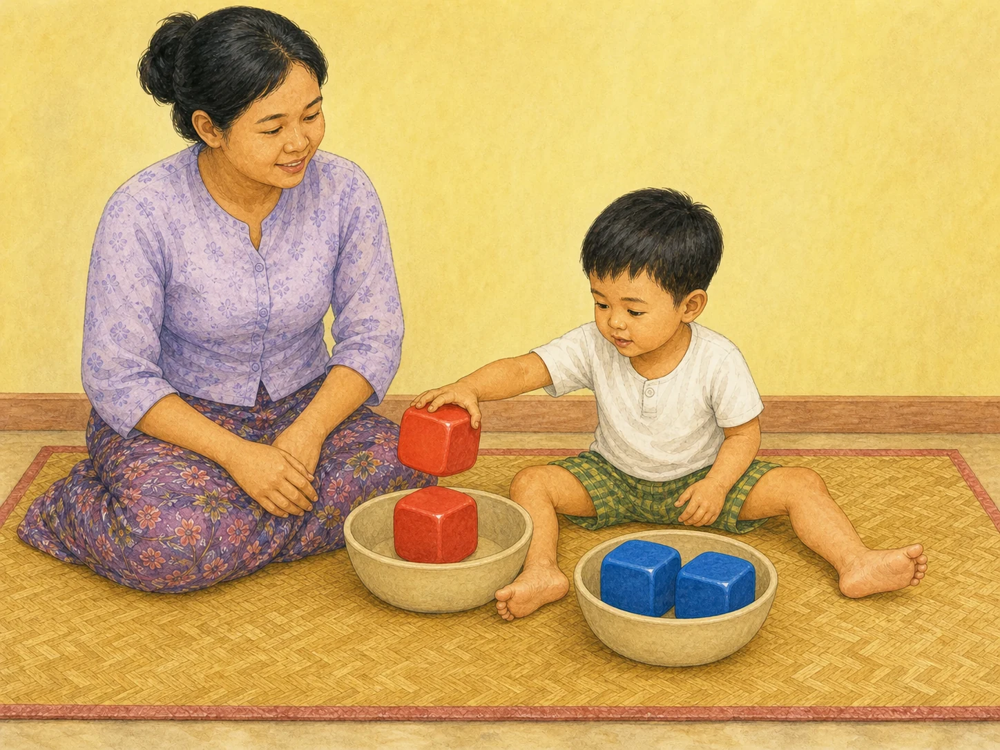

# ACE Child Grow — 3-Year Published Activity Illustration Review

Status: **READY FOR OWNER REVIEW — NOT DEPLOYED**

Source of truth: Production Convex `libraryContent`, filtered to exact `type = activity`, `ageGroupKey = 3y`, and `clinicalStatus = published`. Read directly from Production on 2026-08-09. Production contains exactly one matching published record. Every available record field was read; Production data was read only and was not modified.

## Pre-generation review

| Slug | Myanmar title | English title | Exact behaviour | Image scene | Must not show | Status |
|---|---|---|---|---|---|---|
| `act_color_sort` | အရောင်ခွဲ ကစားခြင်း | Color sorting | Child sorts same-colored oversized objects into a separate bowl for each color. | Three-year-old Myanmar child places a large red rounded cube with the other red cube while two identical blue cubes remain grouped in the second of exactly two plain bowls; caregiver supervises immediately beside the child. | Bottle caps, coins, buttons, beads, batteries, magnets, beans, choking-size pieces, mixed shapes, shape sorting, stacking, building, counting, text, extra bowls/blocks/toys, or parent sorting for the child. | READY |

## Pre-generation confirmation

- Scene illustrates only the published color-categorizing behaviour: **PASS**
- Body size, coordinated posture and independence are appropriate for three years: **PASS**
- Color is the only sorting distinction; shape and size remain identical: **PASS**
- Choking-risk supervision and oversized-object requirements are identified: **PASS**
- Concept is understandable without text: **PASS**
- Exact slug receives one unique image; no age/domain/category fallback: **PASS**

The table was completed before generation. Built-in ImageGen was called separately for each candidate. The first candidate was rejected and was never saved as final.

## Complete Production record used for review

- Slug: `act_color_sort`
- Myanmar title: **အရောင်ခွဲ ကစားခြင်း**
- English title: **Color sorting**
- Summary MM: ပစ္စည်းများကို အရောင်ဖြင့် ခွဲ၍ အသိဉာဏ် လေ့ကျင့်ခြင်း။
- Summary EN: Sort objects by color to build early thinking.
- Age / primary domain / publication: `3y` / `cognitive` / `published`
- Domains: `cognitive`, `problem_solving`
- Difficulty / duration / offline: `medium` / 10 minutes / `true`
- Context flags: indoor `true`; outdoor `false`; one child `true`; parent–child `true`; group `true`; low cost `true`
- Materials MM: မျိုမချနိုင်လောက်အောင် ကြီးသော အရောင်စုံ ဘူးအဖုံးများ သို့မဟုတ် ကစားတုံးများနှင့် ခွက်နှစ်လုံး။
- Materials EN: Colorful caps/blocks and two bowls.
- Setup MM: အရောင်စုံ ပစ္စည်းများကို ရောထားပါ။
- Setup EN: Mix the colorful objects together.
- Instruction MM: အရောင်တူ ပစ္စည်းများကို ခွက်တစ်လုံးစီ ခွဲထည့်စေပါ။
- Instruction EN: Have the child sort same colors into each bowl.
- Safety MM: ငယ်သောပစ္စည်းများ ကြီးကြပ်လျက်သာ သုံးပါ။
- Safety EN: Supervise small objects.
- Outcome MM: အရောင်သိမှု၊ အမျိုးအစားခွဲမှု။
- Outcome EN: Color knowledge and categorizing.
- Variations: none published
- Review scope: `education`
- Reviewer: ACE Child Grow Owner / Education Reviewer — MEd (Early Childhood and Special Education)
- Review note: Education and special-needs professional review completed. This is not medical or clinical approval; medical guidance remains general, evidence-based information.
- Source: ACE Child Grow editorial draft — general developmental guidance, pending native-Myanmar and clinical review
- Version: `1`

## Owner review card

### `act_color_sort`

- Asset: `/activities/3y/act_color_sort.baca30dca4.webp`
- File: 1448×1086 landscape 4:3 WebP, 335,186 bytes
- Scene match: child moves one red oversized block to the bowl containing its identical red match; the second bowl contains two identical blue blocks; color is the only category difference.
- Safety match: all blocks are visibly too large for the child's mouth; caregiver supervises immediately beside the child; no small-object or fall hazard.

QA: behaviour ✓ · three-year age/body/posture ✓ · anatomy ✓ · both child hands/fingers ✓ · both child legs/feet ✓ · focused gaze/expression ✓ · exactly two bowls/four blocks ✓ · color-only sorting ✓ · oversized objects ✓ · caregiver supervision ✓ · no extra action ✓ · culturally appropriate ✓ · wordless ✓

Rejected candidate: attempt 1 matched the behaviour, object count and safety requirements, but the child appeared younger than three years. It was not saved. Attempt 2 used visibly older preschool proportions and passed age QA.

**READY FOR OWNER REVIEW**

## Mapping and application verification

- Published Production slug maps directly to its new versioned WebP: **PASS**
- Asset exists, is exact 4:3, has a content-hash filename, and is below 500 KB: **PASS**
- No age-group/domain/category/unknown fallback resolves for `3y`: **PASS**
- Previously approved activity mappings remain unchanged: **PASS**
- Component-level `/content/act_color_sort` rendering shows the exact Production Myanmar title, summary, image `src`, and image `alt`: **PASS — 1/1**
- Local running application signed-out authentication gate and browser console: **PASS — no console error**
- Authenticated text-plus-image card and mobile/desktop review: **PENDING OWNER REVIEW** — no credential will be entered or authentication bypassed during this draft run.
- Production Convex records were read only; no Production data was changed: **PASS**

## Engineering verification

- Focused mapping and exact ContentDetail rendering tests: **PASS — 18/18**
- Full unit test suite: **PASS — 1,123/1,123 across 115 test files**
- Typecheck: **PASS**
- Lint: **PASS**
- Production build and PWA precache: **PASS — 225 precache entries; no missing image or asset-related warning**
- Existing unrelated React Testing Library `act(...)` warnings remain in older milestone/Learn/AgeBand tests; this batch adds no new warning and its focused tests are clean.

## Deployment authorization

Owner approval: **NOT YET RECEIVED FOR THIS BATCH**

Final review result: **READY FOR OWNER REVIEW — DO NOT DEPLOY**

This batch changes only the exact published 3-year activity illustration, its exact slug mapping, related tests, and this review record.
