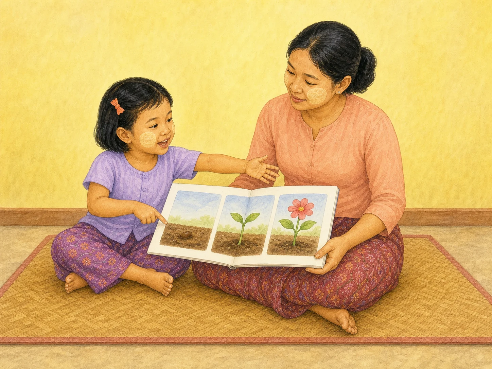

# ACE Child Grow — 4-Year Published Activity Illustration Review

Status: **OWNER APPROVED — PRODUCTION DEPLOYMENT AUTHORIZED**

Source of truth: Production Convex `libraryContent`, filtered to `type = activity`, exact `ageGroupKey = 4y`, and `clinicalStatus = published`. Read directly from Production on 2026-08-09. Production contains exactly one matching published record. Every available record field was read. Production data was read only and was not modified.

## Pre-generation review

| Slug | Myanmar title | English title | Exact behaviour | Image scene | Must not show | Status |
|---|---|---|---|---|---|---|
| `act_story_sequence` | ဇာတ်လမ်း အစီအစဉ် ပြန်ပြောကစားခြင်း | Story-sequence retelling | Read one story together; ask “what happened first, then?” in order; the child retells the story in sequence. | One four-year-old Myanmar child points to the first of three wordless seed → sprout → flower story pictures while speaking and gesturing toward what follows; the mother holds the open book and listens. | Text, letters, numbers, arrows, screens, toys, writing, silent reading only, extra people or actions, wrong age, or unnatural anatomy. | READY |

## Pre-generation confirmation

- Scene illustrates only the published observed activity: **PASS**
- Child body size, posture and independence are appropriate for age four: **PASS**
- Unrelated developmental actions and objects are excluded: **PASS**
- Published safety field is “None specific”; a safe floor-level setting was selected: **PASS**
- Concept is understandable without text: **PASS**
- One exact slug receives one unique image; no domain/category fallback: **PASS**

The table was completed before image generation. One Built-in ImageGen call produced the accepted candidate; no rejected candidate was saved.

## Complete published record

- Slug / type / version: `act_story_sequence` / `activity` / `1`
- Myanmar title: **ဇာတ်လမ်း အစီအစဉ် ပြန်ပြောကစားခြင်း**
- English title: **Story-sequence retelling**
- Summary MM: ဖတ်ပြီးသော ပုံပြင်ကို အစီအစဉ်တကျ ပြန်ပြောစေခြင်း။
- Summary EN: Retell a story in order to build language and memory.
- Age group / primary domain / domains: `4y` / `language` / `language`, `cognitive`
- Publication / priority: `published` / `completed`
- Difficulty / duration / offline: `medium` / `15 minutes` / `true`
- Formats: one child `true`; parent-child `true`; group `true`; indoor `true`; outdoor `false`; low-cost `true`
- Materials MM / EN: ပုံပြင်စာအုပ်။ / A story book.
- Setup MM / EN: ပုံပြင်တစ်ပုဒ် အတူဖတ်ပါ။ / Read a story together.
- Instruction MM / EN: “ပထမ ဘာဖြစ်လဲ၊ ပြီးတော့” ဟု အစီအစဉ်ဖြင့် မေးပါ။ / Ask “what happened first, then?” in order.
- Outcome MM / EN: ဘာသာစကား၊ အစီအစဉ် တွေးခေါ်မှု။ / Language and sequencing.
- Safety MM / EN: — / None specific.
- Variations: none
- Tags: `language`, `cognitive`, `4y`
- Source: ACE Child Grow editorial draft — general developmental guidance, pending native-Myanmar and clinical review
- Review scope / qualification: `education` / MEd (Early Childhood and Special Education)
- Reviewer: ACE Child Grow Owner / Education Reviewer
- Review note: Education and special-needs professional review completed. This is not medical or clinical approval; medical guidance remains general, evidence-based information.
- Reviewed at / next review / created / updated (Production timestamps): `1785043817285` / `1816560000000` / `1785024282947` / `1786159228200`
- Production record ID: `kx70f2hmd5esn68tf0hkw176sd8b8nvq`

## Owner review card

### `act_story_sequence`

- Myanmar title: **ဇာတ်လမ်း အစီအစဉ် ပြန်ပြောကစားခြင်း**
- English title: **Story-sequence retelling**
- Summary MM: ဖတ်ပြီးသော ပုံပြင်ကို အစီအစဉ်တကျ ပြန်ပြောစေခြင်း။
- Summary EN: Retell a story in order to build language and memory.
- Age / domain / publication: `4y` / `language` / `published`
- Meaning MM: ဘာသာစကား၊ အစီအစဉ် တွေးခေါ်မှု။
- Meaning EN: Language and sequencing.
- Asset: `/activities/4y/act_story_sequence.8064356734.webp` — 1448×1086, 323,326 bytes

QA: behaviour ✓ · age ✓ · anatomy ✓ · hands/fingers ✓ · legs/feet ✓ · speaking expression ✓ · gaze ✓ · exact wordless sequence ✓ · no unrelated objects/actions ✓ · culturally appropriate ✓ · no text/logo/watermark ✓

Rejected candidates: none. Attempt 1 passed every QA check.

**READY FOR OWNER REVIEW**

## Mapping and application verification

- Exact published slug maps directly to one versioned WebP: **PASS**
- Asset exists, is exact 4:3, and is below 500 KB: **PASS**
- No age-group/domain/category/unknown fallback resolves for `4y`: **PASS**
- Previously approved mappings remain unchanged: **PASS**
- Exact `/content/act_story_sequence` component route renders the exact Myanmar and English title, summary and mapped image: **PASS**
- Production Convex record was read only; no Production data was changed: **PASS**

## Engineering verification

- Focused image mapping and detail rendering tests: **PASS — 10/10**
- Full unit test suite: **PASS — 1,115/1,115 across 112 test files**
- Typecheck: **PASS**
- Lint: **PASS**
- Production build and PWA precache: **PASS — 220 precache entries; no asset-related warning**
- Signed-out route and browser console check: **PASS — authentication gate rendered; zero console errors**
- Owner visual review of the complete text + illustration card: **PASS — APPROVED 2026-08-09**
- Authenticated production mobile/desktop route verification: **REQUIRED POST-DEPLOYMENT**

## Deployment authorization

Owner approval for this complete 4-year review was received on **2026-08-09**.

Final review result: **OWNER APPROVED FOR PRODUCTION**

Production Convex remains read only. This run changes only the exact 4-year activity illustration, its exact slug mapping, related tests, and this review record.
