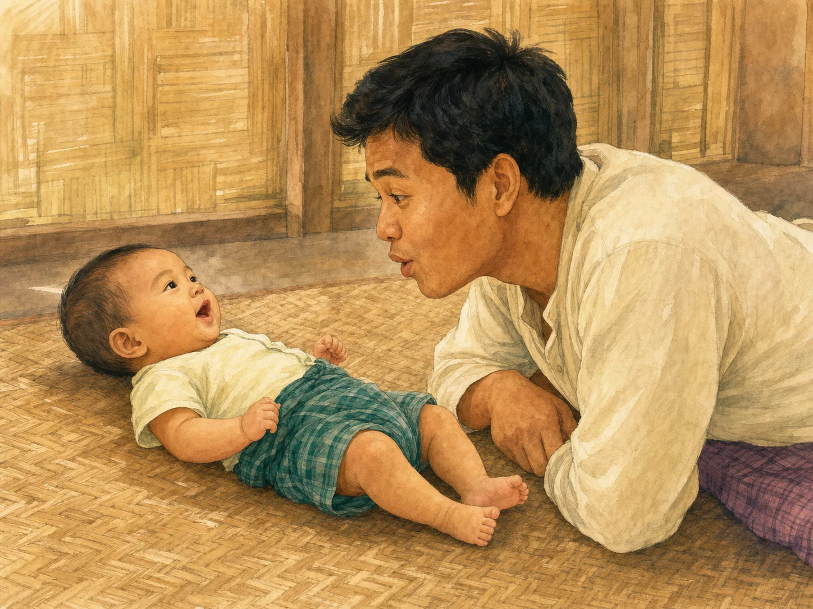
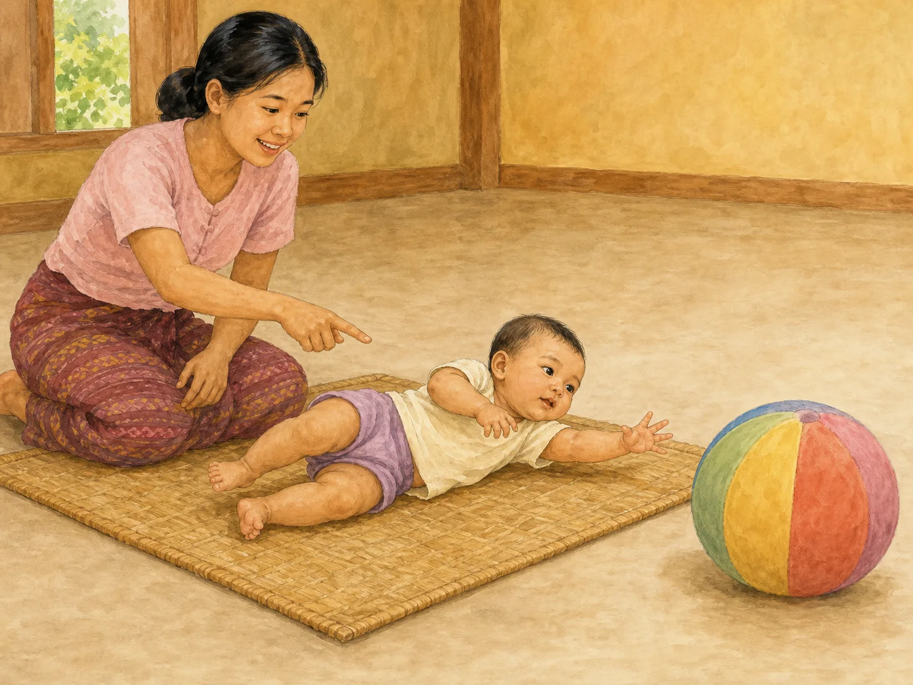
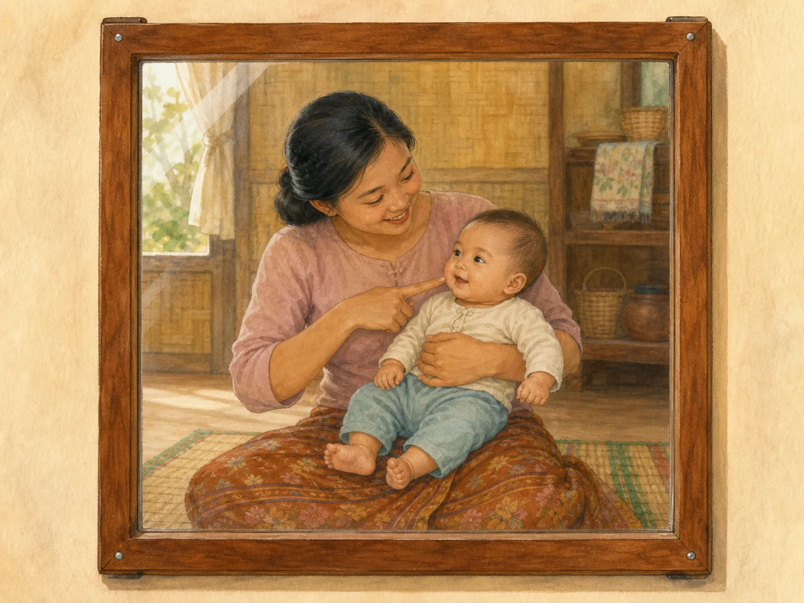
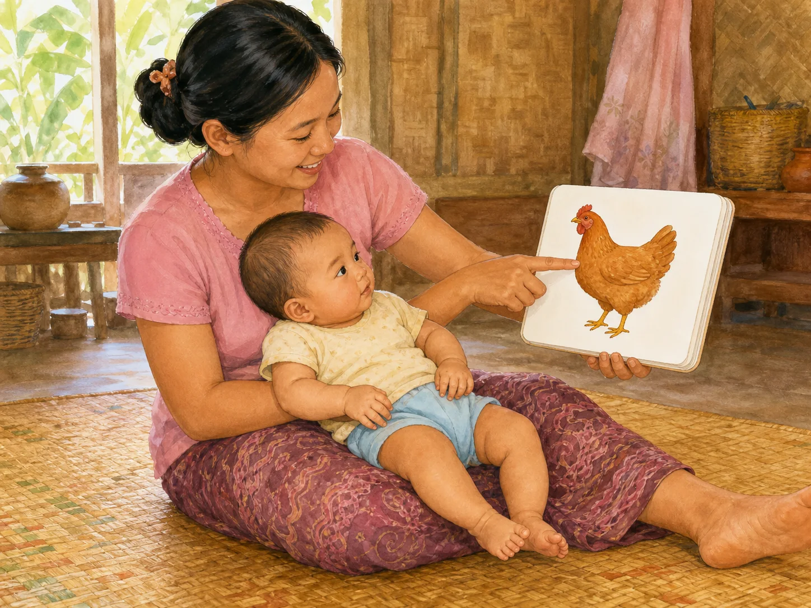
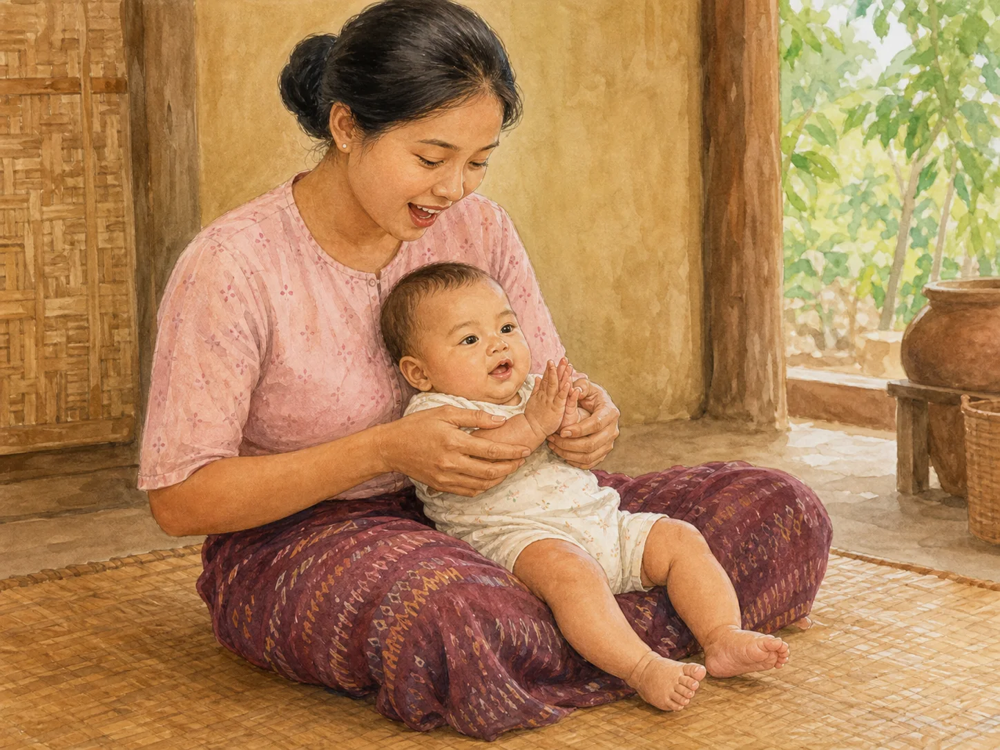
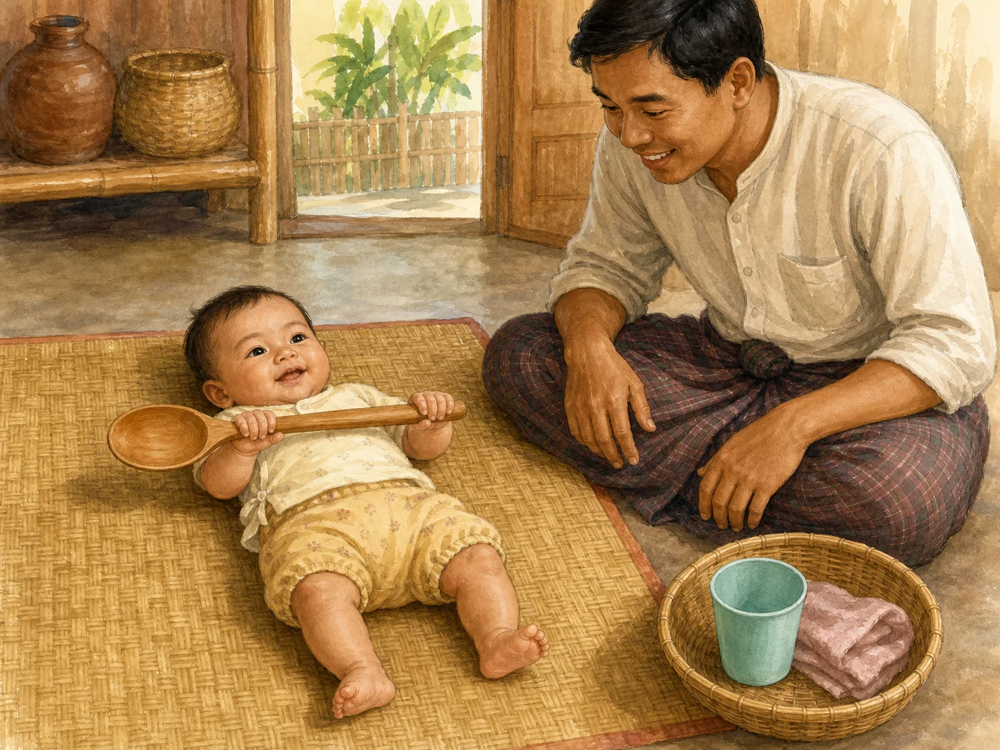

# ACE Child Grow — 5–6 Month Published Activity Illustration Review

Status: **OWNER APPROVED — PRODUCTION DEPLOYMENT AUTHORIZED**

Source of truth: Production Convex `libraryContent`, filtered to `type = activity`, exact `ageGroupKey = 5_6m`, and `clinicalStatus = published`. Read directly from Production on 2026-08-03. Production contains exactly six matching published records. Every available record field was read; Production data was read only and was not modified.

## Pre-generation review

| Slug | Myanmar title | English title | Exact behaviour | Image scene | Must not show | Status |
|---|---|---|---|---|---|---|
| `act_babble_back_and_forth` | အသံ အပြန်အလှန် ဖလှယ်ခြင်း | Babble back and forth | Baby makes a consonant-like babble while caregiver copies the mouth shape, pauses, and watches for the baby's next turn. | Quiet face-to-face floor scene: awake 5–6 month baby safely reclined on a firm mat, caregiver at eye level, both making a gentle open-mouth babble expression with shared eye contact. | Text or sound symbols, loud voice, clapping, toy, book, screen, sitting, rolling, feeding, tired/distressed baby, or unrelated action. | READY |
| `act_roll_and_reach` | လှိမ့်၍ လှမ်းယူခြင်း | Roll and reach | Baby starts on the back, turns toward one large toy placed just beyond reach, and purposefully reaches while rolling to the side; caregiver watches without pushing. | Clear floor-level mat scene with baby halfway from back to side, one hand reaching toward one mouth-safe large toy, and caregiver close beside the baby. | Bed, table, elevated surface, furniture or cord nearby, small toy, toy in mouth, caregiver pushing the baby, crawling, sitting, standing, or unrelated play. | READY |
| `act_mirror_hello` | မှန်ထဲက မိတ်ဆွေ | Hello in the mirror | Caregiver holds baby securely on the lap, points to the baby's face in a firmly fixed mirror, smiles, and watches the baby's social response. | Warm Myanmar home with a securely wall-mounted mirror; caregiver and 5–6 month baby sit together, baby's whole body supported and feet visible, with one natural matching reflection and shared smiles. | Loose, handheld, cracked, leaning, or falling mirror; baby alone; impossible reflection; duplicated/missing limbs; independent sitting; toy; screen; or unrelated action. | READY |
| `act_board_book_point` | ထူထပ်စာအုပ် လက်ညှိုးထိုး ကစားခြင်း | Board book pointing | Caregiver opens one sturdy board-book page, points to one large picture and names it while baby looks; the caregiver, not the baby, performs the pointing. | Baby securely supported on caregiver's lap in good light; caregiver's one index finger points to one simple wordless animal picture in a thick board book. | Baby pointing independently, printed text/letters/numbers, phone/tablet, thin or torn paper, sharp edge, loose binding cord, unsupported sitting, multiple books, or unrelated toy. | READY |
| `act_clap_and_sing_5_6m` | လက်ခုပ်တီး၍ သီချင်းဆိုခြင်း | Clap and sing | Caregiver sings softly and gently guides the baby's hands together on the beat; baby does not clap independently. | 5–6 month baby fully supported on caregiver's lap; caregiver lightly holds both baby hands near the midline for one gentle clap, with warm reciprocal expressions. | Independent clapping, pulling arms, shaking, tossing baby, loud performance, instrument, screen, standing, unsupported sitting, sleep, or unrelated activity. | READY |
| `act_safe_touch_basket` | ဘေးကင်း အထိအတွေ့ ခြင်းတောင်း | Safe touch basket | Caregiver offers one clean, mouth-safe, large textured object at a time; baby grasps and explores it while the caregiver remains beside the baby. | Baby safely supported on a floor mat, grasping one oversized smooth wooden spoon while caregiver supervises; one basket nearby contains only a large plastic cup and a large folded cloth. | Small objects, coin, button, seed, battery, sharp/cracked item, long cord, plastic bag, several items in baby's hands, baby unattended, sitting/standing, or unrelated toy. | READY |

## Pre-generation confirmations

- Every scene illustrates only the exact published activity: **PASS**
- 5–6 month body size, posture, rolling, reach, grasp, gaze, and independence are age-correct: **PASS**
- The adult—not the infant—does the pointing and guides the clapping: **PASS**
- Safety constraints are identified for floor play, choking, mirrors, books, sound, and limb handling: **PASS**
- Every concept is visually distinct and understandable without reading: **PASS**
- One exact slug will receive one unique landscape 4:3 wordless illustration: **PASS**

## `act_babble_back_and_forth`

- Review status: **READY FOR OWNER REVIEW**
- Myanmar title: အသံ အပြန်အလှန် ဖလှယ်ခြင်း
- English title: Babble back and forth
- Myanmar summary: ကလေး၏ ဗျည်းသံများကို အတုယူ ပြန်ဆိုပြီး အလှည့်ကျ စကားပြောခြင်း။
- English summary: Copy your baby’s babble and build a back-and-forth conversation.
- Materials: မလိုအပ်ပါ — သင်၏ အသံနှင့် မျက်နှာသာ။ / None — just your voice and face.
- Setup: တိတ်ဆိတ်သော နေရာတွင် မျက်နှာချင်းဆိုင် ထိုင်ပါ။ တီဗွီ၊ ရေဒီယို ပိတ်ပါ။ / Sit face to face in a quiet spot with the TV and radio off.
- Published instructions (MM): ကလေး "ဘဘ"၊ "ဒဒ" ကဲ့သို့ အသံ ထွက်သည်ကို စောင့်ပါ။ ထိုအသံအတိုင်း အတိအကျ ပြန်ဆိုပါ။ ၅ စက္ကန့်ခန့် ရပ်နား၍ ကလေး၏ အလှည့်ကို စောင့်ပါ။ ကလေး ပြန်ထွက်လျှင် ထပ်ဆိုပါ — အလှည့် များများ ဖြစ်အောင် ကြိုးစားပါ။ ပြီးလျှင် အသံအသစ် တစ်ခု ("မမ") ထည့်ပေးပါ။ ကလေး မျက်နှာလွှဲလျှင် ရပ်ပါ။
- Published instructions (EN): Wait for a babble sound such as "ba-ba" or "da-da". Copy that sound back exactly. Pause about five seconds and wait for her turn. When she answers, copy again — aim for as many turns as you can. Then add one new sound of your own, such as "ma-ma". Stop when she turns away.
- Safety: အသံ ကျယ်လောင်စွာ မထွက်ပါနှင့်။ ကလေး၏ မောပန်း လက္ခဏာကို လေးစားပါ။ / Keep your voice soft, never loud, and respect her tired cues.
- Outcomes: ဗျည်းသံ ထွက်ဆိုမှုနှင့် အလှည့်ကျ ဆက်သွယ်မှုကို အားပေးရန်။ မျက်လုံးချင်းဆိုင်မှုနှင့် ပူးတွဲ အာရုံစိုက်မှု တိုးလာခြင်း။ / Encourage consonant babble, conversational turn-taking, eye contact, and shared attention.
- Age/domain/status: `5_6m` / `speech` / `published`
- Asset: `/activities/5_6m/act_babble_back_and_forth.f5cb049412.webp`

QA: **PASS** — baby and caregiver clearly share gaze and matching gentle open-mouth babble expressions; 5–6 month baby remains safely on the mat with complete body, both hands, both legs and both feet visible; anatomy is natural; no prop, unrelated action, loud cue, text, symbol, logo, or watermark.

## `act_roll_and_reach`

- Review status: **READY FOR OWNER REVIEW**
- Myanmar title: လှိမ့်၍ လှမ်းယူခြင်း
- English title: Roll and reach
- Myanmar summary: ကစားစရာကို ဘေးတစ်ဖက်တွင် ထားပေး၍ ကလေးအား လှိမ့်ရန် ဖိတ်ခေါ်ခြင်း။
- English summary: Place a toy just to one side to invite your baby to roll towards it.
- Materials: ပါးစပ်ထဲ မဝင်နိုင်လောက်အောင် ကြီးသော ကစားစရာ တစ်ခုနှင့် အခင်း တစ်ထည်။ / One toy too large to fit in the mouth, and a mat.
- Setup: ကြမ်းပြင်ပေါ်တွင် အခင်း ခင်းပါ။ ဘေးပတ်လည်ကို ရှင်းလင်းစွာ ထားပါ — ပရိဘောဂ၊ ကြိုး ဝေးအောင် ထားပါ။ / Lay a mat on the floor and clear the space all around — no furniture or cords nearby.
- Published instructions (MM): ကလေးကို ပက်လက် လှဲပါ။ ကစားစရာကို ဘေးတစ်ဖက်၊ လက်လှမ်း အနည်းငယ် လွန်သောနေရာတွင် ချထားပါ။ အမည်ခေါ်၍ ကစားစရာကို ညွှန်ပြပါ။ ကလေး လှည့်ရန် ကြိုးစားလျှင် စောင့်ကြည့်ပါ — အတင်း မတွန်းပါနှင့်။ ရောက်လျှင် ချီးကျူးပြီး ကစားစရာကို ကိုင်ခွင့် ပေးပါ။ တစ်ဖက်ပြီး တစ်ဖက် အလှည့်ကျ လုပ်ပါ။
- Published instructions (EN): Lay her on her back. Put the toy to one side, just beyond her reach. Call her name and point to the toy. Watch as she tries to turn — do not push her over. When she gets there, cheer and let her hold it. Repeat on the other side.
- Safety: ကြမ်းပြင်ပေါ်တွင်သာ လုပ်ပါ — အိပ်ရာ၊ စားပွဲပေါ်တွင် လုံးဝ မလုပ်ပါနှင့်၊ လိမ့်ကျနိုင်သည်။ ကလေးအနီးတွင် အမြဲ ရှိနေပါ။ ကစားစရာသည် ကလေးပါးစပ်ထက် ကြီးရမည်။ ကလေး ငိုလျှင် ရပ်ပါ။ / Do this on the floor only, stay beside the baby, use a toy larger than the mouth, and stop if the baby cries.
- Outcomes: လှိမ့်ခြင်းနှင့် ရည်ရွယ်ချက်ရှိ လှမ်းယူခြင်းကို အားပေးရန်။ ပခုံး၊ ခါးနှင့် ကိုယ်လုံး ကြွက်သားများ အားကောင်းလာခြင်း။ / Encourage rolling, purposeful reaching, and stronger shoulder, hip, and trunk muscles.
- Age/domain/status: `5_6m` / `gross_motor` / `published`
- Asset: `/activities/5_6m/act_roll_and_reach.ee83a6db44.webp`

QA: **PASS** — baby is halfway from the back onto one side and reaches one hand toward exactly one large cord-free ball; caregiver points without pushing; entire baby, natural hands, legs and feet are visible; floor area is clear; no elevated surface, small object, crawling, sitting, text, logo, or watermark.

## `act_mirror_hello`

- Review status: **READY FOR OWNER REVIEW**
- Myanmar title: မှန်ထဲက မိတ်ဆွေ
- English title: Hello in the mirror
- Myanmar summary: မှန်ရှေ့တွင် အတူထိုင်၍ မျက်နှာများကို ကြည့်ရင်း ပြုံးပြခြင်း။
- English summary: Sit together at a mirror, look at the faces and smile.
- Materials: နံရံကပ် မှန် သို့မဟုတ် ခိုင်ခံ့သော မှန်တစ်ချပ်။ / A wall mirror or one firmly fixed mirror.
- Setup: ကလေးကို ရင်ခွင်တွင် ထားပြီး မှန်ရှေ့တွင် ထိုင်ပါ။ မှန်သည် လုံခြုံစွာ တပ်ဆင်ထားရမည်။ / Hold her on your lap in front of the mirror. The mirror must be securely fixed.
- Published instructions (MM): မှန်ထဲရှိ ကလေးမျက်နှာကို ညွှန်ပြပြီး အမည်ခေါ်ပါ။ သင်၏ မျက်နှာကို ညွှန်ပြပြီး "အမေ"/"အဖေ" ဟု ပြောပါ။ ပြုံးပြပါ၊ လက်ပြပါ — ကလေး၏ တုံ့ပြန်မှုကို စောင့်ကြည့်ပါ။ ကလေး မျက်နှာ ပြောင်းလဲမှုကို စကားဖြင့် ပြောပေးပါ ("ပြုံးနေတယ်နော်")။ ကလေး မျက်နှာလွှဲလျှင် ရပ်ပါ။
- Published instructions (EN): Point to her face in the mirror and say her name. Point to your own face and say "Mummy" or "Daddy". Smile and wave, then watch her response. Describe what you see — "you are smiling". Stop when she turns away.
- Safety: မှန်ကို နံရံတွင် ခိုင်ခံ့စွာ တပ်ဆင်ထားပါ — လဲကျပါက ကွဲပြီး ထိခိုက်နိုင်သည်။ ကွဲအက်နေသော မှန်ကို လုံးဝ မသုံးပါနှင့်။ ကလေးကို မှန်ရှေ့တွင် တစ်ယောက်တည်း မထားပါနှင့်။ / Fix the mirror firmly, never use a cracked mirror, and never leave the baby alone at the mirror.
- Outcomes: မျက်နှာများကို စိတ်ဝင်စားမှုနှင့် လူမှုဆက်ဆံမှုကို အားပေးရန်။ ပူးတွဲ အာရုံစိုက်မှုနှင့် ခံစားချက် ဖလှယ်မှု တိုးလာခြင်း။ / Encourage interest in faces, social interaction, shared attention, and shared feeling.
- Age/domain/status: `5_6m` / `social` / `published`
- Asset: `/activities/5_6m/act_mirror_hello.8b5bc4a6ec.webp`

QA: **PASS** — sturdy frame is visibly fixed to the wall; exactly one mother and one supported baby appear in the mirror; mother points at the baby's face; baby's complete body, hands, legs and feet are visible; anatomy is natural; no crack, loose mirror, extra reflection, independent sitting, prop, text, logo, or watermark. First output rejected because the real and reflected pointing gestures did not match; only this corrected output is final.

## `act_board_book_point`

- Review status: **READY FOR OWNER REVIEW**
- Myanmar title: ထူထပ်စာအုပ် လက်ညှိုးထိုး ကစားခြင်း
- English title: Board book pointing
- Myanmar summary: ထူထပ်သော ပုံစာအုပ်ကို အတူဖတ်ရင်း ပုံများကို လက်ညှိုးထိုး အမည်ခေါ်ခြင်း။
- English summary: Share a board book, point at the pictures and name them.
- Materials: စာမျက်နှာထူပြီး ခိုင်ခံ့သော ပုံစာအုပ်တစ်အုပ်။ မရှိလျှင် အိမ်တွင် ပြုလုပ်ထားသော ပုံကတ်များ။ / One board book, or home-made picture cards.
- Setup: ကလေးကို ရင်ခွင်တွင် ထားပါ။ အလင်းရောင် လုံလောက်သော နေရာ ရွေးပါ။ / Hold her on your lap in good light.
- Published instructions (MM): စာမျက်နှာ တစ်မျက်နှာကို ဖွင့်ပါ။ ပုံကို လက်ညှိုးထိုး၍ အမည်ခေါ်ပါ ("ကြက်"၊ "ခွေး")။ ကလေး ကြည့်သည်ကို စောင့်ပြီး ထပ်ခေါ်ပါ။ ကလေး စာအုပ်ကို ကိုင်ချင်လျှင် ကိုင်ခွင့် ပေးပါ — ပါးစပ်ထဲ ထည့်လျှင်လည်း ရပါသည်။ စာမျက်နှာ ၂–၃ မျက်နှာဖြင့် ရပ်ပါ — အားလုံး မဖတ်ရန် မလိုပါ။
- Published instructions (EN): Open one page. Point at a picture and name it — "chicken", "dog". Wait until she looks, then say it again. Let her hold the book if she wants — mouthing it is fine. Two or three pages is plenty — you do not have to finish the book.
- Safety: စာမျက်နှာထူပြီး ခိုင်ခံ့သော စာအုပ်ကိုသာ သုံးပါ။ စက္ကူပါးကို ဆုတ်ဖြဲပြီး မျိုချမိနိုင်သည်။ စာအုပ်အနားများ ချွန်ထက်ခြင်းရှိမရှိ စစ်ဆေးပြီး သန့်ရှင်းစွာ ထားပါ။ ဤအရွယ်တွင် ပုံစာအုပ်အစား ဖုန်း သို့မဟုတ် တက်ဘလက်ကို အသုံးမပြုရန် အကြံပြုထားသည်။ / Use thick board books only, check for sharp edges, keep the book clean, and do not substitute a screen.
- Outcomes: ဝေါဟာရ နားလည်မှုနှင့် ပူးတွဲ အာရုံစိုက်မှုကို အားပေးရန်။ စာအုပ်နှင့် ရင်းနှီးမှု၊ နေ့စဉ် ဖတ်ရှုသည့် အလေ့အထ စတင်ခြင်း။ / Build early vocabulary understanding, shared attention, book familiarity, and a reading habit.
- Age/domain/status: `5_6m` / `language` / `published`
- Asset: `/activities/5_6m/act_board_book_point.1f396ad081.webp`

QA: **PASS** — baby is reclined and supported on the caregiver's lap with both hands and both feet visible; caregiver—not baby—points to exactly one wordless chicken picture; sturdy rounded book has no text, thin paper, sharp edge, cord, or screen; anatomy is natural; no unrelated object, logo, or watermark. First output rejected because one baby hand was obscured; only this corrected output is final.

## `act_clap_and_sing_5_6m`

- Review status: **READY FOR OWNER REVIEW**
- Myanmar title: လက်ခုပ်တီး၍ သီချင်းဆိုခြင်း
- English title: Clap and sing
- Myanmar summary: မြန်မာ ကလေးသီချင်း တစ်ပုဒ်ကို လက်ခုပ်သံဖြင့် ထပ်ခါထပ်ခါ ဆိုပြခြင်း။
- English summary: Sing one Myanmar rhyme with a simple clapping beat, again and again.
- Materials: မလိုအပ်ပါ — သင်၏ အသံနှင့် လက်နှစ်ဖက်သာ။ / None — just your voice and your hands.
- Setup: ကလေးကို ရင်ခွင်တွင် ထားပါ သို့မဟုတ် အခင်းပေါ်တွင် မျက်နှာချင်းဆိုင် ထားပါ။ / Hold her on your lap, or sit face to face on a mat.
- Published instructions (MM): မြန်မာ ကလေးသီချင်း တစ်ပုဒ်ကို ရွေးပါ။ ဖြည်းညှင်းစွာ ဆိုရင်း လက်ခုပ်ကို အသာအယာ တီးပါ။ ကလေး၏ လက်ကို ဖြေးညှင်းစွာ ကိုင်၍ တီးပေးပါ — အတင်း မဆွဲပါနှင့်။ တစ်ပုဒ်တည်းကို ရက်အနည်းငယ် ထပ်ခါထပ်ခါ ဆိုပါ — ထပ်ခြင်းက သင်ယူမှုကို ကူညီသည်။ သီချင်း ဆုံးလျှင် ခေတ္တ ရပ်၍ ကလေး တုံ့ပြန်မှုကို စောင့်ပါ။
- Published instructions (EN): Choose one Myanmar children’s song. Sing it slowly and clap softly on the beat. Gently hold her hands and clap with her — never pull. Sing the same song for several days — repetition helps her learn. Pause at the end and wait for her response.
- Safety: အသံ ကျယ်လောင်စွာ မဆိုပါနှင့်။ ကလေး၏ လက်၊ လက်မောင်းကို အတင်း မဆွဲပါနှင့်။ ကလေးကို လေထဲ မပစ်တင်ပါနှင့်၊ ဘယ်တော့မျှ မလှုပ်ခါပါနှင့်။ ကလေး မောပုံရလျှင် ရပ်ပါ။ / Keep the voice soft; never pull the hands or arms, toss or shake the baby; stop when the baby looks tired.
- Outcomes: အသံ၊ စည်းချက်နှင့် ဘာသာစကား ရင်းနှီးမှုကို တိုးပွားစေရန်။ မိဘနှင့် ကလေးကြား ဆက်နွယ်မှု ခိုင်မာလာခြင်း၊ အနားယူရန် ကူညီခြင်း။ / Build familiarity with sound, rhythm, and language, strengthen the parent–child bond, and aid settling.
- Age/domain/status: `5_6m` / `speech` / `published`
- Asset: `/activities/5_6m/act_clap_and_sing_5_6m.d81f12554d.webp`

QA: **PASS** — baby is fully supported and caregiver clearly uses both hands to guide the baby's two hands together; baby does not clap independently; all hands, both legs and both feet are visible and natural; caregiver has a gentle singing expression; no pulling, shaking, tossing, instrument, symbol, text, logo, or watermark.

## `act_safe_touch_basket`

- Review status: **READY FOR OWNER REVIEW**
- Myanmar title: ဘေးကင်း အထိအတွေ့ ခြင်းတောင်း
- English title: Safe touch basket
- Myanmar summary: အထိအတွေ့ ကွဲပြားသော ဘေးကင်းပစ္စည်းများကို တစ်ခုချင်း ကိုင်တွယ် လေ့လာစေခြင်း။
- English summary: Let your baby explore a few safe objects with different textures, one at a time.
- Materials: ခြင်းတောင်း တစ်လုံးနှင့် ကလေးပါးစပ်ထက် ကြီးသော ပစ္စည်း ၃–၄ ခု (အဝတ်စ၊ သစ်သားဇွန်း၊ ပလတ်စတစ်ခွက်)။ / A basket and three or four objects larger than her mouth — a cloth, a wooden spoon, a plastic cup.
- Setup: ပစ္စည်းများကို ရေနွေးဖြင့် ဆေးပါ။ ကလေးကို အခင်းပေါ်တွင် ထားပါ။ / Wash the objects in hot water. Put her on a mat.
- Published instructions (MM): ပစ္စည်း တစ်ခုကို ရွေး၍ ကလေးလက်ထဲ ဖြေးညှင်းစွာ ထည့်ပေးပါ။ ပစ္စည်း၏ အမည်နှင့် အထိအတွေ့ကို ပြောပြပါ ("နူးနူးလေးနော်")။ ကလေး ကိုင်တွယ်၊ ပါးစပ်ထဲ ထည့်၊ ချလိုက်သည်ကို စောင့်ကြည့်ပါ။ စိတ်ဝင်စားမှု လျော့သွားလျှင် နောက်တစ်ခု ကမ်းပေးပါ။ တစ်ကြိမ်လျှင် ပစ္စည်း ၃–၄ ခုထက် မပိုပါစေနှင့်။
- Published instructions (EN): Choose one object and place it gently in her hand. Name the object and the feel — "this is soft". Watch her hold it, mouth it and drop it. When interest fades, offer the next one. Keep to three or four objects per session.
- Safety: ပစ္စည်းတိုင်းသည် ကလေးပါးစပ်ထက် ကြီးရမည် — အသေးစား ပစ္စည်း၊ အကြွေစေ့၊ ခလုတ်၊ အစေ့၊ ဘက်ထရီ လုံးဝ မထည့်ပါနှင့်။ ကြိုးရှည်၊ ပလတ်စတစ်အိတ် မထည့်ပါနှင့်။ အနား ချွန်ထက်ခြင်း၊ အက်ကွဲခြင်း ရှိ/မရှိ တစ်ခုချင်း စစ်ပါ။ ကလေး ကစားနေစဉ် တစ်စက္ကန့်မျှ မခွာပါနှင့်။ / Every object must be larger than the mouth; no small items, cords or bags; check for damage and never step away.
- Outcomes: အထိအတွေ့ ကွဲပြားမှုကို လေ့လာစေပြီး ကိုင်တွယ်မှု စွမ်းရည် တိုးစေရန်။ အာရုံစိုက်နိုင်စွမ်းနှင့် ဝေါဟာရ တိုးပွားလာခြင်း။ / Explore textures, build grasp and handling skills, concentration, and vocabulary.
- Age/domain/status: `5_6m` / `fine_motor` / `published`
- Asset: `/activities/5_6m/act_safe_touch_basket.c953264aef.webp`

QA: **PASS** — baby holds exactly one oversized rounded wooden spoon with both clearly visible hands; caregiver remains beside the baby with empty hands and direct supervision; basket contains only one large cup and one folded cloth; complete baby body, legs, feet, hands, face and gaze are natural; no choking item, cord, bag, crack, mouth contact, text, logo, or watermark. First output rejected because one baby hand was missing; only this corrected output is final.

## Common image QA

- Exact published behaviour and 5–6 month age: **PASS**
- Myanmar/Southeast Asian child, family, home, and cultural fit: **PASS**
- Anatomy, hands, fingers, legs, feet, face, gaze, support, and independence: **PASS**
- No unrelated developmental action or unsafe object: **PASS**
- No text, letters, numbers, labels, arrows, logo, UI, or watermark: **PASS**
- Six unique images with no reuse or shared asset: **PASS**
- Landscape 4:3 WebP, 1448×1086, every asset under 500 KB: **PASS**
- Exact slug mapping; no age/domain/category fallback for these six slugs: **PASS**

Rejected outputs were not saved as final: the first mirror image had mismatched real/reflected gestures; the first board-book image obscured one baby hand; the first touch-basket image omitted one baby hand.

## Engineering verification

- Focused mapping and fallback tests: **PASS** — 1 file, 6 tests
- Full unit test suite: **PASS** — 98 files, 987 tests
- TypeScript typecheck: **PASS**
- Lint: **PASS**
- Production build: **PASS**
- PWA precache: **PASS** — all six exact 5–6 month assets included
- Missing file, duplicate path, broken import, or asset-related warning: **PASS** — none found
- Existing React test `act(...)` notices and the existing Vite large-chunk warning are unrelated to this asset change.

## Application verification

- Exact slug-to-image mapping and preservation of Birth–2 Month and 3–4 Month sets: **PASS**
- Six unique responsive 4:3 files in the production build: **PASS**
- Authenticated Production routes for all six exact slugs: **PASS** — every Myanmar title and summary matches the Production record; no browser console error
- New exact images on authenticated Production cards, responsive layout, and live cache: **PENDING PRODUCTION DEPLOYMENT AND LIVE CHECK** — the current live site correctly has no `5_6m` exact-image mapping before this approved change is deployed
- Production Convex content: **READ ONLY — NOT MODIFIED**

Owner approval received: **2026-08-04**

Final result: **OWNER APPROVED FOR PRODUCTION**
