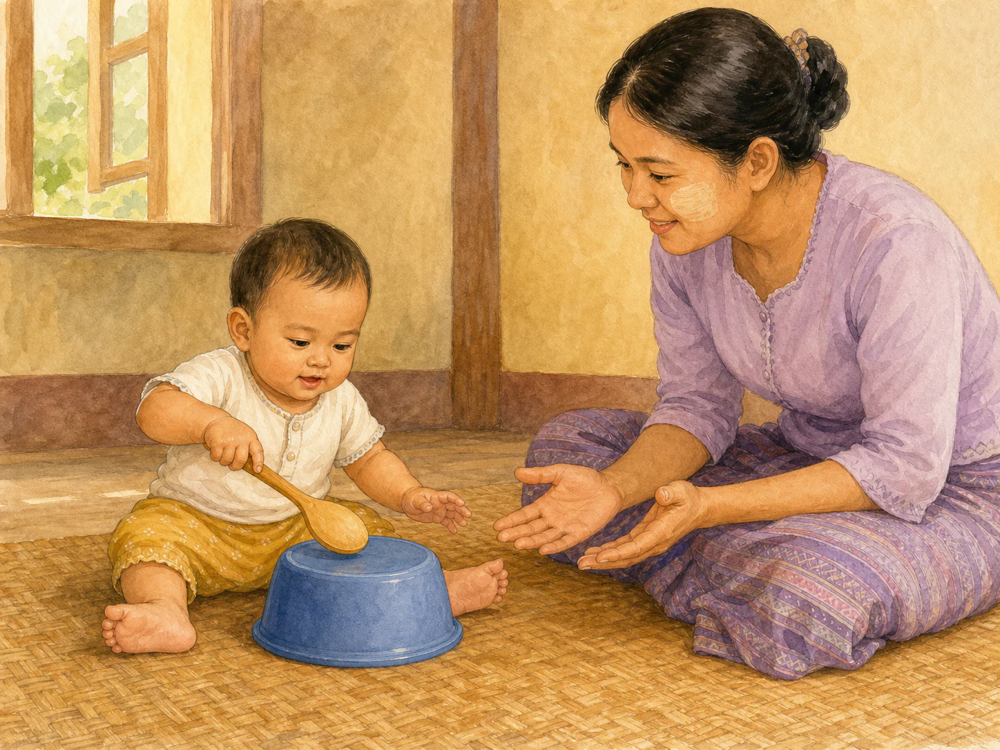
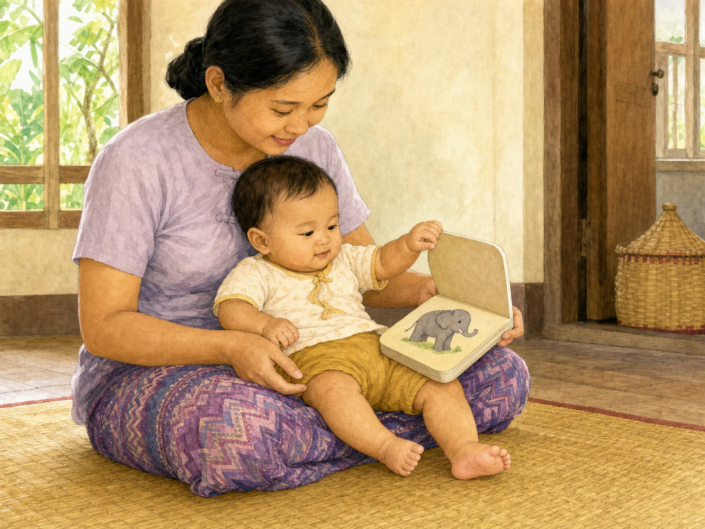
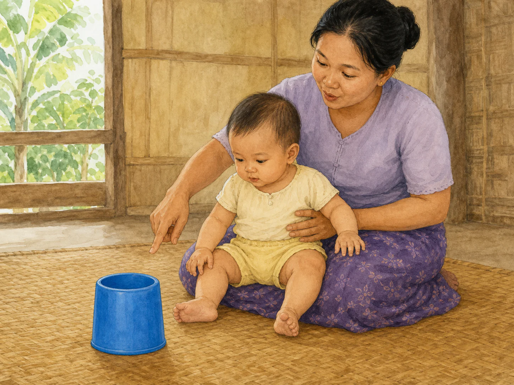
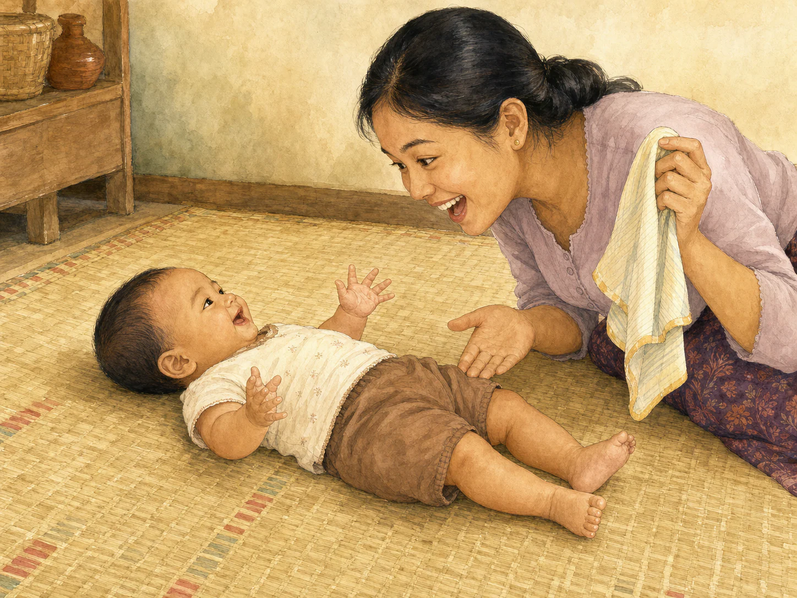
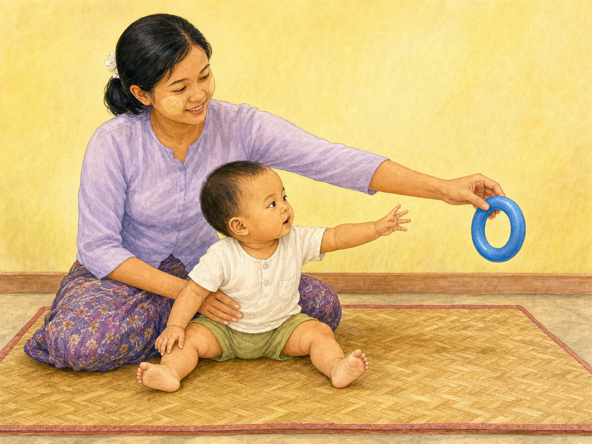
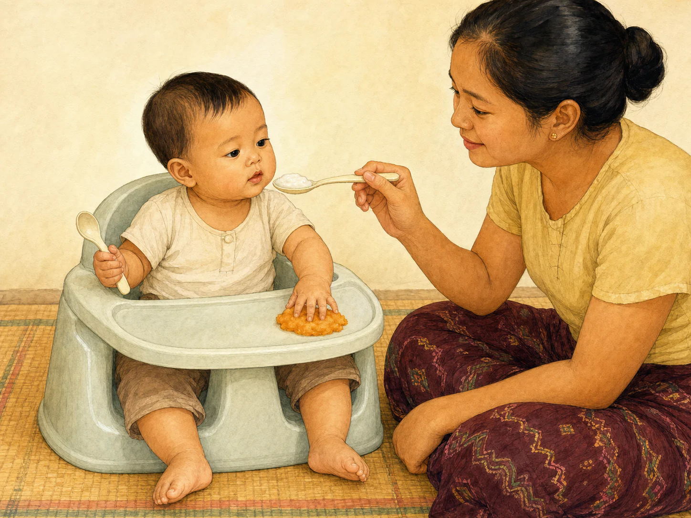

# ACE Child Grow — 7–9 Month Published Activity Illustration Review

Status: **OWNER APPROVED — PRODUCTION DEPLOYMENT AUTHORIZED**

Source of truth: Production Convex libraryContent, filtered to type = activity, exact ageGroupKey = 7_9m, and clinicalStatus = published. Read directly from Production on 2026-08-04. Production contains exactly seven matching published records. Every available record field was read; Production data was read only and was not modified.

## Pre-generation review

| Slug | Myanmar title | English title | Exact behaviour | Image scene | Must not show | Status |
|---|---|---|---|---|---|---|
| act_drum_and_pause | တီး၍ ရပ်နားခြင်း | Drum and pause | Caregiver gently taps one sturdy bowl three times, pauses and watches; baby then uses one wooden spoon to take a turn. | Floor-level Myanmar home scene: supported 7–9 month baby gently taps one sturdy plastic bowl with one wooden spoon while caregiver sits close with empty, still hands and attentive gaze, clearly waiting for the baby's turn. | Loud or forceful banging, metal or breakable bowl, several instruments, small loose parts, singing/clapping, standing, walking, screen, text, sound marks, or unrelated toys. | READY |
| act_lift_the_flap_book | စာအုပ် ဖွင့်၍ ရှာကြည့်ခြင်း | Lift-the-flap book time | Baby turns or lifts one thick page/flap of a sturdy picture book while caregiver follows the picture the baby chose. | Baby securely supported on caregiver's lap in good light, using one hand to lift one thick rounded flap/page of a wordless board book while both look at the revealed simple animal picture. | Thin or torn paper, loose paper pieces, plastic bag, phone/TV, printed words or letters, caregiver turning the page instead, unsupported sitting, mouthing, or unrelated toy. | READY |
| act_name_and_wait | အမည်ခေါ်၍ စောင့်ခြင်း | Name it and wait | Caregiver names the one safe object baby is already looking at, then pauses and watches for baby's gaze or vocal response. | Quiet face-to-face floor scene: supported baby looks at one large everyday object, a rounded plastic cup; caregiver points to that cup with a gentle naming mouth shape and attentive waiting expression. | Multiple objects, coins/buttons/battery, object in mouth, book, drumming, clapping, speech bubble, letters, sound symbols, screen, forced response, or unrelated action. | READY |
| act_peekaboo | “ဘယ်မှာလဲ၊ ဒီမှာပါ” ကစားခြင်း | Peek-a-boo | Caregiver briefly hides their own face and reveals it; baby watches the hide-and-reveal. | Face-to-face floor scene at the reveal moment: caregiver holds one small soft cloth beside their now-visible smiling face, clearly just removed from their own face; supported baby looks directly at the caregiver with delighted recognition. | Cloth on or near baby's face, cloth around a neck, baby hidden, caregiver still fully covered, extra toy, standing, crawling, screen, text, or unrelated action. | READY |
| act_sit_and_reach_ring | ထိုင်၍ လက်လှမ်းယူခြင်း | Sit and reach for the ring | Baby sits with hip support if needed and reaches slightly sideways for one large easy-to-hold ring without being pulled. | Clear floor mat with no furniture nearby: caregiver supports baby's hips from behind; baby remains seated and reaches one hand slightly sideways toward one large one-piece ring held close by the caregiver. | Bed/table/sofa, walker, fall hazard, unsupported unstable sitting, caregiver pulling baby's arm or body, crawling, standing, tiny ring, ring in mouth, or extra toys. | READY |
| act_two_texture_spoons | အထိအတွေ့ နှစ်မျိုး ဇွန်းကစား | Two-texture spoon play | Upright supervised baby holds one baby spoon while caregiver feeds with the second; baby safely explores smooth food and one soft lumpy texture. | Baby upright and fully supported in a secure high chair; baby holds one empty rounded infant spoon, caregiver offers a small spoonful of thick smooth porridge, and a small amount of soft mashed sweet potato rests on the clean tray for supervised fingertip exploration. | Reclined feeding, baby alone, forced feeding, propped bottle, whole nuts/grapes, hard chunks, honey, hot liquid, salt/sugar, cow's milk drink, adult spoon, excessive food, screen, or unrelated action. | READY |
| act_wave_bye_bye | လက်ပြ နှုတ်ဆက်ခြင်း | Wave bye-bye | Held baby sees one family member leaving while caregiver gently guides baby's hand in a wave, stopping if baby resists. | Warm doorway scene: one caregiver securely holds the baby and gently supports one relaxed forearm in a wave toward one family member calmly leaving the room; baby looks toward the departing person. | Baby waving while standing alone, walking, arm pulling, distress, shaking/tossing, crowd, phone/video call, toy, clapping, pointing, text, or unrelated action. | READY |

## Pre-generation confirmation

- Each scene illustrates only the published observed activity: **PASS**
- Behaviour and physical support are appropriate for 7–9 months: **PASS**
- Unrelated developmental actions are excluded: **PASS**
- Floor, object, feeding, hearing and separation safety requirements are identified: **PASS**
- Every concept is understandable without text: **PASS**
- One exact slug will receive one unique image; no domain/category fallback: **PASS**

The table was completed before any image was generated. One separate Built-in ImageGen call was then made for each candidate image, with failed candidates rejected and regenerated only for their own slug.

## Owner review cards

### `act_drum_and_pause`

- Myanmar title: **တီး၍ ရပ်နားခြင်း**
- English title: **Drum and pause**
- Summary MM: ခေါက်သံ ရိုက်ပြီး ရပ်နားပေးခြင်းဖြင့် ကလေးအား အလှည့်ကျ တုံ့ပြန်စေခြင်း။
- Summary EN: Tap a simple beat, then pause so your baby can take a turn.
- Age / domain / publication: `7_9m` / `cognitive` / `published`
- Meaning MM: အကြောင်းနှင့် အကျိုး နားလည်မှုနှင့် အလှည့်ကျမှုကို အားပေးရန်။
- Meaning EN: Learning objective — to build cause-and-effect understanding and turn-taking.
- Safety matched: soft sound; sturdy bowl; no mouth-size pieces, cords or bags; caregiver beside baby.
- Asset: `/activities/7_9m/act_drum_and_pause.86c0ba193b.webp` — 1448×1086, 347,342 bytes

QA: behaviour ✓ · age ✓ · anatomy ✓ · hands ✓ · feet ✓ · gaze/expression ✓ · no extra objects/actions ✓ · culturally appropriate ✓ · wordless ✓

**READY FOR OWNER REVIEW**

### `act_lift_the_flap_book`

- Myanmar title: **စာအုပ် ဖွင့်၍ ရှာကြည့်ခြင်း**
- English title: **Lift-the-flap book time**
- Summary MM: ခိုင်ခံ့သော ပုံစာအုပ် တစ်အုပ်ကို အတူဖတ်၍ ကလေးအား စာမျက်နှာ လှန်ခွင့် ပေးခြင်း။
- Summary EN: Share a sturdy picture book and let your baby turn or lift the pages.
- Age / domain / publication: `7_9m` / `language` / `published`
- Meaning MM: စကားလုံး ကြားနာမှုနှင့် စာအုပ်နှင့် ရင်းနှီးမှုကို အားပေးရန်။
- Meaning EN: Learning objective — to build word exposure and early comfort with books.
- Safety matched: sturdy rounded board book; no torn paper, plastic bag or screen; baby supported on caregiver's lap.
- Asset: `/activities/7_9m/act_lift_the_flap_book.6c33f2de2d.webp` — 1448×1086, 274,764 bytes

QA: behaviour ✓ · age ✓ · anatomy ✓ · hands ✓ · feet ✓ · gaze/expression ✓ · no extra objects/actions ✓ · culturally appropriate ✓ · wordless ✓

**READY FOR OWNER REVIEW**

### `act_name_and_wait`

- Myanmar title: **အမည်ခေါ်၍ စောင့်ခြင်း**
- English title: **Name it and wait**
- Summary MM: အရာဝတ္ထုကို အမည်ခေါ်ပြီး ကလေး တုံ့ပြန်ရန် စောင့်ပေးခြင်း။
- Summary EN: Name what your baby is looking at, then pause and let her answer.
- Age / domain / publication: `7_9m` / `speech` / `published`
- Meaning MM: စကားလုံး နားလည်မှုနှင့် အလှည့်ကျ ဆက်သွယ်မှုကို အားပေးရန်။
- Meaning EN: Learning objective — to build word understanding and conversational turn-taking.
- Safety matched: one large safe cup only; no coins, buttons or button batteries; caregiver remains beside baby.
- Asset: `/activities/7_9m/act_name_and_wait.9e9a12625f.webp` — 1448×1086, 275,722 bytes

QA: behaviour ✓ · age ✓ · anatomy ✓ · hands ✓ · feet ✓ · gaze/expression ✓ · no extra objects/actions ✓ · culturally appropriate ✓ · wordless ✓

**READY FOR OWNER REVIEW**

### `act_peekaboo`

- Myanmar title: **“ဘယ်မှာလဲ၊ ဒီမှာပါ” ကစားခြင်း**
- English title: **Peek-a-boo**
- Summary MM: မျက်နှာကို ခဏဖုံးပြီး ပြန်ဖော်ပြကာ မမြင်ရသော်လည်း ရှိနေဆဲဖြစ်ကြောင်း ကလေး နားလည်လာစေရန် ကစားခြင်း။
- Summary EN: Teach object permanence through hide-and-reveal.
- Age / domain / publication: `7_9m` / `social` / `published`
- Meaning MM: လူမှုချိတ်ဆက်မှု၊ မှတ်ဉာဏ်။
- Meaning EN: Social connection and memory.
- Safety matched: cloth is beside the caregiver after reveal and remains far from baby's face and neck.
- Asset: `/activities/7_9m/act_peekaboo.03b58f4431.webp` — 1448×1086, 347,884 bytes

QA: behaviour ✓ · age ✓ · anatomy ✓ · hands ✓ · feet ✓ · gaze/expression ✓ · cloth safety ✓ · no extra objects/actions ✓ · culturally appropriate ✓ · wordless ✓

**READY FOR OWNER REVIEW**

### `act_sit_and_reach_ring`

- Myanmar title: **ထိုင်၍ လက်လှမ်းယူခြင်း**
- English title: **Sit and reach for the ring**
- Summary MM: ထိုင်နေစဉ် ဘေးတစ်ဖက်သို့ လှမ်းယူစေခြင်းဖြင့် ကိုယ်လုံး ဟန်ချက်ကို လေ့ကျင့်ပေးခြင်း။
- Summary EN: Reaching sideways while sitting builds trunk balance.
- Age / domain / publication: `7_9m` / `gross_motor` / `published`
- Meaning MM: ထိုင်ဟန်ချက်နှင့် လက်လှမ်းယူမှုကို အားပေးရန်။
- Meaning EN: Learning objective — to strengthen sitting balance and reaching.
- Safety matched: floor mat only; caregiver supports waist/hip without pulling; one large ring; no furniture or fall hazard.
- Asset: `/activities/7_9m/act_sit_and_reach_ring.305571520c.webp` — 1448×1086, 262,472 bytes

QA: behaviour ✓ · age ✓ · anatomy ✓ · hands ✓ · feet ✓ · gaze/expression ✓ · floor/hip support safety ✓ · no extra objects/actions ✓ · culturally appropriate ✓ · wordless ✓

Rejected candidates: attempt 1 placed support at the upper arm instead of the hip; attempt 2 showed a disconnected extra hand holding the ring. Both were discarded. Attempt 3 passed all checks.

**READY FOR OWNER REVIEW**

### `act_two_texture_spoons`

- Myanmar title: **အထိအတွေ့ နှစ်မျိုး ဇွန်းကစား**
- English title: **Two-texture spoon play**
- Summary MM: အထိအတွေ့ ကွဲပြားသော အစားအစာ နှစ်မျိုးကို ကိုင်တွယ် စမ်းသပ်ခွင့် ပေးခြင်း။
- Summary EN: Let your baby explore two foods with different textures during a meal.
- Age / domain / publication: `7_9m` / `self_help` / `published`
- Meaning MM: ကိုယ်တိုင် စားခြင်းနှင့် အထိအတွေ့ အမျိုးမျိုးကို လက်ခံနိုင်မှုကို အားပေးရန်။
- Meaning EN: Learning objective — to encourage self-feeding and acceptance of varied textures.
- Safety matched: upright supported feeding seat; direct supervision; exactly two baby spoons; smooth porridge and soft mash only; no hard/round food, honey, bottle or hot liquid.
- Asset: `/activities/7_9m/act_two_texture_spoons.f811d80c0a.webp` — 1448×1086, 262,962 bytes

QA: behaviour ✓ · age ✓ · anatomy ✓ · hands ✓ · feet ✓ · gaze/expression ✓ · feeding posture/food safety ✓ · exactly two spoons ✓ · no extra objects/actions ✓ · culturally appropriate ✓ · wordless ✓

Rejected candidate: attempt 1 did not make the smooth porridge on the caregiver's spoon visually clear enough. It was discarded. Attempt 2 clearly distinguishes both published food textures and passed all checks.

**READY FOR OWNER REVIEW**

### `act_wave_bye_bye`

- Myanmar title: **လက်ပြ နှုတ်ဆက်ခြင်း**
- English title: **Wave bye-bye**
- Summary MM: ထွက်ခွာချိန်တိုင်း လက်ပြပြီး နှုတ်ဆက်ခြင်းဖြင့် ဆက်သွယ်မှု အမူအရာကို သင်ပေးခြင်း။
- Summary EN: Waving every time someone leaves teaches a first communication gesture.
- Age / domain / publication: `7_9m` / `social` / `published`
- Meaning MM: ပထမဆုံး ဆက်သွယ်ရေး အမူအရာကို အားပေးရန်။
- Meaning EN: Learning objective — to encourage a first communication gesture.
- Safety matched: baby securely held; caregiver guides the relaxed forearm without pulling; one departing family member; no distress or shaking.
- Asset: `/activities/7_9m/act_wave_bye_bye.af8bd5d742.webp` — 1448×1086, 319,684 bytes

QA: behaviour ✓ · age ✓ · anatomy ✓ · hands ✓ · feet ✓ · gaze/expression ✓ · secure hold/gentle guidance ✓ · no extra objects/actions ✓ · culturally appropriate ✓ · wordless ✓

**READY FOR OWNER REVIEW**

## Mapping and application verification

- Seven published Production slugs map directly to seven different versioned WebP files: **PASS**
- Every asset exists, is 4:3, and is below 500 KB: **PASS**
- Age-group/domain/category/unknown fallback does not resolve for `7_9m`: **PASS**
- Previously approved birth–2 month, 3–4 month and 5–6 month mappings remain unchanged: **PASS**
- Each `/content/<exact-slug>` detail route renders the exact Myanmar title, exact Myanmar summary and exact mapped image: **PASS (7/7)**
- Activity detail pages do not have Previous/Next controls in the existing product, so those controls are not applicable. All seven detail routes were verified individually.
- Production Convex records were read only; no Production data was changed: **PASS**

## Engineering verification

- Focused image mapping and detail rendering tests: **PASS — 15/15**
- Full unit test suite: **PASS — 1,015/1,015 across 100 test files**
- Typecheck: **PASS**
- Lint: **PASS**
- Production build and PWA precache: **PASS — 200 precache entries, no asset-related warning**
- Existing unrelated Rollup bundle-size warning remains; no illustration asset warning, missing import or missing file was produced.

## Deployment authorization

Owner approval received: **2026-08-04**

Final review result: **OWNER APPROVED FOR PRODUCTION**

Production Convex remains read only. This release changes only the seven exact 7–9 month activity illustrations, their exact slug mappings, related tests, and this review record.
