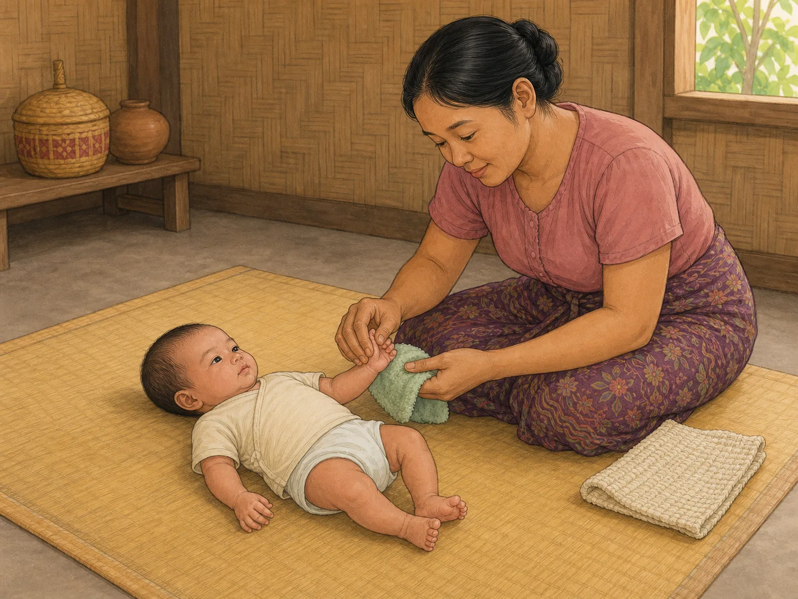
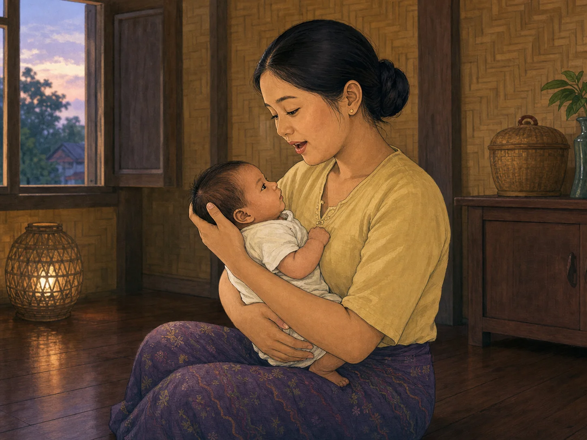
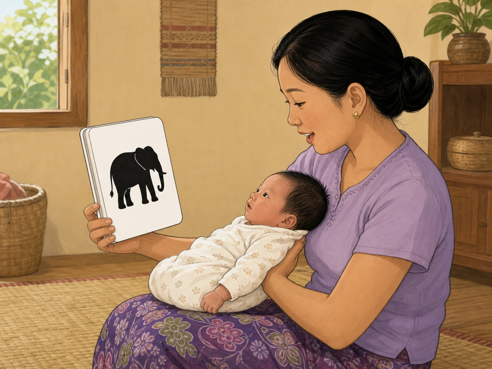
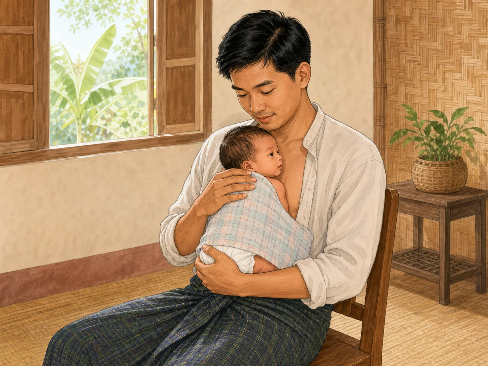
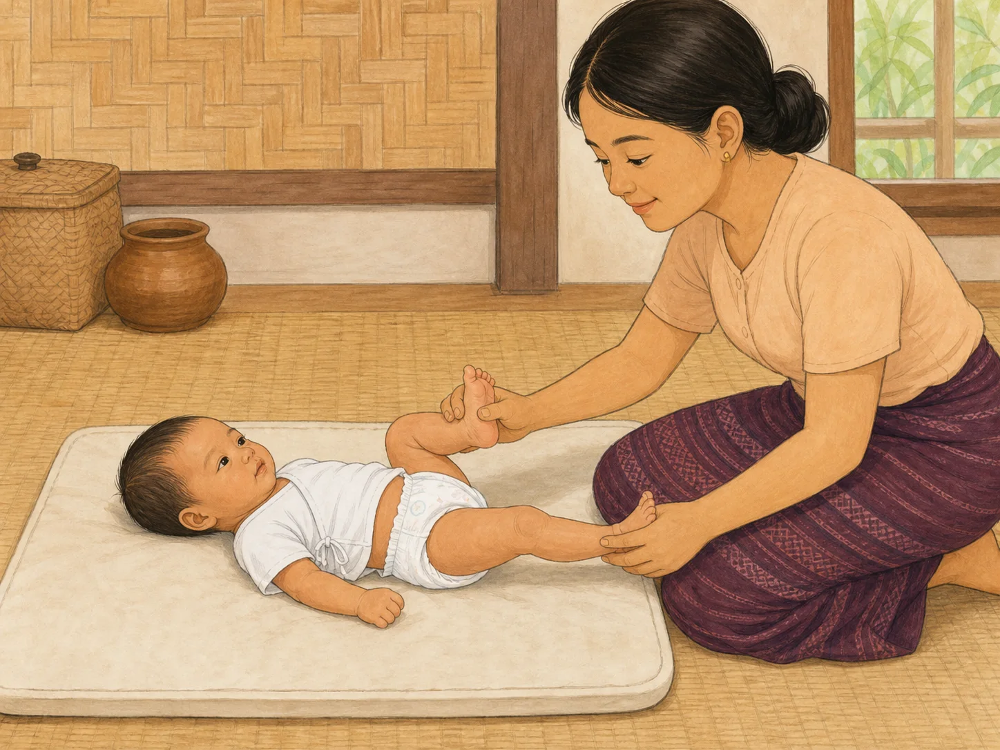
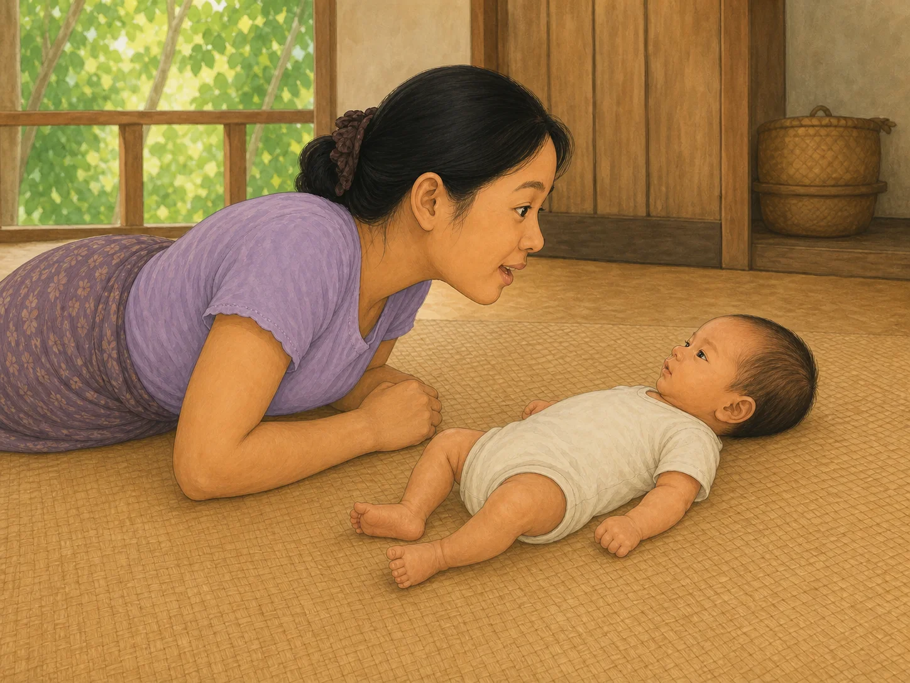
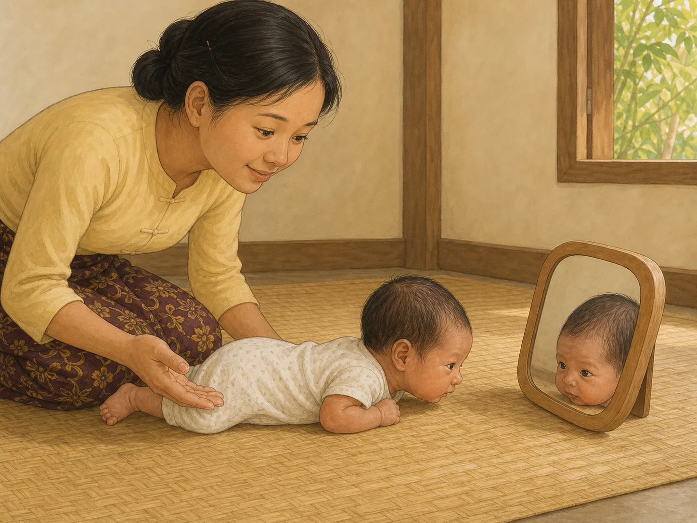

# ACE Child Grow — Birth–2 Month Published Activity Illustration Review

Status: **OWNER APPROVED — PRODUCTION DEPLOYMENT AUTHORIZED**

Source of truth: Production Convex `libraryContent`, filtered to `type = activity`, `ageGroupKey = birth_2m`, and `clinicalStatus = published`. Read on 2026-08-03. Production contains exactly seven matching published records. Production data was read only and was not modified.

## Pre-generation review

| Slug | Meaning | Exact behaviour | Scene | Must not show | Status |
|---|---|---|---|---|---|
| `act_texture_touch` | Experience different gentle touch sensations. | An awake baby lies on the back while a caregiver gently strokes the palm and forearm with one clean fabric. | Floor-level calm infant-care scene with two safe fabric textures. | Fabric on face, plastic, cords, tiny items, toys, sleep, or unrelated action. | READY |
| `act_lullaby_and_rock` | Settle through a quiet lullaby and very gentle rocking. | An awake caregiver securely supports the head and neck, holds baby close, sings softly, and rocks slowly. | Dim, calm home with no extra activity. | Shaking, vigorous movement, sofa/bed sleep, feeding, toy, or unsupported head. | READY |
| `act_first_book_share` | Build early shared attention around pictures and words. | A caregiver supports baby and holds a sturdy picture about 30 cm from the face while describing it. | Baby gazes toward one wordless high-contrast animal image. | Baby holding or mouthing the book, loose paper, text, toys, or older-child action. | READY |
| `act_skin_to_skin_calm` | Build security through safe awake skin-to-skin contact. | An alert upright caregiver holds baby chest-to-chest with the head turned, airway clear, and body fully supported. | Awake kangaroo-care cuddle on a sturdy armless chair. | Drowsiness, sofa, bed, co-sleeping, feeding, covered face, blocked airway, or loose bedding. | READY |
| `act_gentle_bicycle_legs` | Build awareness of gentle leg movement. | Baby lies on the back while the caregiver gently holds the ankles, bending one leg and extending the other. | Firm flat floor-level changing mat. | Pulling, twisting, hyperextension, elevated table, toys, or unrelated movement. | READY |
| `act_face_to_face_talk` | Experience early turn-taking and shared attention. | Caregiver talks gently at 20–30 cm, pauses, and makes eye contact with an awake baby. | Close floor-level face-to-face interaction. | Loud sound, clapping, book, toy, feeding, sitting, rolling, or tummy time. | READY |
| `act_tummy_time_mirror` | Encourage a tiny age-appropriate head lift during supervised tummy time. | Very young baby remains chest-down with tucked forearms and briefly lifts the head toward a safe mirror. | Floor mat, low rounded shatter-proof mirror, caregiver within reach. | Strong forearm push, high head control, sitting, crawling, rolling, elevated surface, or breakable glass. | READY |

## `act_texture_touch`

- Myanmar title: ထိတွေ့ခံစားမှု ကစားနည်း
- English title: Texture touch play
- Myanmar summary: အသွင်အပြင် မတူသော အဝတ်စများကို လက်နှင့် နူးညံ့စွာ ထိတွေ့စေခြင်း။
- English summary: Let your baby feel different soft fabrics on the hands and arms.
- Materials: သန့်ရှင်းသော အဝတ်စ ၂–၃ မျိုး (ချောသော၊ အနည်းငယ် ကြမ်းသော) / 2–3 clean fabric pieces — one smooth, one slightly textured
- Setup: ကလေးကို ပက်လက် လှဲပြီး နိုးနေ၍ ငြိမ်သက်ချိန်ကို ရွေးပါ။ / Lay your baby on the back during a calm, alert time.
- Exact action: အဝတ်စကို လက်ဖဝါးနှင့် လက်မောင်းတွင် နူးညံ့စွာ ပွတ်ပေးပါ။ / Stroke the palm and forearm gently with the fabric.
- Safety: ပါးလွှာသော အိတ်၊ ကြိုး၊ အလွန်သေးငယ်သော ပစ္စည်းများကို လုံးဝ မသုံးပါနှင့်။ အဝတ်ကို မျက်နှာပေါ် လုံးဝ မတင်ပါနှင့်။ / Never use thin plastic, cords or very small items. Never place fabric over the face.
- Age/domain/status: `birth_2m` / `fine_motor` / `published`
- Asset: `/activities/birth_2m/act_texture_touch.8b8fd36899.webp`

QA: **PASS** — awake newborn on back; fabric touches only hand/forearm; face clear; natural hands and feet; no small object, cord, plastic, text, or unrelated action.

## `act_lullaby_and_rock`

- Myanmar title: ကလေးချော့သိပ်သီချင်းဆို၍ ညင်သာစွာ ယိမ်းပေးခြင်း
- English title: Lullaby and gentle rocking
- Myanmar summary: ကလေးချော့သိပ်သီချင်းတစ်ပုဒ်ကို တိုးတိုးဆိုပြီး ကလေးကို ညင်သာစွာ ယိမ်းပေးပါ။
- English summary: Sing the same song each day while rocking slowly.
- Materials: ပစ္စည်းမလိုပါ။ မိဘ၏အသံပဲ လိုပါသည်။ / None — your voice is enough.
- Setup: ကလေး၏ ခေါင်းနှင့်လည်ပင်းကို သေချာထိန်း၍ ပွေ့ချီပါ။ အခန်းမီးကို မှိန်ထားပါ။ / Hold your baby securely and dim the light.
- Exact action: သီချင်းကို နှေးနှေးနှင့် တိုးတိုး ဆိုပေးပါ။ ကလေးကို ခန္ဓာကိုယ်နှင့်ကပ်၍ ကိုင်ထားပြီး ညင်သာစွာ ယိမ်းပေးပါ။ / Sing slowly and softly. Rock gently — never vigorously.
- Safety: ကလေးကို မည်သည့်အခါမျှ ပြင်းထန်စွာ မလှုပ်ခါပါနှင့်။ ကလေး အိပ်ပျော်သွားပါက ဘေးကင်းသော ကလေးအိပ်ရာပေါ်တွင် ပက်လက်အနေအထားဖြင့် အိပ်စေပါ။ / Never shake. If baby falls asleep, move the baby onto the back in a safe sleep space.
- Age/domain/status: `birth_2m` / `play` / `published`
- Asset: `/activities/birth_2m/act_lullaby_and_rock.f4e2f5b20a.webp`

QA: **PASS** — caregiver awake; head and neck supported; calm close hold and soft singing; no shaking, sofa, bed, feeding, sleep, text, or unrelated object.

## `act_first_book_share`

- Myanmar title: ပထမဆုံး စာအုပ် အတူကြည့်ခြင်း
- English title: Sharing a first book
- Myanmar summary: ရုပ်ပုံစာအုပ် တစ်အုပ်ကို အတူကြည့်ပြီး ပြောပြခြင်း — စာဖတ်ခြင်း၏ အစ။
- English summary: Look at a picture book together and describe it — the start of reading.
- Materials: ရုပ်ပုံစာအုပ် သို့မဟုတ် အနက်/အဖြူ ရုပ်ပုံ တစ်ရွက် / A picture book, or a single black-and-white picture
- Setup: ကလေးကို ချီထားပြီး ရုပ်ပုံကို မျက်နှာမှ ၃၀ စင်တီမီတာခန့်တွင် ထားပါ။ / Hold your baby and place the picture about 30 cm from the face.
- Exact action: စာလုံးအတိုင်း မဖတ်ဘဲ ပုံကို ပြောပြပါ။ ကလေး ကြည့်နေသည့် ပုံပေါ်တွင် ရပ်နေပါ။ / Describe the picture rather than reading word for word, and stay on the picture baby watches.
- Safety: စာအုပ်ကို ကလေး ပါးစပ်ထဲ မထည့်ပါစေနှင့်။ စာရွက်ဖြင့် အရေပြား ရှသွားနိုင်သည် — သတိထားပါ။ / Keep the book out of the mouth and watch for paper cuts.
- Age/domain/status: `birth_2m` / `language` / `published`
- Asset: `/activities/birth_2m/act_first_book_share.0b1174986f.webp`

QA: **PASS** — secure head and neck support; caregiver controls rounded sturdy book; baby gaze meets one wordless high-contrast picture; no mouthing, loose paper, text, or toy.

## `act_skin_to_skin_calm`

- Myanmar title: အရေပြားချင်းထိ ပွေ့ချီခြင်း
- English title: Skin-to-skin calming
- Myanmar summary: ကလေးကို ရင်ဘတ်ပေါ် အရေပြားချင်းထိ ပွေ့ချီ၍ ငြိမ်သက်စေခြင်း။
- English summary: Hold your baby skin-to-skin on your chest to settle and connect.
- Materials: ပါးလွှာသော စောင် သို့မဟုတ် ပုဆိုး / A light blanket or longyi
- Setup: သက်တောင့်သက်သာ ထိုင်ပါ။ ကလေး၏ ရင်ဘတ်ကို သင့်ရင်ဘတ်ပေါ် တင်ပါ။ ကျောပေါ်တွင် ပါးလွှာသော အဝတ် ခြုံပေးပါ။ / Sit comfortably, place baby chest-to-chest, and cover the back with a light cloth.
- Exact action: ကလေး၏ ခေါင်းကို ဘေးတစ်ဖက်သို့ လှည့်ထား၍ အသက်ရှူလမ်းကြောင်း ရှင်းနေစေပါ။ ကလေး၏ အသက်ရှူမှုနှင့် အရောင်ကို မကြာခဏ ကြည့်ပါ။ / Turn the head to one side so the airway is clear and check breathing and colour often.
- Safety: အိပ်ငိုက်နေချိန်၊ ဆေးလိပ်သောက်ပြီးချိန်၊ အရက်/မူးယစ်ဆေး သုံးထားချိန်တွင် မလုပ်ပါနှင့်။ ဆိုဖာ သို့မဟုတ် ကုလားထိုင်ပေါ်တွင် ကလေးနှင့်အတူ လုံးဝ အိပ်မပျော်ပါစေနှင့်။ / Do not do this while drowsy or after smoking, alcohol, or sedating drugs. Never fall asleep with baby on a sofa or armchair.
- Age/domain/status: `birth_2m` / `emotional` / `published`
- Asset: `/activities/birth_2m/act_skin_to_skin_calm.c855280097.webp`

QA: **PASS** — father awake and upright on armless chair; baby supported chest-to-chest; head turned; nose and mouth visible; cloth only over back; no sofa, bed, drowsiness, feeding, or airway obstruction.

## `act_gentle_bicycle_legs`

- Myanmar title: ခြေထောက် နူးညံ့စွာ လေ့ကျင့်ပေးခြင်း
- English title: Gentle bicycle legs
- Myanmar summary: အဝတ်လဲချိန်တွင် ခြေထောက်များကို နူးညံ့စွာ ကွေး/ဆန့်ပေးခြင်း။
- English summary: Gently cycle the legs during a nappy change.
- Materials: မလိုအပ်ပါ / None
- Setup: ကလေးကို ပြားပြီး မာသော မျက်နှာပြင်ပေါ် ပက်လက် လှဲပါ။ / Lay your baby on the back on a firm flat surface.
- Exact action: ခြေဖမျက်နှစ်ဖက်ကို နူးညံ့စွာ ကိုင်၍ ခြေထောက်တစ်ဖက်ချင်း ဖြည်းညှင်းစွာ ကွေး၊ ဆန့် ပေးပါ။ / Hold the ankles gently and slowly bend and straighten one leg at a time.
- Safety: အတင်းအကျပ် မဆွဲပါနှင့်။ ကလေး မကြိုက်လျှင် ချက်ချင်း ရပ်ပါ။ ခြေဆစ်ကို မလိမ်ပါနှင့်။ / Never force or pull. Stop if baby dislikes it. Do not twist the joints.
- Age/domain/status: `birth_2m` / `gross_motor` / `published`
- Asset: `/activities/birth_2m/act_gentle_bicycle_legs.ef67d5c21e.webp`

QA: **PASS** — baby awake on back on floor-level firm mat; one leg bent and one extended; caregiver hands gently support both ankles; anatomy natural; no pulling, twisting, elevated surface, or toy.

## `act_face_to_face_talk`

- Myanmar title: မျက်နှာချင်းဆိုင် စကားပြောခြင်း
- English title: Face-to-face talking
- Myanmar summary: မျက်နှာချင်းဆိုင်၍ စကားပြောပြီး ကလေး တုံ့ပြန်ရန် စောင့်ခြင်း — ပထမဆုံး စကားဝိုင်း။
- English summary: Talk face to face and wait for a response — your baby’s first conversation.
- Materials: မလိုအပ်ပါ — သင့်မျက်နှာနှင့် အသံသာ။ / None — just your face and voice.
- Setup: ကလေးကို ပက်လက် သို့မဟုတ် ချီပြီး မျက်နှာမှ ၂၀–၃၀ စင်တီမီတာ အကွာတွင် ကြည့်ပါ။ / Hold or lay your baby so your face is about 20–30 cm away.
- Exact action: ကလေးမျက်လုံးကို ကြည့်ပြီး နာမည်ခေါ်ပါ။ နှေးနှေး၊ နူးညံ့သော အသံဖြင့် စကားပြောပြီး ကလေး အသံထွက်ရန် စောင့်ပါ။ / Look into baby's eyes, speak slowly in a warm gentle voice, then pause and wait for baby's turn.
- Safety: ကလေး၏ မောပန်းသည့် လက္ခဏာကို လေးစားပါ။ ကျယ်လောင်သော အသံ မသုံးပါနှင့်။ / Respect tired cues. Do not use loud sounds.
- Age/domain/status: `birth_2m` / `communication` / `published`
- Asset: `/activities/birth_2m/act_face_to_face_talk.6dcd162b62.webp`

QA: **PASS** — clear eye contact at close safe distance; caregiver's face shows gentle talking and pause; newborn calm on back and fully visible from head to toes; both legs, feet, arms, and hands are present and anatomically natural; no cropped or duplicated limb; no loud action, clapping, toy, book, feeding, text, or older movement.

## `act_tummy_time_mirror`

- Myanmar title: မှောက်လျက် မှန်ကြည့်ကစားခြင်း
- English title: Tummy-time mirror play
- Myanmar summary: မှောက်လျက်နေစဉ် မှန်ဖြင့် ခေါင်းမော့ရန် အားပေးခြင်း။
- English summary: Encourage head-lifting during tummy time with a mirror.
- Materials: နူးညံ့ဖျာ၊ ကွဲမသွားသော မှန်။ / Soft mat, shatter-proof mirror.
- Setup: ကလေးကို မှောက်ချ၍ ရှေ့တွင် မှန်ထားပါ။ / Place baby on tummy with a mirror in front.
- Exact action: ကလေးအား အသံပေး၍ ခေါင်းမော့ကြည့်ရန် ဆွဲဆောင်ပါ။ / Talk to baby to encourage lifting the head to look.
- Safety: အမြဲ ကြီးကြပ်ပါ။ ကလေးမောပါက ရပ်ပါ။ / Always supervise; stop if baby tires.
- Age/domain/status: `birth_2m` / `gross_motor` / `published`
- Asset: `/activities/birth_2m/act_tummy_time_mirror.15e0a5568d.webp`

QA: **PASS** — very young newborn proportions; chest remains down; forearms tucked; only tiny brief head lift; low rounded mirror and natural reflection; caregiver within reach; no strong push-up, rolling, sitting, crawling, elevated surface, or breakable glass.

## Common image QA

- Exact published behaviour and age: **PASS**
- Myanmar/Southeast Asian family and cultural fit: **PASS**
- Anatomy, hands, fingers, legs, feet, face, and gaze: **PASS**
- No unrelated developmental action or unsafe object: **PASS**
- No text, letters, numbers, labels, arrows, logo, UI, or watermark: **PASS**
- Seven unique assets with no shared image: **PASS**
- Landscape 4:3 WebP, 1448×1086, 143,508–256,550 bytes: **PASS**
- Exact slug mapping and no age/domain/category fallback for these seven slugs: **PASS**

Rejected outputs were not saved as final: the first skin-to-skin generation was blocked before output; the first tummy-time image was rejected for showing head control older than the target age; and the first face-to-face image was rejected because the baby's legs and feet were cropped. The approved face-to-face replacement shows the complete baby from head to toes.

## Engineering verification

- Focused activity illustration and fallback tests: **PASS** — 2 files, 22 tests
- Full unit test suite: **PASS** — 98 files, 985 tests
- TypeScript typecheck: **PASS**
- Lint: **PASS**
- Production build: **PASS**
- All seven exact assets included in PWA precache: **PASS**
- Missing asset, broken import, duplicate path, or asset-related warning: **PASS** — none found
- Existing React test `act(...)` notices and the existing Vite large-chunk warning are unrelated to this asset change.

## Application verification

- Exact mapping source and mapping-protection tests: **PASS**
- Authenticated text + image cards on desktop and mobile: **PENDING OWNER-APPROVED PRE-DEPLOY CHECK**
- Production cache and live response verification: **NOT APPLICABLE — NOT DEPLOYED**

Final result: **OWNER APPROVED FOR PRODUCTION**

Deployment authorization: **GRANTED BY OWNER ON 2026-08-03**
