# ACE Child Grow — 10–12 Month Guide Illustration Review

Status: **14/14 READY FOR OWNER REVIEW — NOT DEPLOYED**

Source of truth: Production Convex `libraryContent`, read directly on 2026-08-10 and filtered to exact `type = guide`, `ageGroupKey = 10_12m`. Production contains exactly 14 matching records and all 14 currently have `clinicalStatus = clinical_review`. Production remained read only: this run does not change text, translations, clinical status, evidence, review metadata or any Production record.

Every top-level field and every nested `data` field was inspected for all 14 records. Top-level fields include identifiers/timestamps, slug, titles, summaries, age group, domain, type, source, tags, version, review revision, clinical/priority status when present, and search index. Nested fields include meaning (`why`), observations, daily/weekly activities, indoor/outdoor ideas, materials, safety, mistakes, parent tips, low-cost ideas, red flags, referral, FAQ, encouragement, editorial status and evidence summary when present. Production contains distinct `communication`, `language`, `speech`, `play` and `safety` records; they are not aliases.

## Pre-generation review table

| Slug | Myanmar title | English title | Exact behaviour | Image scene | Must not show | Safety requirements | Status |
|---|---|---|---|---|---|---|---|
| `gd_10_12m_cognitive` | ၁၀ – ၁၂ လ — အသိဉာဏ် ဖွံ့ဖြိုးမှု လမ်းညွှန် | 10–12 months — Cognitive guide | Baby searches for a partly hidden object, showing stronger object permanence. | A Myanmar/Southeast Asian 10–12-month-old sits on a firm floor mat and deliberately lifts one corner of a small breathable cotton cloth to reveal one large soft ring that was partly visible; caregiver watches within reach. | Plastic bag; cloth near face; fully hidden or tiny object; dropping/banging; peekaboo adult; multiple toys; crawling, standing or unrelated play; text/arrows. | Cloth stays below shoulders and away from airway; ring is one-piece and far too large to swallow; direct awake floor-level supervision. | READY TO GENERATE |
| `gd_10_12m_communication` | ၁၀–၁၂ လ — ဆက်သွယ်ပြောဆိုမှု | 10–12 months — Communication | Baby intentionally points to communicate a want before using words. | A seated Myanmar/Southeast Asian 10–12-month-old uses one clear index finger to point toward one large ball just beyond reach while looking back at the attentive caregiver; the caregiver listens with relaxed empty hands. | Waving; clapping; adult pointing; speech-like mouth shape; handing over object; crying; reaching with whole hand; screen; speech bubble/text. | Stable floor posture; ball is large and one-piece; caregiver within reach; no small object, cord or elevated surface. | READY TO GENERATE |
| `gd_10_12m_daily_routine` | ၁၀ – ၁၂ လ — နေ့စဉ် လုပ်ရိုးလုပ်စဉ် လမ်းညွှန် | 10–12 months — Daily routine guide | A calm, familiar bedtime transition forms one predictable step in the daily rhythm. | In warm evening light, a Myanmar/Southeast Asian caregiver calmly dresses an awake 10–12-month-old in simple pajamas while the baby sits supported on the caregiver's lap at floor level; a bare safe cot is visible in the background only as the next routine cue. | Clock, calendar, timetable, immunisation card or medical visit; montage; feeding; bathing water; sleeping baby; toy play; screen; text/arrows. | Caregiver holds baby securely at floor level; cot remains empty with firm flat mattress and fitted sheet only; no medicine, cord, pillow, blanket or toy. | READY TO GENERATE |
| `gd_10_12m_emotional` | ၁၀ – ၁၂ လ — စိတ်ခံစားမှု ဖွံ့ဖြိုးမှု လမ်းညွှန် | 10–12 months — Emotional guide | Upset baby seeks comfort and begins settling through the caregiver's calm co-regulation. | A Myanmar/Southeast Asian caregiver sits on a floor mat and holds the 10–12-month-old securely against the chest; one small tear remains while the baby's body relaxes and gaze reconnects with the caregiver's calm face. | Shaking; ignored or abandoned baby; intense panic; departure/goodbye; stranger; toy distraction; feeding; sleep; speech bubble/text. | Gentle secure hold with face and airway clear; seated floor-level setting; no unsafe sleep implication or object near the baby. | READY TO GENERATE |
| `gd_10_12m_fine_motor` | ၁၀ – ၁၂ လ — လက်ချောင်းငယ် လှုပ်ရှားမှု လမ်းညွှန် | 10–12 months — Fine motor guide | Baby deliberately removes one object from a container while coordinating eyes and both hands. | A Myanmar/Southeast Asian 10–12-month-old sits steadily and removes one large soft fabric block from a wide low container with one hand while the other hand stabilizes the rim; two other large blocks remain inside and every finger is visible. | Tiny pincer-practice object; coin/button/bean/battery/magnet; mouthing; food; throwing/banging/stacking; adult doing the action; extra toys; text/arrows. | Every block is one-piece and much larger than the mouth; container has no sharp edge or lid; direct supervision on clear floor. | READY TO GENERATE |
| `gd_10_12m_gross_motor` | ၁၀ – ၁၂ လ — ကြွက်သားကြီး လှုပ်ရှားမှု လမ်းညွှန် | 10–12 months — Gross motor guide | Baby cruises sideways while holding stable furniture. | A barefoot Myanmar/Southeast Asian 10–12-month-old takes one careful sideways cruising step while both hands hold a low, broad, visibly anchored bench; caregiver kneels within arm's reach without touching. | Independent walking; adult pulling both hands; baby walker; climbing; stairs/window; tip-prone furniture; toy reaching; shoes; elevated surface; text/arrows. | Bench is stable, rounded and anchored; clear non-slip floor; caregiver close; no sharp edge, cord, outlet or fall hazard. | READY TO GENERATE |
| `gd_10_12m_language` | ၁၀ – ၁၂ လ — ဘာသာစကား နားလည်မှု လမ်းညွှန် | 10–12 months — Language understanding guide | Baby understands a simple request and gives one familiar object to the caregiver. | A seated Myanmar/Southeast Asian 10–12-month-old extends one large soft ball toward the caregiver's open palm after a simple request, with purposeful eye contact; caregiver remains silent and does not point. | Name-call head turn; pointing to request; waving/clapping; speech-like babble; adult demonstration; quiz cards/book; multiple objects; text/speech bubble. | Ball is one-piece and too large to swallow; stable floor posture; caregiver within reach; calm single-step interaction. | READY TO GENERATE |
| `gd_10_12m_nutrition` | ၁၀ – ၁၂ လ — အာဟာရ လမ်းညွှန် | 10–12 months — Nutrition guide | Baby accepts a supervised spoonful of appropriately textured iron-rich complementary food. | A Myanmar/Southeast Asian 10–12-month-old sits upright in a supportive high-back feeding seat with secured harness while an attentive caregiver offers one small spoonful of thick mashed lentil, egg and dark-green vegetable mixture from one clean bowl; baby opens mouth willingly. | Force-feeding; baby self-feeding; open cup; bottle; watery purée; whole nut/bean/grape; hard chunk; honey; salt/sugar; several dishes; text/labels. | Continuous close supervision; upright clear-airway posture; soft mashable texture with no choking shape; clean bowl/spoon/hands; no honey or unsafe food. | READY TO GENERATE |
| `gd_10_12m_play` | ၁၀ – ၁၂ လ — ကစားခြင်းနှင့် အိမ်တွင်း ဘေးကင်းရေး လမ်းညွှန် | 10–12 months — Play and home-safety guide | Baby safely explores one simple household object during caregiver-led floor time. | A Myanmar/Southeast Asian 10–12-month-old sits on a large clear floor mat and explores one large lightweight empty nesting cup with both hands while the caregiver sits within reach, follows the baby's lead and watches the same object. | Directed teaching; multiple toys; screen/electronic toy; small part; mouthing; container in-and-out action; crawling toward hazard; stair gate; cleaning/tidying; text/arrows. | Fully baby-proofed clear floor area; cup is one-piece and much larger than mouth; no cord, outlet, water, stair, hot drink, bag or balloon; awake supervision. | READY TO GENERATE |
| `gd_10_12m_safety` | ၁၀–၁၂ လ — ဘေးကင်းလုံခြုံရေး | 10–12 months — Safety | Caregiver secures a stair barrier before the mobile baby can reach the stairs. | A Myanmar/Southeast Asian caregiver kneels between the 10–12-month-old and the bottom of a staircase and visibly closes the latch of a firmly mounted stair gate; baby remains seated safely behind the caregiver on the room side. | Baby touching/climbing gate; open gate; baby alone; fall/injury; medicine/chemical/hot drink; socket demonstration; multiple hazard montage; warning sign/text/arrows. | Properly mounted closed gate; caregiver physically between baby and stairs; baby at safe distance on level floor; stair area uncluttered. | READY TO GENERATE |
| `gd_10_12m_self_help` | ၁၀ – ၁၂ လ — ကိုယ်တိုင် လုပ်ဆောင်နိုင်မှု လမ်းညွှန် | 10–12 months — Self-help guide | Baby independently tries to drink water from a small open cup. | A Myanmar/Southeast Asian 10–12-month-old sits upright and secured in a supportive feeding seat, holds one small open cup with both hands and takes a supervised sip of water; caregiver's empty hands remain close but do not guide the cup. | Bottle, straw cup or milk at bedtime; caregiver holding cup; spoon/food/self-feeding; walking while drinking; toothbrushing; choking food; text/label. | Upright clear-airway posture; only a small amount of water; secure harness; caregiver continuously within reach; clean child-safe unbreakable cup. | READY TO GENERATE |
| `gd_10_12m_sleep` | ၁၀ – ၁၂ လ — အိပ်စက်ခြင်း လမ်းညွှန် | 10–12 months — Sleep guide | Baby sleeps safely on the back on a firm, flat, completely empty infant sleep surface. | A Myanmar/Southeast Asian 10–12-month-old sleeps alone on the back in the centre of a simple cot on a firm flat mattress with one taut fitted sheet; face, both hands and both feet are naturally visible. | Side/prone placement; pillow; any blanket or quilt; bumper; stuffed toy; loose cloth; positioner; incline; adult bed; sofa/armchair; cord; monitor; text/labels. | Exact safe sleep: placed on back, firm flat non-inclined mattress, empty cot, fitted sheet only, clear airway, comfortable temperature, no smoke or cord. | READY TO GENERATE |
| `gd_10_12m_social` | ၁၀ – ၁၂ လ — လူမှုဆက်ဆံရေး လမ်းညွှန် | 10–12 months — Social guide | Baby imitates the caregiver's clapping during a shared social turn. | A Myanmar/Southeast Asian 10–12-month-old and seated caregiver face each other at floor level and each brings their own two open hands together in a clear gentle clap; both smile and make eye contact. | Pointing to request; waving goodbye; object handover; toy/book; forced hand movement; extra child; loud performance; speech bubble/text. | Stable seated floor-level interaction; caregiver within reach; hands/fingers unobstructed; no object, small part or loud-noise source. | READY TO GENERATE |
| `gd_10_12m_speech` | ၁၀ – ၁၂ လ — စကားသံ ထွက်ဆိုမှု လမ်းညွှန် | 10–12 months — Speech guide | Baby directs speech-like babble toward a particular familiar caregiver during a vocal turn. | A Myanmar/Southeast Asian 10–12-month-old sits securely facing the mother, looks directly at her and makes a purposeful natural speech-like babbling mouth shape while the mother listens silently with closed mouth and relaxed empty hands. | Adult prompting or copying at the same moment; pointing/waving/clapping; object request; book/toy; singing; exaggerated open mouth; speech bubble, letters or text. | Quiet close interaction; secure floor posture; caregiver within reach; no pressure, screen, loud sound or small object. | READY TO GENERATE |

## Pre-generation gate

- Exact Production guide records covered: **14/14**
- Every row is `ageGroupKey = 10_12m`, `type = guide`, `clinicalStatus = clinical_review`: **CONFIRMED**
- Scene uses one observable behaviour and no domain/category fallback: **PASS**
- Communication, language, speech, play and safety scenes are visually distinct: **PASS**
- Feeding, movement and under-12-month safe-sleep requirements identified: **PASS**
- Required Production field missing for image concept: **NONE**
- Image generation status: **14/14 generated only after this table was complete; 14/14 passed image QA**
- Deployment status: **NOT DEPLOYED**

## Owner-review cards

All previews below are the final wordless 4:3 WebP files. Each image has a unique exact-slug mapping and a new content hash. Production wording below was re-read directly from Production Convex on 2026-08-10; it was not edited.

### `gd_10_12m_cognitive`

- Myanmar title: ၁၀ – ၁၂ လ — အသိဉာဏ် ဖွံ့ဖြိုးမှု လမ်းညွှန်
- English title: 10–12 months — Cognitive guide
- Myanmar summary: ဤအရွယ်တွင် ကလေးသည် မျက်စိရှေ့တွင် မမြင်ရသော်လည်း ပစ္စည်းရှိနေဆဲဖြစ်ကြောင်း ပိုမို ခိုင်မာစွာ နားလည်လာသည်။ ထို့ကြောင့် ဝှက်ထားသော ကစားစရာကို ရှာတတ်ပြီး ပုန်းတမ်းကစားခြင်းကို နှစ်သက်သည်။ တစ်ချိန်တည်းတွင် ခလုတ်နှိပ်လျှင် အသံထွက်ခြင်း၊ ပစ္စည်းပစ်ချလျှင် ကျသွားခြင်းသကဲ့သို့ အကြောင်းနှင့် အကျိုးကိုလည်း စမ်းသပ်နေသည်။ ယင်းသည် ဖျက်ဆီးလိုစိတ်ကြောင့် မဟုတ်ဘဲ စူးစမ်းလေ့လာနေခြင်း ဖြစ်သည်။
- English summary: Object permanence — knowing that something still exists when it is out of sight — becomes firmer now. That is why she searches for a hidden toy and loves peekaboo. At the same time she is testing cause and effect: press this and it makes a noise, drop that and it falls. This is experimentation, not naughtiness.
- Final scene: baby lifts a breathable cloth corner and searches for the partly revealed large ring.
- Asset: `/guides/gd_10_12m_cognitive.b07b3296a1.webp`

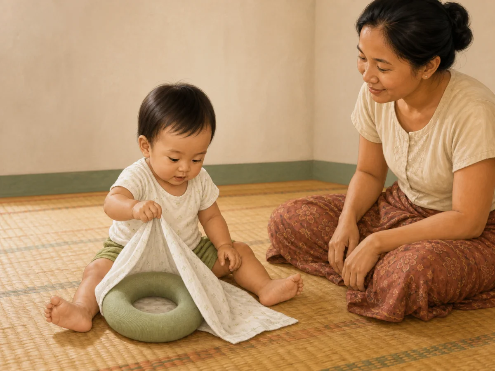

QA: behaviour ✓ · age ✓ · anatomy ✓ · hands ✓ · feet ✓ · gaze/expression ✓ · airway/cloth safety ✓ · no extra object/action ✓ · culturally appropriate ✓ · wordless ✓

Status: **READY FOR OWNER REVIEW**

### `gd_10_12m_communication`

- Myanmar title: ၁၀–၁၂ လ — ဆက်သွယ်ပြောဆိုမှု
- English title: 10–12 months — Communication
- Myanmar summary: လက်ညှိုးထိုးခြင်း၊ လက်ဝှေ့ခြင်းသည် စကားလုံးမတိုင်မီ ဆက်သွယ်မှုနည်းလမ်းများဖြစ်သည်။
- English summary: Pointing and waving are communication before words.
- Final scene: baby points with one index finger to one large ball while looking back to the caregiver.
- Asset: `/guides/gd_10_12m_communication.b4bbd30a3d.webp`

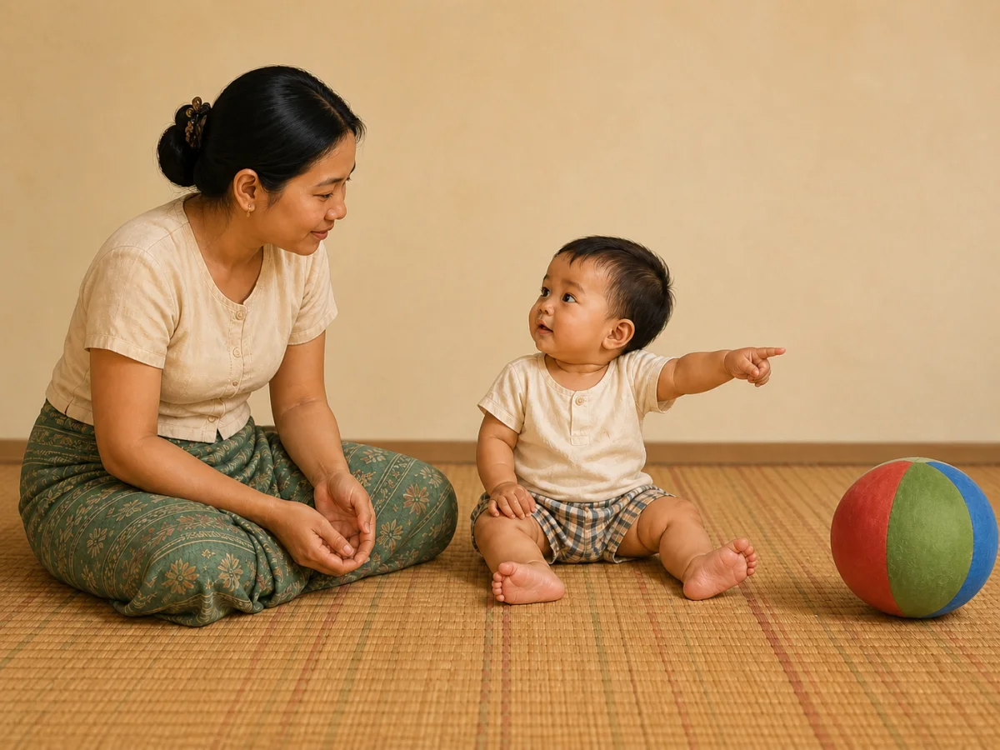

QA: behaviour ✓ · age ✓ · anatomy ✓ · hands ✓ · feet ✓ · intentional pointing/gaze ✓ · large one-piece ball ✓ · no wave/clap/reach ✓ · culturally appropriate ✓ · wordless ✓

Status: **READY FOR OWNER REVIEW**

### `gd_10_12m_daily_routine`

- Myanmar title: ၁၀ – ၁၂ လ — နေ့စဉ် လုပ်ရိုးလုပ်စဉ် လမ်းညွှန်
- English title: 10–12 months — Daily routine guide
- Myanmar summary: ထပ်တလဲလဲ တူညီသော နေ့စဉ် အစီအစဉ်သည် ကလေးအား "နောက်တစ်ခု ဘာလာမလဲ" ကို ကြိုသိစေပြီး လုံခြုံမှု ခံစားချက် ပေးသည်။ အချိန်ဇယား တင်းကျပ်စွာ လိုက်နာရန် မလိုပါ — အစီအစဉ်၏ အစဉ်လိုက် (စား → ကစား → အိပ်) သည် နာရီထက် ပိုအရေးကြီးသည်။ ဤအရွယ်တွင် ကာကွယ်ဆေး ထိုးချိန်များနှင့် ကလေး ကျန်းမာရေး စစ်ဆေးမှုများကိုလည်း ပုံမှန် လုပ်ဆောင်သင့်သည်။
- English summary: A predictable daily rhythm lets her anticipate what comes next and feel secure. You do not need a strict clock — the order of events (feed, play, sleep) matters more than the exact time. This age also includes routine immunisations and health checks.
- Final scene: caregiver calmly adjusts the awake baby's pajama sleeve during a predictable bedtime transition; empty safe cot is the only background cue.
- Asset: `/guides/gd_10_12m_daily_routine.53210581ab.webp`

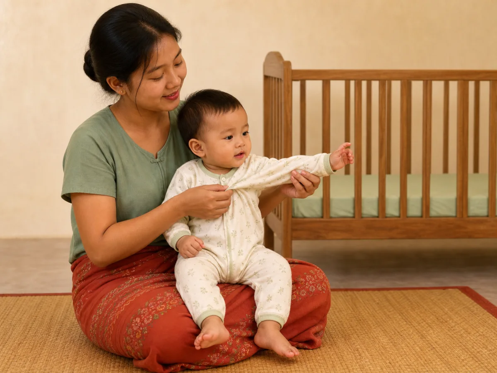

QA: behaviour ✓ · age ✓ · anatomy ✓ · hands ✓ · feet ✓ · supported posture ✓ · empty firm-flat cot ✓ · no unrelated routine action ✓ · culturally appropriate ✓ · wordless ✓

Status: **READY FOR OWNER REVIEW**

### `gd_10_12m_emotional`

- Myanmar title: ၁၀ – ၁၂ လ — စိတ်ခံစားမှု ဖွံ့ဖြိုးမှု လမ်းညွှန်
- English title: 10–12 months — Emotional guide
- Myanmar summary: ဤအရွယ်တွင် ကလေး၏ ခံစားချက်များ ပိုမိုပြင်းထန်လာပြီး မိဘနှင့် ခွဲခွာရမည်ကို စိုးရိမ်မှုလည်း များလာတတ်သည်။ ကလေးသည် မိမိကိုယ်ကို အပြည့်အဝ မတည်ငြိမ်စေနိုင်သေးသဖြင့် ပြုစုစောင့်ရှောက်သူက ပွေ့ဖက်ခြင်း၊ နူးညံ့စွာ ပြောခြင်းနှင့် အနီးတွင် ရှိပေးခြင်းတို့ဖြင့် ကူညီပေးရသည်။ နွေးထွေးပြီး တည်ငြိမ်စွာ တုံ့ပြန်ပေးသည့် ပြုစုစောင့်ရှောက်မှုသည် ကလေး၏ စိတ်ခံစားမှု ဖွံ့ဖြိုးရေးအတွက် အရေးကြီးသည်။
- English summary: Feelings run stronger now and separation anxiety often peaks. She cannot calm herself yet — she borrows an adult’s steadiness to settle, which is called co-regulation. Warm, predictable, responsive care is what builds her emotional foundation.
- Final scene: caregiver gently holds an upset baby who is visibly settling and reconnecting through eye contact.
- Asset: `/guides/gd_10_12m_emotional.2c08ce4b18.webp`

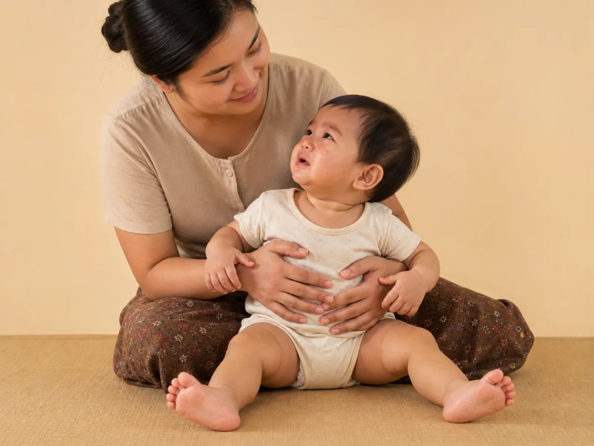

QA: behaviour ✓ · age ✓ · anatomy ✓ · both baby hands fully visible ✓ · both baby legs and both feet fully visible and separate ✓ · toes natural ✓ · one tear/reconnecting gaze ✓ · secure clear-airway hold ✓ · no distraction/action ✓ · culturally appropriate ✓ · wordless ✓

Status: **READY FOR OWNER REVIEW**

### `gd_10_12m_fine_motor`

- Myanmar title: ၁၀ – ၁၂ လ — လက်ချောင်းငယ် လှုပ်ရှားမှု လမ်းညွှန်
- English title: 10–12 months — Fine motor guide
- Myanmar summary: ဤအရွယ်တွင် လက်မနှင့် လက်ညှိုးဖြင့် ညှပ်ယူနိုင်မှု ပိုမို ကျွမ်းကျင်လာသည်။ ပစ္စည်းငယ်များကို ကောက်ယူခြင်း၊ လက်တစ်ဖက်မှ တစ်ဖက်သို့ ပြောင်းကိုင်ခြင်း၊ ဗူးထဲ ထည့်ပြီး ပြန်ထုတ်ခြင်းတို့ကို အကြိမ်ကြိမ် လုပ်ချင်တတ်သည်။ ဤထည့်ထုတ်ကစားနည်းသည် လက်နှင့် မျက်စိ ပူးတွဲလုပ်ဆောင်နိုင်မှုကို လေ့ကျင့်ပေးပြီး ဗူးထဲတွင် ပစ္စည်းရှိနေဆဲဖြစ်ကြောင်းလည်း နားလည်လာစေသည်။
- English summary: The thumb-and-finger pincer grasp becomes more skilled now. She picks up small pieces, passes them hand to hand, and wants to put things into a container and take them out again, over and over. That in-and-out play trains hand–eye coordination and also builds the idea that an object still exists inside the container.
- Final scene: baby removes one of exactly three large soft blocks while the other hand stabilizes the low container.
- Asset: `/guides/gd_10_12m_fine_motor.5053c77e93.webp`

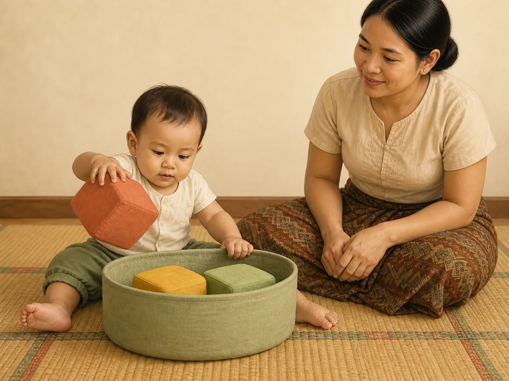

QA: behaviour ✓ · age ✓ · anatomy ✓ · hands/fingers ✓ · feet ✓ · eye-hand coordination ✓ · no choking-size object ✓ · no extra play action ✓ · culturally appropriate ✓ · wordless ✓

Status: **READY FOR OWNER REVIEW**

### `gd_10_12m_gross_motor`

- Myanmar title: ၁၀ – ၁၂ လ — ကြွက်သားကြီး လှုပ်ရှားမှု လမ်းညွှန်
- English title: 10–12 months — Gross motor guide
- Myanmar summary: ဤအရွယ်တွင် ကလေးအများစုသည် ပစ္စည်းကို ဆွဲကိုင်၍ မတ်တပ်ရပ်ခြင်းနှင့် ပရိဘောဂကို ကိုင်လျက် ဘေးတိုက်လျှောက်ခြင်းတို့ကို စတင်လုပ်နိုင်သည်။ အချို့က ခဏတာ လက်လွှတ်ရပ်နိုင်ပြီး အချို့က ပထမဆုံး ခြေလှမ်းများကို လှမ်းကြသည်။ သို့သော် ၁၂ လတွင် လျှောက်နိုင်ရမည်ဟု မသတ်မှတ်နိုင်ပါ။ ကျန်းမာသော ကလေးများသည် ၉ လမှ ၁၈ လအတွင်း လျှောက်တတ်ကြပြီး ဤအချိန်ကွာခြားမှုမှာ ပုံမှန်ဖြစ်သည်။ တွားသွားပုံလည်း ကလေးတစ်ဦးနှင့်တစ်ဦး ကွဲပြားနိုင်ပြီး အချို့က တွားခြင်းမရှိဘဲ တိုက်ရိုက်လျှောက်တတ်ကြသည်။
- English summary: Around now many babies pull to stand and cruise sideways holding furniture. Some stand alone briefly, and some take first steps. But walking by 12 months is not required — healthy children walk anywhere between about 9 and 18 months, and that whole range is normal. Ways of moving also vary: some babies bottom-shuffle or roll, and some skip crawling altogether.
- Final scene: barefoot baby takes one sideways cruising step while both hands hold a broad stable bench; caregiver stays within reach.
- Asset: `/guides/gd_10_12m_gross_motor.c00d6ea6f9.webp`

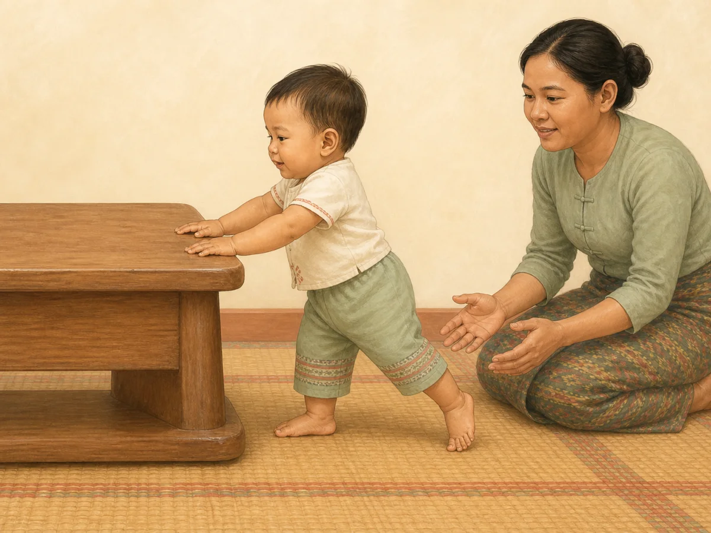

QA: behaviour ✓ · age ✓ · anatomy ✓ · hands ✓ · feet/step ✓ · balance/posture ✓ · stable floor/furniture ✓ · no independent walking/climbing ✓ · culturally appropriate ✓ · wordless ✓

Status: **READY FOR OWNER REVIEW**

### `gd_10_12m_language`

- Myanmar title: ၁၀ – ၁၂ လ — ဘာသာစကား နားလည်မှု လမ်းညွှန်
- English title: 10–12 months — Language understanding guide
- Myanmar summary: ပြောနိုင်မှုထက် နားလည်မှုက အမြဲ ရှေ့ကနေသည်။ ဤအရွယ်တွင် ကလေးသည် နာမည်ခေါ်လျှင် လှည့်ကြည့်ခြင်း၊ "မလုပ်နဲ့" ဟု ပြောလျှင် ခဏ ရပ်ခြင်း၊ မိသားစုဝင်များ၏ အမည်နှင့် အသုံးများသော ပစ္စည်းအမည်များကို နားလည်ခြင်း စတင်လာသည်။ နေ့စဉ် ပြောဆိုမှု များလေ၊ အလှည့်ကျ ဆက်သွယ်မှု များလေ ကလေး၏ စကားလုံး သိုလှောင်မှု ကြီးထွားလေ ဖြစ်သည်။
- English summary: Understanding always runs ahead of speaking. Now she turns to her name, pauses briefly at "no", and starts to understand family names and everyday object words. The more everyday talk and back-and-forth turns she gets, the faster her word store grows.
- Final scene: after a simple request, baby gives one large familiar ball to the caregiver's open palm.
- Asset: `/guides/gd_10_12m_language.5f707ac4bc.webp`

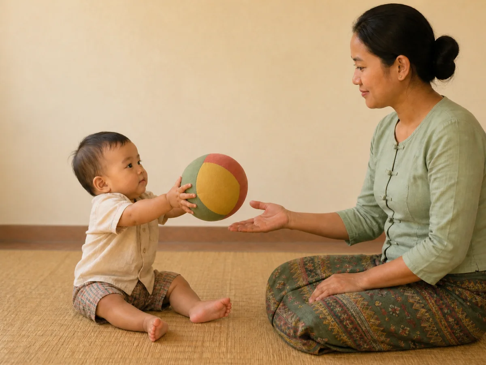

QA: behaviour ✓ · age ✓ · anatomy ✓ · hands ✓ · feet ✓ · purposeful handover/gaze ✓ · no pointing/babble/demonstration ✓ · one safe ball only ✓ · culturally appropriate ✓ · wordless ✓

Status: **READY FOR OWNER REVIEW**

### `gd_10_12m_nutrition`

- Myanmar title: ၁၀ – ၁၂ လ — အာဟာရ လမ်းညွှန်
- English title: 10–12 months — Nutrition guide
- Myanmar summary: ဤအရွယ်တွင် ဖြည့်စွက်အစားအစာက ကလေး၏ အာဟာရအတွက် ပိုမိုအရေးပါလာသည်။ တစ်နေ့လျှင် အဓိကအစာ သုံးနပ်နှင့် ကြားစာ တစ်ကြိမ်မှ နှစ်ကြိမ်ခန့် ကျွေးပေးနိုင်ပြီး မိခင်နို့ကို အသက် ၂ နှစ် သို့မဟုတ် ထို့ထက်ကျော်လွန်၍ ဆက်လက်တိုက်ကျွေးနိုင်သည်။ အစာကို ချောမွေ့အောင် ကြိတ်ထားသည့်ပုံစံမှ အဖတ်အနည်းငယ်ပါသည့်ပုံစံ၊ ထို့နောက် လက်ဖြင့် ကိုင်စားနိုင်သည့် နူးညံ့သောအတုံးများအဖြစ် တဖြည်းဖြည်း ပြောင်းပေးပါ။ အသား၊ ငါး၊ ဥ၊ ပဲနှင့် အစိမ်းရောင် ဟင်းသီးဟင်းရွက်သကဲ့သို့ သံဓာတ်ကြွယ်ဝသော အစားအစာများသည် အထူးအရေးကြီးသည်။
- English summary: Food now plays a larger part in her nutrition — often about three main meals plus one or two snacks a day, alongside breastfeeding which can continue to two years and beyond. Texture should progress gradually from puréed to mashed with soft lumps, then to soft finger pieces. Iron-rich foods — meat, fish, eggs, beans and dark green vegetables — matter especially at this age.
- Final scene: caregiver offers one spoonful of thick soft iron-rich complementary food to the upright, secured baby.
- Asset: `/guides/gd_10_12m_nutrition.6040ff99d5.webp`

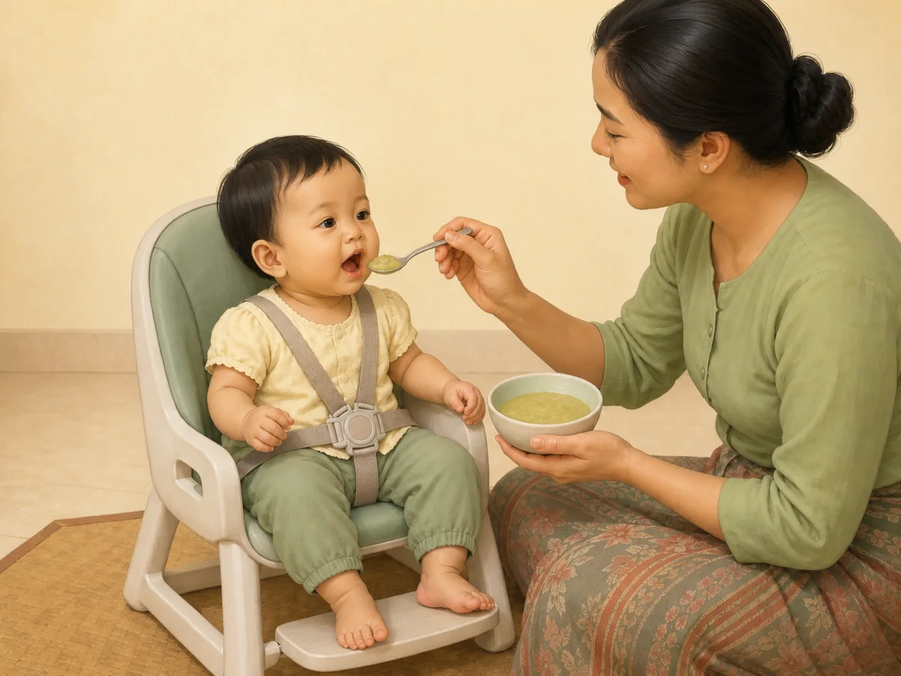

QA: behaviour ✓ · age ✓ · anatomy ✓ · hands ✓ · feet/footrest ✓ · willing mouth/expression ✓ · upright supervised feeding ✓ · safe soft texture/no choking shape ✓ · culturally appropriate ✓ · wordless ✓

Status: **READY FOR OWNER REVIEW**

### `gd_10_12m_play`

- Myanmar title: ၁၀ – ၁၂ လ — ကစားခြင်းနှင့် အိမ်တွင်း ဘေးကင်းရေး လမ်းညွှန်
- English title: 10–12 months — Play and home-safety guide
- Myanmar summary: ကစားခြင်းသည် ဤအရွယ်၏ အဓိက သင်ယူနည်း ဖြစ်သည်။ ကလေးသည် ရွေ့လျားနိုင်လာသည်နှင့်အမျှ ကစားနယ်ပယ် ကျယ်လာပြီး အိမ်တွင်း အန္တရာယ်များနှင့်လည်း ပိုနီးလာသည်။ ထို့ကြောင့် ကြမ်းပြင်ပေါ် လုံခြုံစွာ ကစားနိုင်ရန် ပတ်ဝန်းကျင်ကို ပြင်ဆင်ပေးခြင်းသည် ကလေးကို အမြဲ တားမြစ်ခြင်းထက် ပိုထိရောက်သည်။ "မလုပ်နဲ့" ဟု အကြိမ် ၅၀ ပြောရမည့်အစား အခန်းကို လုံခြုံအောင် ပြင်လိုက်ခြင်းက ကလေးကိုလည်း လွတ်လပ်စွာ လေ့လာခွင့် ပေးသည်။
- English summary: Play is how she learns now. As she becomes mobile her play area widens and she comes closer to household hazards, so preparing the environment works better than constant prohibition. Instead of saying "no" fifty times, make the room safe and let her explore.
- Final scene: baby independently explores one large lightweight one-piece cup while caregiver follows the baby's lead.
- Asset: `/guides/gd_10_12m_play.5b6fab6c04.webp`

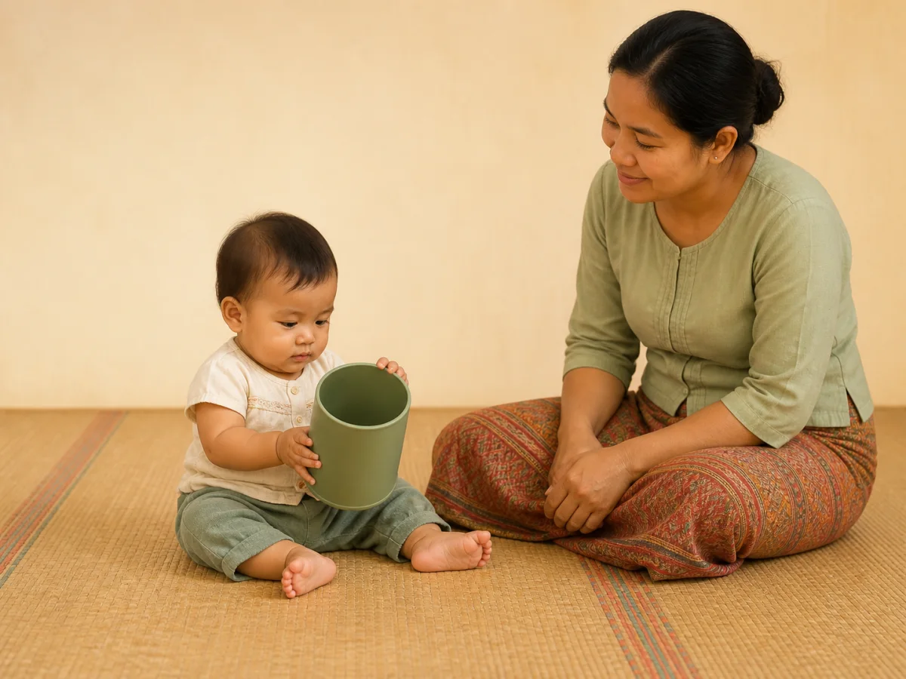

QA: behaviour ✓ · age ✓ · anatomy ✓ · hands ✓ · feet ✓ · caregiver attention ✓ · one mouth-safe object ✓ · clear baby-proofed floor/no extra play ✓ · culturally appropriate ✓ · wordless ✓

Status: **READY FOR OWNER REVIEW**

### `gd_10_12m_safety`

- Myanmar title: ၁၀–၁၂ လ — ဘေးကင်းလုံခြုံရေး
- English title: 10–12 months — Safety
- Myanmar summary: ကလေးရွေ့လျားလာသည်နှင့်အမျှ အိမ်ကို ဘေးကင်းအောင် ပြင်ဆင်ခြင်းက ထိခိုက်မှုများကို ကာကွယ်သည်။
- English summary: As babies get mobile, baby-proofing prevents injuries.
- Final scene: caregiver closes the latch of a mounted stair gate while baby remains seated safely on the room side.
- Asset: `/guides/gd_10_12m_safety.982cb1efe2.webp`

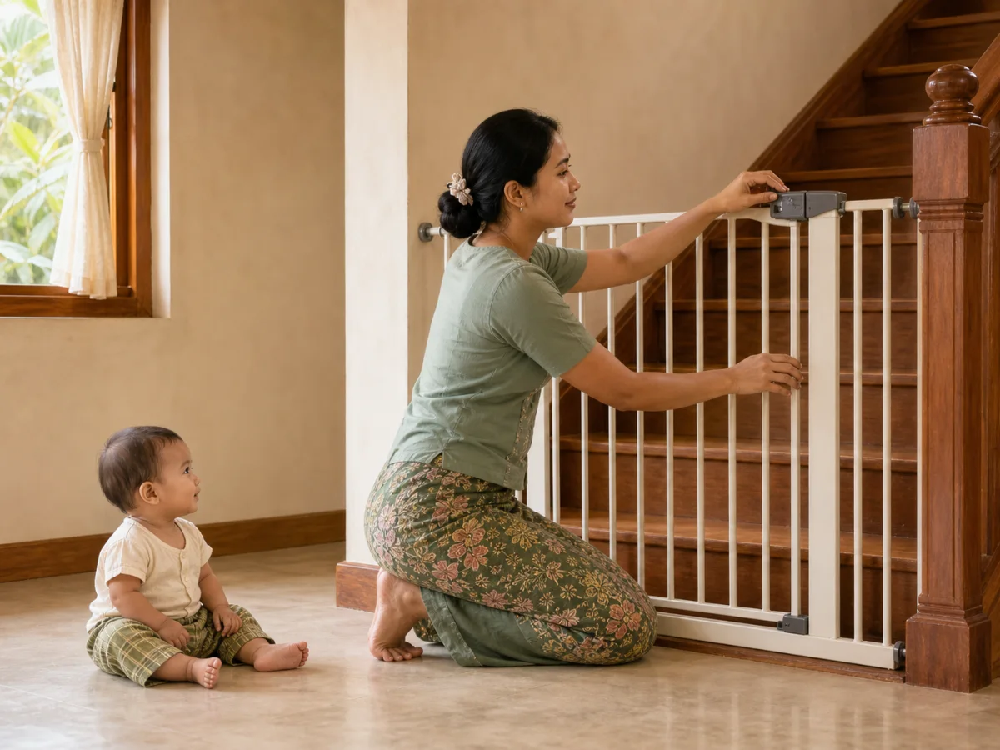

QA: behaviour ✓ · age ✓ · anatomy ✓ · hands ✓ · feet ✓ · caregiver placement ✓ · gate closed/secured ✓ · no baby contact/fall/injury montage ✓ · culturally appropriate ✓ · wordless ✓

Status: **READY FOR OWNER REVIEW**

### `gd_10_12m_self_help`

- Myanmar title: ၁၀ – ၁၂ လ — ကိုယ်တိုင် လုပ်ဆောင်နိုင်မှု လမ်းညွှန်
- English title: 10–12 months — Self-help guide
- Myanmar summary: ဤအရွယ်တွင် ကလေးသည် ကိုယ်တိုင် စားသောက်ရန် စိတ်ဝင်စားလာတတ်သည်။ လက်ဖြင့် အစာကောက်စားခြင်း၊ ဇွန်းကို ကိုင်ကြည့်ခြင်းနှင့် အဖုံးမပါသော ခွက်ဖြင့် သောက်ကြည့်ခြင်းတို့ကို စတင်နိုင်သည်။ အစာစားရာတွင် ရှုပ်ပွနိုင်သော်လည်း ယင်းအတွေ့အကြုံများက လက်ချောင်းလှုပ်ရှားမှု၊ ကိုယ်တိုင်ရွေးချယ်နိုင်မှုနှင့် ဗိုက်ပြည့်မှုကို သိရှိတတ်လာစေရန် ကူညီပေးသည်။ သွားစတင်ပေါက်လာချိန်ဖြစ်သဖြင့် ခံတွင်းသန့်ရှင်းရေးကိုလည်း စတင်ပေးသင့်သည်။
- English summary: She now wants to do things herself — picking up finger foods, holding a spoon, sipping from an open cup. It will be messy, but it trains hand skills, choice-making and her own sense of fullness. Teeth are usually appearing too, so oral care starts now.
- Final scene: secured upright baby independently takes a supervised two-handed sip from a child-safe silicone open cup.
- Asset: `/guides/gd_10_12m_self_help.ad95467b37.webp`

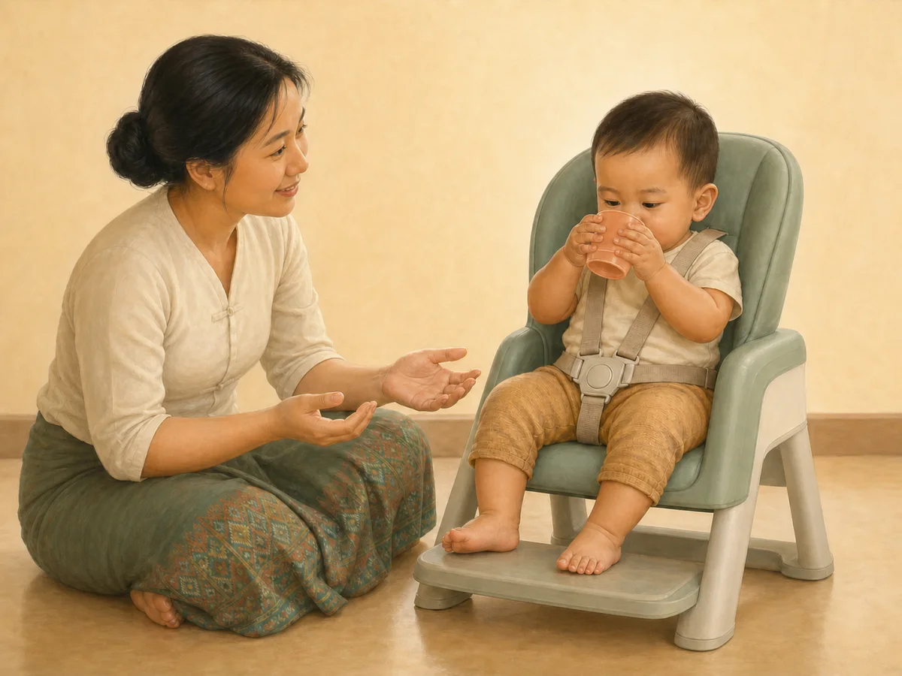

QA: behaviour ✓ · age ✓ · anatomy ✓ · hands ✓ · feet/footrest ✓ · independent open-cup sip ✓ · unbreakable cup/upright supervision ✓ · no food/bottle/straw ✓ · culturally appropriate ✓ · wordless ✓

Status: **READY FOR OWNER REVIEW**

### `gd_10_12m_sleep`

- Myanmar title: ၁၀ – ၁၂ လ — အိပ်စက်ခြင်း လမ်းညွှန်
- English title: 10–12 months — Sleep guide
- Myanmar summary: ဤအရွယ်တွင် ကလေးအများစုသည် ၂၄ နာရီအတွင်း ၁၂ နာရီမှ ၁၆ နာရီခန့် (နေ့ဘက် အိပ်ချိန် အပါအဝင်) အိပ်လေ့ရှိသည်၊ သို့သော် ကလေးတစ်ဦးနှင့်တစ်ဦး ကွာခြားနိုင်သည်။ နေ့ဘက်တွင် ၂ ကြိမ် အိပ်ခြင်းမှ ၁ ကြိမ်သို့ တဖြည်းဖြည်း ပြောင်းလာနိုင်သည်။ ခွဲခွာမှု စိုးရိမ်ခြင်း အထွတ်အထိပ် ရောက်ချိန်ဖြစ်၍ ညဘက် နိုးခြင်းများ ပြန်များလာတတ်သည် — ဤသည် နောက်ပြန်ဆုတ်ခြင်း မဟုတ်ဘဲ ဖွံ့ဖြိုးမှု၏ တစ်စိတ်တစ်ပိုင်း ဖြစ်သည်။ တည်ငြိမ်၍ ထပ်တလဲလဲ တူညီသော အိပ်ရာဝင် ပုံစံသည် အထောက်အကူ အဖြစ်ဆုံး ဖြစ်သည်။
- English summary: Most babies this age sleep about 12 to 16 hours in 24 hours including naps, though this varies. Two naps often become one over these months. Because separation anxiety peaks now, night waking can increase again — that is development, not a setback. A calm, repeated bedtime routine helps most.
- Final scene: baby sleeps alone on the back on a firm flat fitted-sheet-only cot mattress.
- Asset: `/guides/gd_10_12m_sleep.ed83041f69.webp`

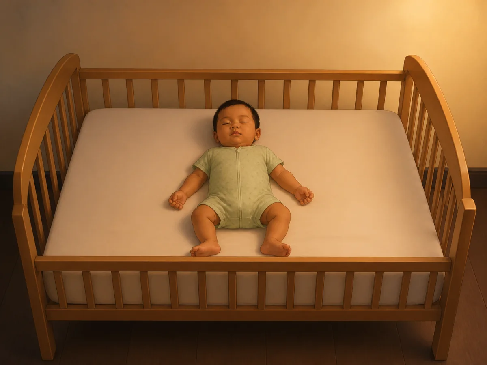

QA: behaviour ✓ · age ✓ · anatomy ✓ · hands ✓ · feet ✓ · peaceful face/clear airway ✓ · back/firm-flat/empty cot/fitted sheet only ✓ · no pillow/blanket/bumper/toy/cord ✓ · culturally appropriate ✓ · wordless ✓

Status: **READY FOR OWNER REVIEW**

### `gd_10_12m_social`

- Myanmar title: ၁၀ – ၁၂ လ — လူမှုဆက်ဆံရေး လမ်းညွှန်
- English title: 10–12 months — Social guide
- Myanmar summary: ဤအရွယ်တွင် ကလေးသည် လက်ပြခြင်း၊ လက်ခုပ်တီးခြင်းနှင့် မျက်နှာအမူအရာများကို လူကြီးထံမှ တုပရန် အလွန် စိတ်ဝင်စားလာသည်။ စိတ်ဝင်စားဖွယ်အရာတစ်ခုကို မြင်လျှင် ထိုအရာနှင့် လူကြီးကို အပြန်အလှန် ကြည့်ပြီး အာရုံစိုက်မှုကို မျှဝေတတ်လာသည်။ ယင်းသည် နောင်တွင် ဘာသာစကားနှင့် လူမှုဆက်ဆံရေး ဖွံ့ဖြိုးရန် အရေးကြီးသော အခြေခံတစ်ခု ဖြစ်သည်။
- English summary: Copying adults becomes a favourite activity — waving, clapping, copying faces. She now looks from an interesting thing back to you, sharing it: joint attention. That shared looking is a foundation for later language and social skills.
- Final scene: seated baby imitates caregiver's gentle clap; each person claps their own two hands while sharing eye contact.
- Asset: `/guides/gd_10_12m_social.e95293d313.webp`

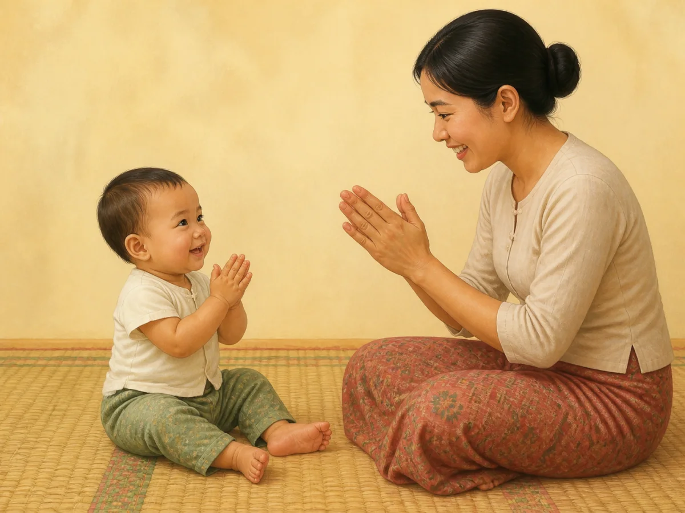

QA: behaviour ✓ · age ✓ · anatomy ✓ · both pairs of hands/fingers ✓ · baby feet ✓ · shared gaze/expression ✓ · no forced movement/object/other gesture ✓ · culturally appropriate ✓ · wordless ✓

Status: **READY FOR OWNER REVIEW**

### `gd_10_12m_speech`

- Myanmar title: ၁၀ – ၁၂ လ — စကားသံ ထွက်ဆိုမှု လမ်းညွှန်
- English title: 10–12 months — Speech guide
- Myanmar summary: ဤအရွယ်တွင် ကလေး၏ ပလုတ်သံများသည် စကားသံနှင့် ပိုတူလာသည်။ "မာမာ"၊ "ဒါဒါ" ကို လူတစ်ဦးကို ရည်ညွှန်း၍ ခေါ်လာနိုင်ပြီး၊ အချို့ ကလေးများသည် ပထမဆုံး အဓိပ္ပာယ်ရှိသော စကားလုံး တစ်လုံး နှစ်လုံး ပြောလာသည်။ အချို့မှာ ၁၅ လ ဝန်းကျင်မှ စတင်ပြောကြပြီး ဤအကွာအဝေးမှာလည်း ပုံမှန် ဖြစ်သည်။ စကားလုံး မထွက်သေးသော်လည်း အသံဖြင့် ဆက်သွယ်နေခြင်း၊ လက်ညှိုးထိုးပြခြင်း၊ နားလည်ပြသခြင်းတို့သည် ဖွံ့ဖြိုးမှု၏ အရေးကြီးသော အစိတ်အပိုင်းများ ဖြစ်သည်။
- English summary: Babble now sounds much more like speech. "Mama" and "dada" may start to mean a specific person, and some babies say one or two first meaningful words. Others begin nearer 15 months, which is also within the normal range. Even before words appear, communicating with sounds, pointing and showing understanding are important parts of speech development.
- Final scene: baby directs speech-like babble to the mother, who listens silently with closed mouth and empty hands.
- Asset: `/guides/gd_10_12m_speech.457c2b581c.webp`

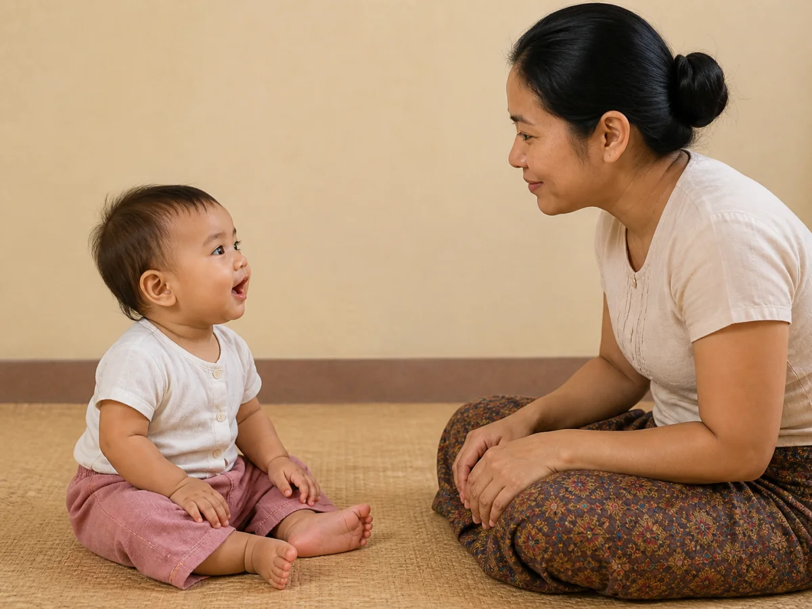

QA: behaviour ✓ · age ✓ · anatomy ✓ · hands/fingers ✓ · feet ✓ · baby babble/mother silent ✓ · direct eye contact ✓ · no pointing/waving/clapping/object ✓ · culturally appropriate ✓ · wordless ✓

Status: **READY FOR OWNER REVIEW**

## Rejected generation audit

Rejected candidates were not saved or mapped as final assets:

- `gd_10_12m_cognitive`: rejected extra plant, basket and decoration; regenerated.
- `gd_10_12m_communication`: rejected extra plant, basket and wall textile; regenerated.
- `gd_10_12m_emotional`: rejected the first candidate because one baby hand was hidden. The next previously selected candidate was removed from the application after owner re-audit found one baby leg and foot hidden. Two correction candidates were also rejected because a baby hand remained hidden. The final `2c08ce4b18` asset shows both hands, both complete legs and both separate feet.
- `gd_10_12m_language`: rejected background basket/textile; regenerated.
- `gd_10_12m_nutrition`: rejected background plant/baskets; regenerated.
- `gd_10_12m_self_help`: rejected because the cup looked breakable/glass-like; regenerated with an opaque child-safe silicone cup.

All other final images passed their first visual QA. No rejected candidate is referenced by the application.

## Mapping and deployment gate

- Exact direct slug-to-asset mappings: **14/14**
- Unique asset paths: **14/14**
- Domain/category/shared fallback for `10_12m`: **NONE**
- Asset format/dimensions: **WebP, 1200 × 900 (4:3)**
- Asset size: **all under 500 KB**
- Production data changed: **NO**
- Deployment: **BLOCKED PENDING EXPLICIT OWNER APPROVAL OF THIS COMPLETE REVIEW**
