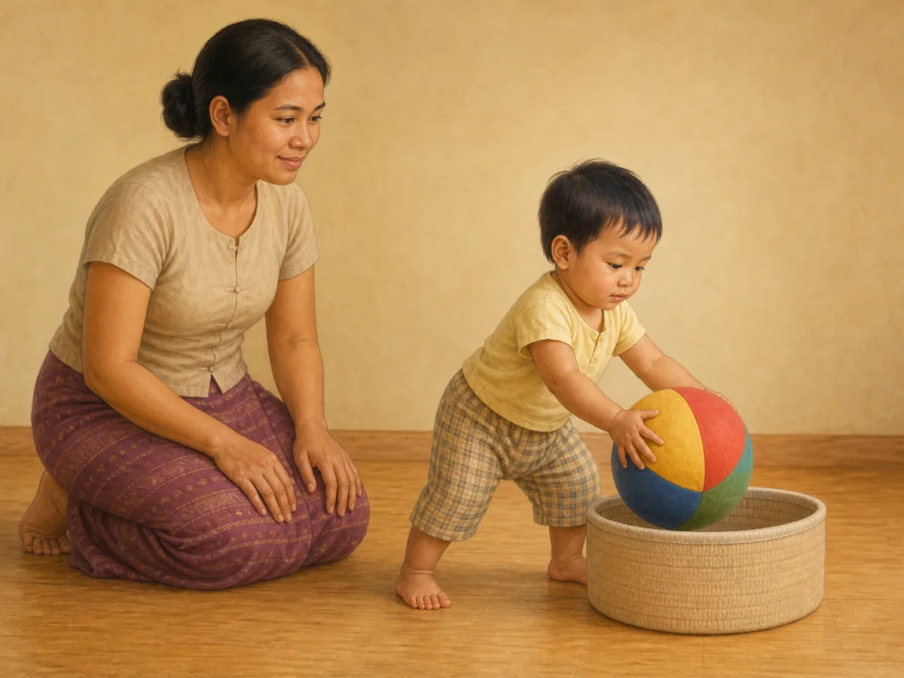
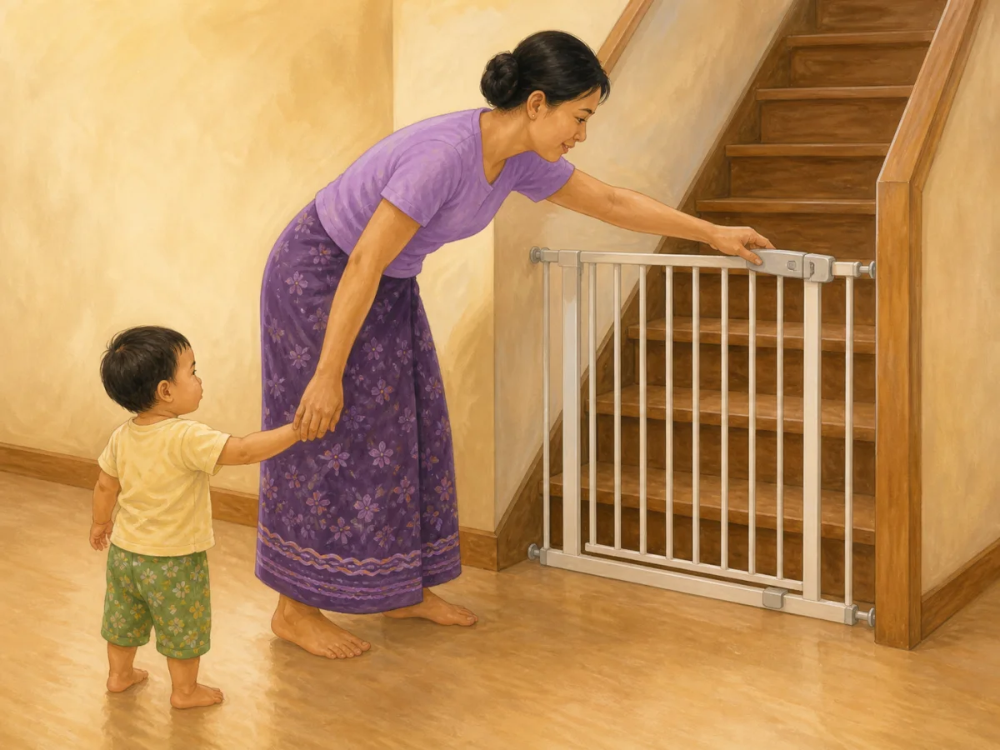
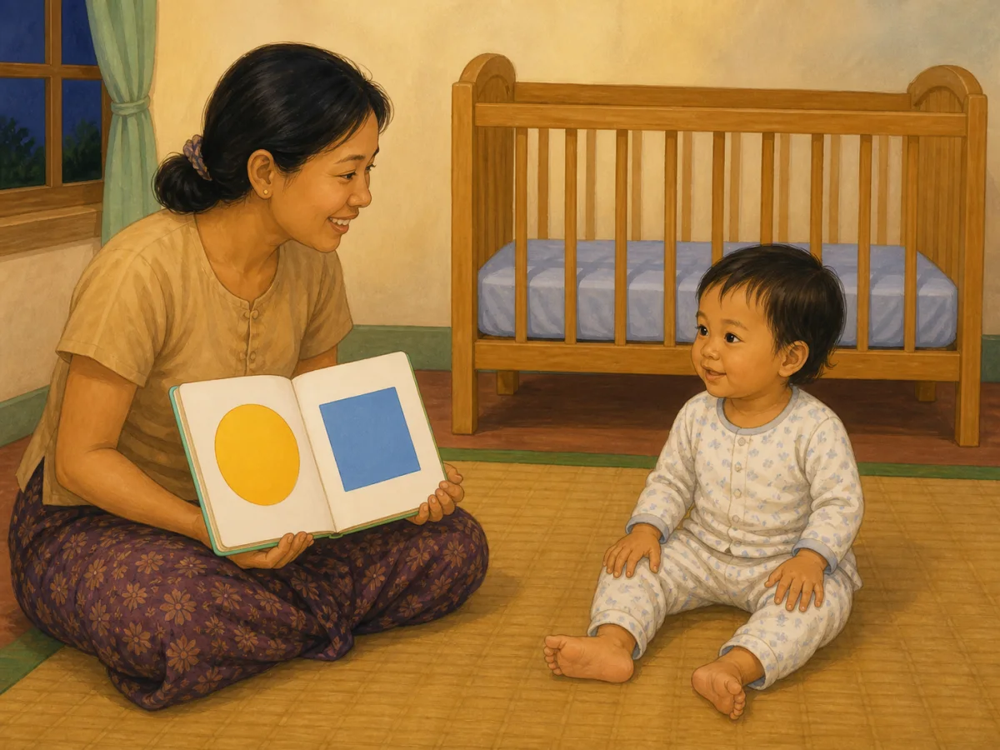
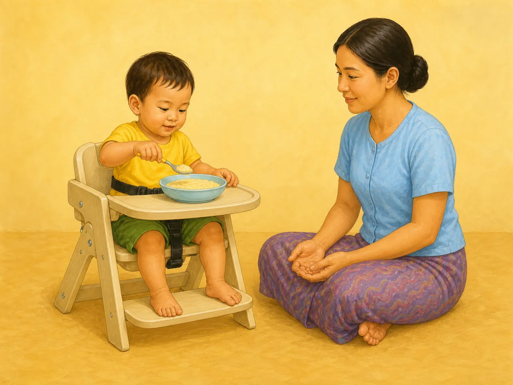
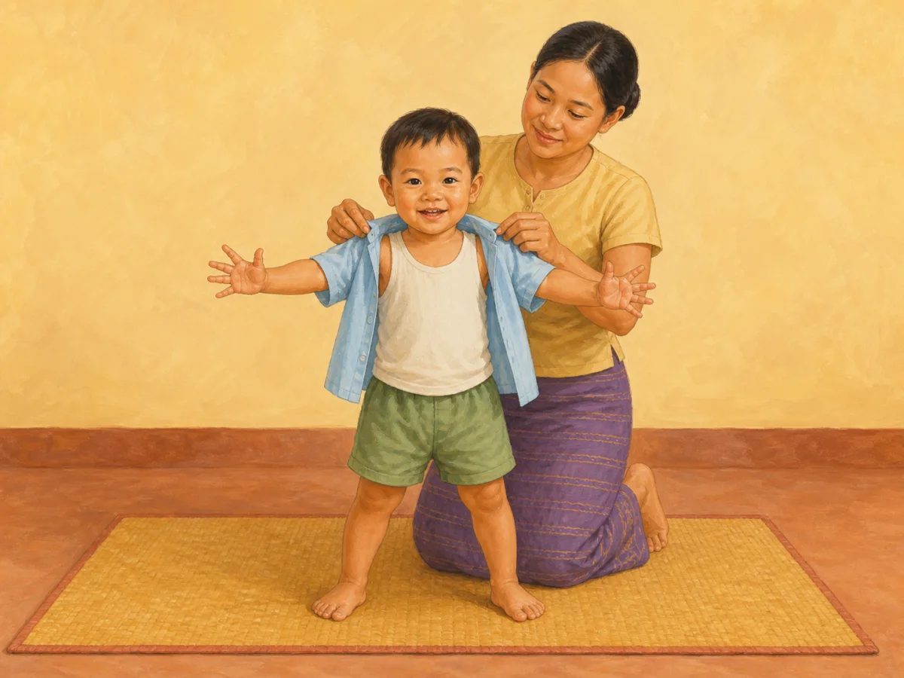
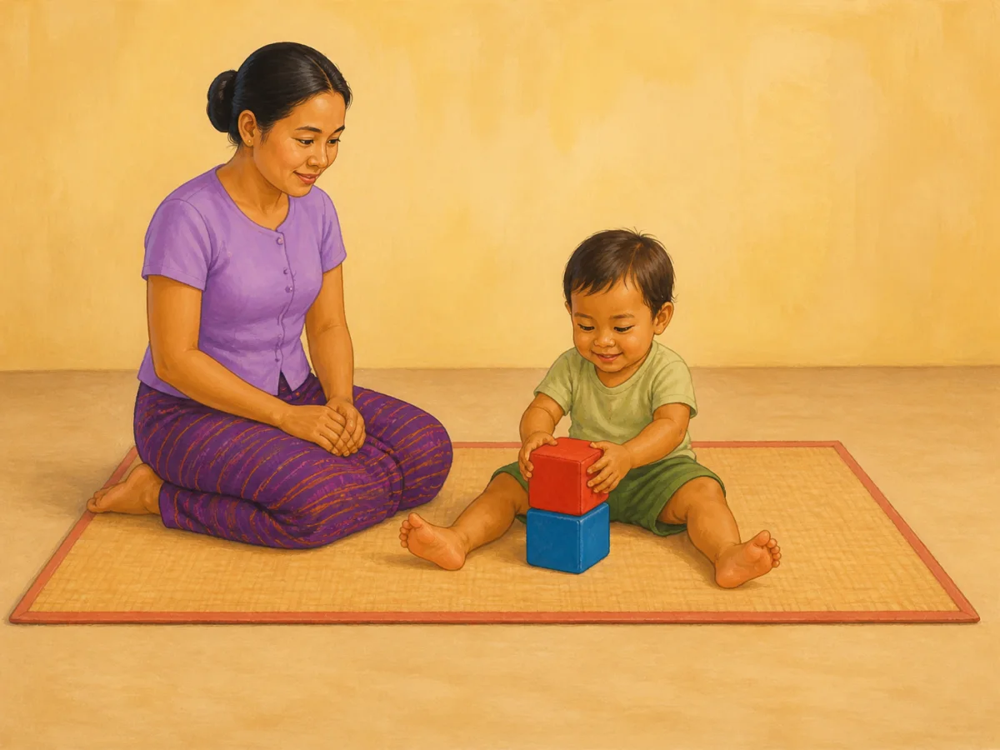

# ACE Child Grow — 13–18 Month Guide Illustration Review

Status: **6/6 READY FOR OWNER REVIEW — NOT DEPLOYED**

Source of truth: Production Convex `libraryContent`, read directly on 2026-08-10 and filtered to exact `type = guide`, `ageGroupKey = 13_18m`. Production contains exactly six matching records and all six currently have `clinicalStatus = clinical_review`. Production remained read only.

Every top-level field and every nested `data` field was inspected for all six records. Top-level fields include identifiers/timestamps, exact slug, Myanmar/English titles and summaries, age group, domain, type, source, tags, version, review revision, clinical/priority status when present, and search index. Nested fields include meaning (`why`), observation questions, daily/weekly activities, indoor/outdoor ideas, materials, safety, common mistakes, parent tips, low-cost ideas, red flags, referral, FAQ, encouragement, editorial status and evidence summary when present. No Production wording is changed by this illustration run.

## Pre-generation review table

| Slug | Myanmar title | English title | Exact behaviour | Image scene | Must not show | Safety requirements | Status |
|---|---|---|---|---|---|---|---|
| `gd_13_18m_daily_routine` | ၁၃–၁၈ လ — နေ့စဉ်လုပ်ရိုးလုပ်စဉ် လမ်းညွှန် | 13–18 months — daily routine guide | Toddler participates in one predictable tidying step by putting one familiar play object away after play. | A Myanmar/Southeast Asian 13–18-month-old stands with stable wide toddler posture beside a low open basket and deliberately places one large soft ball into it; caregiver kneels within reach and calmly watches with empty hands. | Meal, sleep, bath, brushing or dressing montage; clock/calendar; adult doing the task; multiple toys; throwing; running; climbing; text/arrows. | Floor-level clear space; basket is low, soft-edged and open; ball is one-piece and much larger than the mouth; caregiver closely supervises without taking over. | READY TO GENERATE |
| `gd_13_18m_safety` | ၁၃–၁၈ လ — ဘေးကင်းလုံခြုံရေး လမ်းညွှန် | 13–18 months — safety guide | Caregiver secures a stair barrier for a new walker before the child reaches the stairs. | A Myanmar/Southeast Asian caregiver visibly closes the latch of a firmly mounted gate at the bottom of a staircase while the 13–18-month-old new walker stands safely on the room side, holding the caregiver's free hand. | Open gate; child touching or climbing the gate/stairs; injury/fall; water, traffic, cooking or medicine hazard montage; child alone; warning symbols; text/arrows. | Mounted gate is closed and latched; caregiver remains between child and stairs and holds the child's hand; clear level floor; no climbable furniture, cord or loose object. | READY TO GENERATE |
| `gd_13_18m_sleep` | ၁၃–၁၈ လ — အိပ်စက်ခြင်း လမ်းညွှန် | 13–18 months — sleep guide | Toddler settles through one calm, repeatable pre-sleep book routine. | A clearly 15–18-month Myanmar/Southeast Asian toddler in two-piece pajamas sits independently on a floor mat beside the caregiver and watches one wordless board book; an empty high-railed cot is the only background sleep cue. | Infant under 12 months; sleeping medicine; screen; singing and book at once; play; feeding; unguarded bed; pillow; loose blanket; bumper; stuffed toy; loose cloth in the cot; text/letters/arrows. | Floor-level shared reading; cot has high fixed rails, firm flat mattress and taut fitted sheet only; sleep space remains completely empty; no cord or medicine. | READY TO GENERATE |
| `gd_13_18m_nutrition` | ၁၃–၁၈ လ — အာဟာရ လမ်းညွှန် | 13–18 months — nutrition guide | Seated toddler practises self-feeding with a spoon while the caregiver supervises and respects hunger/fullness cues. | A Myanmar/Southeast Asian 13–18-month-old sits upright in a secured supportive feeding chair, uses one child spoon to scoop a small amount of soft thick family food from one shallow bowl, and looks calmly at the food; caregiver sits within reach with empty hands. | Force-feeding; caregiver holding spoon; bottle; feeding while walking/lying; whole grapes/nuts/beans, hard chunks or other choking shapes; many dishes; screen; text/labels. | Upright stable posture and secure seat; constant close supervision; soft mashable texture and small safe portion; unbreakable bowl/spoon; clear airway and no choking hazard. | READY TO GENERATE |
| `gd_13_18m_self_help` | ၁၃–၁၈ လ — ကိုယ်တိုင် လုပ်ဆောင်နိုင်မှု | 13–18 months — Self Help | Toddler actively helps with dressing by extending both arms through a loose shirt while the caregiver gives only the needed support. | A clearly 15–18-month Myanmar/Southeast Asian new walker stands with a stable wide stance and deliberately extends both arms forward through the two sleeves of one loose front-opening shirt; both hands and all fingers are fully outside the cuffs while the caregiver holds only the shoulder seams from behind. | Missing/hidden hand; infant proportions; spoon/cup or feeding; toilet training; adult dressing a passive child; standing on furniture; shoes/hat as extra tasks; multiple clothing items; text/arrows. | Floor-level dressing; stable wide stance; loose soft garment with no cord hazard; caregiver supports only the fabric without holding the child's hands or pulling a limb; clear space and natural joint positions. | READY TO GENERATE |
| `gd_13_18m_fine_motor` | ၁၃–၁၈ လ — လက်ချောင်းငယ် လှုပ်ရှားမှု | 13–18 months — Fine Motor | Toddler coordinates eyes and hands to stack one very large block on another. | A Myanmar/Southeast Asian 13–18-month-old sits stably on a clear floor mat and carefully places one large soft block on top of one other large soft block; both hands, all fingers, both complete legs and both bare feet are visible, with caregiver supervising within reach. | Bean, pebble, coin, button, battery, magnet or any small object; food/mouthing; cup filling; throwing; tall tower; adult doing the action; extra toys; text/arrows. | Only two one-piece soft blocks, each much larger than the child's mouth; floor-level play; direct supervision; no sharp edge, choking part or elevated surface. | READY TO GENERATE |

## Pre-generation gate

- Exact Production guide records covered: **6/6**
- Every row is exact `ageGroupKey = 13_18m`, `type = guide`, `clinicalStatus = clinical_review`: **CONFIRMED**
- Myanmar/English titles, summaries, meaning, activities, observations, safety, red flags and referral were read from Production: **CONFIRMED**
- Each scene contains one visually understandable behaviour and no domain/category fallback: **PASS**
- All six scenes are unique: **PASS**
- Feeding, movement, choking and sleep-space requirements are identified: **PASS**
- Required Production field missing for an image concept: **NONE**
- Image generation status: **6/6 generated only after this table was complete; 6/6 final candidates passed image QA**
- Deployment status: **NOT DEPLOYED**

## Owner-review cards

All previews below are final wordless 4:3 WebP files. Each image has a unique exact-slug mapping and a new content hash. Production wording below was re-read directly from Production Convex on 2026-08-10; it was not edited.

### `gd_13_18m_daily_routine`

- Myanmar title: ၁၃–၁၈ လ — နေ့စဉ်လုပ်ရိုးလုပ်စဉ် လမ်းညွှန်
- English title: 13–18 months — daily routine guide
- Myanmar summary: စားချိန်၊ ကစားချိန်နှင့် အိပ်ချိန်ကို နေ့စဉ် ခန့်မှန်းနိုင်အောင် စီစဉ်ပါ။
- English summary: Keep meals, play, and sleep reasonably predictable.
- Final scene: toddler independently places one large soft ball into one low open basket while the caregiver supervises with empty hands.
- Asset: `/guides/gd_13_18m_daily_routine.cf3d513e9d.webp`

QA: behaviour ✓ · age ✓ · anatomy ✓ · both hands/fingers ✓ · both complete legs/feet ✓ · stable toddler stance ✓ · one safe large ball ✓ · no extra action/object ✓ · culturally appropriate ✓ · wordless ✓

Status: **READY FOR OWNER REVIEW**

### `gd_13_18m_safety`

- Myanmar title: ၁၃–၁၈ လ — ဘေးကင်းလုံခြုံရေး လမ်းညွှန်
- English title: 13–18 months — safety guide
- Myanmar summary: လမ်းလျှောက်စပြုသောကလေးအတွက် လှေကား၊ ပရိဘောဂနှင့် ရေနေရာများကို ကာကွယ်ပါ။
- English summary: Childproof stairs, furniture, and water hazards for a new walker.
- Final scene: caregiver holds the new walker's hand while closing the latch of a firmly mounted stair gate, with the caregiver between child and stairs.
- Asset: `/guides/gd_13_18m_safety.72be1e8e99.webp`

QA: behaviour ✓ · age ✓ · anatomy ✓ · hands/fingers ✓ · both complete legs/feet ✓ · hand-hold ✓ · closed mounted gate ✓ · caregiver between child/stairs ✓ · no hazard montage ✓ · culturally appropriate ✓ · wordless ✓

Status: **READY FOR OWNER REVIEW**

### `gd_13_18m_sleep`

- Myanmar title: ၁၃–၁၈ လ — အိပ်စက်ခြင်း လမ်းညွှန်
- English title: 13–18 months — sleep guide
- Myanmar summary: နေ့ခင်းအိပ်ချိန်နှင့် ညအိပ်ချိန်ကို တည်ငြိမ်သော အစီအစဉ်ဖြင့် ချမှတ်ပါ။
- English summary: Use a predictable nap and bedtime rhythm.
- Final scene: clearly older toddler in two-piece pajamas sits independently beside the caregiver for a wordless pre-sleep book routine, with a completely empty high-railed cot behind them.
- Asset: `/guides/gd_13_18m_sleep.824b435f9a.webp`

QA: behaviour ✓ · clearly 15–18-month body scale ✓ · anatomy ✓ · both hands/fingers ✓ · both complete legs/feet ✓ · floor-level routine ✓ · empty high-railed firm-flat cot ✓ · no medicine/screen/loose cot item ✓ · culturally appropriate ✓ · wordless ✓

Status: **READY FOR OWNER REVIEW**

### `gd_13_18m_nutrition`

- Myanmar title: ၁၃–၁၈ လ — အာဟာရ လမ်းညွှန်
- English title: 13–18 months — nutrition guide
- Myanmar summary: မိသားစုစားသော အစားအစာကို နူးညံ့စွာ ပြင်ဆင်ပြီး အုပ်စုစုံ စားသုံးခွင့်ပေးပါ။
- English summary: Offer varied family foods prepared in soft, safe textures.
- Final scene: securely seated toddler independently practises using one spoon with one bowl of smooth soft family food while the caregiver supervises with empty hands.
- Asset: `/guides/gd_13_18m_nutrition.be0990bf57.webp`

QA: behaviour ✓ · age ✓ · anatomy ✓ · hands/fingers ✓ · both feet on footrest ✓ · upright secured posture ✓ · soft safe food ✓ · one bowl/spoon only ✓ · caregiver supervision ✓ · culturally appropriate ✓ · wordless ✓

Status: **READY FOR OWNER REVIEW**

### `gd_13_18m_self_help`

- Myanmar title: ၁၃–၁၈ လ — ကိုယ်တိုင် လုပ်ဆောင်နိုင်မှု
- English title: 13–18 months — Self Help
- Myanmar summary: ကိုယ်တိုင်စား၊ ကိုယ်တိုင်ဝတ်ရန် ကြိုးစားခြင်းသည် လွတ်လပ်မှုနှင့် ယုံကြည်မှုကို တည်ဆောက်သည်။
- English summary: Trying to self-feed and dress builds independence and confidence.
- Final scene: clearly older new walker stands stably and actively extends both arms through the shirt sleeves; both complete hands are unobstructed while the caregiver holds only the shoulder seams from behind.
- Asset: `/guides/gd_13_18m_self_help.ffc00eff93.webp`

QA: behaviour ✓ · clearly 15–18-month body scale ✓ · anatomy ✓ · both complete child arms ✓ · both hands fully outside cuffs ✓ · five natural fingers per hand ✓ · both complete legs/feet ✓ · stable new-walker stance ✓ · caregiver touches garment only ✓ · culturally appropriate ✓ · wordless ✓

Status: **READY FOR OWNER REVIEW**

### `gd_13_18m_fine_motor`

- Myanmar title: ၁၃–၁၈ လ — လက်ချောင်းငယ် လှုပ်ရှားမှု
- English title: 13–18 months — Fine Motor
- Myanmar summary: လက်ချောင်းလေးများ ကျွမ်းကျင်မှုသည် ကိုယ်တိုင်စားခြင်း၊ အ၀တ် ဝတ်ဆင်ခြင်းနှင့် နောင်တွင်စာရေးသားခြင်းအတွက် အခြေခံဖြစ်သည်။
- English summary: Fine-motor skill underlies self-feeding, dressing, and later writing.
- Final scene: toddler uses both clearly visible hands to place one very large soft block on one other very large soft block.
- Asset: `/guides/gd_13_18m_fine_motor.f1740c1cd4.webp`

QA: behaviour ✓ · clearly 15–18-month body scale ✓ · anatomy ✓ · both hands/all fingers visible ✓ · both complete longer toddler legs/feet ✓ · exactly two mouth-safe large blocks ✓ · floor-level supervision ✓ · no small object/extra toy ✓ · culturally appropriate ✓ · wordless ✓

Status: **READY FOR OWNER REVIEW**

## Rejected generation audit

Rejected candidates were not saved or mapped as final assets:

- `gd_13_18m_safety`: rejected the first candidate because the caregiver did not actually hold the child's hand; regenerated with a clear hand-hold and caregiver between child and stairs.
- `gd_13_18m_nutrition`: rejected the first candidate because unrelated plant, shelf, basket and cloth appeared in the scene; regenerated on a plain background with only chair, bowl and spoon.
- `gd_13_18m_fine_motor`: rejected the first candidate because one toddler hand was hidden behind the top block; regenerated front-on with both hands and fingers visible.
- Owner age/scale re-audit: the previously selected `sleep`, `self_help` and `fine_motor` finals were rejected because their infant-like face/body proportions read closer to 9–12 months than 13–18 months. They were replaced with clearly 15–18-month toddler proportions and new content hashes.
- `gd_13_18m_sleep` age-fix audit: rejected one intermediate candidate because it used an unguarded bed; rejected the next because one child hand was hidden behind the book; final shows both hands/feet and an empty high-railed cot.
- `gd_13_18m_fine_motor` age-fix audit: rejected one older-toddler candidate because the right foot touched the image edge and was cropped in the review card; rejected the next wide candidate because it added unrelated window, plant, shelf, baskets and jars; final uses a plain setting with generous full-body margins.
- `gd_13_18m_self_help` owner hand re-audit: rejected the prior older-toddler candidate because one child arm and hand were hidden behind the shirt/caregiver; final places both complete arms through the sleeves with both hands fully visible outside the cuffs.

## Mapping and asset verification

- Exact slug-to-file mappings: **6/6**
- Unique asset paths: **6/6**
- Domain/category/age fallback: **NONE**
- Format and dimensions: **WebP, 1200 × 900 (4:3), 6/6**
- File sizes: **67,202–108,064 bytes; all below 500 KB**
- Content hash in filename matches SHA-256 prefix: **6/6**
- Production deployment: **NOT PERFORMED**

## Application and engineering verification

- Exact `ContentDetail` Myanmar/English title + exact-slug asset rendering: **68/68 component cases passed, including all six 13–18 month guides**
- Focused mapping and component tests: **76/76 passed**
- Full unit suite: **1,227/1,227 passed across 121 files**
- Typecheck: **PASS**
- ESLint: **PASS**
- Production build: **PASS**
- PWA generation: **PASS — 311 precache entries accepted**
- Playwright asset/card verification: **PASS — 6/6 WebPs returned 200 `image/webp`, natural size 1200 × 900**
- Desktop text + image screenshots: **6/6 captured** under `docs/illustration-review/screenshots/guides-13_18m/`
- Mobile 390 px layout: **6/6 passed with no horizontal overflow**
- Playwright console/page errors and Vite overlay: **NONE**
- Clean-browser navigation to the six actual local `/content/<slug>` routes returned HTTP 200 with meaningful UI and no console/page/overlay errors, but correctly stopped at the sign-in screen because the verification browser had no owner session. Authenticated Production route verification remains a post-approval deployment check; no auth bypass was used.
- Existing unrelated React test `act(...)` warnings were observed in the full suite; there were **zero guide/asset warnings, missing imports or missing files**.
- Unrelated local `ios/` directory: **UNTOUCHED**

## Deployment gate

This complete six-guide review is ready for explicit owner approval. No commit, push, pull request, Production deployment, Production Convex write or clinical-text change has been performed in this run.
