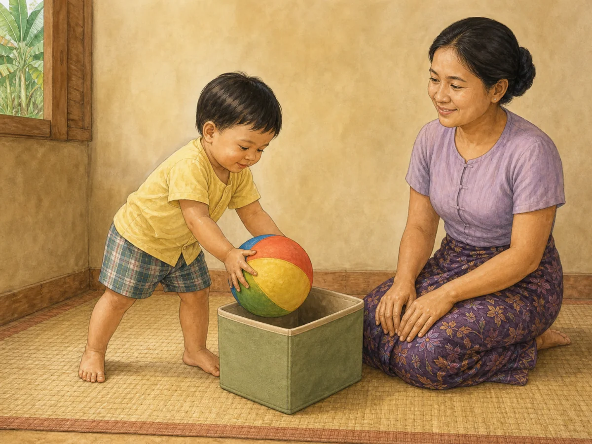
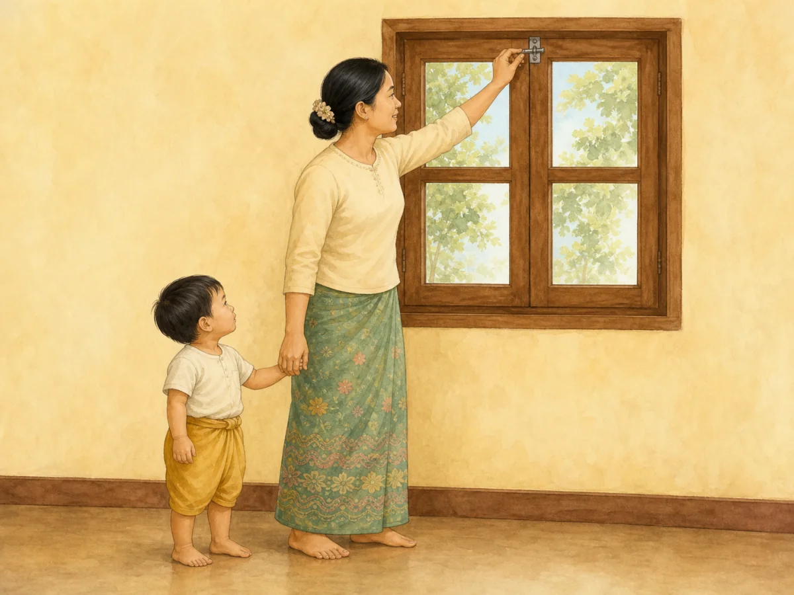
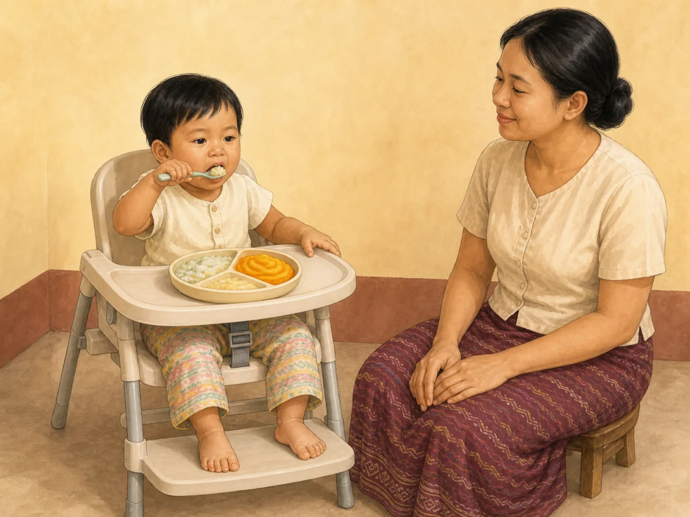
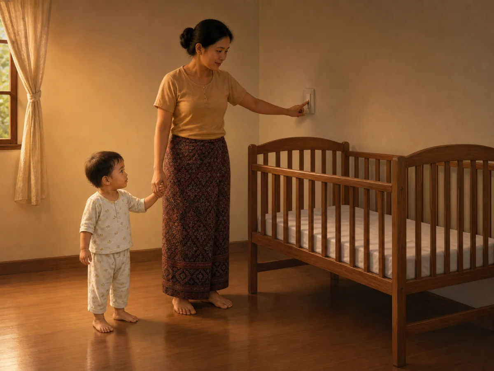

# ACE Child Grow — 19–24 Month Guide Illustration Review

Status: **5/5 READY FOR OWNER REVIEW — NOT DEPLOYED**

Source of truth: Production Convex `libraryContent`, read directly on 2026-08-10 and filtered to exact `type = guide`, `ageGroupKey = 19_24m`. Production contains exactly five matching records; all five currently have `clinicalStatus = clinical_review`. Every available record field was read. Production remained read only.

Every top-level field and every nested `data` field was inspected for all five records. Top-level fields include identifiers/timestamps, exact slug, Myanmar/English titles and summaries, age group, domain, type, source, tags, version, review revision, clinical/priority status when present, and search index. Nested fields include meaning (`why`), observation questions, daily/weekly activities, indoor/outdoor ideas, materials, safety, common mistakes, parent tips, low-cost ideas, red flags, referral, FAQ, encouragement, editorial status and evidence summary when present. No Production wording is changed by this illustration run.

## Pre-generation review table

| Slug | Myanmar title | English title | Exact behaviour | Image scene | Must not show | Safety requirements | Status |
|---|---|---|---|---|---|---|---|
| `gd_19_24m_daily_routine` | ၁၉–၂၄ လ — နေ့စဉ်လုပ်ရိုးလုပ်စဉ် လမ်းညွှန် | 19–24 months — daily routine guide | Toddler follows one short direction by putting one familiar play object into its box as one tidy-up step. | A Myanmar/Southeast Asian 19–24-month-old with clear older-toddler proportions stands in a stable wide stance and deliberately lowers one large soft ball into one low open storage box; caregiver kneels within reach, watches calmly, and keeps both hands empty. | Brushing, bathing, dressing, eating or bedtime; several routine steps; adult doing the task; multiple toys; throwing; climbing; running; written instruction, label, arrow or UI. | Clear floor-level space; one low soft-edged open box; one-piece ball much larger than the mouth; close supervision without taking over. | READY TO GENERATE |
| `gd_19_24m_safety` | ၁၉–၂၄ လ — ဘေးကင်းလုံခြုံရေး လမ်းညွှန် | 19–24 months — safety guide | Caregiver secures one high window lock before the climbing toddler can reach the window. | In a simple Myanmar home, a caregiver visibly engages a high window safety latch while the 19–24-month-old toddler stands safely on the clear floor beside and slightly behind the caregiver, looking up; caregiver remains between child and window. | Open/unsecured window; child touching, climbing toward, or standing on furniture at the window; medicine, poison, traffic, water, stove or injury montage; warning symbols; text, arrows or labels. | Window remains closed and latched; no climbable furniture beneath it; caregiver blocks access and stays within reach; dry level floor with no cord or loose object. | READY TO GENERATE |
| `gd_19_24m_nutrition` | ၁၉–၂၄ လ — အာဟာရ လမ်းညွှန် | 19–24 months — nutrition guide | Seated toddler self-feeds one spoonful from a varied, choking-safe soft meal while the caregiver supervises without pressure. | A Myanmar/Southeast Asian 19–24-month-old sits upright in a secured supportive feeding chair and independently raises one short child spoon containing soft thick rice-and-vegetable food from one shallow divided plate; two additional small portions of soft cooked food are visible while the caregiver sits within reach with empty hands. | Force-feeding; caregiver holding the spoon; feeding while walking or lying; bottle; whole grapes, nuts, popcorn, seeds, hard sweets, raw carrot, hard chunks or round choking shapes; screen; text or labels. | Upright stable posture and secure seat; constant close supervision; all food soft and age-appropriately cut; unbreakable plate and spoon; clear airway and calm responsive feeding. | READY TO GENERATE |
| `gd_19_24m_sleep` | ၁၉–၂၄ လ — အိပ်စက်ခြင်း လမ်းညွှန် | 19–24 months — sleep guide | Toddler participates in one calm, repeatable bedtime cue as the caregiver dims the room before sleep. | In warm evening light, a Myanmar/Southeast Asian 19–24-month-old in two-piece pajamas stands calmly holding the caregiver's free hand beside a closed high-railed cot while the caregiver turns one wall-mounted dimmer or simple lamp switch down; the cot is empty and the child is awake. | Screen, phone or television; play, feeding, bath, medicine, reading and singing at once; sleeping child; climbing cot rails; unguarded adult bed; pillow, loose blanket, bumper, stuffed toy, loose cloth; text or clock. | Caregiver holds the toddler's hand; switch is adult height; clear floor; cot has fixed high rails, firm flat mattress and taut fitted sheet only; no cord, medicine or loose item. | READY TO GENERATE |
| `gd_19_24m_speech` | ၁၉–၂၄ လ — စကားသံ ထွက်ဆိုမှု | 19–24 months — Speech | Toddler purposefully names a familiar picture during face-to-face shared reading while the caregiver pauses and listens. | A Myanmar/Southeast Asian 19–24-month-old sits stably on a floor mat beside a caregiver, points with one finger to one familiar animal picture in a large wordless board book, looks toward the listening caregiver, and forms a natural two-word speech mouth shape; caregiver's mouth is closed. | Caregiver speaking or prompting; speech bubble, letters, numbers or written words; screen; flash cards; child merely babbling; eating; several books or toys; unrelated pointing target. | Quiet face-to-face floor-level interaction; one sturdy large board book with no loose parts; caregiver within reach; no small object, food or choking hazard. | READY TO GENERATE |

Pre-generation confirmations:

- Every row is exact `ageGroupKey = 19_24m`, `type = guide`, `clinicalStatus = clinical_review`: **CONFIRMED**
- Each concept illustrates one observable action that is directly grounded in the Production title, summary and guide body: **CONFIRMED**
- Every child is planned as a clearly 19–24-month-old toddler with age-appropriate posture and independence: **CONFIRMED**
- Every scene is unique and maps one exact slug to one future versioned asset: **CONFIRMED**
- Feeding, movement and sleep-space safety requirements are explicit: **CONFIRMED**
- No scene depends on text, labels, arrows, logos, watermarks or UI: **CONFIRMED**

## Production record summary

| Slug | Summary (Myanmar) | Summary (English) | Domain | Status | Version / review revision |
|---|---|---|---|---|---|
| `gd_19_24m_daily_routine` | သန့်ရှင်းရေးနှင့် ပစ္စည်းသိမ်းခြင်းကို တစ်ဆင့်ချင်း အတူလုပ်ပါ။ | Include the child in one-step tidy-up and care routines. | `daily_routine` | `clinical_review` | 1 / 8 |
| `gd_19_24m_nutrition` | အစားအစာအုပ်စုစုံကို အရွယ်သင့်အပိုင်းဖြင့် ပေးပြီး ကိုယ်တိုင်စားခွင့်ပေးပါ။ | Offer varied foods in safe sizes and support self-feeding. | `nutrition` | `clinical_review` | 1 / 7 |
| `gd_19_24m_safety` | တက်တတ်၊ ဖွင့်တတ်လာသောကလေးအတွက် ပြတင်းပေါက်၊ ဆေးနှင့် သန့်ရှင်းရေးပစ္စည်းကို သော့ခတ်ပါ။ | Lock windows, medicines, and cleaning products as climbing increases. | `safety` | `clinical_review` | 1 / 6 |
| `gd_19_24m_sleep` | နေ့ခင်းအိပ်ချိန်တစ်ကြိမ်နှင့် ညအိပ်ချိန်ကို ပုံမှန်နီးပါး ထားပါ။ | Keep a broadly consistent nap and bedtime. | `sleep` | `clinical_review` | 1 / 7 |
| `gd_19_24m_speech` | ဤအရွယ်တွင် စကားလုံးအရေအတွက် လျင်မြန်စွာ တိုးလာသည် — ပတ်ဝန်းကျင်၏ စကားပြောမှုက ဤအရာကို အားဖြည့်ပေးသည်။ | Vocabulary grows fast now; everyday talk fuels it. | `speech` | `clinical_review` | 1 / 5 |

## Final illustration previews

All previews below are final wordless 4:3 WebP files created with the built-in ImageGen workflow. Each image has a unique exact-slug mapping and a new content hash. Production wording below was re-read directly from Production Convex on 2026-08-10; it was not edited.

### `gd_19_24m_daily_routine`

- Myanmar title: ၁၉–၂၄ လ — နေ့စဉ်လုပ်ရိုးလုပ်စဉ် လမ်းညွှန်
- English title: 19–24 months — daily routine guide
- Myanmar summary: သန့်ရှင်းရေးနှင့် ပစ္စည်းသိမ်းခြင်းကို တစ်ဆင့်ချင်း အတူလုပ်ပါ။
- English summary: Include the child in one-step tidy-up and care routines.
- Final scene: older toddler independently lowers one large soft ball into one low open box while the caregiver watches with empty hands.
- Asset: `/guides/gd_19_24m_daily_routine.dee4891324.webp` — 1200×900 — 151,410 bytes

QA: behaviour ✓ · age ✓ · anatomy ✓ · both hands/fingers ✓ · both complete legs/feet ✓ · stable stance ✓ · one large ball/one box ✓ · caregiver does not take over ✓ · no extra action/object ✓ · culturally appropriate ✓ · wordless ✓

Status: **READY FOR OWNER REVIEW**

### `gd_19_24m_safety`

- Myanmar title: ၁၉–၂၄ လ — ဘေးကင်းလုံခြုံရေး လမ်းညွှန်
- English title: 19–24 months — safety guide
- Myanmar summary: တက်တတ်၊ ဖွင့်တတ်လာသောကလေးအတွက် ပြတင်းပေါက်၊ ဆေးနှင့် သန့်ရှင်းရေးပစ္စည်းကို သော့ခတ်ပါ။
- English summary: Lock windows, medicines, and cleaning products as climbing increases.
- Final scene: caregiver stands between the toddler and a closed window, holds the toddler's hand, and engages the high safety latch.
- Asset: `/guides/gd_19_24m_safety.3e762eb8c3.webp` — 1200×900 — 84,820 bytes

QA: behaviour ✓ · age ✓ · anatomy ✓ · hands/fingers ✓ · both complete legs/feet ✓ · real closed-window latch ✓ · caregiver between child/window ✓ · no climbable furniture/cord ✓ · no hazard montage ✓ · culturally appropriate ✓ · wordless ✓

Status: **READY FOR OWNER REVIEW**

### `gd_19_24m_nutrition`

- Myanmar title: ၁၉–၂၄ လ — အာဟာရ လမ်းညွှန်
- English title: 19–24 months — nutrition guide
- Myanmar summary: အစားအစာအုပ်စုစုံကို အရွယ်သင့်အပိုင်းဖြင့် ပေးပြီး ကိုယ်တိုင်စားခွင့်ပေးပါ။
- English summary: Offer varied foods in safe sizes and support self-feeding.
- Final scene: securely seated older toddler independently raises one spoonful from one divided plate containing three visibly smooth, spoon-soft foods while the caregiver supervises with empty hands.
- Asset: `/guides/gd_19_24m_nutrition.caafec249d.webp` — 1200×900 — 105,732 bytes

QA: behaviour ✓ · age ✓ · anatomy ✓ · hands/fingers ✓ · both feet on footrest ✓ · upright secured posture ✓ · smooth choking-safe food texture ✓ · one divided plate/one spoon ✓ · caregiver supervision ✓ · no pressure ✓ · culturally appropriate ✓ · wordless ✓

Status: **READY FOR OWNER REVIEW**

### `gd_19_24m_sleep`

- Myanmar title: ၁၉–၂၄ လ — အိပ်စက်ခြင်း လမ်းညွှန်
- English title: 19–24 months — sleep guide
- Myanmar summary: နေ့ခင်းအိပ်ချိန်တစ်ကြိမ်နှင့် ညအိပ်ချိန်ကို ပုံမှန်နီးပါး ထားပါ။
- English summary: Keep a broadly consistent nap and bedtime.
- Final scene: awake older toddler in two-piece pajamas holds the caregiver's hand while the caregiver dims one wall switch beside a completely empty high-railed cot.
- Asset: `/guides/gd_19_24m_sleep.106f76d450.webp` — 1200×900 — 64,002 bytes

QA: behaviour ✓ · age ✓ · anatomy ✓ · hands/fingers ✓ · both complete legs/feet ✓ · calm single bedtime cue ✓ · empty high-railed firm-flat cot ✓ · no medicine/screen/pillow/blanket/toy/loose cot item ✓ · culturally appropriate ✓ · wordless ✓

Status: **READY FOR OWNER REVIEW**

### `gd_19_24m_speech`

- Myanmar title: ၁၉–၂၄ လ — စကားသံ ထွက်ဆိုမှု
- English title: 19–24 months — Speech
- Myanmar summary: ဤအရွယ်တွင် စကားလုံးအရေအတွက် လျင်မြန်စွာ တိုးလာသည် — ပတ်ဝန်းကျင်၏ စကားပြောမှုက ဤအရာကို အားဖြည့်ပေးသည်။
- English summary: Vocabulary grows fast now; everyday talk fuels it.
- Final scene: toddler points to one elephant picture in one wordless board book, looks toward the caregiver, and purposefully speaks while the caregiver listens with a closed mouth.
- Asset: `/guides/gd_19_24m_speech.00e0c08e9d.webp` — 1200×900 — 115,112 bytes

QA: behaviour ✓ · age ✓ · anatomy ✓ · pointing hand/fingers ✓ · other hand visible ✓ · both complete legs/feet ✓ · child is the only speaker ✓ · caregiver mouth closed ✓ · one picture/one book ✓ · no text/speech bubble/screen ✓ · culturally appropriate ✓ · wordless ✓

Status: **READY FOR OWNER REVIEW**

## Rejected generation audit

Rejected candidates were not saved or mapped as final assets:

- `gd_19_24m_daily_routine`: rejected the first candidate because the box hid one complete child foot; regenerated with both legs, ankles, feet and toes unobstructed.
- `gd_19_24m_nutrition`: rejected the first candidate because visible round/diced food pieces did not make choking-safe softness clinically clear and the background contained unrelated furniture/plants; regenerated with only three visibly mashed foods on a plain background.

## Mapping and asset verification

- Exact slug-to-file mappings: **5/5**
- Unique asset paths: **5/5**
- Domain/category/age fallback: **NONE**
- Format and dimensions: **WebP, 1200 × 900 (4:3), 5/5**
- File sizes: **64,002–151,410 bytes; all below 500 KB**
- Content hash in filename matches SHA-256 prefix: **5/5**
- Production deployment: **NOT PERFORMED**

## Application and engineering verification

- Exact `ContentDetail` Myanmar/English title + exact-slug asset rendering: **73/73 component cases passed, including all five 19–24 month guides**
- Focused mapping and component tests: **82/82 passed**
- Playwright asset/card verification: **PASS — 5/5 WebPs returned 200 `image/webp`, natural size 1200 × 900**
- Desktop text + image screenshots: **5/5 captured** under `docs/illustration-review/screenshots/guides-19_24m/`
- Mobile 390 px layout: **5/5 passed with no horizontal overflow**
- Playwright console/page errors: **NONE**
- Full unit suite: **1,233/1,233 passed across 121 files**
- Typecheck: **PASS**
- ESLint: **PASS**
- Production build: **PASS**
- PWA generation: **PASS — 316 precache entries accepted**
- Existing unrelated React test `act(...)` warnings and package deprecation/audit notices were observed; there were **zero guide/asset warnings, missing imports or missing files**.

## Desktop owner-review screenshots

| Slug | Text + image card |
|---|---|
| `gd_19_24m_daily_routine` | [review card](screenshots/guides-19_24m/gd_19_24m_daily_routine-desktop.jpg) |
| `gd_19_24m_nutrition` | [review card](screenshots/guides-19_24m/gd_19_24m_nutrition-desktop.jpg) |
| `gd_19_24m_safety` | [review card](screenshots/guides-19_24m/gd_19_24m_safety-desktop.jpg) |
| `gd_19_24m_sleep` | [review card](screenshots/guides-19_24m/gd_19_24m_sleep-desktop.jpg) |
| `gd_19_24m_speech` | [review card](screenshots/guides-19_24m/gd_19_24m_speech-desktop.jpg) |

## Deployment gate

This complete five-guide review is ready for explicit owner approval. No commit, push, pull request, Production deployment, Production Convex write or clinical-text change has been performed in this run.
