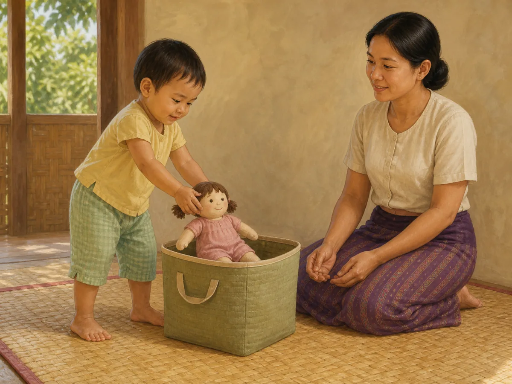
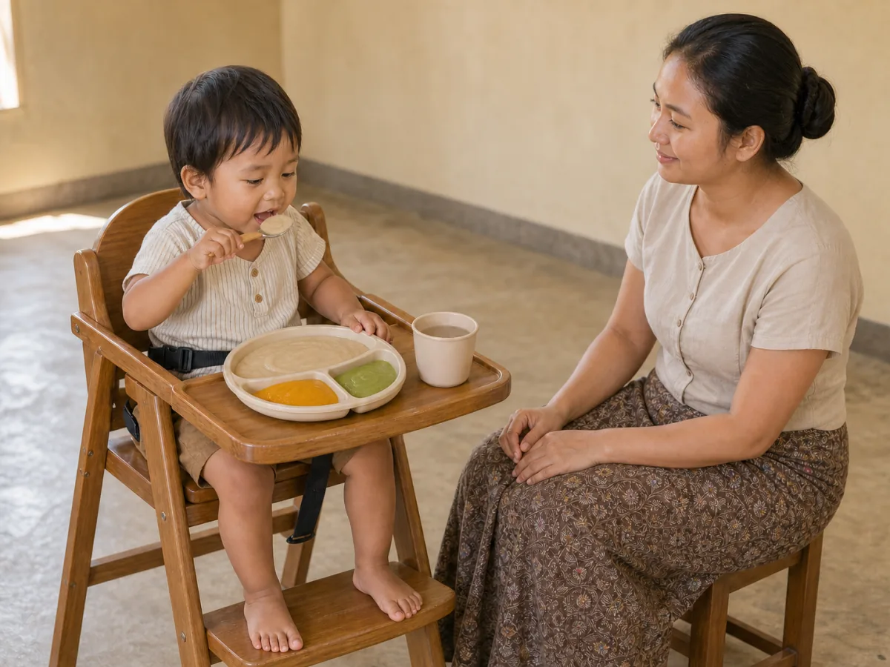
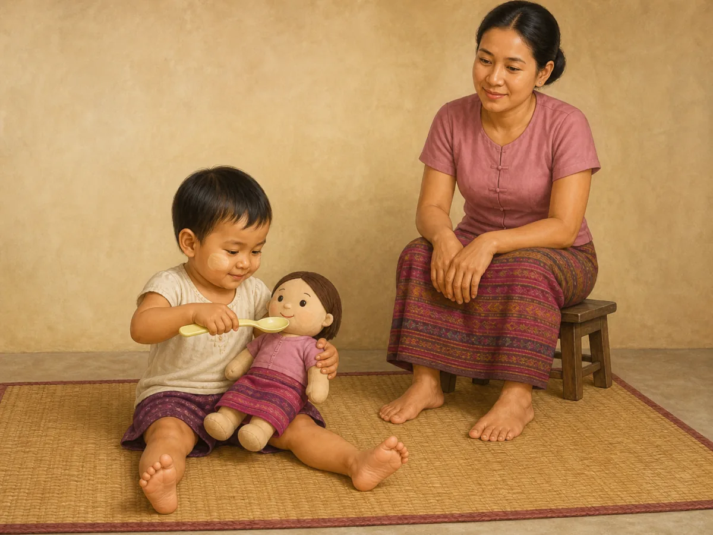
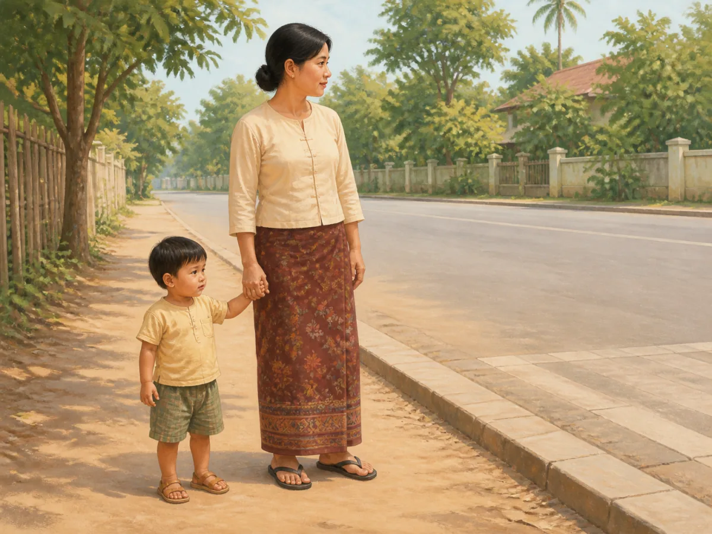
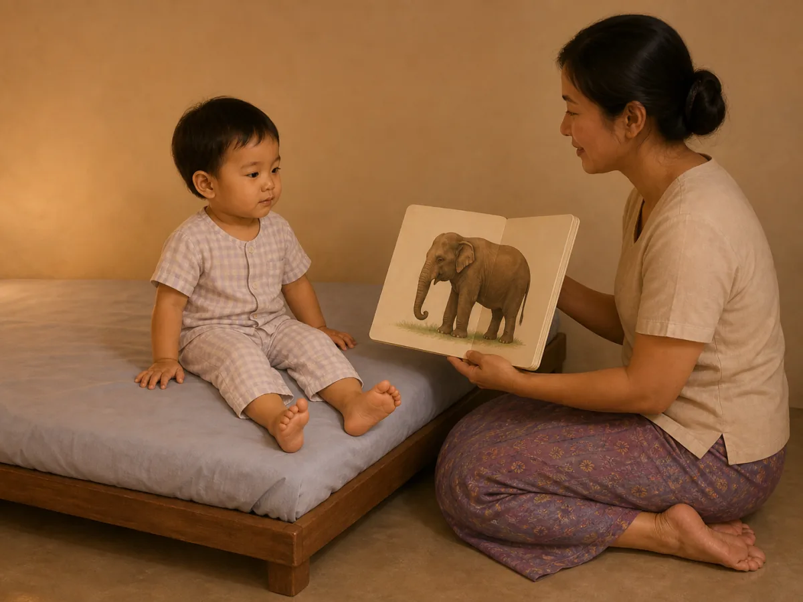

# ACE Child Grow — 2-Year Guide Illustration Review

Status: **6/6 OWNER APPROVED — PRODUCTION DEPLOYMENT AUTHORIZED**

Source of truth: Production Convex `libraryContent`, re-read directly on 2026-08-12 and filtered to exact `type = guide`, `ageGroupKey = 2y`. Production contains exactly six matching records; all six currently have `clinicalStatus = clinical_review`. Production remained read only.

Every top-level field and every nested `data` field was inspected for all six records. Top-level fields include identifiers/timestamps, exact slug, Myanmar/English titles and summaries, age group, domain, type, source, tags, version, review revision, clinical/priority status when present, and the derived search index. Nested fields include meaning (`why`), observation questions, daily/weekly activities, indoor/outdoor ideas, materials, safety, common mistakes, parent tips, low-cost ideas, red flags, referral, FAQ, encouragement, editorial status and evidence summary when present. No Production wording is changed by this illustration run.

## Pre-generation review table

| Slug | Myanmar title | English title | Exact behaviour | Image scene | Must not show | Safety requirements | Status |
|---|---|---|---|---|---|---|---|
| `gd_2y_daily_routine` | ၂ နှစ် — နေ့စဉ် လုပ်ရိုးလုပ်စဉ် | 2 years — Daily Routine | Two-year-old independently completes one familiar after-play clean-up step as part of a predictable routine. | A clearly two-year-old Myanmar/Southeast Asian toddler places one large cloth doll into one low open storage basket while a caregiver kneels within reach and calmly watches with empty hands; the toddler's full body, both hands and both feet are visible. | Bathing, brushing, eating or bedtime; a multi-step montage; adult doing the task; several scattered toys; written schedule, clock, text, arrows, labels or UI. | Clear floor-level area; low soft-edged basket; one large one-piece toy with no detachable small parts; caregiver supervises without taking over. | READY FOR OWNER REVIEW |
| `gd_2y_language` | ၂ နှစ် — ဘာသာစကား နားလည်မှု | 2 years — Language | Two-year-old follows one simple spoken direction by bringing one shoe to the caregiver. | In a plain Myanmar home entry area, a caregiver crouches with one open empty hand and a calm speaking expression while the two-year-old walks the final step toward them and offers one child shoe with both hands; the child's face, full body and both feet are visible. | Picture book, pointing task, singing, screen, flash card, several shoes, dressing the child, caregiver taking or pulling the child, speech bubble, text, label or arrow. | Dry uncluttered floor; one clean soft child shoe with no loose parts; caregiver within reach; stable age-appropriate walking posture. | READY FOR OWNER REVIEW |
| `gd_2y_nutrition` | ၂ နှစ် — အာဟာရ လမ်းညွှန် | 2 years — nutrition guide | Seated two-year-old independently chooses and eats one spoonful from a varied choking-safe meal while the caregiver supervises without pressure. | A two-year-old sits upright in a secured child chair with both feet supported and uses one short spoon to lift soft thick rice-and-lentil food from a divided unbreakable plate; two other portions are visibly mashed or finely shredded, a small open cup contains water, and the caregiver sits within reach with empty hands. | Force-feeding; adult holding the spoon; sugary drink; bottle; eating while walking or lying down; whole grapes, nuts, popcorn, seeds, hard sweets, raw carrot, round chunks or other choking shapes; screen, text or labels. | Upright stable seat and supported feet; constant close supervision; all food soft and age-appropriately prepared; unbreakable plate, spoon and cup; clear airway and calm responsive feeding. | READY FOR OWNER REVIEW |
| `gd_2y_play` | ၂ နှစ် — ကစားခြင်း လမ်းညွှန် | 2 years — play guide | Two-year-old leads one simple pretend-play action while the caregiver watches and follows the child's interest. | On a clear floor mat, a clearly two-year-old Myanmar/Southeast Asian toddler uses one large toy spoon to pretend-feed one large cloth doll; a caregiver sits nearby at the child's level, watches warmly with both hands relaxed and does not direct the play; full child body, both hands and both feet are visible. | Blocks, picture book or outdoor activity in the same scene; adult leading or correcting; several toys; tiny detachable parts; real food; screen; child younger than toddler; text, arrow or label. | One sturdy large cloth doll and one oversized one-piece toy spoon; no small parts, strings, food or choking items; caregiver within reach; clear floor-level play area. | READY FOR OWNER REVIEW |
| `gd_2y_safety` | ၂ နှစ် — ဘေးကင်းလုံခြုံရေး လမ်းညွှန် | 2 years — safety guide | Two-year-old holds an adult's hand outdoors near a road boundary. | A caregiver and two-year-old stand together on a wide dry footpath before a curb, holding hands securely; the caregiver is positioned between the child and the roadway, both look toward the safe crossing direction, and the child's full body, both hands and both feet are visible. | Child running, pulling away or standing in the road; moving vehicle close to the child; water, stove, burn, medicine, window, cord or injury montage; traffic sign text, warning symbol, arrow, label or UI. | Firm adult handhold; caregiver between child and road; both remain on the footpath; clear curb and crosswalk context; no active traffic or immediate hazard. | READY FOR OWNER REVIEW |
| `gd_2y_sleep` | ၂ နှစ် — အိပ်စက်ခြင်း လမ်းညွှန် | 2 years — sleep guide | Two-year-old participates in one calm, repeatable pre-bed cue through shared book reading. | In dim warm evening light, a two-year-old in two-piece pajamas sits upright on a low toddler bed while the caregiver sits beside the bed and reads one large wordless board book; the child's full body, both hands and both feet are visible and the child is awake and calm. | Screen, phone, television, medicine, food, bath or toothbrushing; several bedtime steps at once; infant cot; child climbing or jumping; diagnosis; text, clock, arrow, label or UI. | Low stable toddler bed; dry clear floor; caregiver within reach; one sturdy board book with no loose parts; no medicine, cord or fall hazard. | READY FOR OWNER REVIEW |

Pre-generation confirmations:

- Every row is exact `ageGroupKey = 2y`, `type = guide`, `clinicalStatus = clinical_review`: **CONFIRMED**
- Each concept illustrates one observable action directly grounded in the Production title, summary and guide body: **CONFIRMED**
- Every child is planned as a clearly two-year-old toddler with age-appropriate body proportions, posture and independence: **CONFIRMED**
- Every scene is unique and maps one exact slug to one future content-hashed asset: **CONFIRMED**
- Feeding, movement, play and sleep-space safety requirements are explicit: **CONFIRMED**
- No scene depends on text, labels, arrows, logos, watermarks or UI: **CONFIRMED**

## Production record summary

| Slug | Summary (Myanmar) | Summary (English) | Domain | Status | Version / review revision |
|---|---|---|---|---|---|
| `gd_2y_daily_routine` | ပုံမှန် လုပ်ရိုးလုပ်စဉ်သည် ကလေးကို လုံခြုံစိတ်ချစေ၍ အပြုအမူကို ပိုမိုကောင်းစေသည်။ | Predictable routines help children feel secure and behave better. | `daily_routine` | `clinical_review` | 1 / 5 |
| `gd_2y_language` | နားလည်မှုသည် စကားပြောခြင်းထက် ရှေ့ကရောက်တတ်သည် — ညွှန်ကြားချက် လိုက်နာနိုင်မှုက ဤအရာကို ပြသည်။ | Understanding often runs ahead of speaking; following directions shows it. | `language` | `clinical_review` | 1 / 5 |
| `gd_2y_nutrition` | ပုံမှန်စားချိန်ထားပြီး အုပ်စုစုံပေးကာ မည်မျှစားမည်ကို ကလေးဆုံးဖြတ်ခွင့်ပေးပါ။ | Keep regular meals, offer variety, and let the child decide how much to eat. | `nutrition` | `clinical_review` | 1 / 8 |
| `gd_2y_play` | အတုယူကစားခြင်း၊ ကစားတုံးနှင့် ပုံစာအုပ်ကို နေ့စဉ် အလှည့်ကျကစားပါ။ | Rotate pretend play, blocks, and picture books each day. | `play` | `clinical_review` | 1 / 6 |
| `gd_2y_safety` | ပြေးတတ်လာသောကလေးအတွက် လမ်းမ၊ ရေကန်နှင့် မီးဖိုအန္တရာယ်ကို ကြိုကာကွယ်ပါ။ | Plan ahead for traffic, water, and burn hazards as running begins. | `safety` | `clinical_review` | 1 / 6 |
| `gd_2y_sleep` | ညအိပ်ချိန်မတိုင်မီ တူညီသော အဆင့်တိုများ အသုံးပြုပါ။ | Use the same short sequence before bed. | `sleep` | `clinical_review` | 1 / 9 |

## Final illustration previews

All previews below are final wordless 4:3 WebP files created one slug at a time with the built-in ImageGen workflow. Each image has a unique exact-slug mapping and a new content hash. Production wording below was re-read directly from Production Convex on 2026-08-12 and was not edited.

### `gd_2y_daily_routine`

- Myanmar title: ၂ နှစ် — နေ့စဉ် လုပ်ရိုးလုပ်စဉ်
- English title: 2 years — Daily Routine
- Myanmar summary: ပုံမှန် လုပ်ရိုးလုပ်စဉ်သည် ကလေးကို လုံခြုံစိတ်ချစေ၍ အပြုအမူကို ပိုမိုကောင်းစေသည်။
- English summary: Predictable routines help children feel secure and behave better.
- Final scene: two-year-old independently lowers one large cloth doll into one low basket while the caregiver supervises with empty hands.
- Asset: `/guides/gd_2y_daily_routine.d4f5f46241.webp` — 1200×900 — 101,576 bytes

QA: behaviour ✓ · age ✓ · anatomy ✓ · both hands/fingers ✓ · both complete legs/feet ✓ · stable posture ✓ · one safe doll/one basket ✓ · caregiver does not take over ✓ · no unrelated action/object ✓ · culturally appropriate ✓ · wordless ✓

Status: **OWNER APPROVED**

### `gd_2y_language`

- Myanmar title: ၂ နှစ် — ဘာသာစကား နားလည်မှု
- English title: 2 years — Language
- Myanmar summary: နားလည်မှုသည် စကားပြောခြင်းထက် ရှေ့ကရောက်တတ်သည် — ညွှန်ကြားချက် လိုက်နာနိုင်မှုက ဤအရာကို ပြသည်။
- English summary: Understanding often runs ahead of speaking; following directions shows it.
- Final scene: two-year-old brings exactly one child shoe with both hands to a crouching caregiver after one simple spoken request.
- Asset: `/guides/gd_2y_language.81dbfe69c9.webp` — 1200×900 — 51,484 bytes

QA: behaviour ✓ · age ✓ · anatomy ✓ · both hands/fingers ✓ · both complete legs/feet ✓ · walking posture ✓ · one shoe only ✓ · face/gaze/expression ✓ · uncluttered safe floor ✓ · no screen/book/text ✓ · culturally appropriate ✓ · wordless ✓

Status: **OWNER APPROVED**

### `gd_2y_nutrition`

- Myanmar title: ၂ နှစ် — အာဟာရ လမ်းညွှန်
- English title: 2 years — nutrition guide
- Myanmar summary: ပုံမှန်စားချိန်ထားပြီး အုပ်စုစုံပေးကာ မည်မျှစားမည်ကို ကလေးဆုံးဖြတ်ခွင့်ပေးပါ။
- English summary: Keep regular meals, offer variety, and let the child decide how much to eat.
- Final scene: securely seated two-year-old independently raises one spoonful from a divided plate containing three smooth thick foods while the caregiver supervises with empty hands.
- Asset: `/guides/gd_2y_nutrition.9ee40be9a7.webp` — 1200×900 — 98,862 bytes

QA: behaviour ✓ · age ✓ · anatomy ✓ · hands/fingers ✓ · both feet supported ✓ · upright secured posture ✓ · smooth choking-safe food texture ✓ · water cup ✓ · caregiver supervision/no pressure ✓ · no sugary drink/bottle/screen ✓ · culturally appropriate ✓ · wordless ✓

Status: **OWNER APPROVED**

### `gd_2y_play`

- Myanmar title: ၂ နှစ် — ကစားခြင်း လမ်းညွှန်
- English title: 2 years — play guide
- Myanmar summary: အတုယူကစားခြင်း၊ ကစားတုံးနှင့် ပုံစာအုပ်ကို နေ့စဉ် အလှည့်ကျကစားပါ။
- English summary: Rotate pretend play, blocks, and picture books each day.
- Final scene: two-year-old leads one pretend-feeding action using one oversized toy spoon and one safe large cloth doll while the caregiver watches without directing.
- Asset: `/guides/gd_2y_play.79ad541bd1.webp` — 1200×900 — 102,442 bytes

QA: behaviour ✓ · age ✓ · anatomy ✓ · both child hands/fingers ✓ · both complete legs/feet ✓ · child-led play ✓ · integrated fabric doll hair/no small parts ✓ · no real food/extra toys ✓ · caregiver hands relaxed ✓ · culturally appropriate ✓ · wordless ✓

Status: **OWNER APPROVED**

### `gd_2y_safety`

- Myanmar title: ၂ နှစ် — ဘေးကင်းလုံခြုံရေး လမ်းညွှန်
- English title: 2 years — safety guide
- Myanmar summary: ပြေးတတ်လာသောကလေးအတွက် လမ်းမ၊ ရေကန်နှင့် မီးဖိုအန္တရာယ်ကို ကြိုကာကွယ်ပါ။
- English summary: Plan ahead for traffic, water, and burn hazards as running begins.
- Final scene: toddler and caregiver remain on the footpath before the curb, holding hands, with the caregiver positioned between the child and empty road.
- Asset: `/guides/gd_2y_safety.91fe18f7fc.webp` — 1200×900 — 115,042 bytes

QA: behaviour ✓ · age ✓ · anatomy ✓ · natural held hands ✓ · free child hand visible ✓ · both complete legs/feet ✓ · caregiver road-side position ✓ · both remain off roadway ✓ · no vehicle/sign/hazard montage ✓ · culturally appropriate ✓ · wordless ✓

Status: **OWNER APPROVED**

### `gd_2y_sleep`

- Myanmar title: ၂ နှစ် — အိပ်စက်ခြင်း လမ်းညွှန်
- English title: 2 years — sleep guide
- Myanmar summary: ညအိပ်ချိန်မတိုင်မီ တူညီသော အဆင့်တိုများ အသုံးပြုပါ။
- English summary: Use the same short sequence before bed.
- Final scene: awake two-year-old in pajamas sits on a low toddler bed while the caregiver shares one large wordless elephant board book in dim evening light.
- Asset: `/guides/gd_2y_sleep.873a520e2c.webp` — 1200×900 — 59,330 bytes

QA: behaviour ✓ · age ✓ · anatomy ✓ · both child hands/fingers ✓ · both complete legs/feet ✓ · one calm bedtime cue ✓ · low stable toddler bed ✓ · one sturdy wordless book ✓ · no screen/medicine/food/extra step ✓ · culturally appropriate ✓ · wordless ✓

Status: **OWNER APPROVED**

## Rejected generation audit

Rejected candidates were not saved or mapped as final assets:

- `gd_2y_language`: rejected the first candidate because unrelated hanging décor and furniture remained in the background; regenerated with a plain wall and clear floor while preserving the correct shoe action and anatomy.
- `gd_2y_nutrition`: rejected the first candidate because visible food grains/pieces did not make choking-safe softness clinically clear; regenerated with three fully smooth thick foods and no chunks or round shapes.
- `gd_2y_play`: rejected the first candidate because the child's second hand was hidden behind the doll and the doll had loose yarn hair; rejected a later mapped candidate during release QA because one child foot was cropped at the image edge; rejected the next targeted candidate because one caregiver foot remained hidden. The final targeted regeneration shows complete hands and feet for both people, integrated stitched fabric hair, and no detachable parts.

## Generation method and prompt set

Built-in ImageGen was used for every final asset. The final prompt set is the six exact scene specifications in the pre-generation table, with repeated invariants for: a clearly two-year-old Myanmar/Southeast Asian child, full body and both hands/feet visible, one observable action only, safe feeding/play/road/sleep context, warm ACE Child Grow painterly educational style, landscape 4:3, wordless output, and no text, labels, arrows, logos, watermarks, UI, extra objects or unrelated actions.

## Mapping and asset verification

- Exact slug-to-file mappings: **6/6**
- Unique asset paths: **6/6**
- Domain/category/age fallback: **NONE**
- Format and dimensions: **WebP, 1200 × 900 (4:3), 6/6**
- File sizes: **51,484–115,042 bytes; all below 500 KB**
- Content hash in filename matches SHA-256 prefix: **6/6**
- Production deployment: **NOT PERFORMED**

## Application and engineering verification

- Exact `ContentDetail` Myanmar/English title + exact-slug asset rendering: **83/83 component cases passed, including all six 2-year guides**
- Focused mapping and component tests: **94/94 passed**
- Playwright asset/card verification: **PASS — 6/6 WebPs returned 200 `image/webp`, natural size 1200 × 900**
- Desktop text + image screenshots: **6/6 captured** under `docs/illustration-review/screenshots/guides-2y/`
- Mobile 390 px layout: **6/6 passed with no horizontal overflow**
- Playwright console/page errors: **NONE**
- Full unit suite: **1,310/1,310 passed across 131 files**
- Typecheck: **PASS**
- ESLint: **PASS**
- Production build: **PASS**
- PWA generation: **PASS — 326 precache entries accepted**
- Existing unrelated React test `act(...)`, package deprecation/audit and Playwright `NO_COLOR/FORCE_COLOR` warnings were observed; there were **zero guide/asset warnings, missing imports or missing files**.

## Desktop owner-review screenshots

| Slug | Text + image card |
|---|---|
| `gd_2y_daily_routine` | [review card](screenshots/guides-2y/gd_2y_daily_routine-desktop.jpg) |
| `gd_2y_language` | [review card](screenshots/guides-2y/gd_2y_language-desktop.jpg) |
| `gd_2y_nutrition` | [review card](screenshots/guides-2y/gd_2y_nutrition-desktop.jpg) |
| `gd_2y_play` | [review card](screenshots/guides-2y/gd_2y_play-desktop.jpg) |
| `gd_2y_safety` | [review card](screenshots/guides-2y/gd_2y_safety-desktop.jpg) |
| `gd_2y_sleep` | [review card](screenshots/guides-2y/gd_2y_sleep-desktop.jpg) |

## Deployment gate

All six illustrations are owner-approved. Release QA rejected the previous `gd_2y_play` candidate because one child foot was cropped; the corrected asset was regenerated, re-verified, and explicitly approved by the owner on 2026-08-12. Push, merge, and Production deployment are authorized for this exact six-item package. Production Convex content remains read only and no clinical text is changed.
