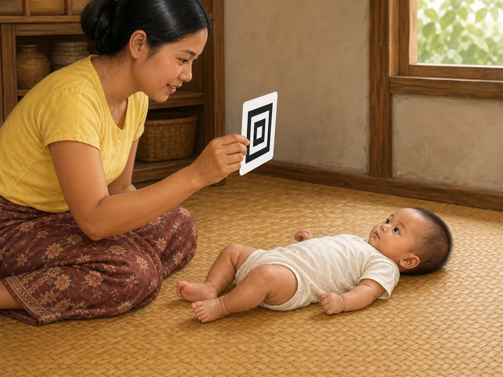
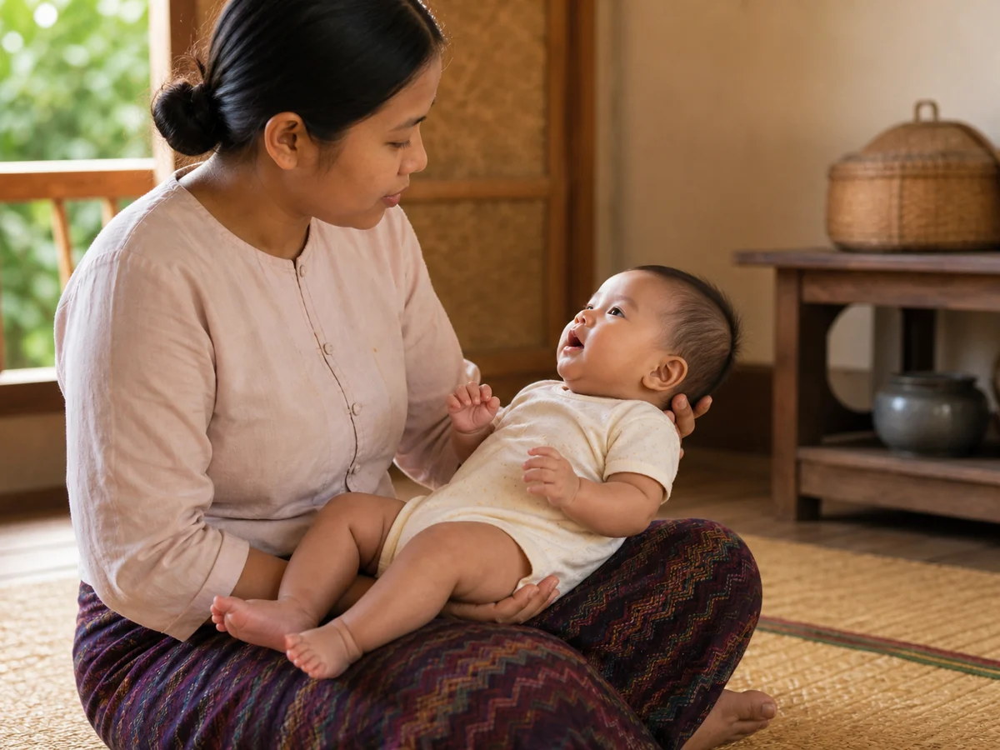
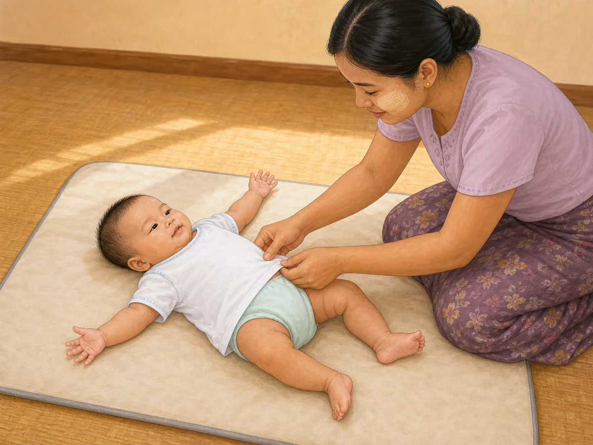
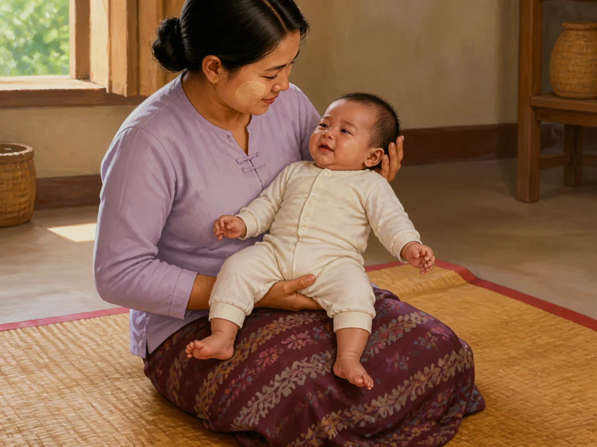
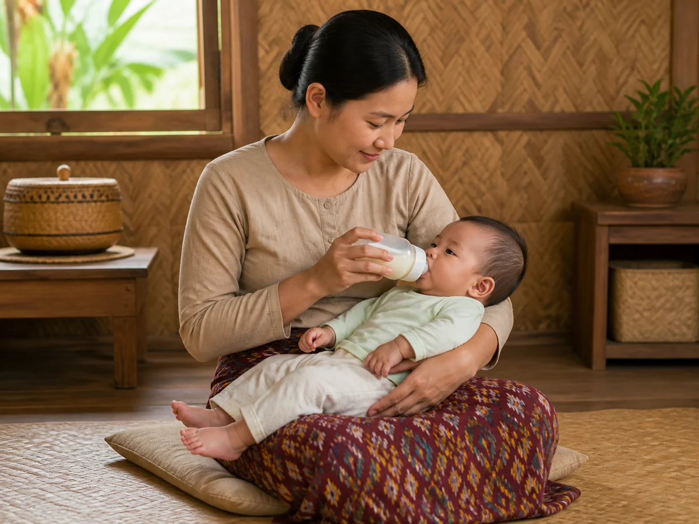
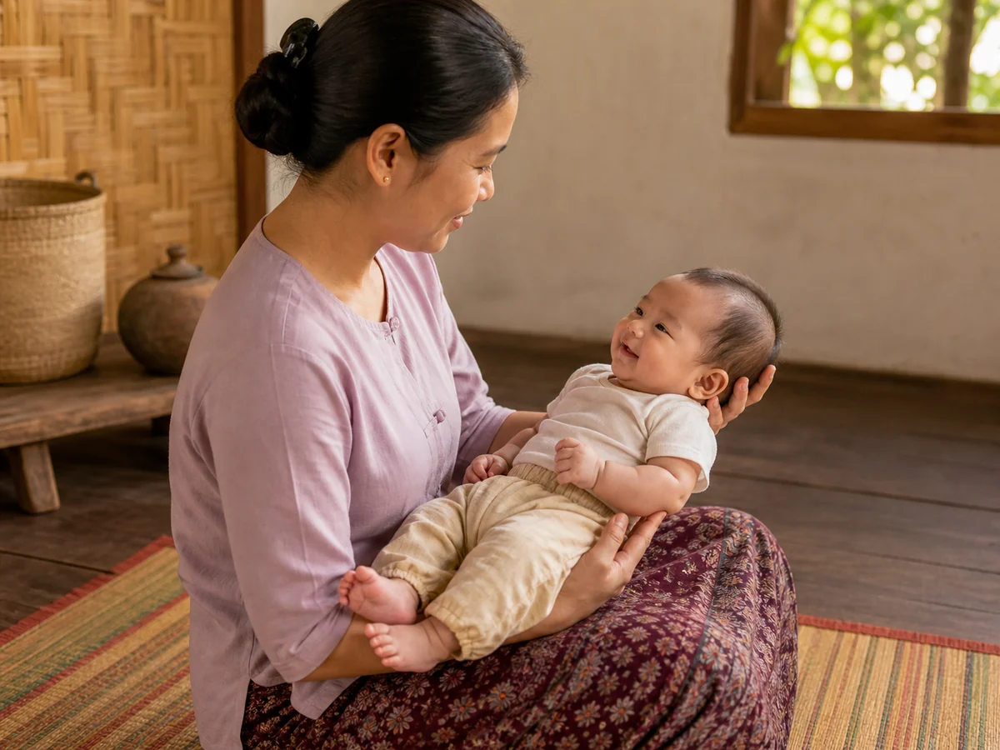

# ACE Child Grow — 3–4 Month Guide Illustration Review

Status: **11/11 OWNER APPROVED — PRODUCTION DEPLOYMENT AUTHORIZED**

Source of truth: Production Convex `libraryContent`, read directly on 2026-08-09 and filtered to exact `type = guide`, `ageGroupKey = 3_4m`. Production contains exactly 11 matching records, all currently `clinicalStatus = clinical_review`. The owner previously removed the former `published only` illustration-eligibility restriction. Production remains read only: this run does not change clinical status, text, translations, evidence, review metadata, or any Production record.

Every top-level field and every nested `data` field was inspected for all 11 records, including title, summary, age, domain, source, tags, version, timestamps, review revision/status, priority status when present, search index, observations, activities, common mistakes, materials, safety, red flags, referral guidance, FAQs, evidence summaries, encouragement, parent tips, weekly activities, indoor/outdoor ideas, low-cost ideas, and meaning (`why`).

## Pre-generation review table

| Slug | Myanmar title | English title | Exact behaviour / meaning | Image scene | Must not show | Safety constraints | Status |
|---|---|---|---|---|---|---|---|
| `gd_3_4m_cognitive` | ၃ – ၄ လ — အသိဉာဏ် ဖွံ့ဖြိုးမှု လမ်းညွှန် | 3–4 months — Thinking and learning guide | The baby follows one slowly moving object with the eyes as visual tracking and focused attention develop. | A Myanmar/Southeast Asian 3–4-month-old lies safely on the back on a firm floor mat, eyes clearly following one large wordless black-and-white pattern card moved slowly sideways by a seated caregiver. | Reaching or grasping; several objects; rattle; mirror; book; screen; sitting; rolling; feeding; sleeping; letters, numbers, text or arrows. | Floor-level firm mat; caregiver within reach; one large card only with no choking-size or detachable part. | READY |
| `gd_3_4m_communication` | ၃ – ၄ လ — ဆက်သွယ်ပြောဆိုမှု လမ်းညွှန် | 3–4 months — Communication guide | The baby makes a soft coo; the caregiver pauses, listens, and takes a conversational turn. | An awake Myanmar/Southeast Asian 3–4-month-old lies fully supported on the caregiver's lap, makes a small natural cooing mouth shape and looks toward the caregiver, who waits attentively face-to-face. | Social-smile-only scene; loud sound; speech bubble; singing; clapping; rattle; phone/TV; feeding; crying; text or sound symbols. | Head, neck and whole body supported; airway clear; calm voice environment with no loud-noise source. | READY |
| `gd_3_4m_daily_routine` | ၃ – ၄ လ — နေ့စဉ် လုပ်ရိုးလုပ်စဉ် လမ်းညွှန် | 3–4 months — Daily routine guide | A calm, repeated daily-care sequence helps the baby predict what comes next; no rigid clock schedule is required. | In soft morning daylight, a Myanmar/Southeast Asian caregiver calmly dresses an awake 3–4-month-old lying on the back on a floor-level changing mat, with one hand securely beside the baby's torso. | Clock, calendar or timetable; feed/play/sleep montage; bath; elevated table; toy; screen; crying; sleeping; text or labels. | Floor-level surface; caregiver stays within reach; baby awake on the back; no powder cloud, plastic, cord or loose item near the face. | READY |
| `gd_3_4m_emotional` | ၃ – ၄ လ — စိတ်ခံစားမှု လမ်းညွှန် | 3–4 months — Emotions guide | A responsive caregiver's secure hold and calm voice help a mildly upset baby settle. | A seated Myanmar/Southeast Asian caregiver securely holds a mildly upset 3–4-month-old against the chest; the baby's body relaxes and expression visibly begins to settle. | Severe distress; ignored crying; shaking; punishment; feeding; sleep; toy; screen; emergency signs; text or labels. | Secure head, neck, back and lower-body support; clear face and airway; caregiver seated calmly at floor level. | READY |
| `gd_3_4m_fine_motor` | ၃ – ၄ လ — လက်ချောင်းငယ် လှုပ်ရှားမှု လမ်းညွှန် | 3–4 months — Hands and reaching guide | The baby's hands open and meet naturally at the middle of the chest while the baby studies them. | A Myanmar/Southeast Asian 3–4-month-old lies safely on the back, looks directly at both naturally open hands meeting at midline above the chest, with a caregiver seated nearby. | Toy, rattle, spoon or cloth in either hand; pincer grasp; clapping; caregiver forcing the hands; reaching; mouthing; sitting; text or labels. | Firm floor-level mat; both hands fully visible with natural fingers; no small object, cord or plastic. | READY |
| `gd_3_4m_gross_motor` | ၃ – ၄ လ — ကိုယ်လုံးလှုပ်ရှားမှု လမ်းညွှန် | 3–4 months — Big movement guide | During supervised tummy time the baby pushes on both forearms and lifts the head and upper chest. | An awake Myanmar/Southeast Asian 3–4-month-old performs tummy time on a firm clean floor mat, symmetrically propped on both forearms with a modest head-and-chest lift while a caregiver stays at eye level. | Rolling; unsupported sitting; crawling; standing; high push-up; pillow; folded chest support; toy reaching; sleeping prone; text or labels. | Awake and continuously supervised; floor-level firm flat mat; nose and mouth clear; caregiver within arm's reach. | READY |
| `gd_3_4m_nutrition` | ၃ – ၄ လ — အာဟာရ လမ်းညွှန် | 3–4 months — Feeding guide | Milk alone is enough; a caregiver feeds responsively while supporting the baby's head, neck and body. | A fully clothed Myanmar/Southeast Asian caregiver sits upright and bottle-feeds a 3–4-month-old in a semi-upright cradle hold, holding the bottle and supporting the baby's aligned head, neck and body. | Baby holding the bottle; propped bottle; water; rice porridge; honey; cow's milk; spoon; solids; high chair; feeding clock; hot drink; text or labels. | Caregiver remains awake and attentive; semi-upright posture; clear airway; bottle held by adult; no loose feeding object. | READY |
| `gd_3_4m_play` | ၃ – ၄ လ — ကစားခြင်း လမ်းညွှန် | 3–4 months — Play guide | Play is brief responsive looking, listening and shared attention; the caregiver follows the baby's interest. | On a clean floor mat, a Myanmar/Southeast Asian caregiver holds one longyi cloth below the caregiver's face for a gentle peek-a-boo reveal while the 3–4-month-old lies on the back, watches and shows delighted attention. | Cloth over the baby's face; several toys; reaching/grasping; screen; mirror; rough movement; sitting; crawling; feeding; text or labels. | Floor-level supervised play; cloth remains in caregiver's hands and away from baby's face; stop at tired or gaze-away cues. | READY |
| `gd_3_4m_safety` | ၃ – ၄ လ — ဘေးကင်းလုံခြုံရေး လမ်းညွှန် | 3–4 months — Safety guide | Because a 3–4-month-old may begin to twist or roll, changing must stay at floor level with a caregiver's hand continuously on the baby. | A fully clothed Myanmar/Southeast Asian 3–4-month-old lies on the back on a clean floor-level changing mat while a caregiver keeps one open palm securely on the baby's torso and uses the other hand to fasten the waistband of a clean diaper. | Elevated bed/table/sofa; unattended baby; rolling action; nudity; small object; water; hot drink; car seat; toy; hazard demonstration; text or labels. | Floor-level mat; caregiver in direct contact throughout; baby's face and airway clear; no plastic, powder, cord or choking item. | READY |
| `gd_3_4m_sleep` | ၃ – ၄ လ — အိပ်စက်ခြင်း လမ်းညွှန် | 3–4 months — Sleep guide | Every sleep starts on the back on a firm, flat, empty infant sleep surface. | A Myanmar/Southeast Asian 3–4-month-old sleeps alone on the back in the centre of a simple cot on a firm flat mattress with a taut fitted sheet, arms naturally positioned and face fully clear. | Side/prone sleep; pillow; blanket or light cover; bumper; teddy/stuffed toy; loose cloth; swaddle; incline; adult bed; sofa; monitor; text or labels. | Exact safe-sleep scene: back, firm flat non-inclined mattress, empty cot, fitted sheet only, clear airway and no overheating cue. | READY |
| `gd_3_4m_social` | ၃ – ၄ လ — လူမှုဆက်ဆံရေး လမ်းညွှန် | 3–4 months — Social guide | The baby recognises a familiar face, makes eye contact and gives a clear social smile. | A securely supported Myanmar/Southeast Asian 3–4-month-old makes direct eye contact and gives a warm social smile to a familiar caregiver, who quietly smiles back. | Cooing turn-taking; tongue game; peek-a-boo cloth; stranger; crowd; toy; feeding; waving; sitting; exaggerated laughter; text or labels. | Head, neck and lower body fully supported; caregiver respects gaze-away cues; no crowd, smoke or unsafe hold. | READY |

## Pre-generation confirmation

- All 11 concepts use exact Production titles, summaries, age group, domain, observation fields, nested meaning and safety guidance: **PASS**
- Each slug has one distinct central scene and will receive one unique asset: **PASS**
- Every posture and level of independence matches 3–4 months: **PASS**
- Sleep follows the back-sleeping, firm-flat-mattress, fitted-sheet-only, empty-cot rule: **PASS**
- Feeding is supervised and milk-only, with the caregiver holding the bottle and no solids, water or bottle propping: **PASS**
- Movement takes place awake, supervised and at floor level; the baby does not sit, crawl or stand: **PASS**
- No red flag, diagnosis, emergency or unsafe act is dramatised: **PASS**
- Every image will be Myanmar/Southeast Asian, warm, wordless, landscape 4:3 and understandable without reading: **PASS**
- No image was generated before this table was completed: **PASS**

## Owner-override boundary

The owner authorized illustration work for `clinical_review` records on 2026-08-09 and removed the former `published only` eligibility rule. This does not authorize editing clinical wording, translations, evidence, review metadata, or Production Convex status. Deployment remains disabled until the owner reviews and approves all 11 final text-and-image cards.

## Owner review cards

### `gd_3_4m_cognitive`

- Myanmar title: ၃ – ၄ လ — အသိဉာဏ် ဖွံ့ဖြိုးမှု လမ်းညွှန်
- English title: 3–4 months — Thinking and learning guide
- Production Myanmar summary: ကလေးသည် ရွေ့လျားနေသော အရာကို မျက်လုံးဖြင့် လိုက်ကြည့်နိုင်လာသည်။ အသိမျက်နှာနှင့် အသစ်ကို ခွဲခြားလာသည်။ ထပ်ခါထပ်ခါ လုပ်ခြင်းဖြင့် သင်ယူသည် — ထို့ကြောင့် တူညီသော ကစားနည်းကို ထပ်ကစားခြင်းသည် ငြီးငွေ့စရာ မဟုတ်ဘဲ လိုအပ်သော အရာ ဖြစ်သည်။
- Production English summary: She now follows a moving object with her eyes and tells familiar faces from new ones. Babies learn by repetition, so playing the same game again is not boring — it is how learning sticks.
- Asset: `/guides/gd_3_4m_cognitive.43e67ef564.webp` — 1200×900 — 142,904 bytes

QA: behaviour ✓ · age ✓ · anatomy ✓ · hands/fingers ✓ · legs/feet ✓ · gaze/focused tracking ✓ · one large safe card only ✓ · no reaching or unrelated action ✓ · culturally appropriate ✓ · wordless ✓

**READY FOR OWNER REVIEW**

### `gd_3_4m_communication`

- Myanmar title: ၃ – ၄ လ — ဆက်သွယ်ပြောဆိုမှု လမ်းညွှန်
- English title: 3–4 months — Communication guide
- Production Myanmar summary: ဤအရွယ်တွင် ကလေးသည် "အူး"၊ "အာ" သကဲ့သို့ သရသံများ ထွက်လာပြီး ရယ်မောသံ ကြားရတတ်သည်။ သင်ပြောသောအခါ ခေတ္တရပ်၍ တုံ့ပြန်ခြင်းသည် အပြန်အလှန် စကားပြောခြင်း၏ အခြေခံ ဖြစ်သည်။ ဤ "အလှည့်နှင့် စကားပြောခြင်း" သည် နောင် ဘာသာစကား ဖွံ့ဖြိုးမှုအတွက် အရေးအကြီးဆုံး အရာ ဖြစ်သည်။
- Production English summary: Babies now coo with vowel sounds and may laugh out loud. When you talk, pause and let her answer — this turn-taking is the base of conversation and matters more for later language than any toy.
- Asset: `/guides/gd_3_4m_communication.d6301611d2.webp` — 1200×900 — 103,322 bytes

QA: behaviour ✓ · age ✓ · anatomy ✓ · hands/fingers ✓ · legs/feet ✓ · coo/listen turn-taking ✓ · full head/neck/body support ✓ · no sound object or unrelated action ✓ · culturally appropriate ✓ · wordless ✓

**READY FOR OWNER REVIEW**

### `gd_3_4m_daily_routine`

- Myanmar title: ၃ – ၄ လ — နေ့စဉ် လုပ်ရိုးလုပ်စဉ် လမ်းညွှန်
- English title: 3–4 months — Daily routine guide
- Production Myanmar summary: ဤအရွယ်တွင် နေ့စဉ် ပုံစံတစ်ခု တဖြည်းဖြည်း ပေါ်လာတတ်သည်။ တင်းကျပ်သော အချိန်ဇယား မလိုအပ်ပါ — ထပ်တလဲလဲ ဖြစ်နေသော အစီအစဉ် (တိုက်ကျွေး၊ ကစား၊ အိပ်) က ကလေးအား နောက်တစ်ခု ဘာဖြစ်မည်ကို ခန့်မှန်းစေပြီး စိတ်ငြိမ်စေသည်။
- Production English summary: A daily pattern starts to appear. A rigid timetable is not needed — a repeating shape of feed, play, sleep helps her predict what comes next, which is calming.
- Asset: `/guides/gd_3_4m_daily_routine.61d54d81d3.webp` — 1200×900 — 117,616 bytes

QA: behaviour ✓ · age ✓ · anatomy ✓ · both hands/fingers ✓ · legs/feet ✓ · calm floor-level care ✓ · no clock, montage or elevated surface ✓ · culturally appropriate ✓ · wordless ✓

**READY FOR OWNER REVIEW**

### `gd_3_4m_emotional`

- Myanmar title: ၃ – ၄ လ — စိတ်ခံစားမှု လမ်းညွှန်
- English title: 3–4 months — Emotions guide
- Production Myanmar summary: ကလေးသည် ပျော်ရွှင်မှု၊ စိတ်မသက်မသာမှုတို့ကို ပိုမို ရှင်းလင်းစွာ ဖော်ပြလာသည်။ ငိုသံများသည်လည်း ကွဲပြားလာသည်။ တုံ့ပြန်မှု အမြဲရရှိသော ကလေးသည် စိတ်ငြိမ်သက်ရန် ပိုလွယ်လာသည်။ အသက် ၂ လဝန်းကျင်တွင် အများဆုံးဖြစ်တတ်သော ငိုခြင်းသည် ဤအရွယ်တွင် တဖြည်းဖြည်း လျော့လာတတ်သည်။
- Production English summary: Feelings show more clearly now — pleasure, discomfort, and different cries. Babies who are answered consistently find it easier to settle. The crying peak around 2 months usually eases across these months.
- Asset: `/guides/gd_3_4m_emotional.83d0e47c19.webp` — 1200×900 — 96,316 bytes

QA: behaviour ✓ · age ✓ · anatomy ✓ · hands/fingers ✓ · two distinct feet ✓ · mild settling expression ✓ · secure hold and clear airway ✓ · no severe distress or unrelated action ✓ · culturally appropriate ✓ · wordless ✓

**READY FOR OWNER REVIEW**

### `gd_3_4m_fine_motor`

- Myanmar title: ၃ – ၄ လ — လက်ချောင်းငယ် လှုပ်ရှားမှု လမ်းညွှန်
- English title: 3–4 months — Hands and reaching guide
- Production Myanmar summary: ကလေး၏ လက်များသည် အမြဲလက်သီးဆုပ်ထားရာမှ တဖြည်းဖြည်း ဖြန့်လာပြီး ရင်ဘတ်အလယ်တွင် လက်နှစ်ဖက် ဆုံလာတတ်သည်။ မိမိလက်ကို စိုက်ကြည့်ခြင်းနှင့် ပစ္စည်းကို လှမ်းပုတ်ရန် ကြိုးစားခြင်းတို့လည်း စတင်တွေ့ရနိုင်သည်။ ကိုင်မိသောပစ္စည်းကို ပါးစပ်ဖြင့် စူးစမ်းခြင်းသည် ဤအရွယ်၏ သင်ယူနည်းတစ်ခု ဖြစ်သည်။
- Production English summary: Hands open out from the early fist and come together at the middle of the chest. Babies stare at their own hands, and swipe at things they see. Bringing what they catch to the mouth is normal learning, not a bad habit.
- Asset: `/guides/gd_3_4m_fine_motor.b3be622766.webp` — 1200×900 — 129,026 bytes

QA: behaviour ✓ · age ✓ · anatomy ✓ · two separated natural hands/fingers ✓ · legs/feet ✓ · gaze at hands ✓ · no toy, forced pose or unrelated action ✓ · floor-level safety ✓ · culturally appropriate ✓ · wordless ✓

**READY FOR OWNER REVIEW**

### `gd_3_4m_gross_motor`

- Myanmar title: ၃ – ၄ လ — ကိုယ်လုံးလှုပ်ရှားမှု လမ်းညွှန်
- English title: 3–4 months — Big movement guide
- Production Myanmar summary: ဤအရွယ်တွင် ခေါင်းထိန်းနိုင်မှု သိသိသာသာ တိုးတက်လာသည်။ မှောက်ချထားစဉ် လက်မောင်းဖြင့် ထောက်၍ ရင်ဘတ်ကို မြှောက်နိုင်လာသည်။ ပက်လက်အိပ်စဉ် ခြေထောက်များကို ကန်ခြင်း၊ တစ်ဖက်သို့ လှိမ့်ရန် ကြိုးစားခြင်းများ စတင်တတ်သည်။ ကလေးတိုင်း အချိန်မတူ ရောက်ကြသည် — ကွာဟမှု ကျယ်ပါသည်။
- Production English summary: Head control improves clearly at this age. During tummy time your baby starts to push up on the forearms and lift the chest. On the back she kicks strongly and may begin to twist towards a roll. Babies reach this at different times — the range is wide.
- Asset: `/guides/gd_3_4m_gross_motor.82c903f693.webp` — 1200×900 — 79,946 bytes

QA: behaviour ✓ · age ✓ · anatomy ✓ · both forearms/hands ✓ · legs/feet ✓ · modest head/chest lift ✓ · awake supervised floor-level tummy time ✓ · no rolling, sitting, crawling or toy-reaching ✓ · culturally appropriate ✓ · wordless ✓

**READY FOR OWNER REVIEW**

### `gd_3_4m_nutrition`

- Myanmar title: ၃ – ၄ လ — အာဟာရ လမ်းညွှန်
- English title: 3–4 months — Feeding guide
- Production Myanmar summary: ဤအရွယ်တွင် နို့တစ်မျိုးတည်းဖြင့် လုံလောက်ပါသည်။ အသက် ၆ လအထိ မိခင်နို့တစ်မျိုးတည်း တိုက်ကျွေးရန် အကြံပြုထားပြီး ထို့နောက်မှ အစားအစာ စတင်ရန် ဖြစ်သည်။ ဤအရွယ်တွင် ကလေးသည် အနီးအနားကို ပိုစိတ်ဝင်စားလာသဖြင့် နို့စို့ရင်း အာရုံပျံ့လွင့်တတ်သည် — ဤသည် နို့နည်းသွားခြင်း မဟုတ်ပါ။
- Production English summary: Milk alone is enough at this age. Exclusive breastfeeding is recommended to around 6 months, with solid foods starting after that. Babies now get distracted at the breast because the world is interesting — that is not a sign your milk has reduced.
- Asset: `/guides/gd_3_4m_nutrition.fe59f60d33.webp` — 1200×900 — 121,792 bytes

QA: behaviour ✓ · age ✓ · anatomy ✓ · hands/fingers ✓ · legs/feet ✓ · caregiver-held bottle ✓ · semi-upright aligned support ✓ · no water, solids, propping or self-feeding ✓ · culturally appropriate ✓ · wordless ✓

**READY FOR OWNER REVIEW**

### `gd_3_4m_play`

- Myanmar title: ၃ – ၄ လ — ကစားခြင်း လမ်းညွှန်
- English title: 3–4 months — Play guide
- Production Myanmar summary: ဤအရွယ်တွင် ကစားခြင်းဆိုသည်မှာ ကြည့်ခြင်း၊ နားထောင်ခြင်း၊ ထိတွေ့ခြင်းနှင့် လှမ်းယူရန် ကြိုးစားခြင်း ဖြစ်သည်။ ကစားစရာ ဈေးကြီးများ မလိုအပ်ပါ။ အရေးကြီးဆုံးမှာ သင်နှင့် အတူရှိသော အချိန် ဖြစ်သည်။
- Production English summary: Play at this age means looking, listening, touching and reaching. Expensive toys are not needed. What matters most is time together with you.
- Asset: `/guides/gd_3_4m_play.159c31b92c.webp` — 1200×900 — 130,240 bytes

QA: behaviour ✓ · age ✓ · anatomy ✓ · hands/fingers ✓ · legs/feet ✓ · attentive/delighted expression ✓ · cloth held only by caregiver and away from face ✓ · no reaching, extra toy or unrelated action ✓ · culturally appropriate ✓ · wordless ✓

**READY FOR OWNER REVIEW**

### `gd_3_4m_safety`

- Myanmar title: ၃ – ၄ လ — ဘေးကင်းလုံခြုံရေး လမ်းညွှန်
- English title: 3–4 months — Safety guide
- Production Myanmar summary: ဤအရွယ်တွင် ကလေးသည် လှိမ့်ရန် ကြိုးစားလာသဖြင့် ယခင်က ဘေးကင်းခဲ့သော နေရာများ အန္တရာယ် ဖြစ်လာသည်။ လက်လှမ်းယူတတ်လာသဖြင့် ပါးစပ်ထဲ ထည့်နိုင်သော ပစ္စည်းများကို ဖယ်ရှားရန် လိုအပ်သည်။ အန္တရာယ် အများစုကို ကြိုတင် ပြင်ဆင်ခြင်းဖြင့် ကာကွယ်နိုင်ပါသည်။
- Production English summary: Babies now try to roll, so places that were safe before are not. They also reach and grab, so anything that fits in the mouth must go. Most of these risks are preventable with a little setting up.
- Asset: `/guides/gd_3_4m_safety.4b72559806.webp` — 1200×900 — 118,494 bytes

QA: behaviour ✓ · age ✓ · anatomy ✓ · both baby hands/fingers ✓ · legs/feet ✓ · floor-level changing ✓ · caregiver maintains direct contact ✓ · diaper covers lower body ✓ · no elevated surface, hazard or unrelated action ✓ · culturally appropriate ✓ · wordless ✓

**READY FOR OWNER REVIEW**

### `gd_3_4m_sleep`

- Myanmar title: ၃ – ၄ လ — အိပ်စက်ခြင်း လမ်းညွှန်
- English title: 3–4 months — Sleep guide
- Production Myanmar summary: ဤအရွယ်တွင် ညအိပ်ချိန် တဖြည်းဖြည်း ရှည်လာပြီး နေ့နှင့် ည ခွဲခြားလာသည်။ အသက် ၄–၁၁ လအရွယ်တွင် စုစုပေါင်း အိပ်ချိန် ၁၂–၁၆ နာရီခန့် (နေ့အိပ် အပါအဝင်) ဖြစ်တတ်သည်၊ ကွာဟမှု ကျယ်ပါသည်။ ညဘက် နိုးခြင်းသည် ဤအရွယ်တွင် ပုံမှန် ဖြစ်သည်။
- Production English summary: Night sleep gradually lengthens and a day–night pattern appears. Total sleep at 4–11 months is commonly about 12–16 hours including naps, with wide variation. Waking at night is still normal.
- Asset: `/guides/gd_3_4m_sleep.365616420a.webp` — 1200×900 — 91,544 bytes

QA: behaviour ✓ · age ✓ · anatomy ✓ · hands/fingers ✓ · legs/feet ✓ · face/airway clear ✓ · back sleep ✓ · firm flat fitted-sheet-only empty cot ✓ · no pillow, blanket, bumper, toy, cloth, swaddle or incline ✓ · culturally appropriate ✓ · wordless ✓

**READY FOR OWNER REVIEW**

### `gd_3_4m_social`

- Myanmar title: ၃ – ၄ လ — လူမှုဆက်ဆံရေး လမ်းညွှန်
- English title: 3–4 months — Social guide
- Production Myanmar summary: ဤအရွယ်တွင် ကလေးသည် လူတစ်ဦး၏ မျက်နှာနှင့်အသံကို တုံ့ပြန်ပြီး ပြုံးတတ်လာသည်။ ရင်းနှီးသောမျက်နှာများကို ပိုမိုမှတ်မိလာပြီး လူများနှင့် အတူနေရသည်ကို နှစ်သက်တတ်သည်။ တစ်ယောက်တည်း ကျန်ခဲ့လျှင် ငိုခြင်းသည် အလိုလိုက်လွန်းခြင်းကြောင့် မဟုတ်ဘဲ ပြုစုစောင့်ရှောက်သူနှင့် ချိတ်ဆက်မှု ဖွံ့ဖြိုးနေခြင်းကြောင့် ဖြစ်နိုင်သည်။
- Production English summary: Babies now smile at people — the social smile. They recognise familiar faces and enjoy company. Crying when left alone is not spoiling; it is attachment developing.
- Asset: `/guides/gd_3_4m_social.ffe3653931.webp` — 1200×900 — 114,972 bytes

QA: behaviour ✓ · age ✓ · anatomy ✓ · hands/fingers ✓ · two complete feet ✓ · direct eye contact/social smile ✓ · head/neck/back/lower body fully supported ✓ · no cooing performance, toy or unrelated action ✓ · culturally appropriate ✓ · wordless ✓

**READY FOR OWNER REVIEW**

## Rejected generations

- `gd_3_4m_daily_routine` attempt 1: rejected because one baby hand was hidden.
- `gd_3_4m_emotional` attempt 1: rejected because the feet overlapped ambiguously.
- `gd_3_4m_fine_motor` attempt 1: rejected because overlapping hands made finger anatomy ambiguous.
- `gd_3_4m_safety` car-seat concept: rejected because rear-facing orientation was visually ambiguous.
- `gd_3_4m_safety` floor-level attempt 1: rejected because the caregiver's palm hid one baby hand.
- Rejected files were not mapped or saved as final assets.

## Mapping and engineering verification

- Direct exact-slug mappings: **11/11 PASS**
- Unique asset paths and content hashes: **11/11 PASS**
- Existing WebP files: **11/11 PASS**
- 1200×900 landscape 4:3: **11/11 PASS**
- Under 500 KB: **11/11 PASS** (79,946–142,904 bytes)
- No guide domain/category/age/type/unknown fallback: **PASS**
- Myanmar and English `ContentDetail` title + exact image rendering: **29 guide cases / 29 PASS**, including all 11 `3_4m` records
- Focused image/mapping tests: **34/34 PASS**
- Full unit tests: **1,185/1,185 PASS**
- TypeScript: **PASS**
- ESLint: **PASS**
- Production build: **PASS**
- Asset-related build warnings: **0**
- PWA precache: **11/11 assets present**
- Playwright browser suite: **9 PASS, 4 existing credential-dependent tests skipped**
- Local production preview direct content route: correctly stopped at the sign-in boundary; no authentication bypass or Production write was used. The real `ContentDetail` component and exact bilingual text-to-image mappings are covered by the passing component tests above.
- Other age-group mappings: **unchanged**
- Production Convex: **read only; no record changed**
- Unrelated local `ios/` worktree: **untouched**

## Deployment authorization

Owner approval of this complete 11-image review: **GRANTED ON 2026-08-09**

Final result: **11/11 OWNER APPROVED — PRODUCTION DEPLOYMENT AUTHORIZED**
