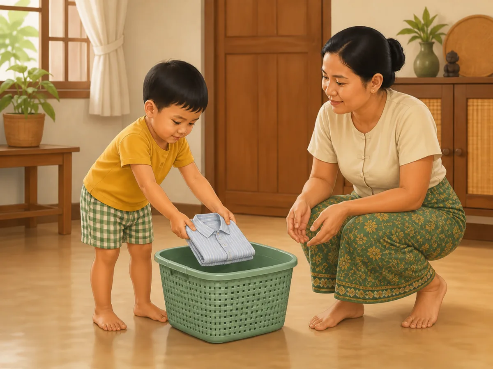
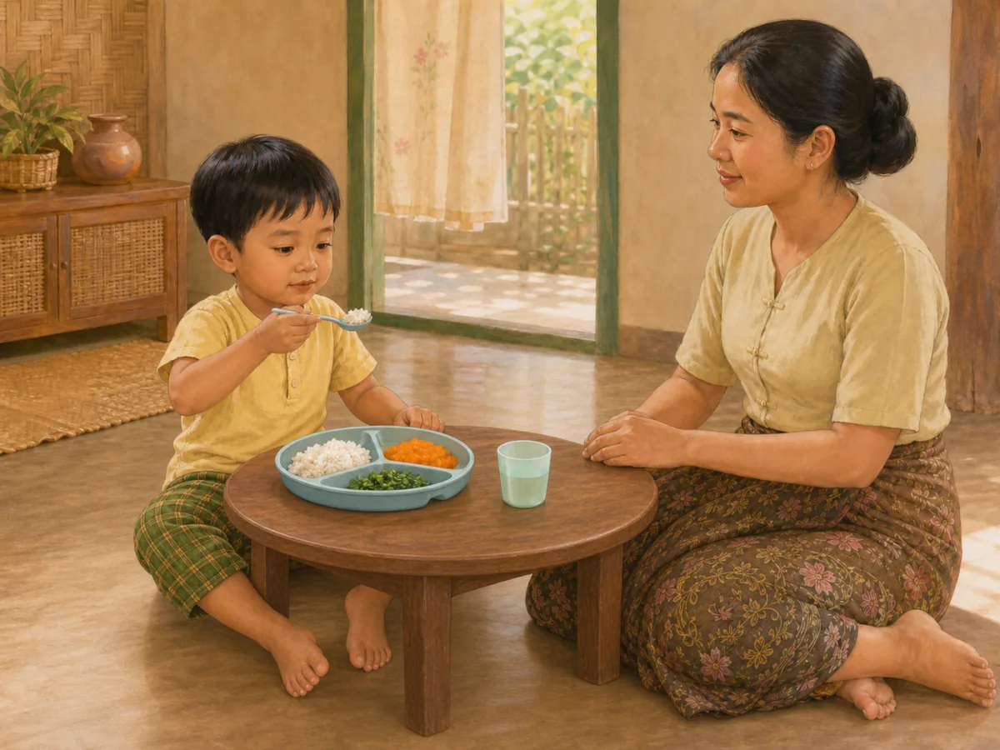
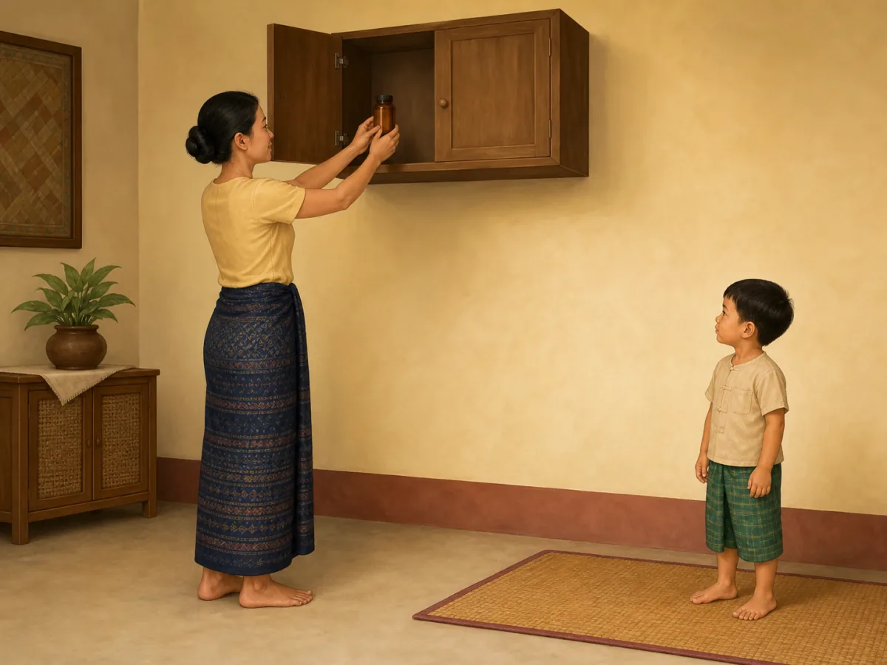
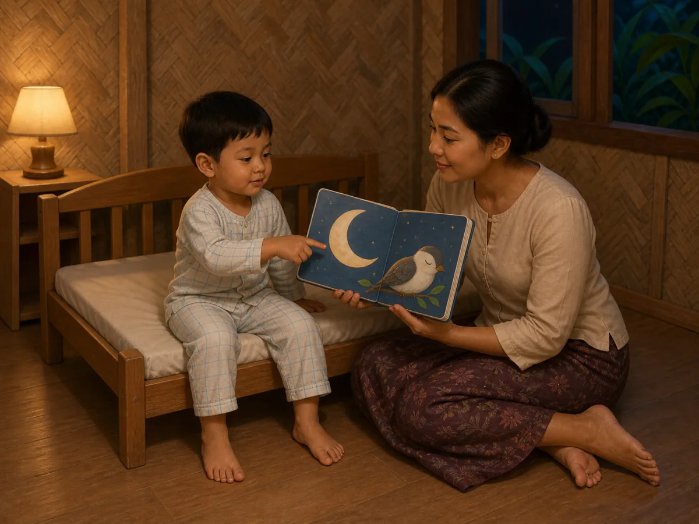

# ACE Child Grow — 3.5-year guide illustration review

Status: **4/4 OWNER APPROVED — PRODUCTION DEPLOYMENT AUTHORIZED**

## Production source of truth

- Exact Production Convex filter: `type == "guide"` and `ageGroupKey == "3_5y"`.
- Production read performed on 2026-08-12; no Production data was modified.
- Exact result: 4 records; all have `clinicalStatus = clinical_review`.
- Every available field was read for every record: identifiers/timestamps, age group, clinical status, domain, slug, bilingual title/summary, tags, source, version/revision, complete search text, and all nested `data` fields.
- Nested fields read include title, why/meaning, observation questions, daily/weekly/indoor/outdoor activities, safety, parent tips, FAQ, red flags, referral, encouragement, editorial status, and evidence summary.
- No local seed, constant, dump, screenshot, old image, or fallback mapping was used as content authority.

## Pre-generation review table

| Slug | Myanmar title | English title | Exact behaviour | Image scene | Must not show | Safety requirements | Status |
|---|---|---|---|---|---|---|---|
| `gd_3_5y_daily_routine` | ၃ နှစ်ခွဲ — နေ့စဉ်လုပ်ရိုးလုပ်စဉ် လမ်းညွှန် | 3.5 years — daily routine guide | A 3.5-year-old completes one predictable tidying step independently while a caregiver allows time and supervises. | In a simple Myanmar home, the child stands steadily and places exactly one neatly folded lightweight shirt into one low open clothes basket; a caregiver crouches within reach with empty hands and watches without taking over; both complete bodies, hands and feet are visible. | Toothbrushing, bathing, road crossing, dressing several garments, toys, multiple baskets, routine chart, written symbols, clock, screen, labels, arrows or UI. | Low stable basket with smooth edges; lightweight shirt only; dry uncluttered floor; caregiver within reach without physically directing the child. | READY FOR OWNER REVIEW |
| `gd_3_5y_safety` | ၃ နှစ်ခွဲ — ဘေးကင်းလုံခြုံရေး လမ်းညွှန် | 3.5 years — safety guide | An adult removes a medicine hazard in advance by placing it in a high secured cabinet while the child remains separated. | A Myanmar/Southeast Asian caregiver stands securely on the floor and places exactly one closed plain amber child-resistant medicine bottle into one high wall cabinet, then closes the cabinet door; the 3.5-year-old stands at least one adult arm's length away beside a clear play mat with empty hands; all hands and feet are fully visible. | Child touching/reaching for medicine, loose pills, open bottle, readable label, poisoning or injury, stool/ladder/chair, road, water, fire, window, cord, warning icon, text, arrow or UI. | Bottle stays closed; adult controls it; high cabinet; adult remains on floor; child remains separated; no loose medicine or climbable furniture. | READY FOR OWNER REVIEW |
| `gd_3_5y_sleep` | ၃ နှစ်ခွဲ — အိပ်စက်ခြင်း လမ်းညွှန် | 3.5 years — sleep guide | A 3.5-year-old follows one calm repeatable pre-bed cue by sharing one wordless book instead of using a screen. | In warm dim evening light, the child in two-piece pajamas sits upright on one low toddler bed and points to one large picture of a moon and sleeping bird in a sturdy wordless board book held by a caregiver seated beside the bed; both gaze at the picture; full bodies, hands and feet are visible. | Phone, tablet, television, medicine, food, drink, bath, toothbrushing, singing, multiple books, infant cot, climbing/jumping, written letters/numbers, clock, arrows or UI. | Low stable bed; one sturdy book without loose parts; caregiver within reach; clear dry floor; no medicine, cord, screen, fall hazard, pillow or loose bedding. | READY FOR OWNER REVIEW |
| `gd_3_5y_nutrition` | ၃ နှစ်ခွဲ — အာဟာရ လမ်းညွှန် | 3.5 years — nutrition guide | A seated 3.5-year-old calmly eats one age-safe bite from a varied family meal and has plain water available while a caregiver supervises without pressure. | The child sits upright at a low family table, holds one child-size spoon naturally and lifts one soft bite from an unbreakable divided plate containing three age-safe foods: soft rice, mashed orange vegetable and finely shredded leafy vegetable; one small open unbreakable cup of plain water is beside the plate; a caregiver sits within reach with empty hands and a calm expression; full bodies, hands and feet are visible. | Force-feeding, caregiver holding the spoon, standing/running while eating, whole grapes/nuts/hard chunks, bones, hot food, knife, glass, bottle, straw, sugary drink, many dishes, screen, text or labels. | Child seated upright and supervised; soft age-prepared foods; small spoon; unbreakable plate/cup; no choking, hot, sharp or breakable item; calm no-pressure interaction. | READY FOR OWNER REVIEW |

## Production record summary

| Slug | Myanmar summary | English summary | Domain | Publication status | Version / review revision |
|---|---|---|---|---|---|
| `gd_3_5y_daily_routine` | ၃ နှစ်ခွဲအရွယ်တွင် သွားတိုက်ခြင်း၊ အဝတ်ဝတ်ခြင်းနှင့် ပစ္စည်းသိမ်းခြင်းကို ပုံမှန်အစီအစဉ်ဖြင့် လေ့ကျင့်ပါ။ | At 3.5 years, practise brushing, dressing, and tidying in a predictable order. | `daily_routine` | `clinical_review` | 1 / 6 |
| `gd_3_5y_safety` | ၃ နှစ်ခွဲအရွယ်တွင် လမ်းမ၊ ရေ၊ မီး၊ ပြတင်းပေါက်နှင့် ဆေးဝါးအန္တရာယ်များကို လူကြီးက ဆက်လက်ကာကွယ်ရပါမည်။ | At 3.5 years, adults still need to prevent traffic, water, burn, window, and medicine hazards. | `safety` | `clinical_review` | 1 / 5 |
| `gd_3_5y_sleep` | ၃ နှစ်ခွဲအရွယ်အတွက် ပုံမှန်အိပ်ချိန်၊ နိုးချိန်နှင့် ငြိမ်သက်သော အိပ်မီအလေ့အထ ထားပါ။ | Keep regular sleep and wake times with a calm bedtime routine at 3.5 years. | `sleep` | `clinical_review` | 1 / 8 |
| `gd_3_5y_nutrition` | ၃ နှစ်ခွဲအရွယ်တွင် မိသားစုစားပွဲ၌ အုပ်စုစုံ အစားအစာနှင့် ရေကို ပုံမှန်ပေးပါ။ | At 3.5 years, offer varied family foods and water at regular meals. | `nutrition` | `clinical_review` | 1 / 8 |

## Owner-review items

### `gd_3_5y_daily_routine` — READY FOR OWNER REVIEW

- Myanmar title: ၃ နှစ်ခွဲ — နေ့စဉ်လုပ်ရိုးလုပ်စဉ် လမ်းညွှန်
- English title: 3.5 years — daily routine guide
- Myanmar summary: ၃ နှစ်ခွဲအရွယ်တွင် သွားတိုက်ခြင်း၊ အဝတ်ဝတ်ခြင်းနှင့် ပစ္စည်းသိမ်းခြင်းကို ပုံမှန်အစီအစဉ်ဖြင့် လေ့ကျင့်ပါ။
- English summary: At 3.5 years, practise brushing, dressing, and tidying in a predictable order.
- Asset: [`/public/guides/gd_3_5y_daily_routine.52c15c6500.webp`](../../public/guides/gd_3_5y_daily_routine.52c15c6500.webp) — 1200×900, 82,744 bytes
- QA: behaviour ✓ · age/body size ✓ · anatomy ✓ · hands/fingers ✓ · legs/feet ✓ · stable posture ✓ · exactly one shirt/basket ✓ · caregiver hands-off ✓ · no unrelated action/object ✓ · culturally appropriate ✓ · wordless/no mark ✓

### `gd_3_5y_nutrition` — READY FOR OWNER REVIEW

- Myanmar title: ၃ နှစ်ခွဲ — အာဟာရ လမ်းညွှန်
- English title: 3.5 years — nutrition guide
- Myanmar summary: ၃ နှစ်ခွဲအရွယ်တွင် မိသားစုစားပွဲ၌ အုပ်စုစုံ အစားအစာနှင့် ရေကို ပုံမှန်ပေးပါ။
- English summary: At 3.5 years, offer varied family foods and water at regular meals.
- Asset: [`/public/guides/gd_3_5y_nutrition.a9bb6fe8f1.webp`](../../public/guides/gd_3_5y_nutrition.a9bb6fe8f1.webp) — 1200×900, 104,348 bytes
- QA: behaviour ✓ · age/body size ✓ · anatomy ✓ · all hands/fingers ✓ · all legs/feet ✓ · seated posture ✓ · soft age-safe varied foods ✓ · plain water ✓ · no-pressure supervision ✓ · no hot/sharp/breakable/choking item ✓ · culturally appropriate ✓ · wordless/no mark ✓

### `gd_3_5y_safety` — READY FOR OWNER REVIEW

- Myanmar title: ၃ နှစ်ခွဲ — ဘေးကင်းလုံခြုံရေး လမ်းညွှန်
- English title: 3.5 years — safety guide
- Myanmar summary: ၃ နှစ်ခွဲအရွယ်တွင် လမ်းမ၊ ရေ၊ မီး၊ ပြတင်းပေါက်နှင့် ဆေးဝါးအန္တရာယ်များကို လူကြီးက ဆက်လက်ကာကွယ်ရပါမည်။
- English summary: At 3.5 years, adults still need to prevent traffic, water, burn, window, and medicine hazards.
- Asset: [`/public/guides/gd_3_5y_safety.9293fe1354.webp`](../../public/guides/gd_3_5y_safety.9293fe1354.webp) — 1200×900, 59,704 bytes
- QA: behaviour ✓ · age/body size ✓ · anatomy ✓ · all hands/fingers ✓ · all legs/feet ✓ · one closed plain bottle ✓ · adult-controlled high cabinet ✓ · child safely separated ✓ · no loose medicine/climbable item/injury ✓ · culturally appropriate ✓ · wordless/no mark ✓

### `gd_3_5y_sleep` — READY FOR OWNER REVIEW

- Myanmar title: ၃ နှစ်ခွဲ — အိပ်စက်ခြင်း လမ်းညွှန်
- English title: 3.5 years — sleep guide
- Myanmar summary: ၃ နှစ်ခွဲအရွယ်အတွက် ပုံမှန်အိပ်ချိန်၊ နိုးချိန်နှင့် ငြိမ်သက်သော အိပ်မီအလေ့အထ ထားပါ။
- English summary: Keep regular sleep and wake times with a calm bedtime routine at 3.5 years.
- Asset: [`/public/guides/gd_3_5y_sleep.da3b8b7d22.webp`](../../public/guides/gd_3_5y_sleep.da3b8b7d22.webp) — 1200×900, 84,004 bytes
- QA: behaviour ✓ · age/body size ✓ · anatomy ✓ · hands/fingers ✓ · legs/feet ✓ · shared gaze ✓ · exactly one wordless book ✓ · empty low bed/no pillow or loose bedding ✓ · no screen/medicine/extra routine step ✓ · culturally appropriate ✓ · wordless/no mark ✓

## Rejected-generation audit

- `gd_3_5y_daily_routine`: the first candidate was rejected because one caregiver foot was obscured by the longyi; the targeted regeneration shows both complete feet naturally.
- `gd_3_5y_nutrition`: the first candidate was rejected because one child foot was hidden behind the table/chair; the targeted regeneration shows complete hands and feet for both people.
- `gd_3_5y_safety`: initial candidate passed after original-resolution anatomy review confirmed both child hands and all feet are complete.
- `gd_3_5y_sleep`: initial candidate passed after original-resolution anatomy review confirmed both caregiver feet are naturally visible in the cross-legged pose.

## Mapping and application verification

- Four exact slugs map directly to four different content-hashed files; no domain/category/shared fallback is used.
- All four WebP files are 1200×900 (4:3), optimized at high quality, and under 500 KB.
- Exact Myanmar and English titles were verified against Production data on every rendered card.
- Desktop and mobile rendering passed with no overflow, missing image, stale mapping, page error, or console error.
- Browser verification proved HTTP 200, WebP MIME type, 1200×900 dimensions, and four unique image sources.
- Captured text + image cards: [daily routine](screenshots/guides-3_5y/gd_3_5y_daily_routine-desktop.jpg), [nutrition](screenshots/guides-3_5y/gd_3_5y_nutrition-desktop.jpg), [safety](screenshots/guides-3_5y/gd_3_5y_safety-desktop.jpg), [sleep](screenshots/guides-3_5y/gd_3_5y_sleep-desktop.jpg).

## Engineering verification

- Focused component and mapping tests: 87/87 passed.
- Full unit suite: 1,303/1,303 passed across 131 files.
- Typecheck: passed.
- Lint: passed.
- Playwright 3.5-year guide image test: passed.
- Production build: passed; PWA precache generated 320 entries and accepted every asset.
- Existing unrelated React test `act(...)` warnings, `NO_COLOR`/`FORCE_COLOR` notices, and the Vite mixed static/dynamic import advisory remain; there are no 3.5-year asset warnings, missing imports, missing files, or broken routes.

## Deployment gate

**OWNER APPROVED on 2026-08-12.** Commit, push, merge, and production deployment are authorized for this exact four-item 3.5-year guide scope. Production Convex content remains unchanged.
