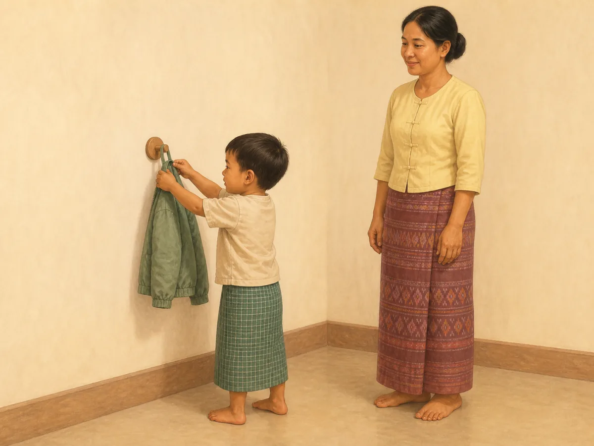
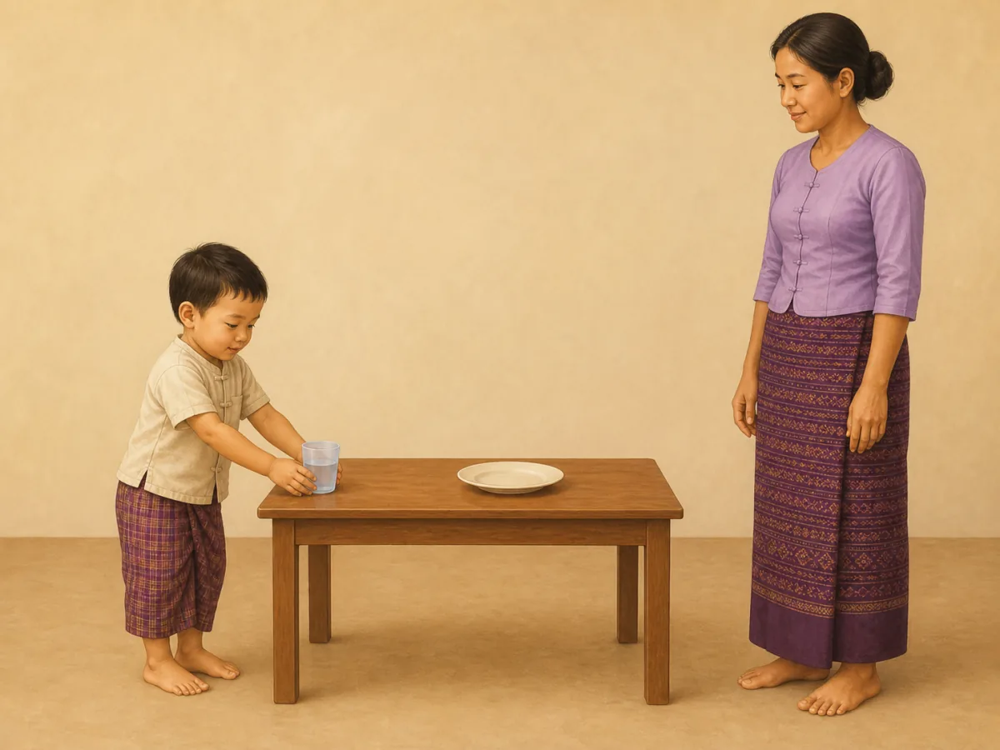
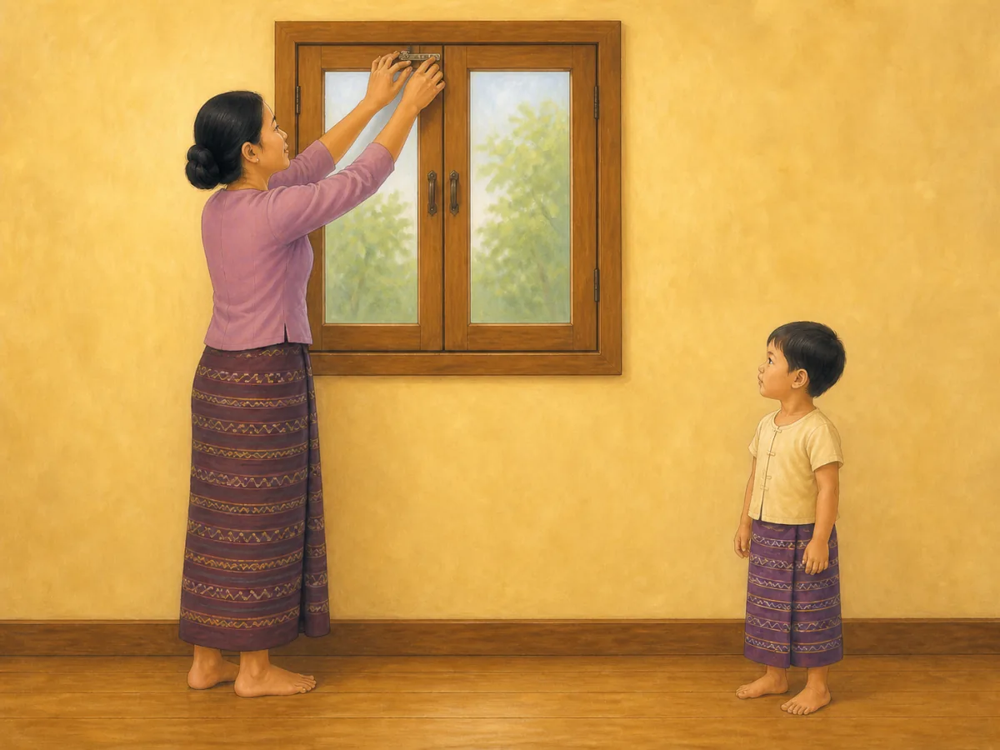
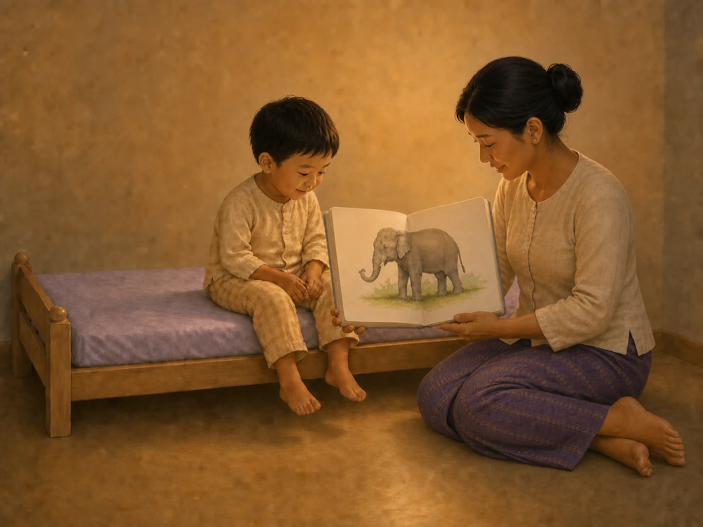
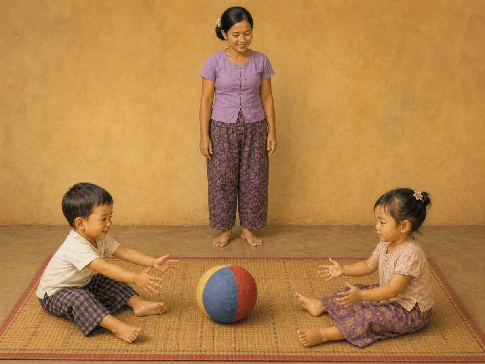

# ACE Child Grow — 3-year guide illustration review

Status: **6/6 OWNER APPROVED — READY FOR PRODUCTION RELEASE**

## Production source of truth

- Exact Production Convex filter: `type == "guide"` and `ageGroupKey == "3y"`.
- Production read performed on 2026-08-12; no Production data was modified.
- Exact result: 6 records; all have `clinicalStatus = clinical_review`.
- Every available top-level field was read, including identifiers/timestamps, age group, status/priority, domain, slug, bilingual title/summary, tags, source, version/revision, complete search text, and nested `data`.
- Every nested field present was read, including meaning/why, title, observation questions, daily/weekly/indoor/outdoor/low-cost activities, materials, safety, common mistakes, parent tips, encouragement, FAQ, red flags, referral, and evidence/editorial fields.
- No local seed, constant, dump, screenshot, old image, or fallback mapping was used as content authority.

## Pre-generation review table

| Slug | Myanmar title | English title | Exact behaviour | Image scene | Must not show | Safety requirements | Status |
|---|---|---|---|---|---|---|---|
| `gd_3y_cognitive` | ၃ နှစ် — အသိဉာဏ် ဖွံ့ဖြိုးမှု | 3 years — Cognitive | A 3-year-old counts exactly three large safe blocks by touching them one at a time. | A clearly 3-year-old Myanmar/Southeast Asian child sits on a clear mat with exactly three oversized solid-color wooden blocks in one straight row and touches the third block with one index finger; the other hand rests open; a caregiver sits within reach and watches with empty hands; full bodies, hands and feet are visible. | Flashcards, written letters/numbers, bottle caps or small counting objects; sorting, shape building or another learning action; food, screen, text, labels, arrows or UI. | Three one-piece blocks too large to swallow; smooth rounded edges; floor-level play; caregiver supervises; no food or detachable parts. | READY FOR OWNER REVIEW |
| `gd_3y_daily_routine` | ၃ နှစ် — နေ့စဉ်လုပ်ရိုးလုပ်စဉ် လမ်းညွှန် | 3 years — daily routine guide | A 3-year-old independently hangs one used jacket on one low hook as one predictable tidying step. | In a plain Myanmar home entry area, the child stands stably and uses both hands to place the sewn hanging loop of one lightweight jacket over one child-height rounded wall hook; the caregiver stands within reach with empty hands and does not take over; full bodies and feet are visible. | Toothbrushing, bathing, full dressing, shoes, several garments or a multi-step tidy-up; routine chart, clock, text, labels, arrows or UI. | One firmly mounted rounded low hook; lightweight garment with an integrated sewn loop; dry uncluttered floor; caregiver within reach. | READY FOR OWNER REVIEW |
| `gd_3y_nutrition` | ၃ နှစ် — အာဟာရ လမ်းညွှန် | 3 years — nutrition guide | A 3-year-old participates in one simple family table task by placing one open cup of water at their place. | The child stands stably at a low family table and uses both hands to set exactly one small unbreakable open cup half-filled with plain water beside one empty unbreakable plate; a caregiver crouches within reach with empty hands and calmly supervises; full bodies, hands and feet are visible. | Eating, cooking, cutting, carrying hot food, glass, knife, bottle, straw, sugary drink, choking food, multiple dishes, screen, text or labels. | Stable low table; unbreakable cup/plate; small water amount; dry clear floor; no hot/sharp/breakable item; caregiver within reach. | READY FOR OWNER REVIEW |
| `gd_3y_safety` | ၃ နှစ် — ဘေးကင်းလုံခြုံရေး လမ်းညွှန် | 3 years — safety guide | An adult prevents a window fall hazard by closing one high safety latch while the child remains separated. | In a simple Myanmar home, a caregiver stands securely on the floor and uses both hands to close the high safety latch of one already-closed window; the 3-year-old stands at least one adult arm's length away with empty hands and both feet on the floor; full bodies are visible. | Child touching, reaching for, opening or climbing at the window; open window, stool, chair or ladder; bars suggesting entrapment; traffic, water, fire, medicine or injury montage; text, warning symbol, arrow or UI. | Window remains closed; high latch controlled only by adult; adult stays on floor; child remains safely separated; dry clear floor and no climbable furniture. | READY FOR OWNER REVIEW |
| `gd_3y_sleep` | ၃ နှစ် — အိပ်စက်ခြင်း လမ်းညွှန် | 3 years — sleep guide | A 3-year-old participates in one calm repeatable pre-bed cue through shared reading of one wordless picture book. | In dim warm evening light, the awake child in two-piece pajamas sits near the center of one low toddler bed while a caregiver sits on the floor beside it and holds one large sturdy wordless picture book open toward the child; child and caregiver gaze at the same simple animal picture; full hands and feet are visible. | Screen, phone, television, medicine, food, drink, bath, toothbrushing, singing or another bedtime step; multiple books; infant cot, climbing, jumping, text, letters, numbers, clock, arrows or UI. | Low stable toddler bed; sturdy book with no loose parts; caregiver within reach; dry clear floor; no cord, medicine or fall hazard. | READY FOR OWNER REVIEW |
| `gd_3y_social` | ၃ နှစ် — လူမှုဆက်ဆံရေး | 3 years — Social | Two 3-year-olds take turns by rolling one large soft ball between them. | Two clearly 3-year-old Myanmar/Southeast Asian children sit facing each other on a clear floor mat; one child has just released exactly one large soft fabric ball along the mat, and the other child waits with both open hands ready to receive it; a caregiver sits within reach behind them with empty hands; all bodies, hands and feet are visible. | Forced sharing, adult directing or holding the ball, competition, throwing through the air, several toys/balls, dolls, food, small object, conflict, text, arrows or UI. | One soft ball too large to swallow; floor-level play; clear space; seated turn-taking; caregiver actively supervises. | READY FOR OWNER REVIEW |

## Production record summary

| Slug | Myanmar summary | English summary | Domain | Publication status | Version / review revision |
|---|---|---|---|---|---|
| `gd_3y_cognitive` | အရောင်၊ ပုံသဏ္ဌာန်၊ အရေအတွက် သိရှိခြင်းသည် ကျောင်းသင်ယူမှု၏ အခြေခံဖြစ်သည်။ | Colors, shapes, and counting are the base for school learning. | `cognitive` | `clinical_review` | 1 / 4 |
| `gd_3y_daily_routine` | ၃ နှစ်အရွယ်တွင် သွားတိုက်ခြင်း၊ အဝတ်ဝတ်ခြင်းနှင့် ပစ္စည်းသိမ်းခြင်းကို ပုံမှန်အစီအစဉ်ဖြင့် လေ့ကျင့်ပါ။ | At 3 years, practise brushing, dressing, and tidying in a predictable order. | `daily_routine` | `clinical_review` | 1 / 6 |
| `gd_3y_nutrition` | ၃ နှစ်အရွယ်တွင် မိသားစုစားပွဲ၌ အုပ်စုစုံ အစားအစာနှင့် ရေကို ပုံမှန်ပေးပါ။ | At 3 years, offer varied family foods and water at regular meals. | `nutrition` | `clinical_review` | 1 / 8 |
| `gd_3y_safety` | ၃ နှစ်အရွယ်တွင် လမ်းမ၊ ရေ၊ မီး၊ ပြတင်းပေါက်နှင့် ဆေးဝါးအန္တရာယ်များကို လူကြီးက ဆက်လက်ကာကွယ်ရပါမည်။ | At 3 years, adults still need to prevent traffic, water, burn, window, and medicine hazards. | `safety` | `clinical_review` | 1 / 5 |
| `gd_3y_sleep` | ၃ နှစ်အရွယ်အတွက် ပုံမှန်အိပ်ချိန်၊ နိုးချိန်နှင့် ငြိမ်သက်သော အိပ်မီအလေ့အထ ထားပါ။ | Keep regular sleep and wake times with a calm bedtime routine at 3 years. | `sleep` | `clinical_review` | 1 / 8 |
| `gd_3y_social` | အလှည့်ကျ ကစားခြင်းနှင့် ဝေမျှခြင်းသည် သူငယ်ချင်းဖွဲ့မှုနှင့် ကျောင်းဘဝအတွက် ပြင်ဆင်ပေးသည်။ | Turn-taking and sharing prepare for friendships and school. | `social` | `clinical_review` | 1 / 8 |

## Owner-review items

### `gd_3y_cognitive` — OWNER APPROVED

- Myanmar title: ၃ နှစ် — အသိဉာဏ် ဖွံ့ဖြိုးမှု
- English title: 3 years — Cognitive
- Myanmar summary: အရောင်၊ ပုံသဏ္ဌာန်၊ အရေအတွက် သိရှိခြင်းသည် ကျောင်းသင်ယူမှု၏ အခြေခံဖြစ်သည်။
- English summary: Colors, shapes, and counting are the base for school learning.
- Asset: [`/public/guides/gd_3y_cognitive.6e4d7b1737.webp`](../../public/guides/gd_3y_cognitive.6e4d7b1737.webp) — 1200×900, 87,514 bytes
- QA: behaviour ✓ · 3-year age/body size ✓ · anatomy ✓ · hands/fingers ✓ · legs/feet ✓ · gaze/expression ✓ · exactly three safe blocks ✓ · no extra action/object ✓ · culturally appropriate ✓ · wordless/no mark ✓

### `gd_3y_daily_routine` — OWNER APPROVED

- Myanmar title: ၃ နှစ် — နေ့စဉ်လုပ်ရိုးလုပ်စဉ် လမ်းညွှန်
- English title: 3 years — daily routine guide
- Myanmar summary: ၃ နှစ်အရွယ်တွင် သွားတိုက်ခြင်း၊ အဝတ်ဝတ်ခြင်းနှင့် ပစ္စည်းသိမ်းခြင်းကို ပုံမှန်အစီအစဉ်ဖြင့် လေ့ကျင့်ပါ။
- English summary: At 3 years, practise brushing, dressing, and tidying in a predictable order.
- Asset: [`/public/guides/gd_3y_daily_routine.819d380c64.webp`](../../public/guides/gd_3y_daily_routine.819d380c64.webp) — 1200×900, 52,850 bytes
- QA: behaviour ✓ · 3-year age/body size ✓ · anatomy ✓ · hands/fingers ✓ · legs/feet ✓ · stable posture ✓ · one jacket/one safe low hook ✓ · caregiver supervises without taking over ✓ · no extra routine step ✓ · culturally appropriate ✓ · wordless/no mark ✓

### `gd_3y_nutrition` — OWNER APPROVED

- Myanmar title: ၃ နှစ် — အာဟာရ လမ်းညွှန်
- English title: 3 years — nutrition guide
- Myanmar summary: ၃ နှစ်အရွယ်တွင် မိသားစုစားပွဲ၌ အုပ်စုစုံ အစားအစာနှင့် ရေကို ပုံမှန်ပေးပါ။
- English summary: At 3 years, offer varied family foods and water at regular meals.
- Asset: [`/public/guides/gd_3y_nutrition.2077c69177.webp`](../../public/guides/gd_3y_nutrition.2077c69177.webp) — 1200×900, 54,812 bytes
- QA: behaviour ✓ · 3-year age/body size ✓ · anatomy ✓ · all hands/fingers ✓ · all legs/feet ✓ · stable posture ✓ · one open cup of water/one empty plate ✓ · adult supervision ✓ · no hot, sharp, breakable or choking item ✓ · culturally appropriate ✓ · wordless/no mark ✓

### `gd_3y_safety` — OWNER APPROVED

- Myanmar title: ၃ နှစ် — ဘေးကင်းလုံခြုံရေး လမ်းညွှန်
- English title: 3 years — safety guide
- Myanmar summary: ၃ နှစ်အရွယ်တွင် လမ်းမ၊ ရေ၊ မီး၊ ပြတင်းပေါက်နှင့် ဆေးဝါးအန္တရာယ်များကို လူကြီးက ဆက်လက်ကာကွယ်ရပါမည်။
- English summary: At 3 years, adults still need to prevent traffic, water, burn, window, and medicine hazards.
- Asset: [`/public/guides/gd_3y_safety.ea3175b45e.webp`](../../public/guides/gd_3y_safety.ea3175b45e.webp) — 1200×900, 67,076 bytes
- QA: behaviour ✓ · 3-year age/body size ✓ · anatomy ✓ · hands/fingers ✓ · legs/feet ✓ · closed window/high adult-controlled latch ✓ · child safely separated ✓ · no stool/climbing/open window/extra hazard ✓ · culturally appropriate ✓ · wordless/no mark ✓

### `gd_3y_sleep` — OWNER APPROVED

- Myanmar title: ၃ နှစ် — အိပ်စက်ခြင်း လမ်းညွှန်
- English title: 3 years — sleep guide
- Myanmar summary: ၃ နှစ်အရွယ်အတွက် ပုံမှန်အိပ်ချိန်၊ နိုးချိန်နှင့် ငြိမ်သက်သော အိပ်မီအလေ့အထ ထားပါ။
- English summary: Keep regular sleep and wake times with a calm bedtime routine at 3 years.
- Asset: [`/public/guides/gd_3y_sleep.f742f1b5f9.webp`](../../public/guides/gd_3y_sleep.f742f1b5f9.webp) — 1200×900, 93,536 bytes
- QA: behaviour ✓ · 3-year age/body size ✓ · anatomy ✓ · both child hands/fingers ✓ · both child legs/feet ✓ · both caregiver hands/fingers ✓ · both caregiver legs/feet ✓ · shared gaze ✓ · one wordless animal book ✓ · low empty bed/no pillow or loose object ✓ · no screen/medicine/extra bedtime step ✓ · culturally appropriate ✓ · wordless/no mark ✓

### `gd_3y_social` — OWNER APPROVED

- Myanmar title: ၃ နှစ် — လူမှုဆက်ဆံရေး
- English title: 3 years — Social
- Myanmar summary: အလှည့်ကျ ကစားခြင်းနှင့် ဝေမျှခြင်းသည် သူငယ်ချင်းဖွဲ့မှုနှင့် ကျောင်းဘဝအတွက် ပြင်ဆင်ပေးသည်။
- English summary: Turn-taking and sharing prepare for friendships and school.
- Asset: [`/public/guides/gd_3y_social.6b54712467.webp`](../../public/guides/gd_3y_social.6b54712467.webp) — 1200×900, 99,326 bytes
- QA: behaviour ✓ · two clearly 3-year-old children ✓ · anatomy ✓ · all hands/fingers ✓ · all legs/feet ✓ · face/gaze ✓ · exactly one large soft ball ✓ · floor-level supervised turn-taking ✓ · no conflict/extra toy/action ✓ · culturally appropriate ✓ · wordless/no mark ✓

## Rejected-generation audit

- `gd_3y_cognitive`: initial candidate passed all checks.
- `gd_3y_daily_routine`: initial candidate passed all checks.
- `gd_3y_nutrition`: three earlier candidates were rejected because a caregiver foot, caregiver hand, or child foot was obscured; the final composition exposes every hand and foot naturally.
- `gd_3y_safety`: the first candidate was rejected because an unrelated cloth/strap appeared near the latch; the final targeted regeneration has one plain high latch only.
- `gd_3y_sleep`: the first candidate was rejected because it introduced a pillow. A later mapped candidate was rejected during release QA because one caregiver hand and one caregiver foot were hidden. The first anatomy-targeted correction was rejected because the caregiver's feet overlapped unnaturally and both book-holding hands were not distinct. The next correction restored complete anatomy but was rejected because the child and caregiver looked at each other instead of the book. The final targeted regeneration has an empty low bed, one wordless book, complete separate hands and feet for both people, and both gazes clearly directed to the same elephant picture.
- `gd_3y_social`: the first candidate was rejected because one caregiver foot was hidden; the final targeted regeneration shows complete natural anatomy for all three people.

## Mapping and application verification

- Six exact slugs map directly to six different content-hashed files; no domain/category/shared fallback is used.
- All six WebP files are 1200×900 (4:3), optimized at high quality, and under 500 KB.
- Exact Myanmar and English titles were verified against Production data on each rendered card.
- Desktop and mobile rendering passed with no overflow, missing image, stale mapping, page error, or console error.
- Browser test verified HTTP 200, WebP MIME type, 1200×900 dimensions, and six unique image sources.
- Captured text + image cards: [cognitive](screenshots/guides-3y/gd_3y_cognitive-desktop.jpg), [daily routine](screenshots/guides-3y/gd_3y_daily_routine-desktop.jpg), [nutrition](screenshots/guides-3y/gd_3y_nutrition-desktop.jpg), [safety](screenshots/guides-3y/gd_3y_safety-desktop.jpg), [sleep](screenshots/guides-3y/gd_3y_sleep-desktop.jpg), [social](screenshots/guides-3y/gd_3y_social-desktop.jpg).

## Engineering verification

- Focused component and mapping tests: 101/101 passed.
- Full unit suite: 1,317/1,317 passed across 131 files.
- Typecheck: passed.
- Lint: passed.
- Playwright 3-year guide image test: passed.
- Production build: passed; PWA precache generated 332 entries and accepted every asset.
- Existing unrelated React test `act(...)` warnings and the existing Vite mixed static/dynamic import advisory remain; there are no 3-year asset warnings, missing imports, missing files, or broken routes.

## Deployment gate

All six illustrations are owner approved. Release QA rejected the previously approved `gd_3y_sleep` candidate because one caregiver hand and one caregiver foot were hidden; its corrected replacement was regenerated, re-verified, and explicitly owner approved on 2026-08-12. The complete 3-year guide asset set is cleared for production release. Production Convex remains read only and no clinical wording is changed.
