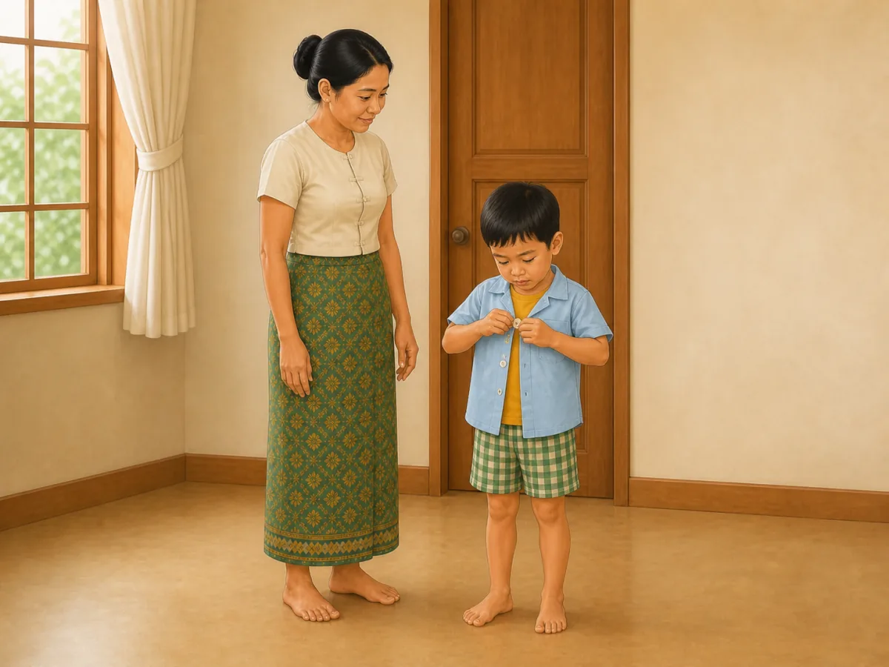
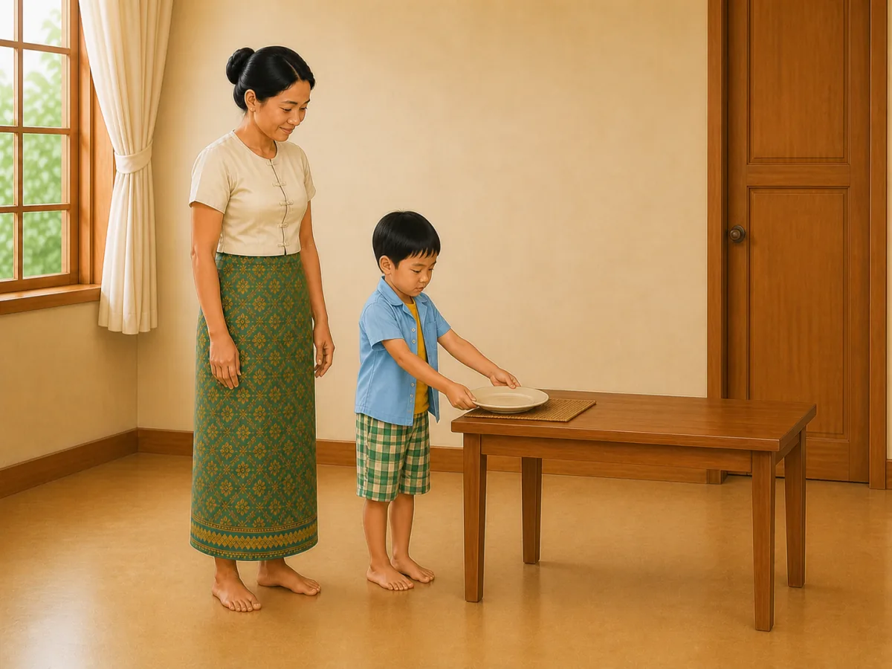
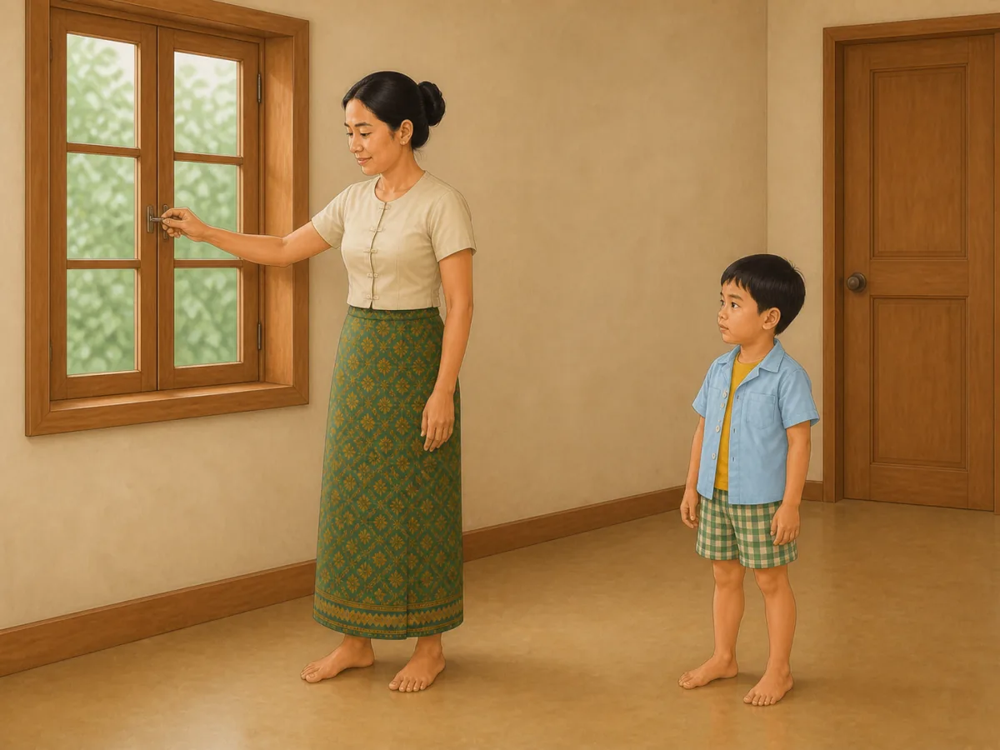
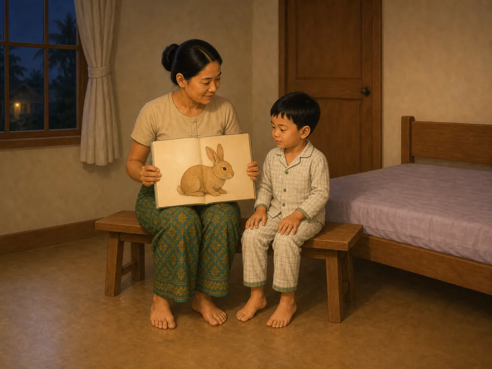

# ACE Child Grow — 4.5-year guide illustration review

Status: **4/4 READY FOR OWNER REVIEW — DEPLOYMENT DISABLED**

## Production source of truth

- Exact Production Convex filter: `type == "guide"` and `ageGroupKey == "4_5y"`.
- Production read performed on 2026-08-12; no Production data was modified.
- Exact result: 4 records; all have `clinicalStatus = clinical_review`.
- Every available field was read for every record: identifiers/timestamps, age group, clinical status, domain, slug, bilingual title/summary, tags, source, version/revision, complete search text, and every nested `data` field.
- Nested fields read include title, why/meaning, observation questions, daily/weekly/indoor/outdoor activities, safety, parent tips, FAQ, red flags, referral, encouragement, editorial status, and evidence summary.
- No required visual field is unavailable; no item is blocked.
- No local seed, constant, dump, screenshot, old image, or fallback mapping was used as content authority.

## Pre-generation review table

| Slug | Myanmar title | English title | Exact behaviour | Image scene | Must not show | Safety requirements | Status |
|---|---|---|---|---|---|---|---|
| `gd_4_5y_daily_routine` | ၄ နှစ်ခွဲ — နေ့စဉ်လုပ်ရိုးလုပ်စဉ် လမ်းညွှန် | 4.5 years — daily routine guide | A 4.5-year-old completes one predictable dressing step by fastening one large front shirt button while a caregiver allows time and supervises without taking over. | In a simple Myanmar home, the fully dressed child stands steadily and uses both hands to fasten one large button on the front of their own loose overshirt; a caregiver stands within reach with empty hands and watches calmly; both complete bodies, hands and feet are visible. | Toothbrushing, bathing, tidying, road crossing, several garments, shoes, routine chart, mirror/reflection, clock, toys, screen, letters, numbers, labels, arrows or UI. | Child remains fully dressed; one easy large button; dry uncluttered floor; caregiver within reach; no pin, sharp fastener, stool, medicine or breakable object. | READY FOR OWNER REVIEW |
| `gd_4_5y_safety` | ၄ နှစ်ခွဲ — ဘေးကင်းလုံခြုံရေး လမ်းညွှန် | 4.5 years — safety guide | An adult prevents a window hazard in advance by closing and securing one reachable window while the 4.5-year-old remains safely separated. | In a Myanmar home, a caregiver stands securely on the floor and closes one low window, turning one simple latch with one hand while the other hand rests visibly at their side; the child stands more than one adult arm's length away on a clear floor with both empty hands visible; both complete bodies, hands and feet are visible. | Child touching/reaching/climbing toward window, open drop, stool/chair/ladder, loose blind cord, medicine, water, fire, road, injury, fear, warning symbol, text, arrow or UI. | Caregiver controls the window and remains on the floor; window closes inward and is latched; child stays separated; no climbable furniture, loose cord, broken glass or exposed height. | READY FOR OWNER REVIEW |
| `gd_4_5y_sleep` | ၄ နှစ်ခွဲ — အိပ်စက်ခြင်း လမ်းညွှန် | 4.5 years — sleep guide | A 4.5-year-old shares one calm wordless book with a caregiver as a repeatable bedtime cue instead of using a screen. | In warm dim evening light, the child in two-piece pajamas and caregiver sit side-by-side on one low stable bench beside a tidy low bed; the caregiver holds exactly one sturdy wordless picture book open to one large rabbit illustration while the child's two hands rest visibly on their own knees; both look at the page; complete bodies, hands and feet are visible. | Phone, tablet, television, medicine, food, drink, toothbrushing, singing, multiple books, infant cot, climbing/jumping, letters, numbers, clock, arrows or UI. | Stable low bench and bed; one sturdy book without loose parts; caregiver within reach; clear dry floor; no medicine, cord, screen or fall hazard. | READY FOR OWNER REVIEW |
| `gd_4_5y_nutrition` | ၄ နှစ်ခွဲ — အာဟာရ လမ်းညွှန် | 4.5 years — nutrition guide | A 4.5-year-old participates in one simple table task by placing one unbreakable plate at their own place while a caregiver supervises without pressure. | The child stands steadily beside a low family table and uses both hands to place exactly one empty unbreakable plate onto one plain woven placemat; a caregiver stands within reach with both empty hands visible and watches without taking over; all hands and feet are visible. | Eating, food preparation, food, drink, knife, glass, bottle, utensils, multiple plates/mats, tablecloth, standing on furniture, spill, screen, text or labels. | Lightweight unbreakable plate; low stable table; dry clear floor; caregiver within reach; no hot, sharp, glass, food or choking item. | READY FOR OWNER REVIEW |

## Production record summary

| Slug | Myanmar summary | English summary | Domain | Publication status | Version / review revision |
|---|---|---|---|---|---|
| `gd_4_5y_daily_routine` | ၄ နှစ်ခွဲအရွယ်တွင် သွားတိုက်ခြင်း၊ အဝတ်ဝတ်ခြင်းနှင့် ပစ္စည်းသိမ်းခြင်းကို ပုံမှန်အစီအစဉ်ဖြင့် လေ့ကျင့်ပါ။ | At 4.5 years, practise brushing, dressing, and tidying in a predictable order. | `daily_routine` | `clinical_review` | 1 / 6 |
| `gd_4_5y_safety` | ၄ နှစ်ခွဲအရွယ်တွင် လမ်းမ၊ ရေ၊ မီး၊ ပြတင်းပေါက်နှင့် ဆေးဝါးအန္တရာယ်များကို လူကြီးက ဆက်လက်ကာကွယ်ရပါမည်။ | At 4.5 years, adults still need to prevent traffic, water, burn, window, and medicine hazards. | `safety` | `clinical_review` | 1 / 5 |
| `gd_4_5y_sleep` | ၄ နှစ်ခွဲအရွယ်အတွက် ပုံမှန်အိပ်ချိန်၊ နိုးချိန်နှင့် ငြိမ်သက်သော အိပ်မီအလေ့အထ ထားပါ။ | Keep regular sleep and wake times with a calm bedtime routine at 4.5 years. | `sleep` | `clinical_review` | 1 / 8 |
| `gd_4_5y_nutrition` | ၄ နှစ်ခွဲအရွယ်တွင် မိသားစုစားပွဲ၌ အုပ်စုစုံ အစားအစာနှင့် ရေကို ပုံမှန်ပေးပါ။ | At 4.5 years, offer varied family foods and water at regular meals. | `nutrition` | `clinical_review` | 1 / 8 |

## Owner-review items

### `gd_4_5y_daily_routine` — READY FOR OWNER REVIEW

- Myanmar title: ၄ နှစ်ခွဲ — နေ့စဉ်လုပ်ရိုးလုပ်စဉ် လမ်းညွှန်
- English title: 4.5 years — daily routine guide
- Myanmar summary: ၄ နှစ်ခွဲအရွယ်တွင် သွားတိုက်ခြင်း၊ အဝတ်ဝတ်ခြင်းနှင့် ပစ္စည်းသိမ်းခြင်းကို ပုံမှန်အစီအစဉ်ဖြင့် လေ့ကျင့်ပါ။
- English summary: At 4.5 years, practise brushing, dressing, and tidying in a predictable order.
- Asset: [`/public/guides/gd_4_5y_daily_routine.5877b17356.webp`](../../public/guides/gd_4_5y_daily_routine.5877b17356.webp) — 1200×900, 62,506 bytes
- QA: exact dressing step ✓ · 4.5-year body size ✓ · anatomy ✓ · both hands/fingers ✓ · all legs/feet ✓ · stable posture ✓ · caregiver hands-off ✓ · dry clear floor ✓ · no unrelated action/object ✓ · culturally appropriate ✓ · wordless/no mark ✓

### `gd_4_5y_nutrition` — READY FOR OWNER REVIEW

- Myanmar title: ၄ နှစ်ခွဲ — အာဟာရ လမ်းညွှန်
- English title: 4.5 years — nutrition guide
- Myanmar summary: ၄ နှစ်ခွဲအရွယ်တွင် မိသားစုစားပွဲ၌ အုပ်စုစုံ အစားအစာနှင့် ရေကို ပုံမှန်ပေးပါ။
- English summary: At 4.5 years, offer varied family foods and water at regular meals.
- Asset: [`/public/guides/gd_4_5y_nutrition.072745f055.webp`](../../public/guides/gd_4_5y_nutrition.072745f055.webp) — 1200×900, 74,968 bytes
- QA: exact table task ✓ · 4.5-year body size ✓ · anatomy ✓ · both hands/fingers ✓ · all legs/feet ✓ · stable posture ✓ · exactly one unbreakable plate/mat ✓ · caregiver hands-off ✓ · no food/hot/sharp/breakable/choking item ✓ · culturally appropriate ✓ · wordless/no mark ✓

### `gd_4_5y_safety` — READY FOR OWNER REVIEW

- Myanmar title: ၄ နှစ်ခွဲ — ဘေးကင်းလုံခြုံရေး လမ်းညွှန်
- English title: 4.5 years — safety guide
- Myanmar summary: ၄ နှစ်ခွဲအရွယ်တွင် လမ်းမ၊ ရေ၊ မီး၊ ပြတင်းပေါက်နှင့် ဆေးဝါးအန္တရာယ်များကို လူကြီးက ဆက်လက်ကာကွယ်ရပါမည်။
- English summary: At 4.5 years, adults still need to prevent traffic, water, burn, window, and medicine hazards.
- Asset: [`/public/guides/gd_4_5y_safety.6cac88d3a8.webp`](../../public/guides/gd_4_5y_safety.6cac88d3a8.webp) — 1200×900, 62,710 bytes
- QA: exact window-safety behaviour ✓ · 4.5-year body size ✓ · anatomy ✓ · all hands/fingers ✓ · all legs/feet ✓ · caregiver controls latch ✓ · child safely separated ✓ · no climbable furniture/cord/broken glass/exposed drop ✓ · culturally appropriate ✓ · wordless/no mark ✓

### `gd_4_5y_sleep` — READY FOR OWNER REVIEW

- Myanmar title: ၄ နှစ်ခွဲ — အိပ်စက်ခြင်း လမ်းညွှန်
- English title: 4.5 years — sleep guide
- Myanmar summary: ၄ နှစ်ခွဲအရွယ်အတွက် ပုံမှန်အိပ်ချိန်၊ နိုးချိန်နှင့် ငြိမ်သက်သော အိပ်မီအလေ့အထ ထားပါ။
- English summary: Keep regular sleep and wake times with a calm bedtime routine at 4.5 years.
- Asset: [`/public/guides/gd_4_5y_sleep.3032ba1b07.webp`](../../public/guides/gd_4_5y_sleep.3032ba1b07.webp) — 1200×900, 70,498 bytes
- QA: exact calm bedtime cue ✓ · 4.5-year body size ✓ · anatomy ✓ · all hands/fingers ✓ · all legs/feet ✓ · shared gaze ✓ · exactly one wordless book ✓ · stable low bench/bed ✓ · no screen/medicine/extra routine step ✓ · culturally appropriate ✓ · wordless/no mark ✓

## Rejected-generation audit

- `gd_4_5y_daily_routine`: initial candidate passed original-resolution review; both hands, all feet, the single button action, caregiver posture, and age presentation are natural.
- `gd_4_5y_safety`: initial candidate passed original-resolution review; the caregiver-controlled latch, safe separation, all hands, and all feet are clear.
- `gd_4_5y_sleep`: initial candidate passed original-resolution review; both people have complete natural hands and feet, and the single book is wordless.
- `gd_4_5y_nutrition`: the first candidate was rejected because one caregiver foot was partially hidden by a table leg; the second was rejected because one child foot was hidden by a table leg. The third targeted regeneration shows complete hands and feet for both people while preserving the exact single-plate task.

## Mapping and application verification

- Four exact slugs map directly to four different content-hashed files; no domain/category/shared fallback is used.
- All four WebP files are 1200×900 (4:3), optimized at high quality, and under 500 KB.
- Exact Myanmar and English titles were verified against Production data on every rendered card.
- Desktop and mobile rendering passed with no overflow, missing image, stale mapping, page error, or console error.
- Browser verification proved HTTP 200, WebP MIME type, 1200×900 dimensions, and four unique image sources.
- Captured text + image cards: [daily routine](screenshots/guides-4_5y/gd_4_5y_daily_routine-desktop.jpg), [nutrition](screenshots/guides-4_5y/gd_4_5y_nutrition-desktop.jpg), [safety](screenshots/guides-4_5y/gd_4_5y_safety-desktop.jpg), [sleep](screenshots/guides-4_5y/gd_4_5y_sleep-desktop.jpg).

## Engineering verification

- Focused component and mapping tests: 113/113 passed.
- Full unit suite: 1,329/1,329 passed across 131 files.
- Typecheck: passed.
- Lint: passed.
- Playwright 4.5-year guide image test: 1/1 passed.
- Production build: passed; PWA precache generated 342 entries and accepted every asset.
- Existing unrelated React test `act(...)` warnings, `NO_COLOR`/`FORCE_COLOR` notices, and the Vite mixed static/dynamic import advisory remain; there are no 4.5-year asset warnings, missing imports, missing files, or broken routes.

## Deployment gate

`DEPLOY_ALLOWED = false`. A local review commit may be prepared, but no push, merge, deployment, publication, or Production Convex update is authorized. Explicit owner approval is required for this exact four-item 4.5-year guide review before production release.
