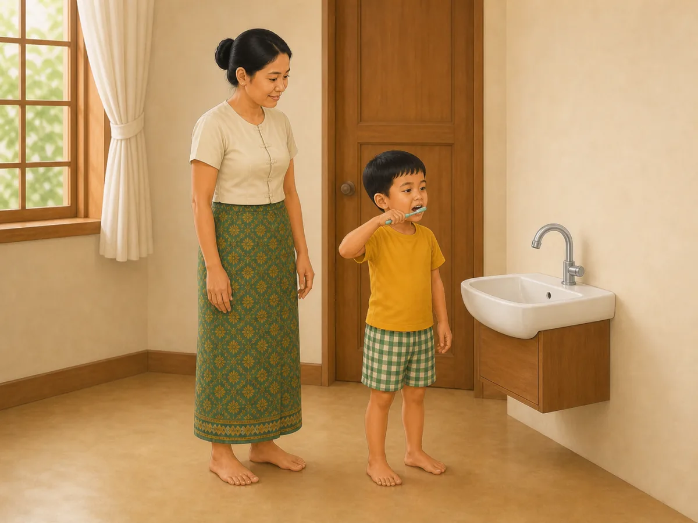
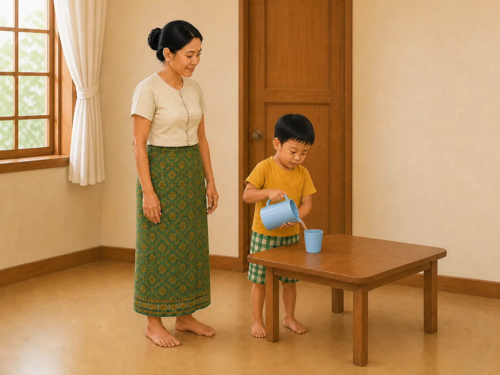
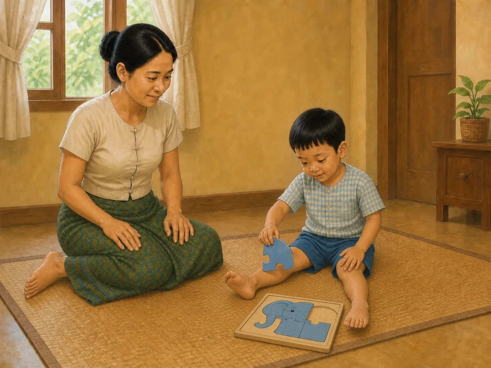
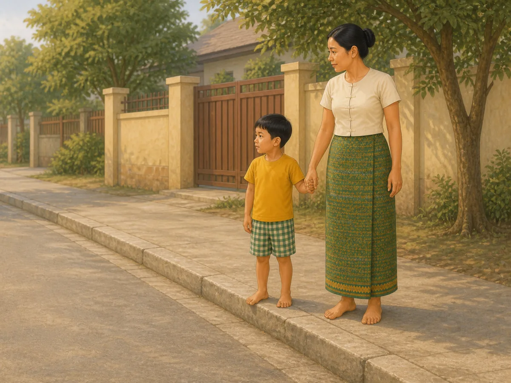
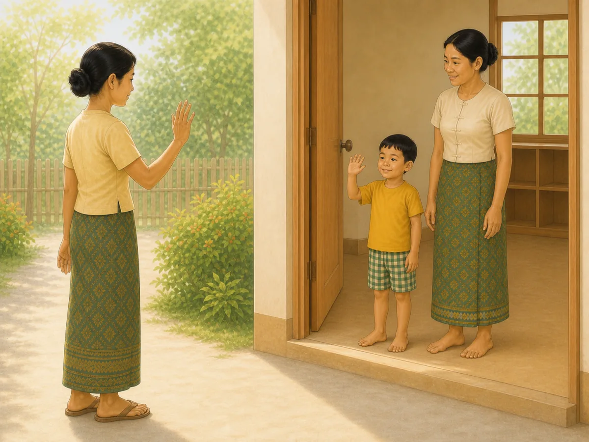
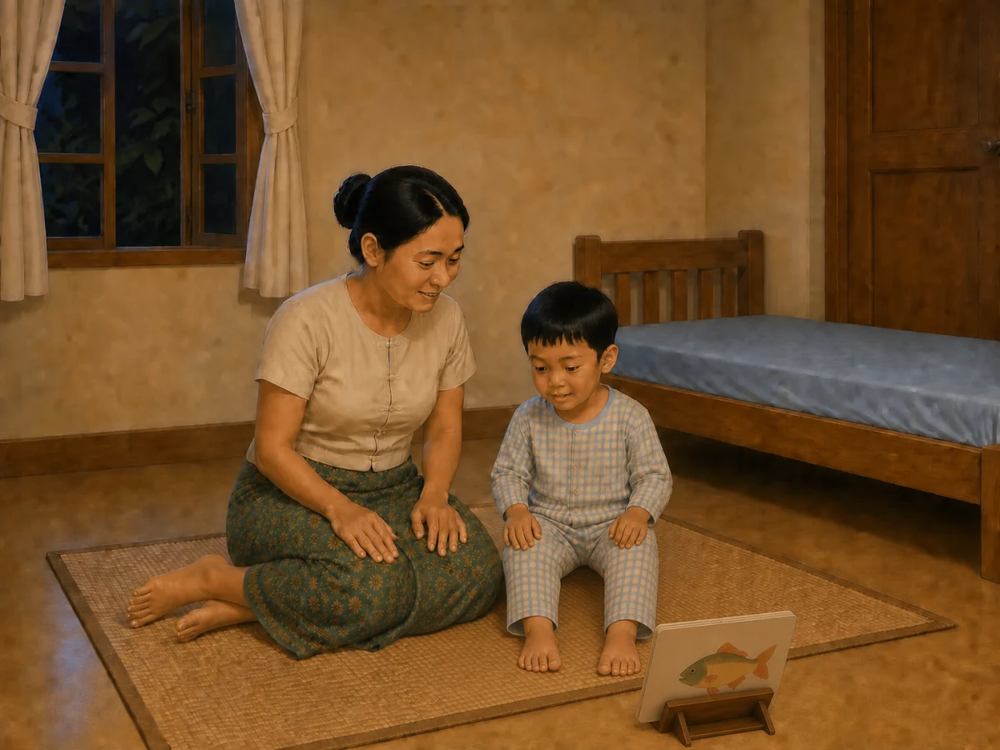

# ACE Child Grow — 4-year guide illustration review

Status: **3/6 OWNER APPROVED; 3/6 CORRECTED AND READY FOR OWNER RE-REVIEW — NOT DEPLOYED**

## Production source of truth

- Exact Production Convex filter: `type == "guide"` and `ageGroupKey == "4y"`.
- Production read performed on 2026-08-12; no Production data was modified.
- Exact result: 6 records; all have `clinicalStatus = clinical_review`.
- Every available field was read for every record: identifiers/timestamps, age group, clinical status, domain, slug, bilingual title/summary, tags, source, version/revision, priority status when present, complete search text, and every nested `data` field.
- Nested fields read include title, why/meaning, observation questions, daily/weekly/indoor/outdoor activities, low-cost activities and materials when present, safety, common mistakes, parent tips, FAQ, red flags, referral, encouragement, editorial status, and evidence summary when present.
- No required visual field is unavailable; no item is blocked.
- No local seed, constant, dump, screenshot, old image, or fallback mapping was used as content authority.

## Pre-generation review table

| Slug | Myanmar title | English title | Exact behaviour | Image scene | Must not show | Safety requirements | Status |
|---|---|---|---|---|---|---|---|
| `gd_4y_daily_routine` | ၄ နှစ် — နေ့စဉ်လုပ်ရိုးလုပ်စဉ် လမ်းညွှန် | 4 years — daily routine guide | A 4-year-old practises one predictable self-care step—brushing their own teeth—while a caregiver supervises without taking over. | In a simple Myanmar home wash area, the child stands steadily on a dry floor at one child-height basin and brushes their teeth with one child-size toothbrush; a caregiver stands within reach with empty hands and watches calmly; both complete bodies, hands and feet are visible. | Bathing, dressing, tidying, road crossing, routine chart, toothpaste tube, cup, toys, food, mirror/reflection, stool, screen, clock, letters, numbers, labels, arrows or UI. | Dry uncluttered floor; child-height stable basin; one child-size toothbrush; caregiver within reach; no medicine, sharp, hot, breakable or climbable object. | READY FOR OWNER REVIEW |
| `gd_4y_safety` | ၄ နှစ် — ဘေးကင်းလုံခြုံရေး လမ်းညွှန် | 4 years — safety guide | A 4-year-old waits at the edge of a road with a trusted adult holding their hand, showing that adults still prevent traffic hazards. | On a quiet Myanmar neighbourhood sidewalk, the child and caregiver stand fully behind the curb, holding hands and looking toward the road before crossing; the road is clear and both complete bodies, hands and feet are visible. | Crossing the road, running, moving/parked vehicles close to them, phone, water, fire, medicine, window, cord, injury, fear, police, traffic sign, written mark, arrow or UI. | Adult remains beside the child and holds the child’s hand; both stay behind the curb; dry level sidewalk; no vehicle or other active hazard enters the scene. | READY FOR OWNER REVIEW |
| `gd_4y_sleep` | ၄ နှစ် — အိပ်စက်ခြင်း လမ်းညွှန် | 4 years — sleep guide | A 4-year-old shares one calm wordless book with a caregiver as a repeatable bedtime cue instead of using a screen. | In warm dim evening light, the child in two-piece pajamas and caregiver sit together on a floor mat beside one low tidy bed; one sturdy wordless fish-picture book rests open on a low stand, both look at the page, and all hands rest separately in clear view. | Phone, tablet, television, medicine, food, drink, toothbrushing, singing, multiple books, infant cot, climbing/jumping, written letters/numbers, clock, arrows or UI. | Low stable bed and book stand; one sturdy book without loose parts; caregiver within reach; dry clear floor; no medicine, cord, screen or fall hazard. | READY FOR OWNER REVIEW |
| `gd_4y_nutrition` | ၄ နှစ် — အာဟာရ လမ်းညွှန် | 4 years — nutrition guide | A 4-year-old participates in one simple table task by carefully pouring plain water from a small unbreakable pitcher into an open unbreakable cup while a caregiver supervises. | The child stands steadily beside a low family table, holds the pitcher handle with one fully visible hand and supports its base with the other fully visible hand while pouring a small amount of clear water into one open cup; a caregiver stands within reach with empty hands. | Eating, force-feeding, food preparation, knife, hot food/drink, glass, bottle, straw, sugary drink, multiple dishes, spill, standing on furniture, screen, text or labels. | Small volume of plain water; lightweight unbreakable pitcher and cup; low stable table; dry floor; caregiver within reach; no hot, sharp, glass or choking item. | READY FOR OWNER REVIEW |
| `gd_4y_school_readiness` | ၄ နှစ် — ကျောင်းအတွက် အသင့်ဖြစ်မှု | 4 years — School Readiness | A 4-year-old copes calmly with a brief separation by joining a trusted teacher while the caregiver says goodbye. | At a simple preschool doorway, the calm child stands beside a welcoming teacher and waves once to a caregiver who is a few steps away and waves back; all three show reassuring expressions and their complete bodies, hands and feet are visible. | Crying, fear, restraint, child clinging to caregiver, reading, writing, counting, desk work, school bus, food, toys, crowd, written school sign, alphabet, numbers, arrows or UI. | Positive low-pressure separation; teacher stays beside the child; clear level doorway and floor; caregiver remains visible nearby; no food or choking item. | READY FOR OWNER REVIEW |
| `gd_4y_problem_solving` | ၄ နှစ် — ပြဿနာ ဖြေရှင်းခြင်း | 4 years — Problem Solving | A 4-year-old tries a different orientation for one large puzzle piece while a caregiver gives the child time to solve it independently. | On a clear floor mat, the child sits naturally and rotates one large rounded puzzle piece above its matching space in a simple four-piece wooden picture puzzle; the caregiver sits nearby with empty hands and an encouraging expression; complete bodies, hands and feet are visible. | Caregiver placing/pointing to the piece, finished puzzle, frustration/crying, blocks, boxes, sand, water, food, tiny pieces, letters, numbers, written marks, arrows or UI. | Four large rounded pieces with no small/choking parts; stable flat puzzle board; clear floor; caregiver within reach but hands-off; no unstable structure. | READY FOR OWNER REVIEW |

## Production record summary

| Slug | Myanmar summary | English summary | Domain | Publication status | Version / review revision |
|---|---|---|---|---|---|
| `gd_4y_daily_routine` | ၄ နှစ်အရွယ်တွင် သွားတိုက်ခြင်း၊ အဝတ်ဝတ်ခြင်းနှင့် ပစ္စည်းသိမ်းခြင်းကို ပုံမှန်အစီအစဉ်ဖြင့် လေ့ကျင့်ပါ။ | At 4 years, practise brushing, dressing, and tidying in a predictable order. | `daily_routine` | `clinical_review` | 1 / 6 |
| `gd_4y_safety` | ၄ နှစ်အရွယ်တွင် လမ်းမ၊ ရေ၊ မီး၊ ပြတင်းပေါက်နှင့် ဆေးဝါးအန္တရာယ်များကို လူကြီးက ဆက်လက်ကာကွယ်ရပါမည်။ | At 4 years, adults still need to prevent traffic, water, burn, window, and medicine hazards. | `safety` | `clinical_review` | 1 / 5 |
| `gd_4y_sleep` | ၄ နှစ်အရွယ်အတွက် ပုံမှန်အိပ်ချိန်၊ နိုးချိန်နှင့် ငြိမ်သက်သော အိပ်မီအလေ့အထ ထားပါ။ | Keep regular sleep and wake times with a calm bedtime routine at 4 years. | `sleep` | `clinical_review` | 1 / 8 |
| `gd_4y_nutrition` | ၄ နှစ်အရွယ်တွင် မိသားစုစားပွဲ၌ အုပ်စုစုံ အစားအစာနှင့် ရေကို ပုံမှန်ပေးပါ။ | At 4 years, offer varied family foods and water at regular meals. | `nutrition` | `clinical_review` | 1 / 8 |
| `gd_4y_school_readiness` | ကျောင်းအသင့်ဖြစ်မှုသည် စာဖတ်တတ်ခြင်းထက် — အလှည့်စောင့်ခြင်း၊ ခွဲနေနိုင်ခြင်းနှင့် ကိုယ်ကိုထိန်းချုပ်နိုင်ခြင်းက ပို၍ အရေးကြီးသည်။ | Readiness is less about reading and more about turn-taking, coping with separation, and self-control. | `school_readiness` | `clinical_review` | 1 / 3 |
| `gd_4y_problem_solving` | ပြဿနာ ဖြေရှင်းခြင်းသည် စိတ်ရှည်မှု၊ စီစဉ်မှုနှင့် ယုံကြည်မှုကို တည်ဆောက်ပေးသည်။ | Problem solving builds patience, planning, and confidence. | `problem_solving` | `clinical_review` | 1 / 3 |

## Owner-review items

### `gd_4y_daily_routine` — OWNER APPROVED

- Myanmar title: ၄ နှစ် — နေ့စဉ်လုပ်ရိုးလုပ်စဉ် လမ်းညွှန်
- English title: 4 years — daily routine guide
- Myanmar summary: ၄ နှစ်အရွယ်တွင် သွားတိုက်ခြင်း၊ အဝတ်ဝတ်ခြင်းနှင့် ပစ္စည်းသိမ်းခြင်းကို ပုံမှန်အစီအစဉ်ဖြင့် လေ့ကျင့်ပါ။
- English summary: At 4 years, practise brushing, dressing, and tidying in a predictable order.
- Asset: [`/public/guides/gd_4y_daily_routine.2425854507.webp`](../../public/guides/gd_4y_daily_routine.2425854507.webp) — 1200×900, 61,670 bytes
- QA: behaviour ✓ · age/body size ✓ · anatomy ✓ · hands/fingers ✓ · legs/feet ✓ · stable posture ✓ · one toothbrush/basin ✓ · caregiver hands-off supervision ✓ · dry clear floor ✓ · no unrelated action/object ✓ · culturally appropriate ✓ · wordless/no mark ✓

### `gd_4y_nutrition` — READY FOR OWNER RE-REVIEW

- Myanmar title: ၄ နှစ် — အာဟာရ လမ်းညွှန်
- English title: 4 years — nutrition guide
- Myanmar summary: ၄ နှစ်အရွယ်တွင် မိသားစုစားပွဲ၌ အုပ်စုစုံ အစားအစာနှင့် ရေကို ပုံမှန်ပေးပါ။
- English summary: At 4 years, offer varied family foods and water at regular meals.
- Asset: [`/public/guides/gd_4y_nutrition.432cc475f0.webp`](../../public/guides/gd_4y_nutrition.432cc475f0.webp) — 1200×900, 84,118 bytes
- QA: behaviour ✓ · age/body size ✓ · anatomy ✓ · both child hands/fingers fully visible ✓ · all legs/feet ✓ · controlled two-hand pour ✓ · plain water ✓ · one unbreakable pitcher/cup ✓ · caregiver supervision ✓ · no hot/sharp/glass/choking item ✓ · culturally appropriate ✓ · wordless/no mark ✓

### `gd_4y_problem_solving` — READY FOR OWNER RE-REVIEW

- Myanmar title: ၄ နှစ် — ပြဿနာ ဖြေရှင်းခြင်း
- English title: 4 years — Problem Solving
- Myanmar summary: ပြဿနာ ဖြေရှင်းခြင်းသည် စိတ်ရှည်မှု၊ စီစဉ်မှုနှင့် ယုံကြည်မှုကို တည်ဆောက်ပေးသည်။
- English summary: Problem solving builds patience, planning, and confidence.
- Asset: [`/public/guides/gd_4y_problem_solving.4570a87a16.webp`](../../public/guides/gd_4y_problem_solving.4570a87a16.webp) — 1200×900, 145,744 bytes
- QA: behaviour ✓ · age/body size ✓ · anatomy ✓ · hands/fingers ✓ · legs/feet ✓ · active piece rotation ✓ · large rounded puzzle pieces ✓ · caregiver hands-off ✓ · no answer-giving/pointing ✓ · no tiny part ✓ · culturally appropriate ✓ · wordless/no mark ✓

### `gd_4y_safety` — OWNER APPROVED

- Myanmar title: ၄ နှစ် — ဘေးကင်းလုံခြုံရေး လမ်းညွှန်
- English title: 4 years — safety guide
- Myanmar summary: ၄ နှစ်အရွယ်တွင် လမ်းမ၊ ရေ၊ မီး၊ ပြတင်းပေါက်နှင့် ဆေးဝါးအန္တရာယ်များကို လူကြီးက ဆက်လက်ကာကွယ်ရပါမည်။
- English summary: At 4 years, adults still need to prevent traffic, water, burn, window, and medicine hazards.
- Asset: [`/public/guides/gd_4y_safety.35e6619556.webp`](../../public/guides/gd_4y_safety.35e6619556.webp) — 1200×900, 124,320 bytes
- QA: behaviour ✓ · age/body size ✓ · anatomy ✓ · joined/free hands ✓ · legs/feet ✓ · both behind curb ✓ · adult within reach/holding hand ✓ · empty road/no active hazard ✓ · no crossing/running/phone ✓ · culturally appropriate ✓ · wordless/no mark ✓

### `gd_4y_school_readiness` — OWNER APPROVED

- Myanmar title: ၄ နှစ် — ကျောင်းအတွက် အသင့်ဖြစ်မှု
- English title: 4 years — School Readiness
- Myanmar summary: ကျောင်းအသင့်ဖြစ်မှုသည် စာဖတ်တတ်ခြင်းထက် — အလှည့်စောင့်ခြင်း၊ ခွဲနေနိုင်ခြင်းနှင့် ကိုယ်ကိုထိန်းချုပ်နိုင်ခြင်းက ပို၍ အရေးကြီးသည်။
- English summary: Readiness is less about reading and more about turn-taking, coping with separation, and self-control.
- Asset: [`/public/guides/gd_4y_school_readiness.44eee6681f.webp`](../../public/guides/gd_4y_school_readiness.44eee6681f.webp) — 1200×900, 102,768 bytes
- QA: behaviour ✓ · age/body size ✓ · anatomy ✓ · all six hands/fingers ✓ · all six feet ✓ · calm child expression ✓ · reassuring caregiver/teacher ✓ · low-pressure brief separation ✓ · no academics/crowd/distress ✓ · culturally appropriate ✓ · wordless/no mark ✓

### `gd_4y_sleep` — READY FOR OWNER RE-REVIEW

- Myanmar title: ၄ နှစ် — အိပ်စက်ခြင်း လမ်းညွှန်
- English title: 4 years — sleep guide
- Myanmar summary: ၄ နှစ်အရွယ်အတွက် ပုံမှန်အိပ်ချိန်၊ နိုးချိန်နှင့် ငြိမ်သက်သော အိပ်မီအလေ့အထ ထားပါ။
- English summary: Keep regular sleep and wake times with a calm bedtime routine at 4 years.
- Asset: [`/public/guides/gd_4y_sleep.ce53f5b92f.webp`](../../public/guides/gd_4y_sleep.ce53f5b92f.webp) — 1200×900, 114,278 bytes
- QA: behaviour ✓ · age/body size ✓ · anatomy ✓ · all hands/fingers separately visible ✓ · all legs/feet ✓ · shared gaze ✓ · exactly one wordless book ✓ · low tidy bed ✓ · no screen/medicine/extra routine step ✓ · culturally appropriate ✓ · wordless/no mark ✓

## Rejected-generation audit

- `gd_4y_daily_routine`: the first candidate was rejected because one child hand was hidden behind the basin and the basin support resembled a stool; the targeted regeneration uses a fixed cabinet-mounted basin and shows every hand and foot.
- `gd_4y_nutrition`: the previously reviewed candidate was rejected at release zoom QA because the pitcher partly concealed the supporting hand; the corrected regeneration shows one complete hand on the handle and one complete hand supporting the base.
- `gd_4y_problem_solving`: the previously reviewed candidate was rejected at release QA because one caregiver foot was hidden. The first correction exposed both caregiver feet but still hid one child foot; the final correction exposes both feet for both people while preserving hands-off problem solving.
- `gd_4y_safety`: initial candidate passed after original-resolution review confirmed both people remain behind the curb with all hands and feet complete.
- `gd_4y_school_readiness`: the first candidate was rejected because the outside caregiver's free hand was behind the body; the targeted regeneration shows all six hands and all six feet clearly.
- `gd_4y_sleep`: the first candidate was rejected because hand ownership below the held book was visually unclear. A later reviewed candidate put the book on a low stand but release QA found one child foot hidden. Two subsequent corrections still obscured part of one foot; the final correction moves the book stand aside and exposes both feet completely while preserving shared gaze and all four hands.

## Mapping and application verification

- Six exact slugs map directly to six different content-hashed files; no domain/category/shared fallback is used.
- All six WebP files are 1200×900 (4:3), optimized at high quality, and under 500 KB.
- Exact Myanmar and English titles were verified against Production data on every rendered card.
- Component rendering proved each exact slug overrides legacy shared media and shows its own image/title in both locales.
- Desktop and mobile browser cards passed with no overflow, missing image, stale mapping, page error, or console error.
- Browser verification proved HTTP 200, WebP MIME type, 1200×900 dimensions, and six unique image sources.
- Captured text + image cards: [daily routine](screenshots/guides-4y/gd_4y_daily_routine-desktop.jpg), [nutrition](screenshots/guides-4y/gd_4y_nutrition-desktop.jpg), [problem solving](screenshots/guides-4y/gd_4y_problem_solving-desktop.jpg), [safety](screenshots/guides-4y/gd_4y_safety-desktop.jpg), [school readiness](screenshots/guides-4y/gd_4y_school_readiness-desktop.jpg), [sleep](screenshots/guides-4y/gd_4y_sleep-desktop.jpg).

## Engineering verification

- Focused component and mapping tests: 108/108 passed after all three corrected regenerations.
- Full unit suite: 1,324/1,324 passed across 131 files.
- Typecheck: passed.
- Lint: passed.
- Playwright 4-year guide image test: passed after the final mapping update.
- Production build: passed; PWA precache generated 338 entries and accepted every asset.
- Existing unrelated React test `act(...)` warnings, `NO_COLOR`/`FORCE_COLOR` notices, and the Vite mixed static/dynamic import advisory remain; there are no 4-year asset warnings, missing imports, missing files, or broken routes.

## Deployment gate

The unchanged daily-routine, safety, and school-readiness illustrations retain the owner's earlier 4-year approval. Release QA changed nutrition, problem-solving, and sleep to correct hidden hands or feet. **Explicit owner re-approval of those three corrected previews is required before push, merge, or production deployment.** Production Convex remains read only and no clinical wording is changed.
