# ACE Child Grow — 5–6 Month Guide Illustration Review

Status: **13/13 READY FOR OWNER REVIEW — NOT DEPLOYED**

Source of truth: Production Convex `libraryContent`, read directly on 2026-08-09 and filtered to exact `type = guide`, `ageGroupKey = 5_6m`. Production contains exactly 13 matching records: 12 currently have `clinicalStatus = clinical_review`, and `gd_5_6m_social` has `clinicalStatus = published`. The owner previously removed the former `published only` illustration-eligibility restriction. Production remains read only: this run does not change clinical status, text, translations, evidence, review metadata, or any Production record.

Every top-level field and every nested `data` field was inspected for all 13 records, including title, summary, age, domain, source, tags, version, timestamps, review revision/status, priority status when present, search index, observations, activities, common mistakes, materials, safety, red flags, referral guidance, FAQs, evidence summaries, encouragement, parent tips, weekly activities, indoor/outdoor ideas, low-cost ideas, and meaning (`why`). Production contains distinct `language` and `speech` records; they are not aliases and require different scenes.

## Pre-generation review table

| Slug | Myanmar title | English title | Exact behaviour / meaning | Image scene | Must not show | Safety constraints | Status |
|---|---|---|---|---|---|---|---|
| `gd_5_6m_cognitive` | ၅ – ၆ လ — အသိဉာဏ် ဖွံ့ဖြိုးမှု လမ်းညွှန် | 5–6 months — Cognitive guide | The baby deliberately repeats an action, releases one object and looks for it where it fell, beginning to learn that actions have results. | A Myanmar/Southeast Asian 5–6-month-old lies safely in a supported side-lying position on a firm floor mat, deliberately opens one hand to release one large soft silicone ring just above the mat and looks down toward it; a seated caregiver watches within reach. | Reaching for several toys; hidden-object game; rattle shaking; sitting; crawling; standing; throwing; feeding; text, arrows or motion symbols. | Floor-level mat; awake supervision; one mouth-safe ring much larger than the mouth; no small or detachable part. | READY |
| `gd_5_6m_communication` | ၅ – ၆ လ — ဆက်သွယ်ပြောဆိုမှု လမ်းညွှန် | 5–6 months — Communication guide | The baby communicates a need for a break without words by turning the face and gaze away; the caregiver notices and pauses. | A fully supported Myanmar/Southeast Asian 5–6-month-old reclines across a seated caregiver's lap, clearly turns the head and gaze away with a calm tired expression, while the caregiver stops interacting and waits attentively with relaxed hands. | Babbling or singing; social smile; name calling; crying; toy; book; clapping; feeding; sleep; speech bubble, text or sound symbols. | Head, neck, trunk and lower body fully supported; clear airway; cue respected without forcing eye contact or stimulation. | READY |
| `gd_5_6m_daily_routine` | ၅ – ၆ လ — နေ့စဉ် လုပ်ရိုးလုပ်စဉ် လမ်းညွှန် | 5–6 months — Daily routine guide | A calm repeated care sequence lets the baby predict what comes next; the order matters more than an exact clock time. | In gentle morning light, a Myanmar/Southeast Asian caregiver calmly fastens a clean playsuit on an awake 5–6-month-old lying on the back on a floor-level changing mat, with the caregiver's other hand staying beside the baby's torso. | Clock, calendar or timetable; feed/play/sleep montage; bath; elevated table; toy; screen; sleeping; feeding; text or labels. | Floor-level mat; caregiver remains within reach; no powder cloud, plastic, cord or loose object near the baby's face. | READY |
| `gd_5_6m_emotional` | ၅ – ၆ လ — စိတ်ခံစားမှု လမ်းညွှန် | 5–6 months — Emotional guide | The baby shows mild frustration clearly and begins to settle when a calm caregiver responds with a secure hold. | A seated Myanmar/Southeast Asian caregiver securely holds a mildly frustrated 5–6-month-old against the chest; the baby's relaxed shoulders and softening face show that the feeling is beginning to settle. | Severe distress; ignored crying; shaking; punishment; stranger interaction; toy; feeding; sleeping; screen; diagnosis; text or labels. | Secure support for head, trunk, hips and feet; clear face and airway; caregiver seated calmly at floor level. | READY |
| `gd_5_6m_fine_motor` | ၅ – ၆ လ — လက်ချောင်းလေးများ လှုပ်ရှားမှု လမ်းညွှန် | 5–6 months — Fine motor guide | The baby purposefully passes one large object from one hand to the other using a whole-hand palmar grasp. | A supported Myanmar/Southeast Asian 5–6-month-old reclines safely on a caregiver's lap and looks at one large soft ring held at midline as one whole hand takes it and the other naturally releases it; both hands and all fingers are unobstructed. | Pincer grasp; small object; mouthing; several toys; caregiver forcing the hands; clapping; unsupported sitting; feeding; text or labels. | One clean ring much larger than the mouth with no detachable part; adult within reach; both hands, arms, legs and feet fully visible and anatomically natural. | READY |
| `gd_5_6m_gross_motor` | ၅ – ၆ လ — ကြွက်သားကြီး လှုပ်ရှားမှု လမ်းညွှန် | 5–6 months — Gross motor guide | During supervised tummy time the baby pushes the chest up using both straight arms as strength and head control grow. | An awake Myanmar/Southeast Asian 5–6-month-old performs tummy time on a firm floor mat, symmetrically pushing the chest up on two straight arms with steady head control while a caregiver stays at eye level within reach. | Forearm-only 3–4-month pose; rolling; unsupported sitting; crawling; standing; pillow or chest prop; toy reaching; prone sleep; text or labels. | Awake and continuously supervised; firm flat floor mat; nose and mouth clear; clear fall-free area with no small object. | READY |
| `gd_5_6m_language` | ၅ – ၆ လ — ဘာသာစကား နားလည်မှု လမ်းညွှန် | 5–6 months — Language guide | The baby recognises a familiar voice and turns the head and gaze when the caregiver calls the baby's name. | An awake Myanmar/Southeast Asian 5–6-month-old lies safely on the back on a floor mat and clearly turns the head and eyes toward a familiar caregiver speaking gently from one side. | Babbling mouth shape; gaze-away break cue; social-smile-only scene; loud noise; clapping; musical toy; book; screen; text or sound symbols. | Quiet room; normal gentle voice; no loud-noise source or object near the ear; caregiver within reach. | READY |
| `gd_5_6m_nutrition` | ၅–၆ လ — အာဟာရ (အစိုင်အခဲ စတင်ခြင်း) | 5–6 months — Nutrition (starting solids) | At around 6 months, a developmentally ready baby holds the head steady, sits fully supported, shows interest and opens the mouth for a very small amount of smooth food. | A Myanmar/Southeast Asian baby near 6 months sits upright in a fully supportive high-back infant feeding seat with a secured harness and steady head; an attentive caregiver offers one tiny spoonful of smooth plain purée as the baby opens the mouth. | Unsupported sitting; baby holding spoon or bowl; bottle holding; chunks; honey; nuts; whole grapes; salt or sugar; forced feeding; several foods; text or labels. | Continuous adult supervision; upright fully supported posture; one soft spoon and small bowl; smooth choking-safe texture; clear airway; no honey or choking shape. | READY |
| `gd_5_6m_play` | ၅–၆ လ — ကစားခြင်း | 5–6 months — Play | The baby explores one safe toy by holding it, looking at it and feeling its texture during supervised play. | A Myanmar/Southeast Asian 5–6-month-old lies safely on the back, looks directly at one large textured soft ball and explores its surface with two open hands while a caregiver responds nearby. | Mouthing; object transfer; dropping; several toys; mirror; screen; unsupported sitting; crawling; feeding; text or labels. | Awake supervised floor play; one clean soft ball much larger than the mouth with no loose thread, small part, cord or detachable piece. | READY |
| `gd_5_6m_safety` | ၅ – ၆ လ — ဘေးကင်းလုံခြုံရေး လမ်းညွှန် | 5–6 months — Safety guide | Because the baby now rolls and reaches, a clear floor-level play space prevents falls better than placing the baby on a bed or sofa. | A Myanmar/Southeast Asian 5–6-month-old begins a natural side roll on a clean firm floor mat in a completely clear area while a caregiver kneels within arm's reach and watches attentively. | Bed, sofa, table or other height; unattended baby; walker; choking object; water; hot drink; cord; plastic bag; hazard montage; text or labels. | Floor-level fall-free space; direct awake supervision; no small item, water container, hot object, cord or plastic anywhere in reach. | READY |
| `gd_5_6m_sleep` | ၅ – ၆ လ — အိပ်စက်ခြင်း လမ်းညွှန် | 5–6 months — Sleep guide | Every sleep starts on the back on a firm, flat, empty infant sleep surface, even when the baby can roll independently. | A Myanmar/Southeast Asian 5–6-month-old sleeps alone on the back in the centre of a simple cot on a firm flat mattress with a taut fitted sheet, face fully clear and arms naturally positioned. | Side or prone sleep; pillow; blanket or light cover; bumper; teddy/stuffed toy; loose cloth; swaddle; weighted item; incline; adult bed; sofa; monitor; text or labels. | Exact safe-sleep scene: back, firm flat non-inclined mattress, empty cot, fitted sheet only, clear airway and no overheating cue. | READY |
| `gd_5_6m_social` | ၅ – ၆ လ — လူမှုဆက်ဆံရေး လမ်းညွှန် | 5–6 months — Social guide | The baby recognises a familiar caregiver; the face brightens and the baby gives a warm shared smile while the caregiver provides supported sitting. | Preserve the existing unique approved image: a Myanmar/Southeast Asian 5–6-month-old is securely supported on the mother's lap, looks up and smiles warmly at the familiar mother while another family member stays nearby. | Forced handover; crying with a stranger; crowd; toy; babbling; feeding; waving; unsupported sitting; text or labels. | Mother supports the baby's trunk and hips; both legs and feet are visible; no forced stranger contact, smoke or unsafe hold. | EXISTING OWNER-APPROVED — PRESERVE |
| `gd_5_6m_speech` | ၅ – ၆ လ — စကားသံ ထွက်ဆိုမှု လမ်းညွှန် | 5–6 months — Speech guide | The baby practises consonant babble and takes a vocal turn after the caregiver imitates and pauses. | A fully supported Myanmar/Southeast Asian 5–6-month-old faces a seated caregiver, makes a clear natural babbling mouth shape and looks engaged while the caregiver listens during the baby's turn. | Name-call head turn; gaze-away break cue; social-smile-only scene; singing; speech bubble; letters; sound symbols; rattle; phone/TV; feeding; text. | Secure head, trunk, hips and lower-body support; quiet face-to-face interaction; no loud-noise source, smoke or object near the ear. | READY |

## Pre-generation confirmation

- All 13 concepts use exact Production titles, summaries, age group, domain, observation fields, nested meaning and safety guidance: **PASS**
- Production contains 13 exact slugs, including separate `language` and `speech` records: **PASS**
- Twelve new concepts have distinct central behaviours; the existing unique social asset remains directly mapped only to `gd_5_6m_social`: **PASS**
- Every posture and level of independence matches 5–6 months: **PASS**
- Sleep follows the back-sleeping, firm-flat-mattress, fitted-sheet-only, empty-cot rule: **PASS**
- Feeding is fully supported, upright and continuously supervised with one tiny spoonful of smooth food and no honey or choking shape: **PASS**
- Movement and play take place awake, supervised and at floor level; the baby does not crawl, stand or sit unsupported: **PASS**
- No red flag, diagnosis, emergency or unsafe act is dramatised: **PASS**
- Every new image will be Myanmar/Southeast Asian, warm, wordless, landscape 4:3 and understandable without reading: **PASS**
- No new image was generated before this table was completed: **PASS**

## Existing social-asset audit

- Asset: `/guides/gd_5_6m_social.f45ff11649.webp`
- Unique direct slug mapping: **PASS**
- Published Production title, summary, observation and safety meaning: **PASS**
- Familiar-person response and shared smile: **PASS**
- 5–6-month size and fully supported posture: **PASS**
- Natural face, gaze, hands, fingers, legs and two visible feet: **PASS**
- No unrelated action, unsafe object, text, logo or watermark: **PASS**
- Myanmar/Southeast Asian family and culturally appropriate warm style: **PASS**

## Owner-override boundary

The owner authorized illustration work for `clinical_review` records on 2026-08-09 and removed the former `published only` eligibility rule. This does not authorize editing clinical wording, translations, evidence, review metadata, or Production Convex status. Deployment remains disabled until the owner reviews and explicitly approves all 13 final text-and-image cards.

## Owner review cards

### `gd_5_6m_cognitive`

- Myanmar title: ၅ – ၆ လ — အသိဉာဏ် ဖွံ့ဖြိုးမှု လမ်းညွှန်
- English title: 5–6 months — Cognitive guide
- Production Myanmar summary: ဤအရွယ်တွင် ကလေးသည် "ငါ လုပ်လိုက်ရင် ဘာဖြစ်မလဲ" ဟု စတင် စူးစမ်းနေသည်။ ပစ္စည်းကို ချလိုက်လျှင် အသံမြည်သည်ကို သဘောကျပြီး ထပ်ခါထပ်ခါ လုပ်တတ်သည်။ ကျသွားသော ပစ္စည်းကို လိုက်ရှာခြင်းသည် မျက်စိရှေ့တွင် မမြင်ရသော်လည်း ပစ္စည်းရှိနေဆဲဖြစ်ကြောင်း စတင်နားလည်လာခြင်း ဖြစ်သည်။
- Production English summary: She is starting to learn "what happens if I do this?". Dropping something and hearing it land is fascinating, so she does it again and again. Looking for a dropped toy is the beginning of understanding that things still exist when out of sight.
- Asset: `/guides/gd_5_6m_cognitive.97a0fd0b5b.webp` — 1200×900 — 118,400 bytes

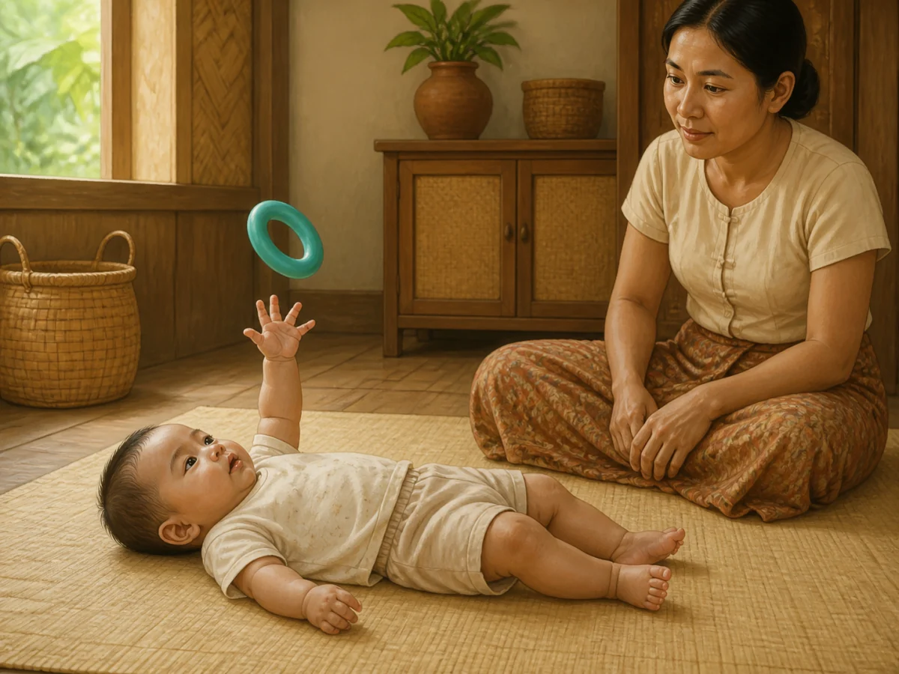

QA: behaviour ✓ · age ✓ · anatomy ✓ · hands/fingers ✓ · legs/feet ✓ · gaze follows one released ring ✓ · one mouth-safe object only ✓ · lying floor posture ✓ · culturally appropriate ✓ · wordless ✓

**READY FOR OWNER REVIEW**

### `gd_5_6m_communication`

- Myanmar title: ၅ – ၆ လ — ဆက်သွယ်ပြောဆိုမှု လမ်းညွှန်
- English title: 5–6 months — Communication guide
- Production Myanmar summary: ကလေးသည် စကားလုံး မသုံးဘဲ ဆက်သွယ်တတ်နေပြီ ဖြစ်သည် — မျက်လုံးချင်းဆုံခြင်း၊ ပြုံးခြင်း၊ လက်လှမ်းခြင်း၊ မျက်နှာလွှဲခြင်း တို့ဖြင့် "ဆက်ကစားချင်တယ်" သို့မဟုတ် "အနားယူချင်ပြီ" ဟု ပြောနေခြင်း ဖြစ်သည်။ မိဘက ဤအချက်ပြမှုများကို သတိထားမိပြီး တုံ့ပြန်ပေးခြင်းသည် ကလေး၏ ဆက်သွယ်မှု စွမ်းရည်ကို အခိုင်မာဆုံး တည်ဆောက်ပေးသည်။
- Production English summary: She already communicates without words — eye contact, smiling, reaching, and turning away all say "more please" or "I need a break". Noticing these signals and answering them is what builds communication most strongly.
- Asset: `/guides/gd_5_6m_communication.3f70d31d54.webp` — 1200×900 — 124,450 bytes

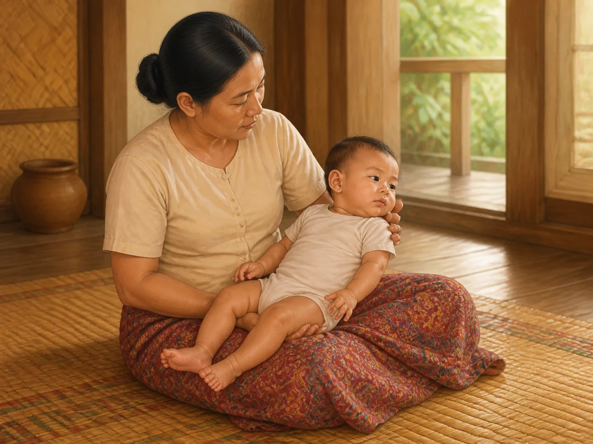

QA: behaviour ✓ · age ✓ · anatomy ✓ · hands/fingers ✓ · legs/feet ✓ · clear gaze-away break cue ✓ · caregiver pauses and respects cue ✓ · full support and clear airway ✓ · no babbling or object ✓ · culturally appropriate ✓ · wordless ✓

**READY FOR OWNER REVIEW**

### `gd_5_6m_daily_routine`

- Myanmar title: ၅ – ၆ လ — နေ့စဉ် လုပ်ရိုးလုပ်စဉ် လမ်းညွှန်
- English title: 5–6 months — Daily routine guide
- Production Myanmar summary: တည်ငြိမ်သော နေ့စဉ် အစီအစဉ်သည် ကလေးအား "နောက်တစ်ခု ဘာလာမလဲ" ကို ကြိုတင် သိစေပြီး လုံခြုံစိတ်ချမှု ဖြစ်စေသည်။ အချိန်တိကျရန် မလိုပါ — အစီအစဉ်၏ အစဉ်လိုက်သည်သာ အရေးကြီးသည်။ ဤအရွယ်တွင် နေ့စဉ်တွင် နို့တိုက်ခြင်း၊ ကစားခြင်း၊ အနားယူခြင်း၊ အိပ်ခြင်း တို့ကို ထပ်ခါထပ်ခါ လှည့်ပတ်နေခြင်း ဖြစ်သည်။
- Production English summary: A steady daily rhythm lets her predict what comes next, and that feels safe. Exact clock times do not matter — the order does. The day is a repeating cycle of feeding, playing, resting and sleeping.
- Asset: `/guides/gd_5_6m_daily_routine.7a2b5f0311.webp` — 1200×900 — 147,494 bytes

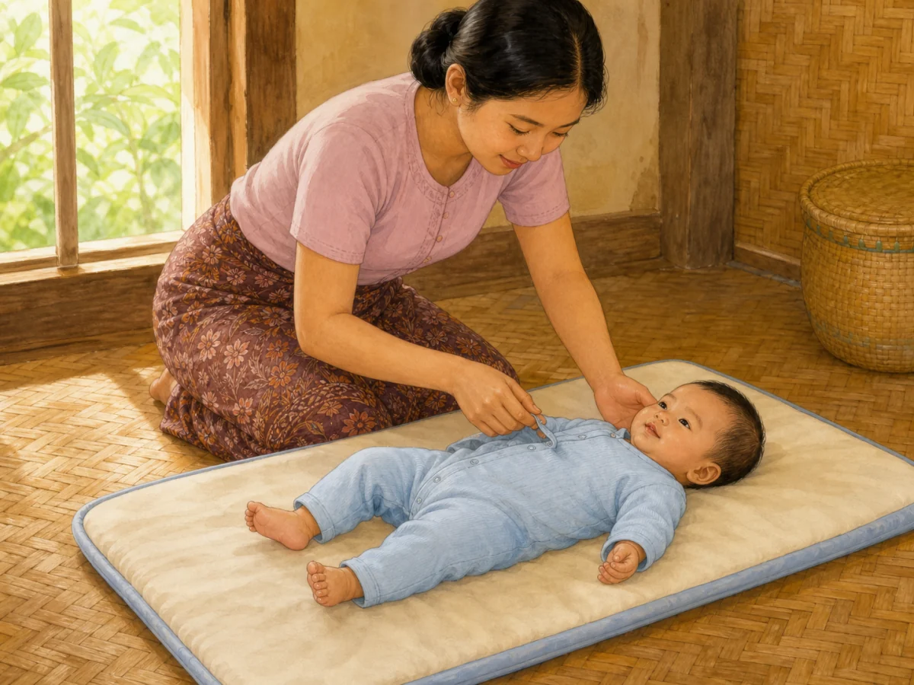

QA: behaviour ✓ · age ✓ · anatomy ✓ · hands/fingers ✓ · legs/feet ✓ · calm repeated dressing step ✓ · fully clothed floor-level care ✓ · no clock, montage or elevated surface ✓ · culturally appropriate ✓ · wordless ✓

**READY FOR OWNER REVIEW**

### `gd_5_6m_emotional`

- Myanmar title: ၅ – ၆ လ — စိတ်ခံစားမှု လမ်းညွှန်
- English title: 5–6 months — Emotional guide
- Production Myanmar summary: ကလေးသည် ပျော်ရွှင်ခြင်း၊ စိတ်ဆိုးခြင်း၊ အံ့သြခြင်းကို ပိုမို ရှင်းလင်းစွာ ပြသတတ်လာသည်။ မိဘက ငြိမ်သက်စွာ တုံ့ပြန်ပေးခြင်းသည် ကလေး၏ စိတ်ခံစားမှုကို ကိုယ်တိုင် ထိန်းညှိတတ်လာစေရန် အခြေခံ ဖြစ်သည်။ မိဘ၏ စိတ်ကျန်းမာရေးသည် ကလေး၏ ဖွံ့ဖြိုးမှုနှင့် တိုက်ရိုက် ဆက်စပ်နေသဖြင့် မိဘကိုယ်တိုင် ကူညီမှု ရယူခြင်းသည်လည်း ကလေးအတွက် စောင့်ရှောက်မှု ဖြစ်သည်။
- Production English summary: She now shows joy, frustration and surprise more clearly. Your calm response is what teaches her to settle her own feelings later. A parent’s own mental health is directly linked to a child’s development, so getting support for yourself is also care for her.
- Asset: `/guides/gd_5_6m_emotional.edccb2ce38.webp` — 1200×900 — 105,076 bytes

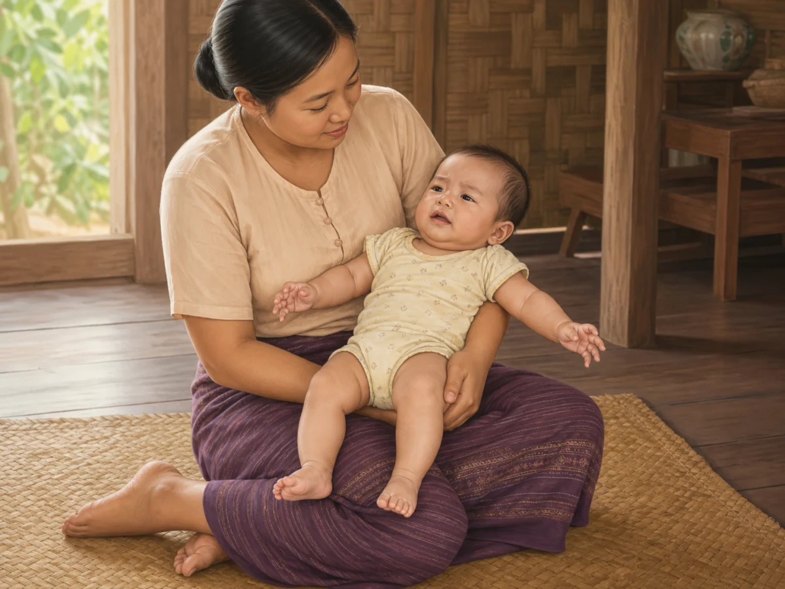

QA: behaviour ✓ · age ✓ · anatomy ✓ · two visible natural hands ✓ · two visible natural feet ✓ · mild frustration visibly settling ✓ · secure supported hold and clear airway ✓ · no severe distress or unrelated action ✓ · culturally appropriate ✓ · wordless ✓

**READY FOR OWNER REVIEW**

### `gd_5_6m_fine_motor`

- Myanmar title: ၅ – ၆ လ — လက်ချောင်းလေးများ လှုပ်ရှားမှု လမ်းညွှန်
- English title: 5–6 months — Fine motor guide
- Production Myanmar summary: ဤအရွယ်တွင် ကလေးသည် ပစ္စည်းကို ရည်ရွယ်ချက်ရှိရှိ လှမ်းယူတတ်လာပြီး လက်တစ်ဖက်မှ တစ်ဖက်သို့ လွှဲပြောင်းနိုင်လာသည်။ လက်ဝါးတစ်ခုလုံးဖြင့် ဆုပ်ကိုင်ခြင်းသည် ဤအရွယ်တွင် ပုံမှန်ဖြစ်သည်။ ကိုင်မိသမျှကို ပါးစပ်ထဲ ထည့်ခြင်းသည် ရောဂါလက္ခဏာ မဟုတ်ဘဲ ပတ်ဝန်းကျင်ကို လေ့လာသင်ယူသည့် နည်းလမ်းတစ်ခု ဖြစ်သည်။
- Production English summary: Babies now reach on purpose and pass an object from hand to hand. A whole-hand palmar grasp is normal at this stage. Mouthing everything is not a problem — it is how she explores.
- Asset: `/guides/gd_5_6m_fine_motor.f1d6e9d0b0.webp` — 1200×900 — 121,530 bytes

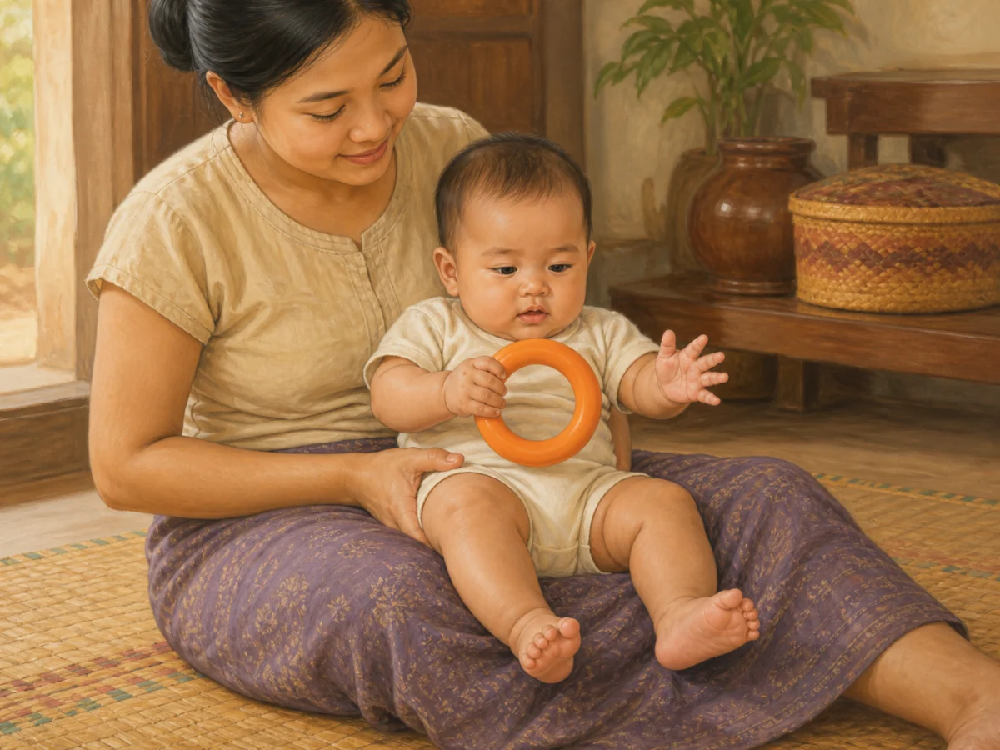

QA: behaviour ✓ · age ✓ · anatomy ✓ · two separate natural hands/fingers ✓ · two separate natural feet ✓ · one hand palmar-grips while the other releases ✓ · gaze at one large safe ring ✓ · no pincer grasp or mouthing ✓ · culturally appropriate ✓ · wordless ✓

**READY FOR OWNER REVIEW**

### `gd_5_6m_gross_motor`

- Myanmar title: ၅ – ၆ လ — ကြွက်သားကြီး လှုပ်ရှားမှု လမ်းညွှန်
- English title: 5–6 months — Gross motor guide
- Production Myanmar summary: ဤအရွယ်တွင် ကလေးအများစုသည် လှိမ့်နိုင်လာပြီး ထောက်ပံ့ပေးလျှင် ခဏ ထိုင်နိုင်တတ်သည်။ ကြွက်သားများ တစ်ပြေးညီ ဖွံ့ဖြိုးလာသဖြင့် လက်နှစ်ဖက်ဖြင့် ထောက်၍ ရင်ဘတ်ကို မြင့်မြင့် မြှင့်နိုင်သည်။ ကလေးတိုင်း အချိန်တူ မဟုတ်ပါ — အချို့က ၄ လတွင် လှိမ့်ပြီး အချို့က ၆ လကျော်မှ လှိမ့်သည်။ ဤသည် ပုံမှန် ကွဲပြားမှု ဖြစ်သည်။
- Production English summary: Most babies now roll and can sit briefly with support. Stronger muscles let them push up on straight arms during tummy time. Timing varies widely — some roll at 4 months, others after 6. That is normal variation.
- Asset: `/guides/gd_5_6m_gross_motor.d99d468e14.webp` — 1200×900 — 124,744 bytes

QA: behaviour ✓ · age ✓ · anatomy ✓ · two straight arms/open palms ✓ · legs/feet ✓ · steady head and raised chest ✓ · awake supervised floor tummy time ✓ · no crawling, sitting or prop ✓ · culturally appropriate ✓ · wordless ✓

**READY FOR OWNER REVIEW**

### `gd_5_6m_language`

- Myanmar title: ၅ – ၆ လ — ဘာသာစကား နားလည်မှု လမ်းညွှန်
- English title: 5–6 months — Language guide
- Production Myanmar summary: ကလေးသည် စကားမပြောနိုင်သေးသော်လည်း နားလည်မှု စတင်တည်ဆောက်နေပြီ ဖြစ်သည်။ မိမိအမည်ကို ခေါ်လျှင် လှည့်ကြည့်တတ်လာသည်။ အသိအသံနှင့် အသစ်အသံကို ခွဲခြားတတ်သည်။ မိဘ ပြောသော စကားလုံး အရေအတွက်နှင့် အပြန်အလှန် ပြောဆိုမှုသည် နောင်နှစ်များ၏ ဘာသာစကား စွမ်းရည်နှင့် ဆက်စပ်နေသည်။
- Production English summary: She cannot speak yet, but understanding is already being built. She turns when her name is called and tells a familiar voice from a new one. How much you talk with her — especially back-and-forth turns — is linked to her later language.
- Asset: `/guides/gd_5_6m_language.a18e680d90.webp` — 1200×900 — 160,526 bytes

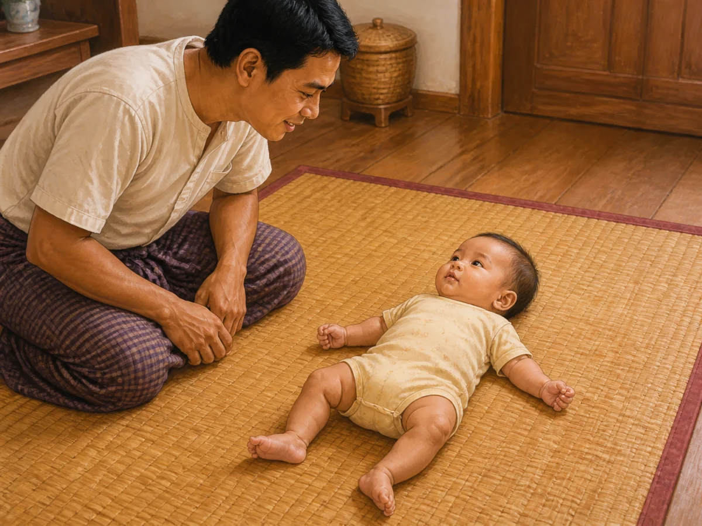

QA: behaviour ✓ · age ✓ · anatomy ✓ · hands/fingers ✓ · legs/feet ✓ · head and gaze turn to familiar name-call ✓ · gentle quiet voice only ✓ · no babbling, sound object or extra action ✓ · culturally appropriate ✓ · wordless ✓

**READY FOR OWNER REVIEW**

### `gd_5_6m_nutrition`

- Myanmar title: ၅–၆ လ — အာဟာရ (အစိုင်အခဲ စတင်ခြင်း)
- English title: 5–6 months — Nutrition (starting solids)
- Production Myanmar summary: ၆ လခန့်တွင် အစိုင်အခဲ စတင်ခြင်းသည် ကြီးထွားမှုနှင့် အရသာ သင်ယူမှုအတွက် အရေးကြီးသည်။
- Production English summary: Around 6 months, starting solids supports growth and taste learning.
- Asset: `/guides/gd_5_6m_nutrition.1c900fe81c.webp` — 1200×900 — 115,714 bytes

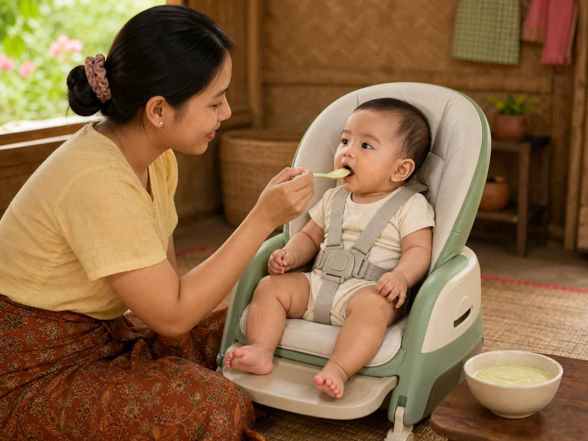

QA: behaviour ✓ · near-6-month age ✓ · anatomy ✓ · hands/fingers ✓ · legs/feet ✓ · steady head and fully supported upright posture ✓ · caregiver-held soft spoon ✓ · tiny smooth food only ✓ · no honey/chunks/self-feeding ✓ · culturally appropriate ✓ · wordless ✓

**READY FOR OWNER REVIEW**

### `gd_5_6m_play`

- Myanmar title: ၅–၆ လ — ကစားခြင်း
- English title: 5–6 months — Play
- Production Myanmar summary: ကစားခြင်းသည် ကလေး၏ အလုပ်ဖြစ်၍ ဦးနှောက်၊ ခန္ဓာကိုယ်နှင့် ဆက်ဆံရေးကို ဖွံ့ဖြိုးစေသည်။
- Production English summary: Play is a child’s work — it grows brain, body, and bonds.
- Asset: `/guides/gd_5_6m_play.63ec9daa99.webp` — 1200×900 — 155,810 bytes

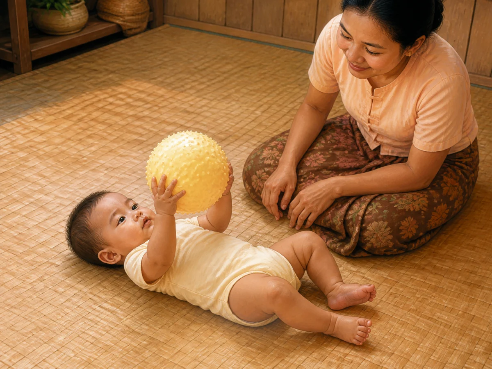

QA: behaviour ✓ · age ✓ · anatomy ✓ · two natural hands on one toy ✓ · two visible feet ✓ · focused gaze at texture ✓ · lying floor posture ✓ · one large one-piece soft ball only ✓ · no mouthing/transfer/drop ✓ · culturally appropriate ✓ · wordless ✓

**READY FOR OWNER REVIEW**

### `gd_5_6m_safety`

- Myanmar title: ၅ – ၆ လ — ဘေးကင်းလုံခြုံရေး လမ်းညွှန်
- English title: 5–6 months — Safety guide
- Production Myanmar summary: ကလေး လှိမ့်နိုင်လာပြီး ပစ္စည်းကို လှမ်းယူတတ်လာသည်နှင့်အမျှ အန္တရာယ် အသစ်များ ပေါ်လာနိုင်သည် — လိမ့်ကျခြင်း၊ လည်ချောင်းပိတ်ခြင်း၊ ရေနစ်ခြင်း၊ မီးလောင်ခြင်း တို့ ဖြစ်သည်။ ဤအရွယ်တွင် ပတ်ဝန်းကျင်ကို ကြိုတင် ပြင်ဆင်ထားခြင်းသည် ကလေးကို အမြဲ ကြည့်နေရခြင်းထက် ပိုမို ထိရောက်ပါသည်။
- Production English summary: As she rolls and reaches, new risks appear — falls, choking, drowning and burns. At this stage, preparing the environment in advance protects her better than constant watching alone.
- Asset: `/guides/gd_5_6m_safety.0baf304cd9.webp` — 1200×900 — 146,448 bytes

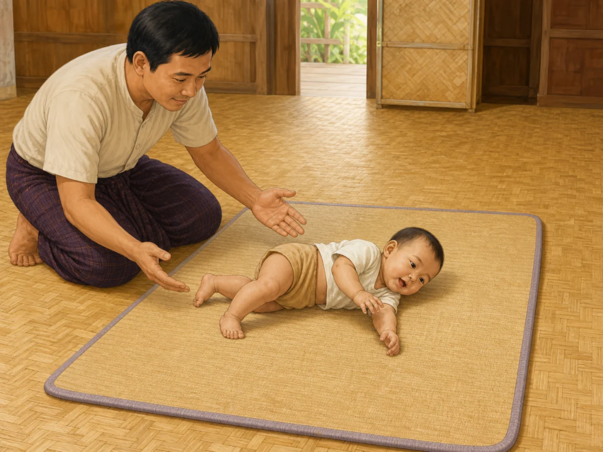

QA: behaviour ✓ · age ✓ · anatomy ✓ · hands/fingers ✓ · legs/feet ✓ · natural side roll on clear floor mat ✓ · caregiver within arm's reach ✓ · no elevated surface or hazard object ✓ · culturally appropriate ✓ · wordless ✓

**READY FOR OWNER REVIEW**

### `gd_5_6m_sleep`

- Myanmar title: ၅ – ၆ လ — အိပ်စက်ခြင်း လမ်းညွှန်
- English title: 5–6 months — Sleep guide
- Production Myanmar summary: အသက် ၄–၁၁ လအရွယ်တွင် စုစုပေါင်း အိပ်ချိန် ၁၂–၁၆ နာရီခန့် (နေ့အိပ် အပါအဝင်) ဖြစ်တတ်သည်။ ကလေးအများစုသည် ညဘက် အိပ်ချိန် ရှည်လာသော်လည်း ညတွင် နိုးခြင်းသည် ဤအရွယ်၌ ပုံမှန်ပင် ဖြစ်သည်။ ကလေး လှိမ့်နိုင်လာသဖြင့် အိပ်ရာ လုံခြုံမှုသည် ယခင်ထက်ပင် ပိုအရေးကြီးလာသည်။
- Production English summary: At 4–11 months total sleep is commonly about 12–16 hours including naps. Night stretches usually lengthen, but waking at night is still normal at this age. Now that she rolls, a safe sleep space matters more than ever.
- Asset: `/guides/gd_5_6m_sleep.432e63096b.webp` — 1200×900 — 77,868 bytes

QA: safe-sleep behaviour ✓ · age ✓ · anatomy ✓ · hands/fingers ✓ · legs/feet ✓ · on back ✓ · firm flat fitted-sheet-only mattress ✓ · empty cot ✓ · clear face and airway ✓ · no pillow/blanket/bumper/toy/loose cloth ✓ · culturally appropriate ✓ · wordless ✓

**READY FOR OWNER REVIEW**

### `gd_5_6m_social`

- Myanmar title: ၅ – ၆ လ — လူမှုဆက်ဆံရေး လမ်းညွှန်
- English title: 5–6 months — Social guide
- Production Myanmar summary: ဤအရွယ်တွင် ကလေးသည် ရင်းနှီးသူနှင့် မရင်းနှီးသူကို ခွဲခြားတတ်လာသည်။ မိဘကို မြင်လျှင် ပိုပျော်ပြီး မရင်းနှီးသူကို မြင်လျှင် ခေါင်းလှည့်ခြင်း သို့မဟုတ် ငိုခြင်း ရှိတတ်သည်။ ယင်းသည် ရှက်တတ်ခြင်းကြောင့် မဟုတ်ဘဲ ပြုစုစောင့်ရှောက်သူနှင့် စိတ်ချလုံခြုံစွာ ချိတ်ဆက်မှု ဖွံ့ဖြိုးလာခြင်း ဖြစ်သည်။
- Production English summary: She now tells familiar people from strangers. She may light up for you and turn away or cry with someone new. This is not shyness to be corrected — it is healthy attachment developing.
- Asset: `/guides/gd_5_6m_social.f45ff11649.webp` — 1200×900 — 137,830 bytes

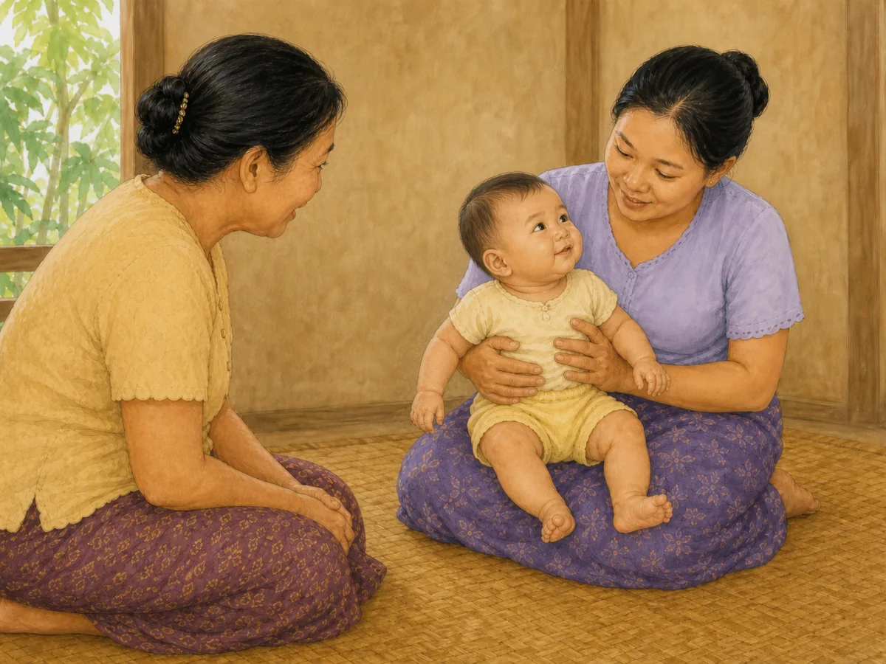

QA: behaviour ✓ · age ✓ · anatomy ✓ · hands/fingers ✓ · two visible feet ✓ · face brightens toward familiar mother ✓ · supported sitting ✓ · no forced stranger contact or unrelated action ✓ · culturally appropriate ✓ · wordless ✓

**READY FOR OWNER REVIEW — EXISTING OWNER-APPROVED ASSET PRESERVED**

### `gd_5_6m_speech`

- Myanmar title: ၅ – ၆ လ — စကားသံ ထွက်ဆိုမှု လမ်းညွှန်
- English title: 5–6 months — Speech guide
- Production Myanmar summary: ဤအရွယ်တွင် ကလေးသည် သရသံများမှ တစ်ဆင့် "ဘဘ"၊ "ဒဒ"၊ "မမ" သကဲ့သို့ ဗျည်းသံပါသော အသံတွဲများ စတင်ထွက်လာသည်။ ယင်းတို့သည် အဓိပ္ပာယ်ရှိသော စကားလုံးများ မဟုတ်သေးဘဲ စကားပြောရန် ပါးစပ်နှင့် လျှာကို လေ့ကျင့်နေခြင်း ဖြစ်သည်။ မိဘက အပြန်အလှန် တုံ့ပြန်ပေးလေလေ ကလေးကလည်း အသံပိုထွက်လေလေ ဖြစ်သည်။
- Production English summary: Vowel cooing now grows into consonant babble — "ba-ba", "da-da", "ma-ma". Babbling is not words yet; it is the mouth and tongue practising for speech. The more you answer, the more she babbles.
- Asset: `/guides/gd_5_6m_speech.7a0f1ebe34.webp` — 1200×900 — 84,978 bytes

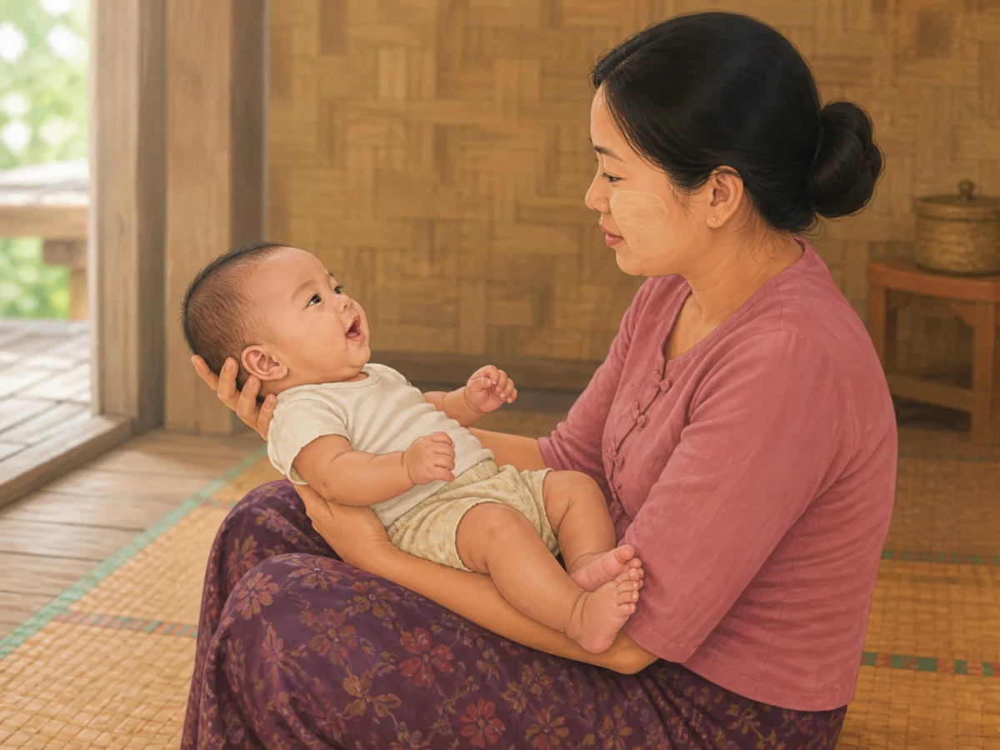

QA: behaviour ✓ · age ✓ · anatomy ✓ · hands/fingers ✓ · two visible feet ✓ · consonant-babble mouth shape ✓ · caregiver listens with lips closed ✓ · secure full support ✓ · no name-call, sound object or text ✓ · culturally appropriate ✓ · wordless ✓

**READY FOR OWNER REVIEW**

## Mapping and asset verification

- Exact Production slugs covered: **13/13**
- Unique direct asset paths: **13/13**
- Domain/category/type/age-group fallbacks: **0**
- Existing social image preserved without overwrite: **PASS**
- New hashed filenames without overwrite: **12/12**
- WebP format at 1200×900 landscape 4:3: **13/13**
- Assets below 500 KB: **13/13**
- Filename hash matches the first 10 characters of SHA-256 content digest: **13/13**
- Missing mapped files: **0**
- Focused mapping and detail-render tests: **46/46 PASS**
- Deployment status: **NOT DEPLOYED — OWNER APPROVAL REQUIRED**

## Running application verification

The real local application was started first. Its authenticated content route correctly presented the sign-in gate; no account was created and no credential, browser storage, or Production record was accessed or changed. To verify the authenticated card UI without crossing that boundary, a separate read-only local review harness rendered the real `ContentDetail` component, the production-build stylesheet, the exact direct slug mapping, and the exact Production title/summary snapshot used in this review. The harness displayed `LOCAL REVIEW — PRODUCTION TEXT SNAPSHOT — NO DATABASE WRITES` and was not added to the application.

- Exact Production guide cards rendered: **13/13**
- Desktop checks at 1024×900: image loaded, natural size 1200×900, exact title/alt, exact direct path, 13 unique paths, no horizontal overflow: **PASS**
- Mobile checks at 390×844: same exact path as desktop, image loaded, natural size 1200×900, exact title/alt, 13 unique paths, no horizontal overflow: **PASS**
- Missing, duplicated, stale, fallback or wrong-slug image: **0**
- Desktop text-and-image screenshots captured: **13/13**

| Slug | Verified text + image card |
|---|---|
| `gd_5_6m_cognitive` | [desktop screenshot](screenshots/guides-5_6m/01-gd_5_6m_cognitive-desktop.png) |
| `gd_5_6m_communication` | [desktop screenshot](screenshots/guides-5_6m/02-gd_5_6m_communication-desktop.png) |
| `gd_5_6m_daily_routine` | [desktop screenshot](screenshots/guides-5_6m/03-gd_5_6m_daily_routine-desktop.png) |
| `gd_5_6m_emotional` | [desktop screenshot](screenshots/guides-5_6m/04-gd_5_6m_emotional-desktop.png) |
| `gd_5_6m_fine_motor` | [desktop screenshot](screenshots/guides-5_6m/05-gd_5_6m_fine_motor-desktop.png) |
| `gd_5_6m_gross_motor` | [desktop screenshot](screenshots/guides-5_6m/06-gd_5_6m_gross_motor-desktop.png) |
| `gd_5_6m_language` | [desktop screenshot](screenshots/guides-5_6m/07-gd_5_6m_language-desktop.png) |
| `gd_5_6m_nutrition` | [desktop screenshot](screenshots/guides-5_6m/08-gd_5_6m_nutrition-desktop.png) |
| `gd_5_6m_play` | [desktop screenshot](screenshots/guides-5_6m/09-gd_5_6m_play-desktop.png) |
| `gd_5_6m_safety` | [desktop screenshot](screenshots/guides-5_6m/10-gd_5_6m_safety-desktop.png) |
| `gd_5_6m_sleep` | [desktop screenshot](screenshots/guides-5_6m/11-gd_5_6m_sleep-desktop.png) |
| `gd_5_6m_social` | [desktop screenshot](screenshots/guides-5_6m/12-gd_5_6m_social-desktop.png) |
| `gd_5_6m_speech` | [desktop screenshot](screenshots/guides-5_6m/13-gd_5_6m_speech-desktop.png) |

Representative mobile safe-sleep card: [390×844 screenshot](screenshots/guides-5_6m/11-gd_5_6m_sleep-mobile.png).

## Engineering verification

- Focused guide mapping and `ContentDetail` rendering tests: **46/46 PASS**
- Full unit suite: **1,197/1,197 PASS** across 121 files
- Typecheck: **PASS**
- Lint: **PASS**
- Production build: **PASS**
- PWA precache: **284 entries accepted**
- Missing import, missing asset, broken route or asset-related warning: **0**
- Production Convex writes: **0**
- Commit, push, PR, publish or deployment: **0 — waiting for explicit owner approval**
