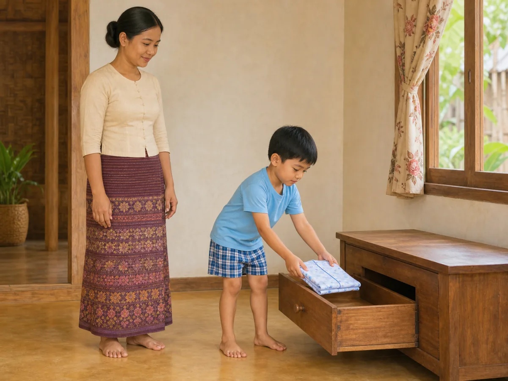
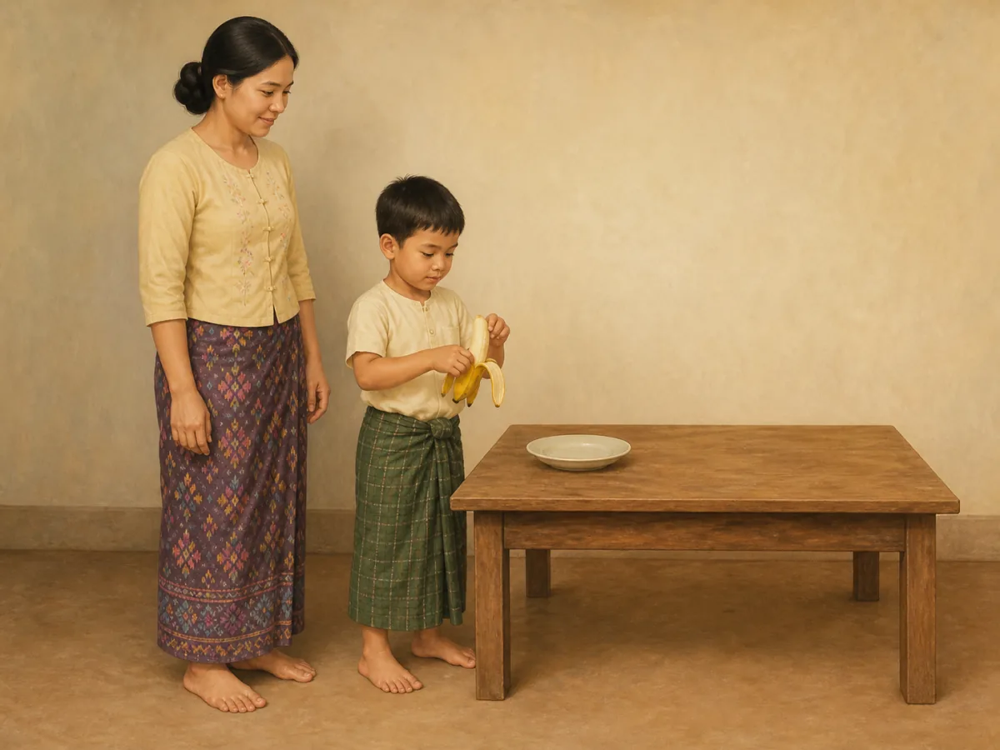
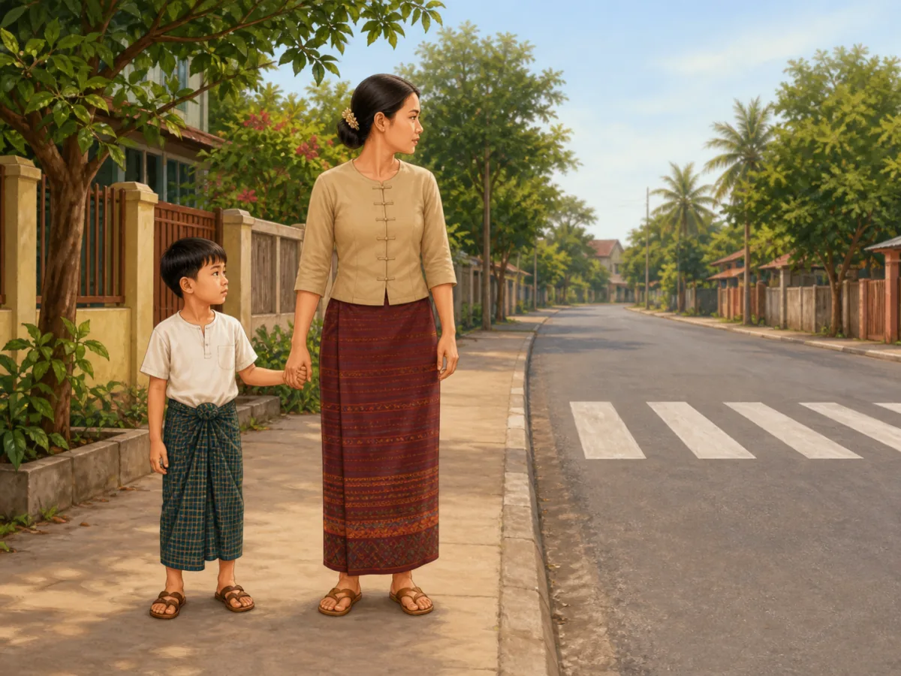
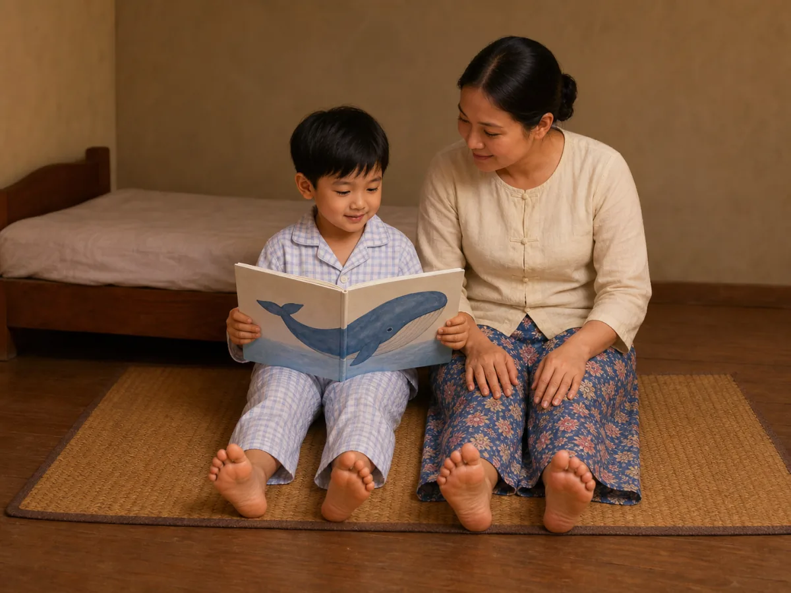

# ACE Child Grow — 5-year guide illustration review

Status: **4/4 READY FOR OWNER REVIEW — DEPLOYMENT DISABLED**

## Production source of truth

- Exact Production Convex filter: `type == "guide"` and `ageGroupKey == "5y"`.
- Production read performed on 2026-08-13; no Production data was modified.
- Exact result: 4 records; all have `clinicalStatus = clinical_review`.
- Every available field was read for every record: identifiers/timestamps, age group, clinical status, domain, slug, bilingual title/summary, tags, source, version/revision, complete search text, and every nested `data` field.
- Nested fields read include title, why/meaning, observation questions, daily/weekly/indoor/outdoor activities, safety, parent tips, FAQ, red flags, referral, encouragement, editorial status, and evidence summary.
- No required visual field is unavailable; no item is blocked.
- No local seed, constant, dump, screenshot, old image, or fallback mapping was used as content authority.

## Pre-generation review table

| Slug | Myanmar title | English title | Exact behaviour | Image scene | Must not show | Safety requirements | Status |
|---|---|---|---|---|---|---|---|
| `gd_5y_daily_routine` | ၅ နှစ် — နေ့စဉ်လုပ်ရိုးလုပ်စဉ် လမ်းညွှန် | 5 years — daily routine guide | A 5-year-old completes one predictable tidying step by placing one neatly folded pajama top into one low open drawer while a caregiver allows time and supervises without taking over. | In a simple Myanmar home, the child stands steadily and uses both hands to place exactly one folded lightweight pajama top into a single low open wooden drawer; the caregiver stands within reach with empty hands; both complete bodies, hands and feet are visible. | Toothbrushing, bathing, dressing, road crossing, toys, several clothes, multiple drawers, routine chart, clock, mirror/reflection, screen, letters, numbers, labels, arrows or UI. | One lightweight garment; low smooth drawer; dry uncluttered floor; caregiver within reach; no sharp edge, medicine, stool or breakable object. | READY FOR OWNER REVIEW |
| `gd_5y_safety` | ၅ နှစ် — ဘေးကင်းလုံခြုံရေး လမ်းညွှန် | 5 years — safety guide | A 5-year-old remains beside a trusted adult and holds the adult's hand while they pause together at the edge of a quiet road before crossing. | On a clear Myanmar neighbourhood footpath, the child and caregiver stand fully on the pavement, one hand naturally joined, bodies facing the road while gazes check both directions; a simple painted crossing is ahead and the roadway is empty; both complete bodies, free hands and feet are visible. | Child entering road, running, vehicle, bicycle, traffic signal, injury, fear, water, fire, window, medicine, phone, warning sign, written text, arrow or UI. | Both remain on the pavement; adult is between child and roadway; firm natural hand hold; clear visibility; no moving traffic, obstruction, drop or distraction. | READY FOR OWNER REVIEW |
| `gd_5y_sleep` | ၅ နှစ် — အိပ်စက်ခြင်း လမ်းညွှန် | 5 years — sleep guide | A 5-year-old shares one calm wordless book with a caregiver as a repeatable bedtime cue instead of using a screen. | In warm dim evening light, the child in two-piece pajamas and caregiver sit side-by-side on one woven floor mat beside a tidy low bed; the child holds exactly one sturdy wordless book open to one large whale illustration while the caregiver listens with empty hands resting visibly on their knees; both gaze at the page; complete bodies, hands and feet are visible. | Phone, tablet, television, medicine, food, drink, toothbrushing, singing, multiple books, infant cot, climbing/jumping, letters, numbers, clock, arrows or UI. | Stable floor-level reading position and low bed; one sturdy book without loose parts; caregiver within reach; clear dry floor; no medicine, cord, screen or fall hazard. | READY FOR OWNER REVIEW |
| `gd_5y_nutrition` | ၅ နှစ် — အာဟာရ လမ်းညွှန် | 5 years — nutrition guide | A 5-year-old participates in one simple food-preparation task by peeling one banana with both hands while a caregiver supervises without pressure. | The child stands steadily at a low family table and uses both hands to peel exactly one banana over one empty unbreakable plate; a caregiver stands within reach with both empty hands visible and watches without taking over; all hands and feet are visible. | Eating, knife, peeler, glass, bottle, drink, cooking, heat, other food, multiple plates, utensils, standing on furniture, spill, screen, text or labels. | Ripe soft banana; clean low stable table; unbreakable plate; dry clear floor; caregiver within reach; no hot, sharp, glass or choking item. | READY FOR OWNER REVIEW |

## Production record summary

| Slug | Myanmar summary | English summary | Domain | Publication status | Version / review revision |
|---|---|---|---|---|---|
| `gd_5y_daily_routine` | ၅ နှစ်အရွယ်တွင် သွားတိုက်ခြင်း၊ အဝတ်ဝတ်ခြင်းနှင့် ပစ္စည်းသိမ်းခြင်းကို ပုံမှန်အစီအစဉ်ဖြင့် လေ့ကျင့်ပါ။ | At 5 years, practise brushing, dressing, and tidying in a predictable order. | `daily_routine` | `clinical_review` | 1 / 6 |
| `gd_5y_safety` | ၅ နှစ်အရွယ်တွင် လမ်းမ၊ ရေ၊ မီး၊ ပြတင်းပေါက်နှင့် ဆေးဝါးအန္တရာယ်များကို လူကြီးက ဆက်လက်ကာကွယ်ရပါမည်။ | At 5 years, adults still need to prevent traffic, water, burn, window, and medicine hazards. | `safety` | `clinical_review` | 1 / 5 |
| `gd_5y_sleep` | ၅ နှစ်အရွယ်အတွက် ပုံမှန်အိပ်ချိန်၊ နိုးချိန်နှင့် ငြိမ်သက်သော အိပ်မီအလေ့အထ ထားပါ။ | Keep regular sleep and wake times with a calm bedtime routine at 5 years. | `sleep` | `clinical_review` | 1 / 8 |
| `gd_5y_nutrition` | ၅ နှစ်အရွယ်တွင် မိသားစုစားပွဲ၌ အုပ်စုစုံ အစားအစာနှင့် ရေကို ပုံမှန်ပေးပါ။ | At 5 years, offer varied family foods and water at regular meals. | `nutrition` | `clinical_review` | 1 / 8 |

## Owner-review items

### `gd_5y_daily_routine` — READY FOR OWNER REVIEW

- Myanmar title: ၅ နှစ် — နေ့စဉ်လုပ်ရိုးလုပ်စဉ် လမ်းညွှန်
- English title: 5 years — daily routine guide
- Myanmar summary: ၅ နှစ်အရွယ်တွင် သွားတိုက်ခြင်း၊ အဝတ်ဝတ်ခြင်းနှင့် ပစ္စည်းသိမ်းခြင်းကို ပုံမှန်အစီအစဉ်ဖြင့် လေ့ကျင့်ပါ။
- English summary: At 5 years, practise brushing, dressing, and tidying in a predictable order.
- Asset: [`/public/guides/gd_5y_daily_routine.a8bef9fde0.webp`](../../public/guides/gd_5y_daily_routine.a8bef9fde0.webp) — 1200×900, 86,818 bytes
- QA: exact tidying step ✓ · 5-year body size ✓ · anatomy ✓ · both hands/fingers ✓ · all legs/feet ✓ · stable posture ✓ · one folded garment/drawer ✓ · caregiver hands-off ✓ · no unrelated action/object ✓ · culturally appropriate ✓ · wordless/no mark ✓

### `gd_5y_nutrition` — READY FOR OWNER REVIEW

- Myanmar title: ၅ နှစ် — အာဟာရ လမ်းညွှန်
- English title: 5 years — nutrition guide
- Myanmar summary: ၅ နှစ်အရွယ်တွင် မိသားစုစားပွဲ၌ အုပ်စုစုံ အစားအစာနှင့် ရေကို ပုံမှန်ပေးပါ။
- English summary: At 5 years, offer varied family foods and water at regular meals.
- Asset: [`/public/guides/gd_5y_nutrition.ba81d83df8.webp`](../../public/guides/gd_5y_nutrition.ba81d83df8.webp) — 1200×900, 60,818 bytes
- QA: exact banana-peeling task ✓ · 5-year body size ✓ · anatomy ✓ · both hands/fingers ✓ · all legs/feet ✓ · stable posture ✓ · exactly one banana/plate ✓ · caregiver hands-off ✓ · no hot/sharp/glass/choking/background object ✓ · culturally appropriate ✓ · wordless/no mark ✓

### `gd_5y_safety` — READY FOR OWNER REVIEW

- Myanmar title: ၅ နှစ် — ဘေးကင်းလုံခြုံရေး လမ်းညွှန်
- English title: 5 years — safety guide
- Myanmar summary: ၅ နှစ်အရွယ်တွင် လမ်းမ၊ ရေ၊ မီး၊ ပြတင်းပေါက်နှင့် ဆေးဝါးအန္တရာယ်များကို လူကြီးက ဆက်လက်ကာကွယ်ရပါမည်။
- English summary: At 5 years, adults still need to prevent traffic, water, burn, window, and medicine hazards.
- Asset: [`/public/guides/gd_5y_safety.610b5aeca8.webp`](../../public/guides/gd_5y_safety.610b5aeca8.webp) — 1200×900, 128,644 bytes
- QA: exact pause-and-check safety behaviour ✓ · 5-year body size ✓ · anatomy ✓ · joined hands/free hands ✓ · all legs/feet ✓ · both remain on pavement ✓ · adult between child/road ✓ · empty roadway ✓ · no distraction/injury/extra hazard ✓ · culturally appropriate ✓ · wordless/no mark ✓

### `gd_5y_sleep` — READY FOR OWNER REVIEW

- Myanmar title: ၅ နှစ် — အိပ်စက်ခြင်း လမ်းညွှန်
- English title: 5 years — sleep guide
- Myanmar summary: ၅ နှစ်အရွယ်အတွက် ပုံမှန်အိပ်ချိန်၊ နိုးချိန်နှင့် ငြိမ်သက်သော အိပ်မီအလေ့အထ ထားပါ။
- English summary: Keep regular sleep and wake times with a calm bedtime routine at 5 years.
- Asset: [`/public/guides/gd_5y_sleep.89936421f7.webp`](../../public/guides/gd_5y_sleep.89936421f7.webp) — 1200×900, 89,076 bytes
- QA: exact calm bedtime cue ✓ · 5-year body size ✓ · anatomy ✓ · all hands/fingers ✓ · all four feet unobstructed ✓ · shared gaze ✓ · exactly one wordless book ✓ · stable floor-level position/low bed ✓ · no visible lamp/cord/screen/medicine ✓ · culturally appropriate ✓ · wordless/no mark ✓

## Rejected-generation audit

- `gd_5y_daily_routine`: initial candidate passed original-resolution review; both people have complete natural hands and feet, and only the one-garment tidying step is shown.
- `gd_5y_safety`: initial candidate passed original-resolution review; both remain on the pavement with the adult between the child and roadway, natural hand hold, complete hands and feet, and no moving traffic.
- `gd_5y_sleep`: first candidate rejected because one caregiver foot was hidden by clothing; second candidate rejected because a visible lantern-like object could imply a heat hazard. The third targeted regeneration has four unobstructed feet and no visible light, electrical, medication, or screen object.
- `gd_5y_nutrition`: first candidate rejected because a bottle-like background object was present. The targeted regeneration has a plain empty background and only the single banana, plate, and table required by the scene.

## Mapping and application verification

- Four exact slugs map directly to four different content-hashed files; no domain/category/shared fallback is used.
- All four WebP files are 1200×900 (4:3), optimized at high quality, and under 500 KB.
- Exact Myanmar and English titles were verified against Production data on every rendered card.
- Desktop and mobile rendering passed with no overflow, missing image, stale mapping, page error, or console error.
- Browser verification proved HTTP 200, WebP MIME type, 1200×900 dimensions, and four unique image sources.
- Captured text + image cards: [daily routine](screenshots/guides-5y/gd_5y_daily_routine-desktop.jpg), [nutrition](screenshots/guides-5y/gd_5y_nutrition-desktop.jpg), [safety](screenshots/guides-5y/gd_5y_safety-desktop.jpg), [sleep](screenshots/guides-5y/gd_5y_sleep-desktop.jpg).

## Engineering verification

- Focused component and mapping tests: 118/118 passed.
- Full unit suite: 1,334/1,334 passed across 131 files.
- Typecheck: passed.
- Lint: passed.
- Playwright 5-year guide image test: 1/1 passed.
- Production build: passed; PWA precache generated 346 entries and accepted every asset.
- Existing unrelated React test `act(...)` warnings, `NO_COLOR`/`FORCE_COLOR` notices, and the Vite mixed static/dynamic import advisory remain; there are no 5-year asset warnings, missing imports, missing files, or broken routes.

## Deployment gate

`DEPLOY_ALLOWED = false`. The four-item review package is prepared in a local review commit only. No push, pull request, merge, deployment, publication, or Production Convex update was performed. Explicit owner approval is required for this exact four-item 5-year guide review before production release.
