# ACE Child Grow — 7–9 Month Guide Illustration Review

Status: **13/13 READY FOR OWNER REVIEW — NOT DEPLOYED**

Source of truth: Production Convex `libraryContent`, read directly on 2026-08-09 and filtered to exact `type = guide`, `ageGroupKey = 7_9m`. Production contains exactly 13 matching records. Six currently have `clinicalStatus = published`; seven currently have `clinicalStatus = clinical_review`. The owner previously removed the former `published only` illustration-eligibility restriction. Production remains read only: this run does not change clinical status, text, translations, evidence, review metadata, or any Production record.

Every top-level field and every nested `data` field was inspected for all 13 records, including slug, Myanmar and English titles and summaries, exact age group, domain, source, publication/clinical status, review metadata when present, meaning (`why`), observations, daily and weekly activities, materials, safety, common mistakes, parent tips, red flags, referral guidance, FAQs, evidence summaries, encouragement, and other available fields. Production contains distinct `communication`, `language`, and `speech` records; they are not aliases and require different scenes.

## Pre-generation review table

| Slug | Myanmar title | English title | Exact behaviour / meaning | Image scene | Must not show | Safety constraints | Status |
|---|---|---|---|---|---|---|---|
| `gd_7_9m_cognitive` | ၇ – ၉ လ — အသိဉာဏ် ဖွံ့ဖြိုးမှု လမ်းညွှန် | 7–9 months — Cognitive guide | The baby looks for a partly hidden object, showing early object permanence and learning that it still exists when out of sight. | A Myanmar/Southeast Asian 7–9-month-old sits stably on a firm floor mat and lifts one light cloth off one large partly hidden toy while looking directly at the revealed toy; a caregiver watches within arm's reach. | Cloth over the baby's face; peekaboo with a person; dropping or throwing; several toys; small object; feeding; crawling; standing; text or arrows. | Awake floor-level supervision; one large mouth-safe toy; light cloth remains below the baby's shoulders and away from the face; no plastic bag, cord or detachable part. | EXISTING OWNER-APPROVED — PRESERVE |
| `gd_7_9m_communication` | ၇ – ၉ လ — ဆက်သွယ်ပြောဆိုမှု လမ်းညွှန် | 7–9 months — Communication guide | The baby deliberately uses a nonverbal signal by lifting both arms toward a familiar caregiver to ask to be picked up; the caregiver notices and responds. | A Myanmar/Southeast Asian 7–9-month-old sits securely on a floor mat, looks at a familiar caregiver and clearly raises both empty arms; the caregiver bends closer with open, responsive hands. | Babbling mouth shape; caregiver pointing; toy reaching; waving; clapping; stranger; crying; feeding; standing; text, speech bubbles or sound symbols. | Caregiver within reach; stable floor-level posture; baby is not pulled by the arms; all hands, fingers, legs and feet visible and natural. | EXISTING OWNER-APPROVED — PRESERVE |
| `gd_7_9m_daily_routine` | ၇ – ၉ လ — နေ့စဉ် လုပ်ရိုးလုပ်စဉ် လမ်းညွှန် | 7–9 months — Daily routine guide | A calm, predictable transition from quiet play into the same bedtime routine helps steady sleep and gives the baby security. | In warm evening light, a Myanmar/Southeast Asian caregiver and awake 7–9-month-old sit together at floor level and calmly look at one large wordless picture book as the single quiet step before bedtime. | Clock, timetable or calendar; daytime montage; active play; feeding; bath water; sleeping baby; screen; multiple books or toys; printed letters or numbers. | Caregiver remains within reach; floor-level setting; one sturdy large book with no loose part; no pillow, blanket, cord or small object. | READY FOR OWNER REVIEW |
| `gd_7_9m_emotional` | ၇ – ၉ လ — စိတ်ခံစားမှု လမ်းညွှန် | 7–9 months — Emotional guide | The baby shows mild fear or frustration and begins to settle by borrowing calm from a promptly responding caregiver. | A seated Myanmar/Southeast Asian caregiver securely holds a mildly upset 7–9-month-old against the chest and speaks with a steady calm expression; the baby's face and shoulders visibly begin to soften. | Severe distress; shaking; punishment; ignored crying; stranger handover; toy; feeding; sleeping; diagnosis; text or labels. | Caregiver seated at floor level; secure support for trunk, hips and feet; face and airway fully clear; no restraint or unsafe grip. | EXISTING OWNER-APPROVED — PRESERVE |
| `gd_7_9m_fine_motor` | ၇ – ၉ လ — လက်ချောင်းငယ် လှုပ်ရှားမှု လမ်းညွှန် | 7–9 months — Fine motor guide | The baby coordinates both hands to bang two objects together, a deliberate fine-motor and cause-and-effect action. | A Myanmar/Southeast Asian 7–9-month-old sits stably on a firm floor mat and clearly brings two identical large one-piece soft silicone blocks together at midline; both hands and every finger are unobstructed while a caregiver supervises within reach. | Pincer grasp; small pieces; mouthing; food; spoon feeding; clapping empty hands; many toys; crawling; standing; text or motion symbols. | Two clean lightweight objects much larger than the mouth with no detachable parts; direct awake supervision; floor-level fall-free area. | READY FOR OWNER REVIEW |
| `gd_7_9m_gross_motor` | ၇–၉ လ — ကြွက်သားကြီး လှုပ်ရှားမှု | 7–9 months — Gross Motor | The baby briefly sits without support, freeing both hands while developing balance and trunk control. | A Myanmar/Southeast Asian 7–9-month-old sits independently for a brief moment on a firm floor mat with empty arms held naturally out for balance, upright trunk and both legs visible; a caregiver kneels within arm's reach without touching. | Prop pillow; caregiver holding the torso; toy reaching; object banging; crawling fast; pulling to stand; standing or walking; elevated surface; text or arrows. | Awake direct supervision; firm floor-level mat; clear fall area; no furniture edge, stair, cord, small object or other hazard. | READY FOR OWNER REVIEW |
| `gd_7_9m_language` | ၇ – ၉ လ — ဘာသာစကား နားလည်မှု လမ်းညွှန် | 7–9 months — Language guide | The baby shows understanding by turning the head and gaze toward a familiar caregiver when the caregiver calls the baby's name. | A Myanmar/Southeast Asian 7–9-month-old sits securely at floor level and clearly turns the head and eyes toward a familiar caregiver speaking gently from one side; the caregiver's hands stay relaxed and empty. | Babbling mouth shape; adult pointing; arms-up request; loud noise; clapping; toy or book; screen; ear-touching; text or sound symbols. | Normal gentle voice; no loud-noise source or object near the ear; caregiver within reach; stable safe floor posture. | READY FOR OWNER REVIEW |
| `gd_7_9m_nutrition` | ၇ – ၉ လ — အာဟာရ လမ်းညွှန် | 7–9 months — Nutrition guide | Complementary food adds to milk; the baby eats a supervised, appropriately thick iron-rich meal while breastfeeding continues. | A Myanmar/Southeast Asian 7–9-month-old sits upright in a supportive high-back infant feeding seat with a secured harness while an attentive caregiver offers one small spoonful of thick smooth iron-rich bean-and-vegetable mash from one clean bowl. | Baby self-feeding; baby holding spoon or bowl; bottle; watery food; honey; nuts; whole grapes; hard chunks; several dishes; forced feeding; text or labels. | Continuous close supervision; upright supported posture and clear airway; soft choking-safe texture; clean hands and utensils; no honey, salt, sugar or choking shape. | READY FOR OWNER REVIEW |
| `gd_7_9m_safety` | ၇ – ၉ လ — ဘေးကင်းလုံခြုံရေး လမ်းညွှန် | 7–9 months — Safety guide | As rolling, sitting and early crawling widen the baby's reach, close supervision and a prepared floor-level environment prevent harm. | A Myanmar/Southeast Asian 7–9-month-old sits on a completely clear floor mat while a caregiver kneels within arm's reach and secures a closed low-cabinet child latch; a closed stair gate is visible in the simple background. | Open stairs; water container; hot drink; cooking fire; medicine; chemical; coin, battery or other small object; cord; plastic bag; balloon; bed, sofa or table; hazard montage; text or warning symbol. | Direct awake supervision; floor-level fall-free zone; closed cabinet and barrier; no choking, drowning, burn, poisoning or strangulation hazard visible or reachable. | EXISTING OWNER-APPROVED — PRESERVE |
| `gd_7_9m_self_help` | ၇ – ၉ လ — ကိုယ်တိုင် လုပ်ဆောင်နိုင်မှု လမ်းညွှန် | 7–9 months — Self-help guide | The baby participates in feeding by trying to hold an open cup with both hands while the caregiver supports and supervises. | A seated Myanmar/Southeast Asian 7–9-month-old holds one small non-glass open cup with both hands at chest level while an attentive caregiver lightly supports the base; only a tiny amount of water is inside. | Independent drinking without adult support; bottle; glass cup; spoon; finger food; honey; hard food; standing or moving while drinking; text or labels. | Upright stable seated posture; continuous close supervision; tiny sip only; clean unbreakable cup; face and airway clear; both hands and fingers natural. | EXISTING OWNER-APPROVED — PRESERVE |
| `gd_7_9m_sleep` | ၇ – ၉ လ — အိပ်စက်ခြင်း လမ်းညွှန် | 7–9 months — Sleep guide | Every sleep begins on the back on a firm, flat, completely empty infant sleep surface; a calm predictable routine supports sleep. | A Myanmar/Southeast Asian 7–9-month-old sleeps alone on the back in the centre of a simple cot on a firm flat mattress with one taut fitted sheet; face, hands and feet are naturally visible. | Side or prone sleep; pillow; blanket, including a light blanket; bumper; teddy or stuffed toy; loose cloth; sleep positioner; incline; adult bed; sofa; cord; monitor; text or labels. | Exact safe-sleep scene: start on back, firm flat non-inclined mattress, empty cot, fitted sheet only, clear airway, no overheating cue and no cord nearby. | READY FOR OWNER REVIEW |
| `gd_7_9m_social` | ၇ – ၉ လ — လူမှုဆက်ဆံရေး လမ်းညွှန် | 7–9 months — Social guide | The baby recognises a familiar returning caregiver and gives a bright social smile; calm greetings and predictable reunions support healthy attachment. | A Myanmar/Southeast Asian 7–9-month-old sits safely with a trusted caregiver and smiles brightly toward another familiar caregiver who kneels nearby and greets the baby warmly. | Sneaking away; stranger forcing a handover; baby waving; severe crying; abandonment; crowd; toy; feeding; restraint; text or labels. | Baby stays floor-level with secure support from a trusted caregiver; calm familiar interaction; no forced contact, teasing, shaking or unattended baby. | EXISTING OWNER-APPROVED — PRESERVE |
| `gd_7_9m_speech` | ၇ – ၉ လ — စကားသံ ထွက်ဆိုမှု လမ်းညွှန် | 7–9 months — Speech guide | The baby practises repeated consonant strings during a face-to-face vocal turn after the caregiver copies a sound and pauses. | A Myanmar/Southeast Asian 7–9-month-old sits securely facing a seated caregiver, looks engaged and makes a clear natural babbling mouth shape while the caregiver listens silently during the baby's turn. | Name-call head turn; adult pointing; arms-up request; singing; book; phone or TV; loud toy; speech bubble; letters, sound symbols or text. | Quiet close interaction; secure floor-level posture; caregiver within reach; no loud-noise source, smoke, or small object near the baby. | READY FOR OWNER REVIEW |

## Pre-generation confirmation

- Production contains exactly 13 guide slugs for exact age group `7_9m`: **PASS**
- All 13 concepts use the complete Production record, including titles, summaries, meaning, observation fields, activities and safety guidance: **PASS**
- `communication`, `language`, and `speech` have three visibly distinct behaviours and scenes: **PASS**
- All 13 scenes have different central behaviour and composition; no domain/category/shared fallback is planned: **PASS**
- Every posture and level of independence matches 7–9 months: **PASS**
- Feeding is upright and continuously supervised with an appropriate texture, one utensil and no honey or choking shape: **PASS**
- Sleep follows the back-sleeping, firm-flat-mattress, fitted-sheet-only, empty-cot rule; the Production `materials` mention of a light blanket is overridden by the stricter Production safety field and safe-sleep rule: **PASS**
- Movement and play take place awake, directly supervised and at floor level: **PASS**
- No red flag, diagnosis, emergency or unsafe act will be dramatised: **PASS**
- Every new image will be Myanmar/Southeast Asian, warm, wordless, landscape 4:3 and understandable without reading: **PASS**
- No image was generated for this run before this table was completed: **PASS**

## Existing owner-approved asset audit

The six published-guide assets were introduced in the previously owner-approved published-guide run and are preserved without renaming or overwriting. Each remains a direct one-slug-to-one-file mapping.

| Slug | Asset | Dimensions | Bytes | Behaviour | Age | Anatomy / hands / feet | Safety | Wordless / culture | Result |
|---|---|---:|---:|---|---|---|---|---|---|
| `gd_7_9m_cognitive` | `/guides/gd_7_9m_cognitive.573c2f0d30.webp` | 1200×900 | 140,282 | PASS | PASS | PASS | PASS | PASS | PRESERVE |
| `gd_7_9m_communication` | `/guides/gd_7_9m_communication.bdb749e2a3.webp` | 1200×900 | 132,470 | PASS | PASS | PASS | PASS | PASS | PRESERVE |
| `gd_7_9m_emotional` | `/guides/gd_7_9m_emotional.73eabf88fb.webp` | 1200×900 | 137,696 | PASS | PASS | PASS | PASS | PASS | PRESERVE |
| `gd_7_9m_safety` | `/guides/gd_7_9m_safety.d33c9acaf9.webp` | 1200×900 | 157,396 | PASS | PASS | PASS | PASS | PASS | PRESERVE |
| `gd_7_9m_self_help` | `/guides/gd_7_9m_self_help.cdfac6e4bf.webp` | 1200×900 | 140,386 | PASS | PASS | PASS | PASS | PASS | PRESERVE |
| `gd_7_9m_social` | `/guides/gd_7_9m_social.2a908691eb.webp` | 1200×900 | 149,214 | PASS | PASS | PASS | PASS | PASS | PRESERVE |

## Application and engineering verification

- Exact mapping: all 13 Production slugs map directly to 13 unique content-hashed WebP paths; no domain, category, age-group, type or unknown-slug fallback resolves: **PASS**
- Asset files: all 13 exist at 1200×900 landscape 4:3, are under 500 KB, and their first ten SHA-256 characters match the filename: **PASS**
- Other age groups: existing mappings and filenames were not changed: **PASS**
- Focused exact-mapping and bilingual `ContentDetail` rendering tests: **PASS — 54/54**
- Full unit suite: **PASS — 1,205/1,205 across 121 test files**
- Typecheck: **PASS**
- Lint: **PASS**
- Production build: **PASS — 310 modules transformed; no asset warning, missing import, missing image or broken route**
- PWA precache: **PASS — all 13 exact 7–9-month guide assets present among 291 entries**
- Full-browser preview-asset and review-card test: **PASS — 13/13 assets returned `image/webp`; every desktop text-image card captured; all 13 cards fit a 390×844 mobile viewport without horizontal overflow; no page or console error**
- Signed-in Production route audit: **PASS — all 13 exact English titles and summaries load from Production. The six previously deployed owner-approved images load at 1200×900. The seven new images remain absent from the current live bundle, as expected before approval/deployment.**
- Production authentication/data safety: the isolated browser runner correctly stopped at login. No test account was created and no Production Convex record, authentication record, clinical status, text or translation was changed: **PASS**

## Rendered text-image card screenshots

| Slug | Desktop screenshot |
|---|---|
| `gd_7_9m_cognitive` | [review card](screenshots/guides-7_9m/gd_7_9m_cognitive-desktop.jpg) |
| `gd_7_9m_communication` | [review card](screenshots/guides-7_9m/gd_7_9m_communication-desktop.jpg) |
| `gd_7_9m_daily_routine` | [review card](screenshots/guides-7_9m/gd_7_9m_daily_routine-desktop.jpg) |
| `gd_7_9m_emotional` | [review card](screenshots/guides-7_9m/gd_7_9m_emotional-desktop.jpg) |
| `gd_7_9m_fine_motor` | [review card](screenshots/guides-7_9m/gd_7_9m_fine_motor-desktop.jpg) |
| `gd_7_9m_gross_motor` | [review card](screenshots/guides-7_9m/gd_7_9m_gross_motor-desktop.jpg) |
| `gd_7_9m_language` | [review card](screenshots/guides-7_9m/gd_7_9m_language-desktop.jpg) |
| `gd_7_9m_nutrition` | [review card](screenshots/guides-7_9m/gd_7_9m_nutrition-desktop.jpg) |
| `gd_7_9m_safety` | [review card](screenshots/guides-7_9m/gd_7_9m_safety-desktop.jpg) |
| `gd_7_9m_self_help` | [review card](screenshots/guides-7_9m/gd_7_9m_self_help-desktop.jpg) |
| `gd_7_9m_sleep` | [review card](screenshots/guides-7_9m/gd_7_9m_sleep-desktop.jpg) |
| `gd_7_9m_social` | [review card](screenshots/guides-7_9m/gd_7_9m_social-desktop.jpg) |
| `gd_7_9m_speech` | [review card](screenshots/guides-7_9m/gd_7_9m_speech-desktop.jpg) |

## Owner-override boundary

The owner authorized illustration work for `clinical_review` records and removed the former `published only` eligibility rule. This does not authorize editing clinical wording, translations, evidence, review metadata, or Production Convex status. Deployment remains disabled until the owner reviews and explicitly approves all 13 final text-and-image cards.

## Owner review cards

### `gd_7_9m_cognitive`

- Myanmar title: **၇ – ၉ လ — အသိဉာဏ် ဖွံ့ဖြိုးမှု လမ်းညွှန်**
- English title: **7–9 months — Cognitive guide**
- Production Myanmar summary: ဤအရွယ်တွင် ကလေးသည် "မမြင်ရသော်လည်း ရှိနေသေးသည်" ဟူသော အသိကို စတင် ရရှိလာသည်။ ထို့ကြောင့် ဖုံးပြီး ပြန်ရှာသော ကစားနည်းများကို အလွန် ကြိုက်နှစ်သက်သည်။ ပစ္စည်းကို ချ၍ ဘာဖြစ်သည်ကို ကြည့်ခြင်း၊ ထပ်ခါထပ်ခါ လုပ်ကြည့်ခြင်းသည် အကြောင်းနှင့် အကျိုးကို လေ့လာနေခြင်း ဖြစ်သည်။
- Production English summary: She is starting to grasp that things still exist when hidden, which is why hide-and-find delights her. Dropping something to see what happens, again and again, is her studying cause and effect.
- Asset: `/guides/gd_7_9m_cognitive.573c2f0d30.webp` — 1200×900 — 140,282 bytes

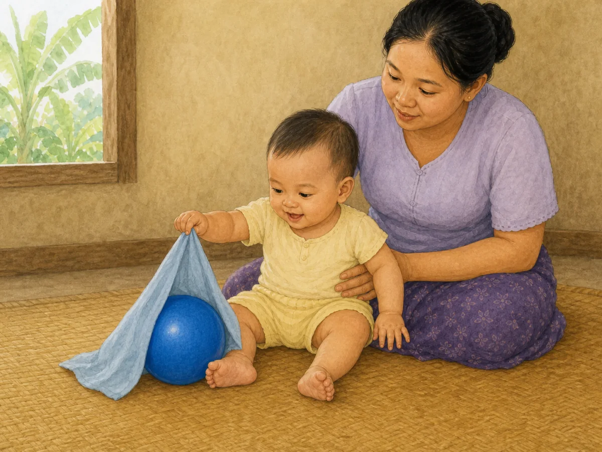

QA: behaviour ✓ · age ✓ · anatomy ✓ · hands/fingers ✓ · legs/feet ✓ · gaze fixed on revealed large ball ✓ · cloth below shoulders and away from face ✓ · direct supervision ✓ · no extra action or unsafe object ✓ · culturally appropriate ✓ · wordless ✓

**EXISTING OWNER-APPROVED — PRESERVE**

### `gd_7_9m_communication`

- Myanmar title: **၇ – ၉ လ — ဆက်သွယ်ပြောဆိုမှု လမ်းညွှန်**
- English title: **7–9 months — Communication guide**
- Production Myanmar summary: ဤအရွယ်တွင် ကလေးသည် စကားလုံး မသုံးဘဲ ရည်ရွယ်ချက်ဖြင့် ဆက်သွယ်တတ်လာသည် — လိုချင်သည့်ဘက်သို့ လက်လှမ်းခြင်း၊ မိဘမျက်နှာကို ကြည့်ပြီး ပစ္စည်းကို ပြန်ကြည့်ခြင်း၊ လက်ကို မြှောက်ပြခြင်း တို့ဖြင့် ဖြစ်သည်။ ဤအချက်ပြမှုများကို မိဘက စကားဖြင့် ပြန်ပြောပေးခြင်းသည် ဆက်သွယ်မှု စွမ်းရည်ကို အခိုင်မာဆုံး တည်ဆောက်ပေးသည်။
- Production English summary: She now communicates on purpose without words — reaching for what she wants, looking from your face to an object and back, lifting her arms to be picked up. Putting those signals into words is what builds communication most strongly.
- Asset: `/guides/gd_7_9m_communication.bdb749e2a3.webp` — 1200×900 — 132,470 bytes

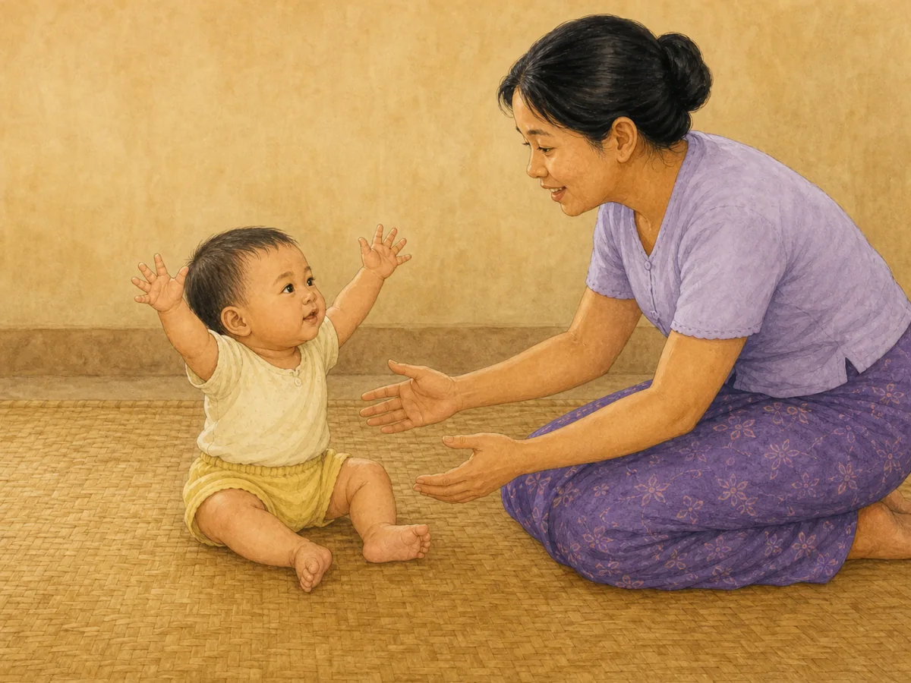

QA: behaviour ✓ · age ✓ · anatomy ✓ · hands/fingers ✓ · legs/feet ✓ · exact two-arm request and mutual gaze ✓ · caregiver responds without pulling ✓ · no toy/pointing/waving/clapping ✓ · culturally appropriate ✓ · wordless ✓

**EXISTING OWNER-APPROVED — PRESERVE**

### `gd_7_9m_daily_routine`

- Myanmar title: **၇ – ၉ လ — နေ့စဉ် လုပ်ရိုးလုပ်စဉ် လမ်းညွှန်**
- English title: **7–9 months — Daily routine guide**
- Production Myanmar summary: ခန့်မှန်းနိုင်သော နေ့စဉ် အစီအစဉ်သည် ကလေးအား လုံခြုံမှု ခံစားစေပြီး မိဘအတွက်လည်း နေ့တစ်နေ့ကို စီမံရ လွယ်ကူစေသည်။ ဤအရွယ်တွင် အစာနပ်များ၊ နေ့ခင်း အိပ်ချိန်များနှင့် ကစားချိန်များကို တစ်သမတ်တည်း ထားနိုင်ပါက ကလေး၏ အိပ်စက်မှုနှင့် အစားအသောက်လည်း ပိုမို တည်ငြိမ်လာတတ်သည်။
- Production English summary: A predictable day helps her feel secure and makes the day easier to manage. Keeping meals, naps and play at roughly the same times tends to steady both sleep and eating at this age.
- Final ImageGen prompt: warm wordless ACE watercolor scene of an awake 7–9-month Myanmar baby and mother seated on a floor mat, calmly sharing one medium wordless picture book as the single quiet bedtime-routine step; all hands and feet visible; plain wall/window only; no clock, screen, toy, blanket, text or extra object.
- Asset: `/guides/gd_7_9m_daily_routine.fa72ddb356.webp` — 1200×900 — 135,174 bytes

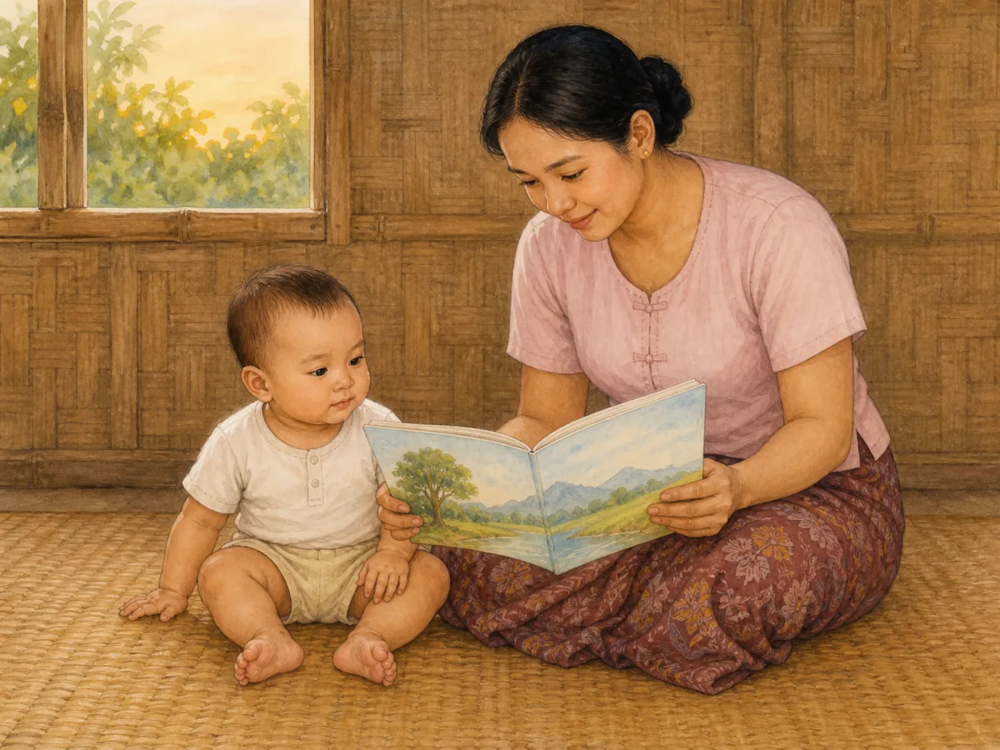

QA: behaviour ✓ · age ✓ · anatomy ✓ · hands/fingers ✓ · legs/feet ✓ · calm quiet-book transition ✓ · one wordless book only ✓ · floor-level safety ✓ · no clock/screen/toy/sleep action ✓ · culturally appropriate ✓ · wordless ✓

**READY FOR OWNER REVIEW**

### `gd_7_9m_emotional`

- Myanmar title: **၇ – ၉ လ — စိတ်ခံစားမှု လမ်းညွှန်**
- English title: **7–9 months — Emotional guide**
- Production Myanmar summary: ဤအရွယ်တွင် ကလေး၏ ခံစားမှုများသည် ပိုမို ရှင်းလင်းလာသည် — ပျော်ရွှင်ခြင်း၊ ကြောက်ရွံ့ခြင်း၊ စိတ်ပျက်ခြင်းတို့ကို မျက်နှာနှင့် အသံဖြင့် ပြသည်။ ကလေးသည် ကိုယ်တိုင် စိတ်ကို ငြိမ်းအောင် မလုပ်နိုင်သေးဘဲ လူကြီး၏ ငြိမ်းချမ်းမှုကို မှီခိုသည်။ မိဘ၏ စိတ်ကျန်းမာရေးသည် ဤနေရာတွင် အလွန် အရေးကြီးသည်။
- Production English summary: Her feelings are clearer now — delight, fear and frustration all show on her face and in her voice. She cannot calm herself yet and borrows calm from adults, which is why your own wellbeing matters so much here.
- Asset: `/guides/gd_7_9m_emotional.73eabf88fb.webp` — 1200×900 — 137,696 bytes

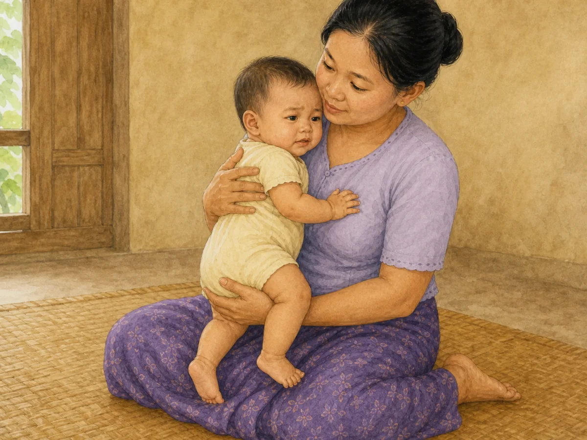

QA: behaviour ✓ · age ✓ · anatomy ✓ · hands/fingers ✓ · legs/feet ✓ · mild settling expression ✓ · secure hold and clear airway ✓ · no shaking/restraint/object ✓ · culturally appropriate ✓ · wordless ✓

**EXISTING OWNER-APPROVED — PRESERVE**

### `gd_7_9m_fine_motor`

- Myanmar title: **၇ – ၉ လ — လက်ချောင်းငယ် လှုပ်ရှားမှု လမ်းညွှန်**
- English title: **7–9 months — Fine motor guide**
- Production Myanmar summary: ဤအရွယ်တွင် လက်သည် စူးစမ်းရေး ကိရိယာ ဖြစ်လာသည်။ လက်ဝါးတစ်ခုလုံးဖြင့် ဆွဲယူရာမှ လက်မနှင့် လက်ညှိုးဖြင့် ညှပ်ယူခြင်းသို့ တဖြည်းဖြည်း ကူးပြောင်းပြီး၊ ပစ္စည်းနှစ်ခုကို ရိုက်ခတ်ခြင်း၊ ပါးစပ်ထဲ ထည့်ကြည့်ခြင်းဖြင့် ပုံသဏ္ဌာန်နှင့် အသွင်အပြင်ကို လေ့လာသည်။ ပါးစပ်ဖြင့် စမ်းသပ်ခြင်းသည် ပုံမှန်ဖြစ်သော်လည်း ဘေးကင်းရေး စည်းကမ်းကို တင်းကျပ်ရန် လိုအပ်သည်။
- Production English summary: Hands become exploring tools now. A whole-hand rake slowly becomes a thumb-and-finger pinch, and banging two objects together or mouthing them is how she studies shape and texture. Mouthing is normal, but it is exactly why the safety rules here are strict.
- Final ImageGen prompt: warm wordless ACE watercolor scene of a seated 7–9-month Myanmar baby deliberately bringing two separate identical large blue one-piece soft blocks together at midline, one in each fully visible hand, with mother supervising within reach; no mouthing, pincer grasp, food, other toy, text or motion symbol.
- Asset: `/guides/gd_7_9m_fine_motor.90cd7a6e1a.webp` — 1200×900 — 143,660 bytes

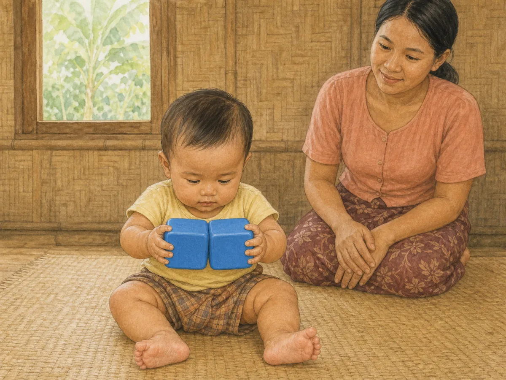

QA: behaviour ✓ · age ✓ · anatomy ✓ · hands/fingers ✓ · legs/feet ✓ · two separate mouth-safe blocks visibly meet ✓ · gaze at contact point ✓ · direct supervision ✓ · no mouthing or extra object ✓ · culturally appropriate ✓ · wordless ✓

Rejected candidate: the first candidate made two cups look nested rather than clearly banged together. It failed behaviour clarity and is not saved or mapped.

**READY FOR OWNER REVIEW**

### `gd_7_9m_gross_motor`

- Myanmar title: **၇–၉ လ — ကြွက်သားကြီး လှုပ်ရှားမှု**
- English title: **7–9 months — Gross Motor**
- Production Myanmar summary: ထိုင်ခြင်း၊ တွားခြင်းသည် ကလေးအား လက်နှစ်ဖက်ဖြင့် ကစားရန်နှင့် ပတ်ဝန်းကျင်ကို စူးစမ်းရန် လွတ်လပ်စေသည်။
- Production English summary: Sitting and crawling free a baby to explore and use both hands.
- Final ImageGen prompt: warm wordless ACE watercolor scene of a 7–9-month Myanmar baby briefly sitting independently on a firm floor mat with empty arms out for balance, both hands and feet visible, while mother stays within arm's reach without touching; no prop, toy, crawling, standing, text or hazard.
- Asset: `/guides/gd_7_9m_gross_motor.9ede7495bd.webp` — 1200×900 — 151,846 bytes

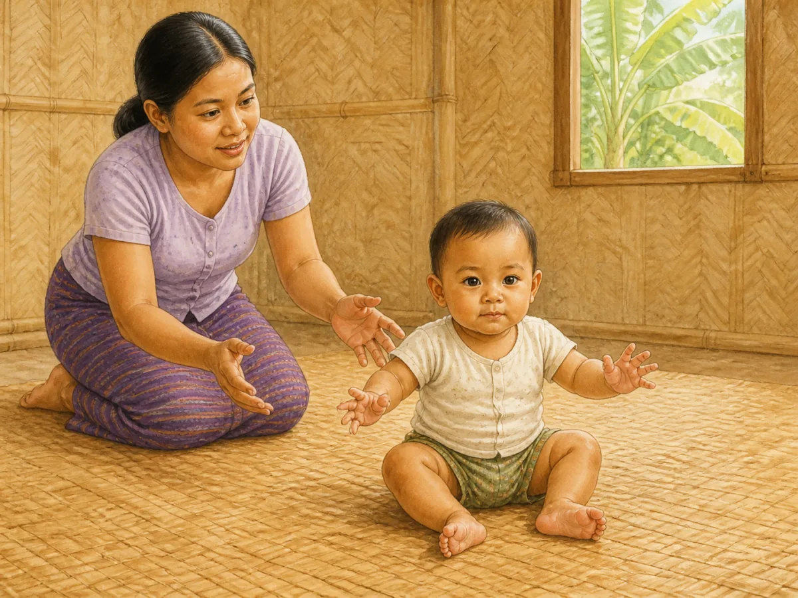

QA: behaviour ✓ · age ✓ · anatomy ✓ · hands/fingers ✓ · legs/feet ✓ · unsupported sitting with balance arms ✓ · caregiver ready but not touching ✓ · clear floor area ✓ · no prop/toy/older movement ✓ · culturally appropriate ✓ · wordless ✓

**READY FOR OWNER REVIEW**

### `gd_7_9m_language`

- Myanmar title: **၇ – ၉ လ — ဘာသာစကား နားလည်မှု လမ်းညွှန်**
- English title: **7–9 months — Language guide**
- Production Myanmar summary: နားလည်မှုသည် ပြောဆိုမှုထက် အမြဲ စောပါသည်။ ဤအရွယ်တွင် ကလေးသည် နာမည်၊ "မလုပ်နဲ့"၊ မိသားစုဝင် အမည်များ သကဲ့သို့ အသုံးများသော စကားလုံးအချို့ကို မှတ်မိလာပြီး၊ မိဘ၏ လေသံနှင့် လက်ဟန်ခြေဟန်များကိုလည်း ဖတ်တတ်လာသည်။ ကလေးအား နေ့စဉ် စကားပြောပေးမှုသည် နောင်တွင် စကားပြောနိုင်မှုကို အထောက်အကူ ပြုသည်။
- Production English summary: Understanding always comes before talking. She now recognises a few familiar words — her name, "no", family names — and reads your tone and gestures too. Everyday talk is what feeds later speech.
- Final ImageGen prompt: warm wordless ACE watercolor scene of a seated 7–9-month Myanmar baby with closed mouth clearly turning head and eyes toward mother calling the baby's name from one side; empty relaxed hands, no pointing, babbling, object, sound symbol or screen.
- Asset: `/guides/gd_7_9m_language.4d8fa21cb8.webp` — 1200×900 — 144,364 bytes

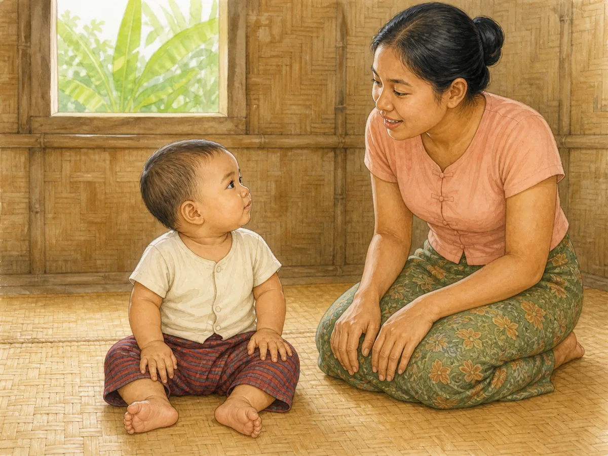

QA: behaviour ✓ · age ✓ · anatomy ✓ · hands/fingers ✓ · legs/feet ✓ · exact receptive head/gaze turn ✓ · baby's mouth closed ✓ · caregiver gentle voice ✓ · no pointing/babbling/object ✓ · culturally appropriate ✓ · wordless ✓

**READY FOR OWNER REVIEW**

### `gd_7_9m_nutrition`

- Myanmar title: **၇ – ၉ လ — အာဟာရ လမ်းညွှန်**
- English title: **7–9 months — Nutrition guide**
- Production Myanmar summary: ဤအရွယ်တွင် အစားအစာသည် နို့ကို ဖြည့်စွက်ပေးရန် ဖြစ်ပြီး အစားထိုးရန် မဟုတ်ပါ။ ကမ္ဘာ့ကျန်းမာရေးအဖွဲ့က ၆ လမှ ၈ လအရွယ်တွင် တစ်နေ့လျှင် အစာ နှစ်နပ်မှ သုံးနပ်၊ ၉ လမှ စ၍ သုံးနပ်နှင့် ကြားစာ တစ်နပ်မှ နှစ်နပ် အကြံပြုပြီး နှစ်နှစ်နှင့် အထက်ထိ နို့တိုက်ရန် ဖြစ်သည်။ ဤကာလတွင် သံဓာတ် လိုအပ်ချက် မြင့်တက်လာသဖြင့် သံဓာတ်ကြွယ်ဝသော အစားအစာများ လိုအပ်သည်။
- Production English summary: Food complements milk now; it does not replace it. WHO guidance is two to three meals a day at 6–8 months and three meals plus one or two snacks from 9 months, alongside breastfeeding into the second year and beyond. Iron needs rise sharply, so iron-rich foods matter.
- Final ImageGen prompt: warm wordless ACE watercolor scene of a 7–9-month Myanmar baby upright in a supportive harnessed feeding chair with both feet on the footrest and hands on the empty tray, while mother offers one tiny soft spoonful of thick smooth lentil-and-vegetable mash from one bowl; no self-feeding, bottle, chunks, honey, extra dish or text.
- Asset: `/guides/gd_7_9m_nutrition.4276d1d573.webp` — 1200×900 — 120,410 bytes

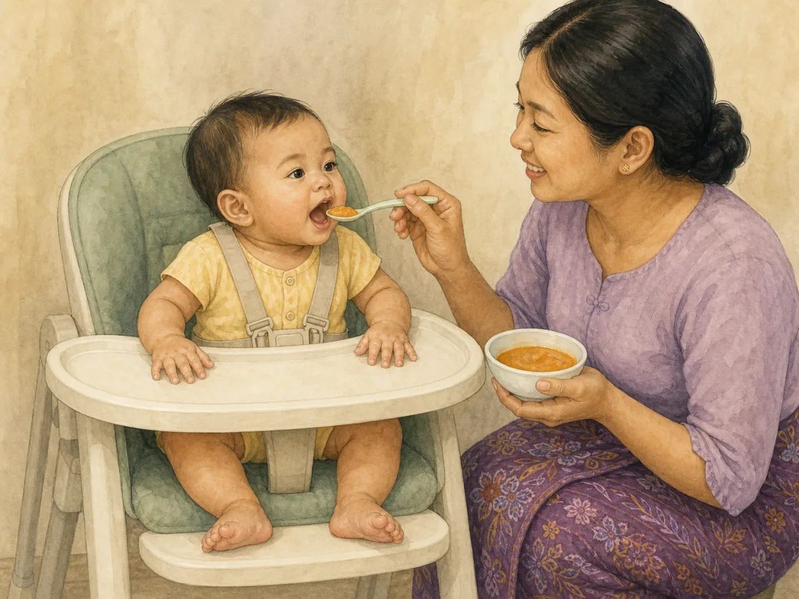

QA: behaviour ✓ · age ✓ · anatomy ✓ · hands/fingers ✓ · legs/feet ✓ · upright harnessed posture ✓ · close supervision ✓ · thick smooth choking-safe texture ✓ · one spoon and bowl only ✓ · no honey/choking shape/force ✓ · culturally appropriate ✓ · wordless ✓

**READY FOR OWNER REVIEW**

### `gd_7_9m_safety`

- Myanmar title: **၇ – ၉ လ — ဘေးကင်းလုံခြုံရေး လမ်းညွှန်**
- English title: **7–9 months — Safety guide**
- Production Myanmar summary: ဤအရွယ်တွင် ကလေးသည် လှိမ့်ခြင်း၊ ထိုင်ခြင်းနှင့် တွားသွားခြင်းတို့ စတင်နိုင်သဖြင့် လက်လှမ်းမီသောနေရာ ပိုမိုကျယ်လာသည်။ ထို့ကြောင့် အိမ်တွင်းဘေးကင်းရေးကို ပြန်လည်စစ်ဆေးရန် အချိန်ကောင်းဖြစ်သည်။ ကလေးကို အနီးကပ်ကြီးကြပ်ခြင်းနှင့် အိမ်ပတ်ဝန်းကျင်ကို ဘေးကင်းအောင် ကြိုတင်ပြင်ဆင်ခြင်း နှစ်မျိုးလုံး လိုအပ်သည်။
- Production English summary: She may now roll, sit and start to crawl, so her reach suddenly widens. This is the moment to re-check the home. Supervision is the basic protection, and preparing the environment makes it stronger.
- Asset: `/guides/gd_7_9m_safety.d33c9acaf9.webp` — 1200×900 — 157,396 bytes

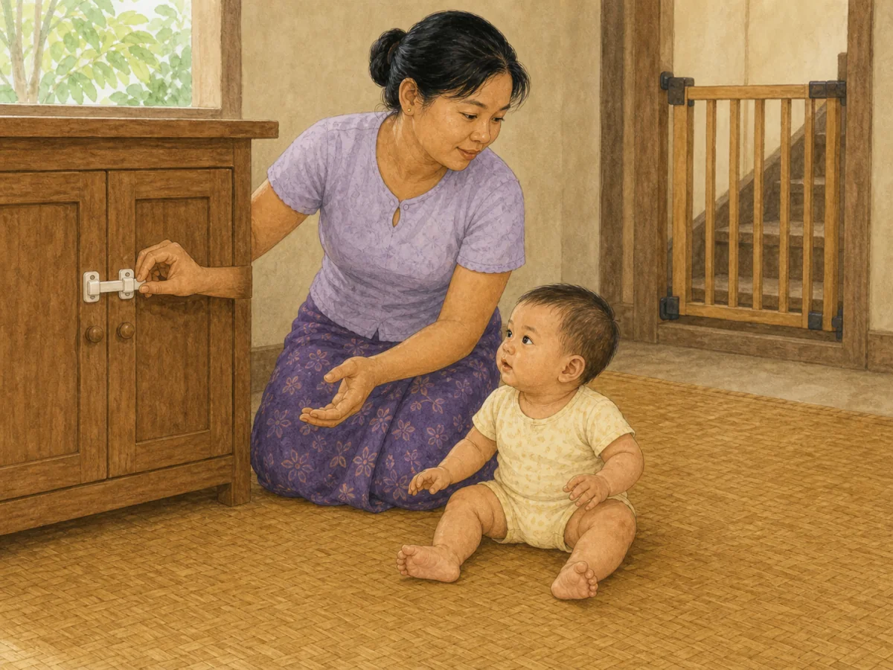

QA: behaviour ✓ · age ✓ · anatomy ✓ · hands/fingers ✓ · legs/feet ✓ · direct floor-level supervision ✓ · closed cabinet latch and stair gate ✓ · clear reachable floor ✓ · no introduced hazard ✓ · culturally appropriate ✓ · wordless ✓

**EXISTING OWNER-APPROVED — PRESERVE**

### `gd_7_9m_self_help`

- Myanmar title: **၇ – ၉ လ — ကိုယ်တိုင် လုပ်ဆောင်နိုင်မှု လမ်းညွှန်**
- English title: **7–9 months — Self-help guide**
- Production Myanmar summary: ဤအရွယ်တွင် ကလေးသည် ကိုယ်တိုင် လုပ်ရန် စတင် ကြိုးစားလာသည် — ပျော့သော အစာတုံးများကို ကောက်စားခြင်း၊ ခွက်ကို ကိုင်ကြည့်ခြင်း၊ အဝတ်လဲစဉ် လက်ကို ဆန့်ပေးခြင်း တို့ ဖြစ်သည်။ ကိုယ်တိုင် လုပ်ခွင့် ပေးခြင်းသည် လက်ကြွက်သားများ၊ ယုံကြည်မှုနှင့် အစားအစာ လက်ခံမှုကို တစ်ပြိုင်နက် တည်ဆောက်ပေးသည်။
- Production English summary: She is starting to do things for herself — picking up soft finger foods, holding a cup, putting an arm out during dressing. Letting her try builds hand skills, confidence and food acceptance all at once.
- Asset: `/guides/gd_7_9m_self_help.cdfac6e4bf.webp` — 1200×900 — 140,386 bytes

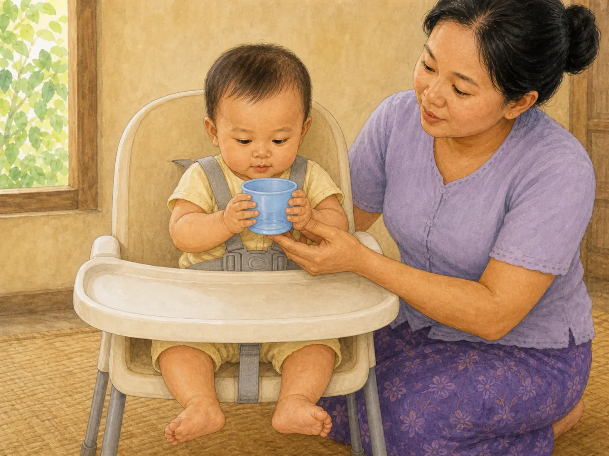

QA: behaviour ✓ · age ✓ · anatomy ✓ · hands/fingers ✓ · legs/feet ✓ · exact two-hand open-cup hold ✓ · upright restrained chair ✓ · caregiver stabilises cup ✓ · no bottle/spoon/food/hot liquid ✓ · culturally appropriate ✓ · wordless ✓

**EXISTING OWNER-APPROVED — PRESERVE**

### `gd_7_9m_sleep`

- Myanmar title: **၇ – ၉ လ — အိပ်စက်ခြင်း လမ်းညွှန်**
- English title: **7–9 months — Sleep guide**
- Production Myanmar summary: ၄ လမှ ၁၁ လအရွယ်တွင် တစ်ရက်လျှင် စုစုပေါင်း ၁၂ နာရီမှ ၁၆ နာရီ (နေ့ခင်း အိပ်ချိန် အပါအဝင်) အိပ်ရန် အကြံပြုထားသည်။ ဤအရွယ်တွင် ခွဲခွာမှု စိုးရိမ်ခြင်းကြောင့် ညအိပ် နိုးခြင်း ပြန်များလာတတ်ပြီး ၎င်းသည် ပုံမှန် ဖြစ်သည်။ တည်ငြိမ်ပြီး ခန့်မှန်းနိုင်သော အိပ်ရာဝင် လုပ်ရိုးလုပ်စဉ်သည် အထောက်အကူ ပြုသည်။
- Production English summary: Between 4 and 11 months, 12 to 16 hours of sleep a day including naps is what guidance suggests. Night waking often increases again at this age because of separation anxiety, and that is normal. A calm, predictable bedtime routine helps.
- Final ImageGen prompt: strict hand-painted ACE watercolor safe-sleep scene showing only a 7–9-month Myanmar baby sleeping alone on the back in the centre of a full bamboo cot, firm flat mattress and taut fitted sheet only, complete clear face/hands/feet, bare empty room; no plant, pillow, blanket, bumper, toy, cloth, cord, adult, text or other object.
- Asset: `/guides/gd_7_9m_sleep.49c5004bb6.webp` — 1200×900 — 119,386 bytes

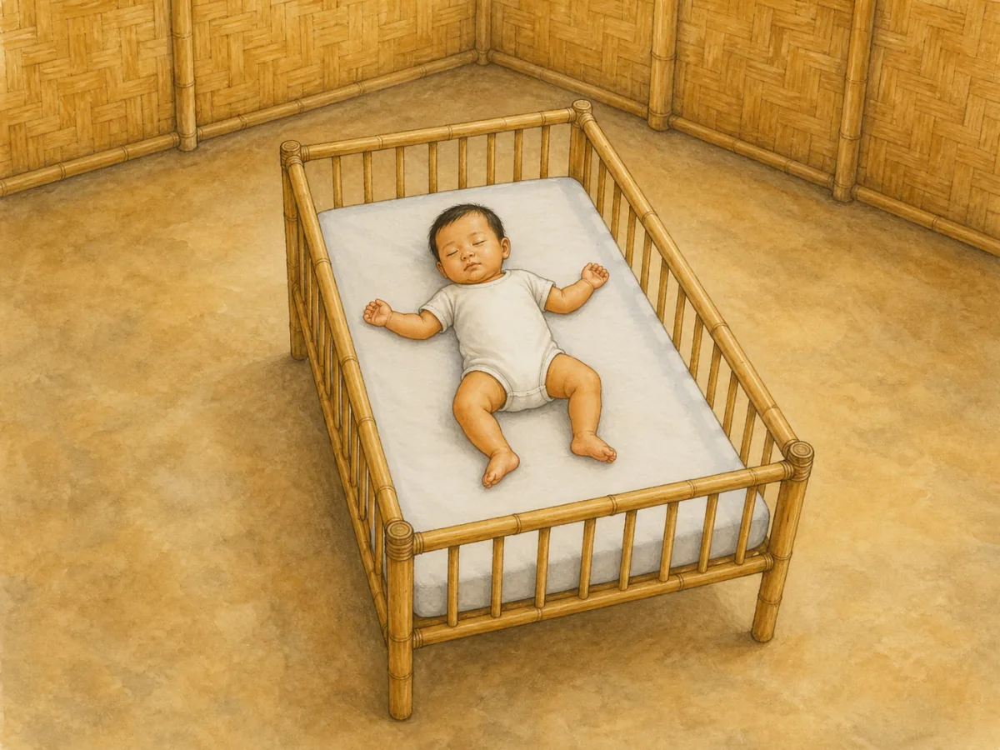

QA: behaviour ✓ · age ✓ · anatomy ✓ · hands/fingers ✓ · legs/feet ✓ · back sleeping ✓ · firm flat non-inclined mattress ✓ · fitted sheet only ✓ · empty cot and room ✓ · clear airway ✓ · no pillow/blanket/bumper/toy/cord ✓ · culturally appropriate ✓ · wordless ✓

Rejected candidate: the first candidate met the core safe-sleep mechanics but looked more photographic than the approved ACE artwork and included an unrelated potted plant. It failed style/extra-object QA and is not saved or mapped.

**READY FOR OWNER REVIEW**

### `gd_7_9m_social`

- Myanmar title: **၇ – ၉ လ — လူမှုဆက်ဆံရေး လမ်းညွှန်**
- English title: **7–9 months — Social guide**
- Production Myanmar summary: ဤအရွယ်တွင် ကလေးသည် အသိမျက်နှာနှင့် အသစ်ကို ရှင်းရှင်းလင်းလင်း ခွဲခြားတတ်ပြီဖြစ်ရာ၊ မိဘ ခွာသွားလျှင် ငိုခြင်း၊ အသိမဟုတ်သူကို တွန့်ဆုတ်ခြင်းများ ဖြစ်လာသည်။ ၎င်းသည် ပြဿနာ မဟုတ်ဘဲ ကျန်းမာသော တွယ်တာမှု၏ လက္ခဏာ ဖြစ်သည်။ ငြိမ်းချမ်းစွာ တုံ့ပြန်ပေးခြင်းက ကလေးအား လုံခြုံမှု ခံစားစေသည်။
- Production English summary: She now clearly tells familiar people from strangers, so she may cry when you leave and hold back from new faces. This is not a problem — it is a sign of healthy attachment. Calm, predictable responses help her feel safe.
- Asset: `/guides/gd_7_9m_social.2a908691eb.webp` — 1200×900 — 149,214 bytes

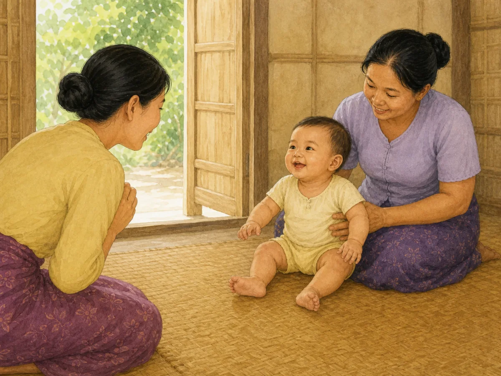

QA: behaviour ✓ · age ✓ · anatomy ✓ · hands/fingers ✓ · legs/feet ✓ · warm familiar-person recognition ✓ · trusted caregiver support ✓ · bright natural smile ✓ · no forced handoff/waving/arms-up signal ✓ · culturally appropriate ✓ · wordless ✓

**EXISTING OWNER-APPROVED — PRESERVE**

### `gd_7_9m_speech`

- Myanmar title: **၇ – ၉ လ — စကားသံ ထွက်ဆိုမှု လမ်းညွှန်**
- English title: **7–9 months — Speech guide**
- Production Myanmar summary: ဤအရွယ်တွင် ကလေးသည် ဗျည်းသံများကို ထပ်ခါထပ်ခါ ပေါင်းစပ်၍ "ဘဘဘ"၊ "ဒဒဒ" သကဲ့သို့ အသံ အစဉ်လိုက် ထွက်လာသည်။ "မာမာ"၊ "ဒါဒါ" ဟု ဆိုသော်လည်း လူကို ရည်ညွှန်း၍ မဟုတ်သေးဘဲ အသံ လေ့ကျင့်နေခြင်းသာ ဖြစ်သည်။ မိဘက ပြန်လည် တုံ့ပြန်ပေးလေ ကလေး၏ အသံ လေ့ကျင့်မှု များလေ ဖြစ်သည်။
- Production English summary: She now repeats consonant strings such as "bababa" and "dadada". "Mama" and "dada" may appear without yet naming a person — she is practising sounds. The more you answer, the more she practises.
- Final ImageGen prompt: warm wordless ACE watercolor scene of a seated 7–9-month Myanmar baby making a natural babbling mouth shape during a face-to-face vocal turn, with both hands and feet visible while mother watches with mouth closed and hands resting; no sound symbols, name-call turn, pointing, toy, book, screen or text.
- Asset: `/guides/gd_7_9m_speech.b2b52b6578.webp` — 1200×900 — 155,610 bytes

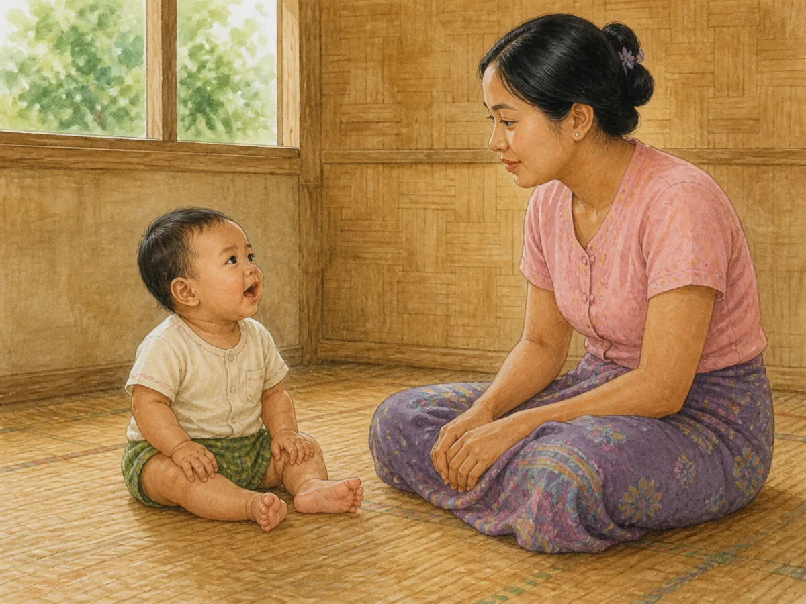

QA: behaviour ✓ · age ✓ · anatomy ✓ · hands/fingers ✓ · legs/feet ✓ · natural babbling mouth ✓ · direct mutual gaze ✓ · caregiver's mouth closed during pause ✓ · no sound symbol/object/extra action ✓ · culturally appropriate ✓ · wordless ✓

**READY FOR OWNER REVIEW**
