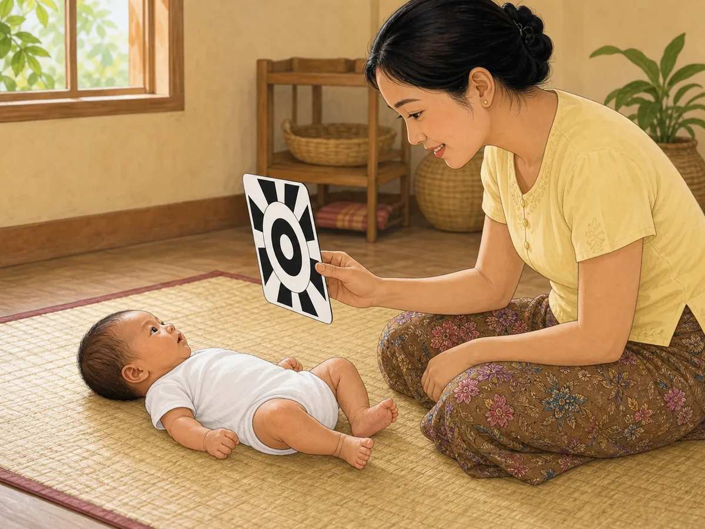
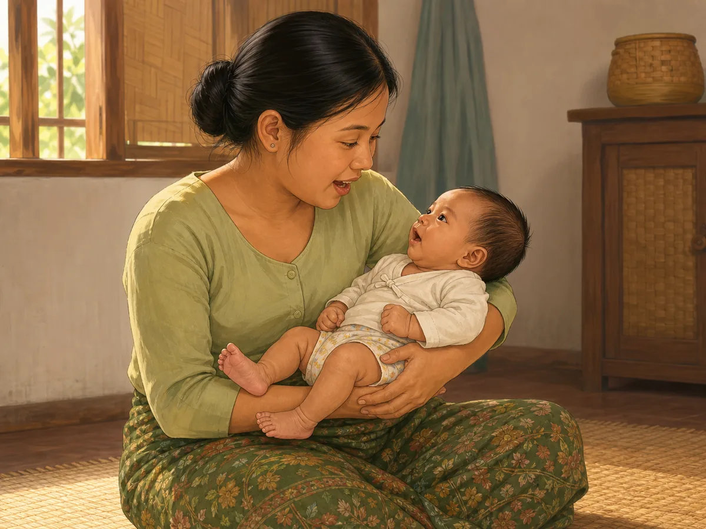
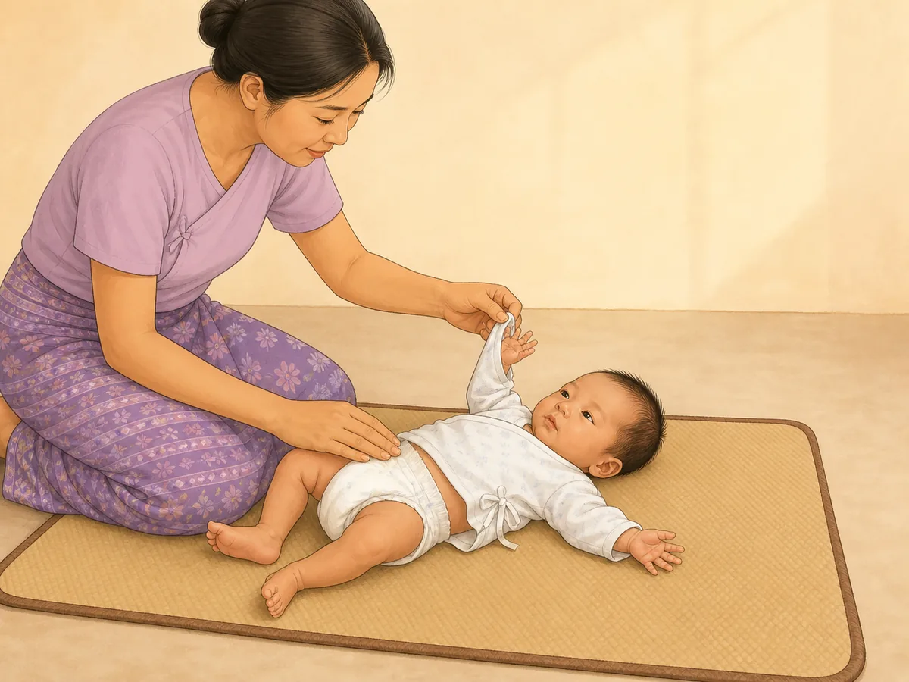
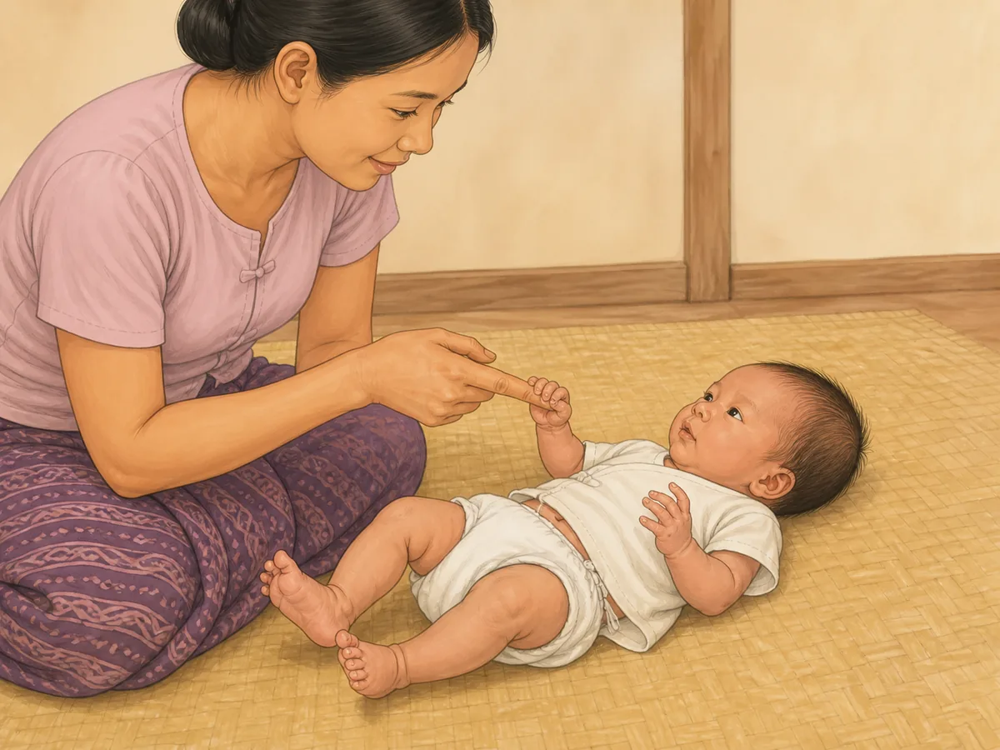
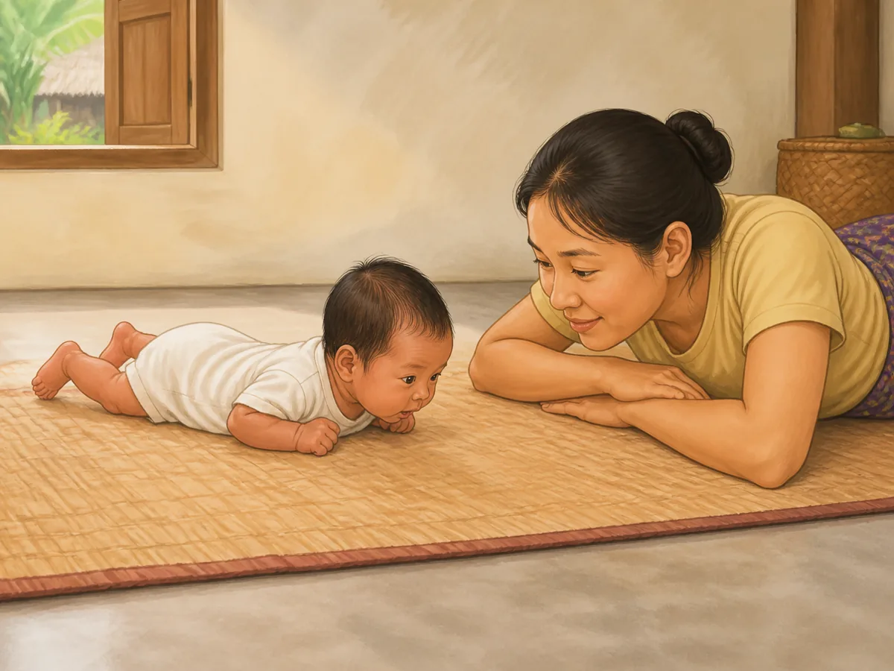
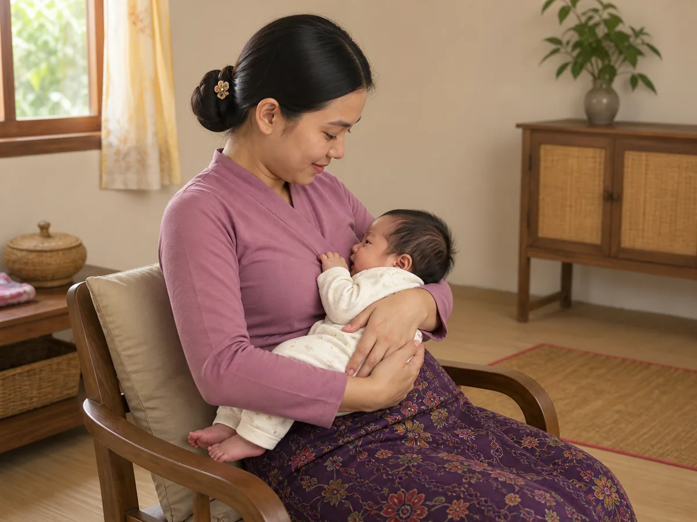
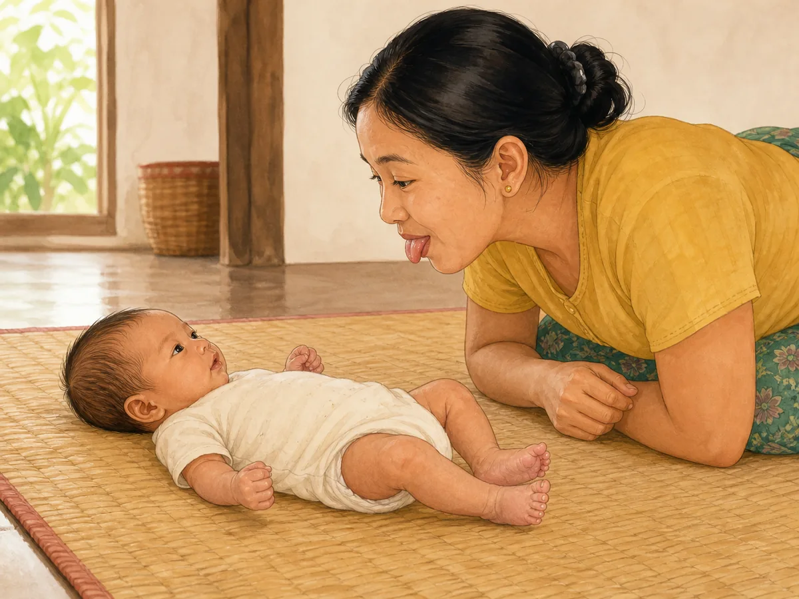
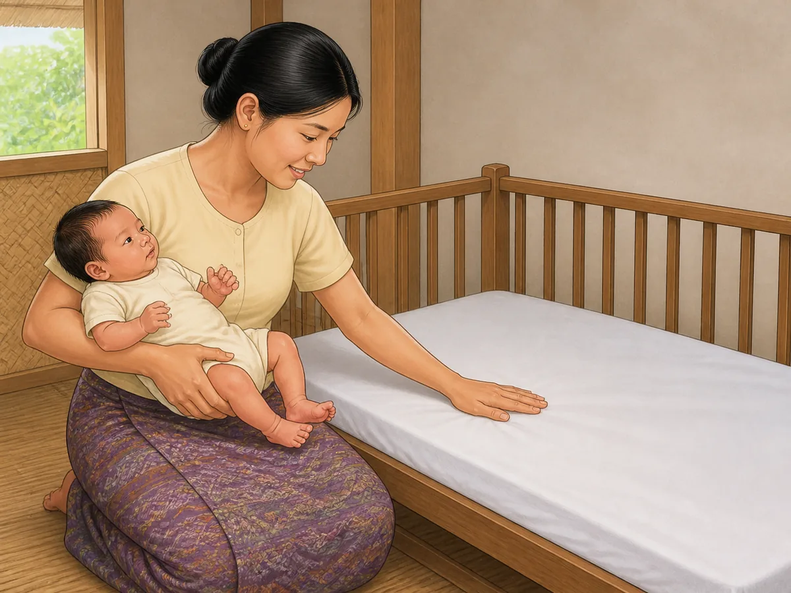

# ACE Child Grow — Birth–2 Month Guide Illustration Review

Status: **OWNER APPROVED FOR PRODUCTION — 2026-08-09**

Source of truth: Production Convex `libraryContent`, read directly on 2026-08-09 and filtered to exact `type = guide`, `ageGroupKey = birth_2m`, and `clinicalStatus = clinical_review`. Production contains exactly 11 matching records. The owner explicitly removed the former `published only` illustration-eligibility restriction on 2026-08-09. Production remains read only: this run does not change clinical status, text, translations, evidence, review metadata, or any Production record.

Every top-level field and every nested `data` field was inspected for all 11 records, including publication/review state, title, summary, age, domain, source, tags, version, timestamps, search index, observations, activities, common mistakes, materials, safety, red flags, referral guidance, FAQs, evidence summaries, encouragement, parent tips, weekly activities, indoor/outdoor ideas, low-cost ideas, and meaning (`why`).

## Pre-generation review table

| Slug | Myanmar title | English title | Exact behaviour / meaning | Image scene | Must not show | Safety constraints | Status |
|---|---|---|---|---|---|---|---|
| `gd_birth_2m_cognitive` | မွေးကင်းစ– ၂ လ — အသိဉာဏ် ဖွံ့ဖြိုးမှု လမ်းညွှန် | Birth–2 months — Early thinking guide | A newborn learns through close-range looking and repeated, predictable sensory experiences. | A Myanmar/Southeast Asian newborn lies safely on the back on a firm floor mat, eyes clearly fixed on one simple wordless black-and-white pattern card held 20–30 cm away by a seated caregiver. | Several objects; toy reaching; grasping; screen; letter/number; noisy bell; clapping; sitting; rolling; feeding; sleeping; text or label. | Baby remains on a firm floor-level mat with the caregiver beside the baby; one large card only, with no detachable or choking-size part. | READY |
| `gd_birth_2m_communication` | မွေးကင်းစ – ၂ လ — ဆက်သွယ်ပြောဆိုမှု လမ်းညွှန် | Birth–2 months — Communication guide | A newborn communicates with soft sounds and attentive gaze; a caregiver pauses, listens, and responds promptly. | A securely cradled Myanmar/Southeast Asian newborn looks toward the caregiver with a small cooing mouth shape while the caregiver listens face-to-face and answers gently. | Crying crisis; loud sound; clapping; musical toy; phone/screen; feeding; tongue game; exaggerated social smile; speech bubble; text or label. | Head, neck and lower body are fully supported; airway and face are clear; caregiver voice is gentle and there is no loud-noise source. | READY |
| `gd_birth_2m_daily_routine` | မွေးကင်းစ – ၂ လ — နေ့စဉ် လုပ်ရိုးလုပ်စဉ် လမ်းညွှန် | Birth–2 months — Daily rhythm guide | A newborn benefits from a gentle predictable rhythm rather than a strict clock schedule. | In soft daylight, a Myanmar/Southeast Asian caregiver calmly completes one ordinary nappy-change/dressing moment with an awake newborn lying on a safe floor-level changing mat. | Clock, calendar, timetable, multiple panels, feeding and sleep at once, bath water, elevated changing table, crying, toy, screen, text or label. | Floor-level changing surface; caregiver stays within reach; baby remains awake and on the back; no loose plastic, cord, powder cloud or unsafe sleep item. | READY |
| `gd_birth_2m_emotional` | မွေးကင်းစ – ၂ လ — စိတ်ခံစားမှု လမ်းညွှန် | Birth–2 months — Feelings and comfort guide | A newborn borrows calm from a responsive adult and settles when held and comforted. | A seated Myanmar/Southeast Asian caregiver holds a mildly upset newborn upright against the chest with secure head, back and lower-body support; the baby's face is visibly beginning to settle. | Ignored crying; severe distress; punishment; shaking; bouncing; feeding; unsafe sleep; toy; screen; medical emergency; text or label. | Caregiver remains calm and seated at floor level; baby's head and airway are supported and visible; no loose cloth over the face. | READY |
| `gd_birth_2m_fine_motor` | မွေးကင်းစ– ၂ လ — လက်နှင့် ကိုင်တွယ်မှု လမ်းညွှန် | Birth–2 months — Hands and grasp guide | The newborn's mostly fisted hand closes reflexively around a caregiver's clean finger while the other hand may begin to open. | A Myanmar/Southeast Asian newborn lies safely on the back while one small hand naturally grasps one caregiver finger; the second hand rests partly open near the chest. | Forced toy in hand; rattle; block; pincer grasp; reaching; mitten; cord; plastic; small object; both hands performing different skills; text or label. | Floor-level firm mat; caregiver stays beside the baby; one clean finger is the only grasped object; natural loose grip with no pulling. | READY |
| `gd_birth_2m_gross_motor` | မွေးကင်းစ– ၂ လ — ကိုယ်လက်လှုပ်ရှားမှု လမ်းညွှန် | Birth–2 months — Big movement guide | During awake supervised tummy time, a newborn briefly attempts to lift the head as neck and back control develops. | A fully awake Myanmar/Southeast Asian newborn lies prone on a firm clean floor mat and lifts the head only slightly while a caregiver lies at eye level within arm's reach. | Sleeping prone; high head/chest push-up; rolling; sitting; crawling; standing; pillow; folded support under the chest; mirror; toy; text or label. | Awake and continuously supervised; firm flat floor-level surface; face and airway clear; stop before fatigue; sleep is always on the back. | READY |
| `gd_birth_2m_nutrition` | မွေးကင်းစ – ၂ လ — အာဟာရနှင့် နို့တိုက်ကျွေးခြင်း လမ်းညွှန် | Birth–2 months — Feeding guide | A newborn feeds on early hunger cues with a responsive caregiver; exclusive breastfeeding is the central guidance. | A Myanmar/Southeast Asian mother breastfeeds a newborn in a comfortable seated position, supporting the baby's head, neck and body in one aligned line while looking attentively at the baby. | Bottle propping; water; sugar water; honey; cow's milk; spoon; solid food; independent bottle holding; feeding by a clock; extra objects; text or label. | Secure supported latch posture; baby's nose and airway remain clear; mother is seated and awake; no hot drink or unsafe feeding object nearby. | READY |
| `gd_birth_2m_play` | မွေးကင်းစ – ၂ လ — ကစားခြင်း လမ်းညွှန် | Birth–2 months — Play guide | Play is brief responsive interaction with a caregiver's face, voice and gentle movement; no toy is needed. | A Myanmar/Southeast Asian caregiver leans face-to-face over a safely reclined awake newborn and makes one gentle playful tongue-out expression while the baby watches with calm bright eyes. | Toy; mobile; screen; clapping; rough rocking; throwing in air; long or overstimulating play; feeding; crying; independent movement; text or label. | Baby remains supported on a firm floor-level mat; caregiver respects gaze-away/tired cues; no rough movement or object near the baby's face. | READY |
| `gd_birth_2m_safety` | မွေးကင်းစ – ၂ လ — ဘေးကင်းလုံခြုံရေး လမ်းညွှန် | Birth–2 months — Safety guide | A caregiver actively prepares a newborn's safe sleep space: separate, firm, flat, empty and smoke-free. | A Myanmar/Southeast Asian caregiver safely cradles an awake newborn beside a separate empty cot and checks the bare, firm, flat mattress before putting the baby down. | Baby already sleeping; pillow; blanket; bumper; teddy/stuffed toy; loose cloth; adult bed-sharing; sofa; hot drink; water container; smoke; hazard demonstration; text or label. | Positive prevention only: empty cot, fitted sheet, firm flat mattress, caregiver in control, separate infant sleep space; no prohibited object is introduced visually. | READY |
| `gd_birth_2m_sleep` | မွေးကင်းစ–၂ လ — အိပ်စက်ခြင်း | Birth–2 months — Sleep | Safe sleep means the newborn sleeps on the back on a firm, flat, non-inclined, empty sleep surface. | A Myanmar/Southeast Asian newborn sleeps alone on the back in the centre of a simple cot with a fitted sheet on a firm flat mattress, arms naturally positioned and face fully clear. | Side/prone sleep; pillow; blanket; bumper; teddy/stuffed toy; loose cloth; swaddle over face; inclined mattress; adult bed; sofa; car seat; text or label. | Exact safe-sleep rules: back sleeping, firm flat mattress, empty cot, fitted sheet only, clear face and airway, no smoke or overheating cue. | READY |
| `gd_birth_2m_social` | မွေးကင်းစ – ၂ လ — လူမှုဆက်ဆံရေး လမ်းညွှန် | Birth–2 months — Social connection guide | A newborn is drawn to a familiar human face, makes calm eye contact and may show an early social smile. | A Myanmar/Southeast Asian newborn is securely supported in a caregiver's arms, makes direct eye contact and shows a subtle first smile while the caregiver smiles quietly back. | Cooing conversation; tongue game; stranger; forced handoff; tickling; toy; mirror; feeding; waving; sitting; exaggerated laughter; text or label. | Head, neck and body are fully supported; caregiver respects gaze-away cues; no crowd, sick visitor, smoke or unsafe hold. | READY |

## Pre-generation confirmation

- All 11 concepts use exact Production titles, summaries, age group, domain, safety guidance and nested meaning: **PASS**
- Each slug has one distinct central scene and will receive one unique asset: **PASS**
- Every newborn posture and level of independence matches birth–2 months: **PASS**
- Sleep and safety concepts follow the empty-cot, back-sleeping, firm-flat-mattress rule: **PASS**
- Feeding shows supervised, supported breastfeeding with no water, solid food or bottle propping: **PASS**
- No red flag, diagnosis, emergency or unsafe act will be dramatised: **PASS**
- Every image will be Myanmar/Southeast Asian, warm, wordless, landscape 4:3 and understandable without reading: **PASS**
- No image was generated before this table was completed: **PASS**

## Owner-override boundary

The owner authorized illustration work for `clinical_review` records on 2026-08-09 and removed the former `published only` eligibility rule. This does not authorize editing clinical wording, translations, evidence, review metadata, or Production Convex status. The owner approved all 11 final text-and-image cards for production on 2026-08-09.

## Owner review cards

### `gd_birth_2m_cognitive`

- Myanmar title: **မွေးကင်းစ– ၂ လ — အသိဉာဏ် ဖွံ့ဖြိုးမှု လမ်းညွှန်**
- English title: **Birth–2 months — Early thinking guide**
- Production meaning: Learning happens through looking, listening and touching; repeated predictable experiences build early brain connections.
- Asset: `/guides/gd_birth_2m_cognitive.ab5c096dbf.webp` — 1200×900, 136,884 bytes

QA: exact close-range looking behaviour ✓ · gaze fixed on one black/white pattern ✓ · 0–2-month proportions/posture ✓ · full body ✓ · hands/fingers ✓ · legs/feet ✓ · caregiver beside baby ✓ · floor-level firm mat ✓ · no reaching/toy/screen/text ✓ · culturally appropriate ✓ · wordless ✓

**OWNER APPROVED FOR PRODUCTION — 2026-08-09**

### `gd_birth_2m_communication`

- Myanmar title: **မွေးကင်းစ – ၂ လ — ဆက်သွယ်ပြောဆိုမှု လမ်းညွှန်**
- English title: **Birth–2 months — Communication guide**
- Production meaning: The newborn communicates with a soft sound and gaze while the caregiver listens and responds promptly.
- Asset: `/guides/gd_birth_2m_communication.dfb919eff7.webp` — 1200×900, 104,608 bytes

QA: exact coo/listen/respond behaviour ✓ · direct mutual gaze ✓ · clear natural mouth expressions ✓ · 0–2-month proportions ✓ · secure head/neck/body support ✓ · full body ✓ · hands/fingers ✓ · legs/feet ✓ · no loud sound/toy/screen/feeding/text ✓ · culturally appropriate ✓ · wordless ✓

**OWNER APPROVED FOR PRODUCTION — 2026-08-09**

### `gd_birth_2m_daily_routine`

- Myanmar title: **မွေးကင်းစ – ၂ လ — နေ့စဉ် လုပ်ရိုးလုပ်စဉ် လမ်းညွှန်**
- English title: **Birth–2 months — Daily rhythm guide**
- Production meaning: A calm predictable caregiving rhythm helps a newborn; a rigid clock schedule is not required.
- Asset: `/guides/gd_birth_2m_daily_routine.bb306b07b9.webp` — 1200×900, 86,282 bytes

QA: one gentle dressing-routine moment ✓ · awake baby on back ✓ · floor-level changing mat ✓ · 0–2-month proportions ✓ · both complete hands/fingers visible ✓ · both legs/feet visible ✓ · no clock/calendar/multiple scene/feeding/sleep/text ✓ · culturally appropriate ✓ · wordless ✓

Rejected candidates: the first candidate added a folded cloth beneath the baby's head and a basket of spare clothing; the second hid one baby hand inside the sleeve. Neither rejected image is saved or mapped. The accepted final keeps the surface clear and shows both complete hands.

**OWNER APPROVED FOR PRODUCTION — 2026-08-09**

### `gd_birth_2m_emotional`

- Myanmar title: **မွေးကင်းစ – ၂ လ — စိတ်ခံစားမှု လမ်းညွှန်**
- English title: **Birth–2 months — Feelings and comfort guide**
- Production meaning: A responsive caregiver's calm hold helps a mildly upset newborn settle; crying is communication, not manipulation.
- Asset: `/guides/gd_birth_2m_emotional.2456e64699.webp` — 1200×900, 129,664 bytes

QA: exact hold-and-settle behaviour ✓ · mild beginning-to-calm expression ✓ · 0–2-month proportions ✓ · head/upper-back/lower-body support ✓ · clear airway ✓ · full body ✓ · hands/fingers ✓ · legs/feet ✓ · no shaking/punishment/emergency/object/text ✓ · culturally appropriate ✓ · wordless ✓

**OWNER APPROVED FOR PRODUCTION — 2026-08-09**

### `gd_birth_2m_fine_motor`

- Myanmar title: **မွေးကင်းစ– ၂ လ — လက်နှင့် ကိုင်တွယ်မှု လမ်းညွှန်**
- English title: **Birth–2 months — Hands and grasp guide**
- Production meaning: A mostly fisted newborn hand closes reflexively around a finger while the hands gradually begin to open.
- Asset: `/guides/gd_birth_2m_fine_motor.6090c1ac8d.webp` — 1200×900, 90,626 bytes

QA: exact single-finger palmar grasp ✓ · second hand partly open ✓ · natural hands/fingers ✓ · 0–2-month proportions/posture ✓ · full body ✓ · legs/feet ✓ · caregiver does not pull ✓ · no toy/rattle/small object/mitten/text ✓ · culturally appropriate ✓ · wordless ✓

**OWNER APPROVED FOR PRODUCTION — 2026-08-09**

### `gd_birth_2m_gross_motor`

- Myanmar title: **မွေးကင်းစ– ၂ လ — ကိုယ်လက်လှုပ်ရှားမှု လမ်းညွှန်**
- English title: **Birth–2 months — Big movement guide**
- Production meaning: During awake supervised tummy time, the newborn briefly attempts a small head lift as early neck and back control develops.
- Asset: `/guides/gd_birth_2m_gross_motor.95520ad071.webp` — 1200×900, 72,114 bytes

QA: exact awake tummy-time head-lift attempt ✓ · nose/mouth clear ✓ · chest/forearms remain down ✓ · 0–2-month proportions ✓ · hands/fingers ✓ · legs/feet ✓ · direct arm's-reach supervision ✓ · firm flat floor mat ✓ · no sleep/push-up/rolling/pillow/toy/text ✓ · culturally appropriate ✓ · wordless ✓

**OWNER APPROVED FOR PRODUCTION — 2026-08-09**

### `gd_birth_2m_nutrition`

- Myanmar title: **မွေးကင်းစ – ၂ လ — အာဟာရနှင့် နို့တိုက်ကျွေးခြင်း လမ်းညွှန်**
- English title: **Birth–2 months — Feeding guide**
- Production meaning: The newborn feeds responsively on early hunger cues; exclusive breastfeeding is recommended for about the first six months.
- Asset: `/guides/gd_birth_2m_nutrition.5015e31552.webp` — 1200×900, 80,154 bytes

QA: responsive feeding position ✓ · fully clothed modest depiction ✓ · aligned head/neck/body support ✓ · clear nose/airway ✓ · 0–2-month proportions ✓ · natural visible anatomy ✓ · seated awake caregiver ✓ · no bottle/water/honey/solid food/hot drink/text ✓ · culturally appropriate ✓ · wordless ✓

Generation note: the first request produced no image because the ImageGen safety system blocked the breastfeeding wording. The successful call preserved the clinical meaning with a completely closed blouse and a non-explicit, fully clothed feeding position.

**OWNER APPROVED FOR PRODUCTION — 2026-08-09**

### `gd_birth_2m_play`

- Myanmar title: **မွေးကင်းစ – ၂ လ — ကစားခြင်း လမ်းညွှန်**
- English title: **Birth–2 months — Play guide**
- Production meaning: Newborn play is short responsive face-and-voice interaction; bought toys are not needed.
- Asset: `/guides/gd_birth_2m_play.b779fe5a19.webp` — 1200×900, 107,984 bytes

QA: exact brief face-play behaviour ✓ · gentle tongue-out expression ✓ · newborn watches caregiver ✓ · 0–2-month proportions/posture ✓ · full body ✓ · hands/fingers ✓ · legs/feet ✓ · floor-level safety ✓ · no toy/screen/clapping/rough movement/text ✓ · culturally appropriate ✓ · wordless ✓

**OWNER APPROVED FOR PRODUCTION — 2026-08-09**

### `gd_birth_2m_safety`

- Myanmar title: **မွေးကင်းစ – ၂ လ — ဘေးကင်းလုံခြုံရေး လမ်းညွှန်**
- English title: **Birth–2 months — Safety guide**
- Production meaning: The caregiver prepares a separate firm, flat and empty infant sleep space before putting the newborn down.
- Asset: `/guides/gd_birth_2m_safety.edd2756676.webp` — 1200×900, 102,702 bytes

QA: exact positive cot-safety preparation ✓ · awake fully supported newborn ✓ · full body ✓ · hands/fingers ✓ · legs/feet ✓ · caregiver presses firm flat mattress ✓ · fitted sheet only ✓ · cot completely empty ✓ · no pillow/blanket/toy/smoke/hazard/text ✓ · culturally appropriate ✓ · wordless ✓

**OWNER APPROVED FOR PRODUCTION — 2026-08-09**

### `gd_birth_2m_sleep`

- Myanmar title: **မွေးကင်းစ–၂ လ — အိပ်စက်ခြင်း**
- English title: **Birth–2 months — Sleep**
- Production meaning: Safe sleep protects life: every sleep is on the back on a firm, flat, non-inclined and empty sleep surface.
- Asset: `/guides/gd_birth_2m_sleep.3bf5cea75b.webp` — 1200×900, 52,696 bytes

QA: baby exactly on back ✓ · firm flat non-inclined mattress ✓ · taut fitted sheet only ✓ · empty cot ✓ · face/airway fully clear ✓ · full body ✓ · hands/fingers ✓ · legs/feet ✓ · 0–2-month proportions ✓ · no pillow/blanket/bumper/toy/swaddle/text ✓ · culturally appropriate ✓ · wordless ✓

**OWNER APPROVED FOR PRODUCTION — 2026-08-09**

### `gd_birth_2m_social`

- Myanmar title: **မွေးကင်းစ – ၂ လ — လူမှုဆက်ဆံရေး လမ်းညွှန်**
- English title: **Birth–2 months — Social connection guide**
- Production meaning: The newborn is drawn to a familiar face, makes calm eye contact and may show a subtle first social smile.
- Asset: `/guides/gd_birth_2m_social.d03fb94d44.webp` — 1200×900, 100,702 bytes

QA: exact direct eye contact ✓ · subtle first smile ✓ · caregiver quietly smiles with closed mouth ✓ · 0–2-month proportions ✓ · secure head/neck/body support ✓ · full body ✓ · hands/fingers ✓ · legs/feet ✓ · no coo/tongue game/toy/feeding/text ✓ · culturally appropriate ✓ · wordless ✓

**OWNER APPROVED FOR PRODUCTION — 2026-08-09**

## Mapping and engineering verification

- Exact slug-to-asset mapping for all 11 owner-authorized `birth_2m` guides: **PASS**
- Unique asset paths, existing files and no domain/age/type fallback: **PASS**
- SHA-256 filename hashes, WebP format, 1200×900 dimensions and under-500-KB limits: **PASS**
- Bilingual Myanmar/English ContentDetail rendering with the exact title and exact image: **PASS — 18 guide records / 23 focused tests**
- Full unit suite: **PASS — 1,174/1,174 across 121 test files**
- Typecheck: **PASS**
- Lint: **PASS**
- Production build: **PASS — 310 modules transformed; no missing import, missing image or asset warning**
- PWA precache: **PASS — 261 entries; all 11 new exact guide assets included**
- Running local production preview direct-asset load: **PASS — 11/11 complete at 1200×900**
- Authenticated detail-page navigation and screenshots: **BLOCKED BY LOCAL AUTHENTICATION** — the running local production preview correctly redirected the private detail route to sign-in. No authentication control was bypassed. Exact bilingual text/image rendering is covered by the focused component test, and all final illustration previews appear above.
- Existing unit-suite React `act(...)` warnings are unrelated to guide assets; this change introduced no asset-related warning.

## Deployment authorization

Owner approval of this complete 11-image review: **GRANTED ON 2026-08-09**

Final result: **APPROVED FOR PRODUCTION**
