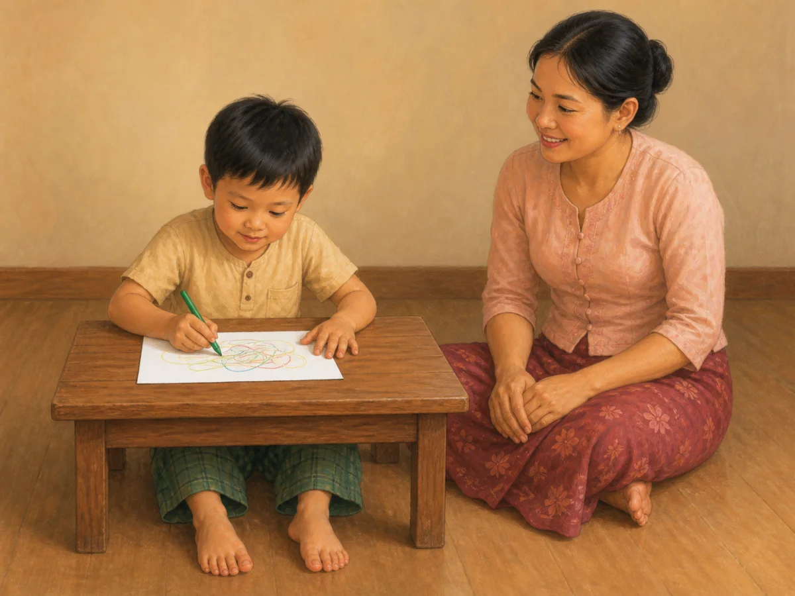

# ACE Child Grow — creativity lesson illustration review

Status: **READY FOR OWNER REVIEW — NOT DEPLOYED**

## Production source of truth

- Exact Production Convex filter: `type == "lesson"` and `category == "creativity"`.
- Fresh read-only Production snapshot: 2026-08-13 from deployment `graceful-possum-566`; no Production data was modified.
- Exact result: one record, `lsn_creativity`, with `clinicalStatus = clinical_review`; no age-group field is present.
- Every available top-level and nested field was read: IDs/timestamps, category, status, slug, bilingual titles and summaries, objective, complete bilingual body, quiz/options/answer, takeaway, actionToday, reading/duration minutes, tags, source, version/revision, and search text.
- Production media was also checked: the only existing illustration row is an offline placeholder, so it is not reused.
- No local seed, TypeScript constant, JSON dump, screenshot, old image, category art, or shared fallback was used as content authority.

## Pre-generation review table

| Slug | Lesson meaning | Primary visual message | Scene | Must not show | Safety requirements | Status |
|---|---|---|---|---|---|---|
| `lsn_creativity` | Creativity grows through open-ended activity without one correct answer; the caregiver values the child’s process and lets the child lead the idea. | A preschool-aged child freely makes their own colourful marks on blank paper while a caregiver watches warmly without touching, pointing, correcting, or demonstrating. | One Myanmar/Southeast Asian preschool child sits stably at a very low table with both feet supported on the floor. The child holds one thick, blunt coloured pencil naturally and draws free non-letter, non-number colour marks on one plain sheet of paper; the other hand steadies the paper. One caregiver sits at the child’s eye level within reach, with both empty hands relaxed on their own lap and an encouraging expression. The child’s complete body and both people’s visible anatomy are natural. The background is plain and uncluttered. | Adult touching the pencil or paper; pointing, directing, correcting, copying, tracing, colouring inside a template, holding up a finished result, award/ribbon/star, praise text, letters, numbers, name, worksheet, colouring book, screen, blocks, pretend-play props, scissors, glue, paint, easel, extra toys, distress, text, label, arrow, logo, UI, or watermark. | Stable floor-level furniture; caregiver supervision; thick blunt child-safe pencil; no sharp tool, small choking object, spill, glass, hot item, elevated chair, or trip hazard. | READY FOR OWNER REVIEW |

## Exact Production record

- Myanmar title: တီထွင်ဖန်တီးမှု အားပေးခြင်း
- English title: Nurturing creativity
- Myanmar summary: လွတ်လပ်စွာ ဆွဲ/တည်ဆောက်/ဟန်ဆောင် ကစားခြင်း အားပေးခြင်း။
- English summary: Encourage open-ended art, building, and pretend play.
- Objective (MM): တီထွင်ဖန်တီးမှု အားပေးနည်း သိရှိရန်။
- Objective (EN): Learn to support creativity.
- Body (MM): တီထွင်ဖန်တီးမှုသည် အဖြေမှန်တစ်ခုတည်း မရှိသော ကစားခြင်းမှ ကြီးထွားသည်။ ရလဒ်ထက် လုပ်ငန်းစဉ်ကို ချီးမွမ်းပါ (“အရောင်တွေ ရောသုံးထားတာ တွေ့တယ်”)။ ကလေး၏ စိတ်ကူးကို ဦးဆောင်ခွင့် ပေးပါ။
- Body (EN): Creativity grows from open-ended play with no single right answer. Praise the process, not the result. Let the child lead their ideas.
- Quiz (MM/EN): တီထွင်မှုအတွက် ချီးမွမ်းသင့်သည်မှာ — / For creativity, praise the —
- Correct quiz option: လုပ်ငန်းစဉ် / process
- Takeaway (MM): “မှန်/မှား” မရှိသော ကစားခြင်းက တီထွင်မှုကို မွေးသည်။
- Takeaway (EN): Open-ended play breeds creativity.
- Action today (MM): ယနေ့ ကလေးကို ခဲတံ/စက္ကူဖြင့် လွတ်လပ်စွာ ဆွဲစေပါ။
- Action today (EN): Let your child draw freely today.
- Category: `creativity`
- Age group: unavailable in Production; the action and child-safe art scene use preschool proportions without claiming a narrower age.
- Publication status: `clinical_review`
- Version / review revision: 1 / 5
- Existing media: placeholder only (`kind = illustration`, `offline = true`, `placeholder = true`)

## Approved candidate

- Asset: `/lessons/creativity/lsn_creativity.3e8ca55af0.webp`
- Dimensions: 1200×900 (landscape 4:3)
- Optimized size: 82,180 bytes
- SHA-256: `3e8ca55af07376950c154bb45aca4247dfd97deefd2e42d3984e7bf98c0eda8a`

## Image QA

- Myanmar/English title and summary meaning: **PASS**
- Complete body, quiz answer, takeaway, and actionToday comparison: **PASS**
- Child freely leads an open-ended drawing: **PASS**
- Drawing has no single right answer: **PASS** — abstract colour marks only, with no template, letter, number, or recognizable target
- Caregiver praises/supports the process without controlling it: **PASS** — warm gaze; both hands empty on own lap; no touching or pointing
- Preschool developmental age and posture: **PASS**
- Child hands, fingers, legs, feet, and toes: **PASS**
- Caregiver hands and visible anatomy: **PASS**
- Face, gaze, and expression: **PASS**
- Safe blunt pencil, low table, floor-level environment, and supervision: **PASS**
- No unrelated activity, toy, award, screen, or unsafe object: **PASS**
- No text, label, arrow, logo, UI, or watermark: **PASS**
- Myanmar/Southeast Asian cultural fit: **PASS**
- Unique exact-slug mapping with no creativity/category fallback: **PASS**

Final result: **READY FOR OWNER REVIEW**

## Engineering and application verification

- Focused exact-slug mapping and detail rendering: **PASS** — 16 tests
- Full unit suite: **PASS** — 132 files / 1,338 tests
- Type check and lint: **PASS**
- Production build: **PASS**
- PWA precache: **PASS** — 347 entries; exact versioned creativity asset is in `dist/sw.js`
- Missing asset, broken import, or asset-related warning: **NONE**
- Existing Vite dynamic/static import notice: unrelated to this illustration change
- Existing React test `act(...)` notices: unrelated to this illustration change
- Exact asset HTTP response and WebP content type: **PASS**
- Desktop/mobile text-and-image review cards: **PASS**
- Browser console/page errors and horizontal overflow: **NONE**

Review captures:

- [Desktop text + image card](screenshots/lessons-creativity/lsn_creativity-desktop.jpg)
- [Mobile text + image card](screenshots/lessons-creativity/lsn_creativity-mobile.jpg)

## Deployment gate

`DEPLOY_ALLOWED = false`. No push, deployment, publication, or Production Convex update is allowed before the completed creativity review receives explicit owner approval.
