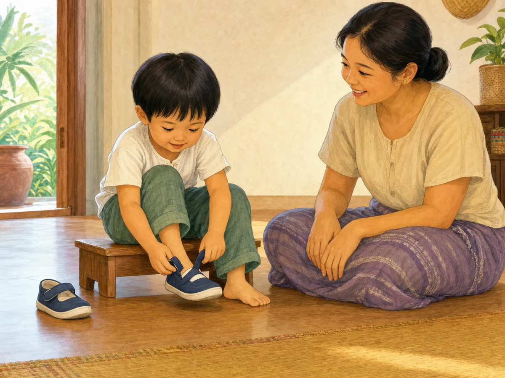

# ACE Child Grow — Published Preparing-for-Preschool Lesson Illustration Review

Status: **OWNER APPROVED — RELEASE AUTHORIZED**

Source of truth: Production Convex `libraryContent`, filtered to `type = lesson`, `category = preparing_for_preschool`, and `clinicalStatus = published`. Read on 2026-08-03. Production contains exactly one matching published record. `ageGroupKey` and separate safety guidance are unavailable in the production record.

## Pre-generation review

| Slug | Lesson meaning | Primary visual message | Scene | Must not show | Status |
|---|---|---|---|---|---|
| `lsn_prepare_preschool` | Preschool readiness depends more on brief separation, routines, and basic self-help than early academics. | The child independently puts on a shoe today while the caregiver encourages without taking over. | One Myanmar preschool-aged child safely seated on a very low stable bench, fastening a simple shoe while a caregiver watches nearby with hands away. | Text, academic worksheets, screens, toys, a caregiver putting on the shoe, shoelace tying, school departure, crying, forced separation, or unrelated actions. | READY |

## `lsn_prepare_preschool`

- Myanmar title: မူကြိုအတွက် ပြင်ဆင်ခြင်း
- English title: Getting ready for preschool
- Myanmar summary: ခွဲနေခြင်း၊ လုပ်ရိုးလုပ်စဉ်နှင့် ကိုယ်တိုင်လုပ်နိုင်မှု လေ့ကျင့်ခြင်း။
- English summary: Practice separation, routines, and self-help.
- Objective: မူကြိုအသင့်ဖြစ်မှု အခြေခံ သိရှိရန်။ / Know preschool readiness basics.
- Myanmar body: မူကြိုအတွက် အသင့်ဖြစ်မှုသည် စာတတ်မှုထက် — ခဏခွဲနေနိုင်ခြင်း၊ လုပ်ရိုးလုပ်စဉ် လိုက်နာနိုင်ခြင်းနှင့် ကိုယ်တိုင် အခြေခံ လုပ်နိုင်ခြင်းက ပို၍ အရေးကြီးသည်။ မူကြိုအကြောင်း အပြုသဘော စကားဖြင့် ပြောပါ။
- English body: Preschool readiness is less about academics and more about brief separation, following routines, and basic self-help. Talk about preschool positively.
- Takeaway: လူမှု/ခံစားမှု ကျွမ်းကျင်မှုက အဓိကဖြစ်သည်။ / Social-emotional skills matter most.
- Action today: ယနေ့ ကလေးကို ကိုယ်တိုင် ဖိနပ်ဝတ်စေပါ။ / Let your child put on their own shoes today.
- Category: `preparing_for_preschool`
- Age group: unavailable / unassigned in Production Convex; the published preschool-readiness meaning establishes preschool-aged depiction without adding a narrower age claim.
- Safety guidance: unavailable as a separate production field; the selected scene uses a stable very low seat, floor-level environment, simple wide-opening shoes, and caregiver supervision.
- Publication status: `published`
- Asset: `/lessons/preparing_for_preschool/lsn_prepare_preschool.47a357b858.webp`

## Image QA

- Main lesson meaning is visible: **PASS**
- Primary action matches `actionToday`: **PASS** — the child independently handles and fastens the shoe
- Preschool-age accuracy: **PASS**
- Caregiver role: **PASS** — nearby encouragement without physical assistance
- Anatomy, hands, fingers, legs, and feet: **PASS**
- Facial expressions and gaze: **PASS** — focused child, warm caregiver
- Safe posture and environment: **PASS** — very low stable bench and floor-level scene
- No unrelated action or unsafe object: **PASS**
- No medical overclaim, shame, distress, or stereotype: **PASS**
- No text, label, logo, or watermark: **PASS**
- Myanmar/Southeast Asian cultural fit: **PASS**
- Landscape 4:3 WebP, 1200×900, 155,062 bytes: **PASS**
- Exact slug mapping with no category fallback: **PASS**

Final result: **OWNER APPROVED**

## Engineering verification

- Focused exact-slug mapping tests: **PASS** — 6 tests across the approved lesson mappings
- Full unit suite: **PASS** — 96 test files / 969 tests
- Type check and lint: **PASS**
- Production build: **PASS**
- Asset-related build warnings or missing imports: **NONE**
- PWA precache: **PASS** — the exact versioned lesson asset is present in `dist/sw.js`
- Mobile/desktop browser capture: **BLOCKED** — the in-app browser's admin-enforced security policy could not be verified, so application-page inspection was refused. The control was not bypassed. The final 1200×900 asset preview above remains available for owner review.

Deployment approval: **GRANTED BY OWNER ON 2026-08-03** — production release tracked through the repository PR and deployment history.
