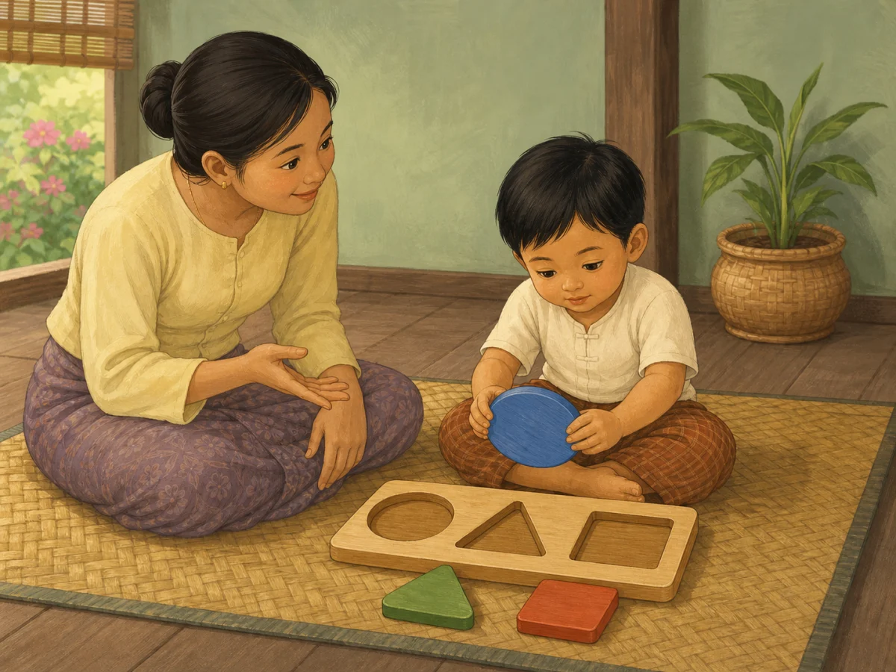

# ACE Child Grow — Published Problem-Solving Lesson Illustration Review

Status: **READY FOR OWNER REVIEW — NOT DEPLOYED**

Source of truth: Production Convex `libraryContent`, filtered to `type = lesson`, `category = problem_solving`, and `clinicalStatus = published`. Read on 2026-08-03. Production contains exactly one matching published record. `ageGroupKey` and separate safety guidance are unavailable in the production record.

## Pre-generation review

| Slug | Lesson meaning | Primary visual message | Scene | Must not show | Status |
|---|---|---|---|---|---|
| `lsn_problem_solving_parenting` | When a child is stuck, ask a guiding question and allow another attempt instead of supplying the answer; mistakes build learning, patience, and confidence. | The child keeps trying a simple problem while the caregiver encourages thinking without pointing out the answer. | One Myanmar child works independently with a large three-piece inset puzzle on a floor mat while a caregiver sits at eye level, hands away, using a gentle palm-up conversational gesture. | Text, speech bubbles, question marks, caregiver touching or pointing to the answer, a completed puzzle, scolding, distress, screens, unrelated toys/actions, or choking-size pieces. | READY |

## `lsn_problem_solving_parenting`

- Myanmar title: ပြဿနာ ဖြေရှင်းမှု အားပေးခြင်း
- English title: Coaching problem solving
- Myanmar summary: အဖြေမပေးဘဲ တွေးခေါ်ရန် ကူညီခြင်း။
- English summary: Help children think it through instead of giving answers.
- Objective: ပြဿနာဖြေရှင်းမှု အားပေးနည်း သိရှိရန်။ / Learn to coach problem solving.
- Myanmar body: ကလေး အခက်အခဲ ကြုံရင် ချက်ချင်း အဖြေ မပေးပါနှင့်။ “ဘယ်လို လုပ်ကြည့်မလဲ” ဟု မေးပါ။ ကြိုးစားခွင့် ပေး၍ မှားလည်း သင်ယူမှုဟု မှတ်ယူပါ။ ဤသည်က စိတ်ရှည်မှုနှင့် ယုံကြည်မှုကို တည်ဆောက်သည်။
- English body: When a child is stuck, don’t rush the answer. Ask “what could you try?” Let them attempt; mistakes are learning. This builds patience and confidence.
- Takeaway: မှားယွင်းမှုတိုင်းသည် သင်ယူမှုဖြစ်သည်။ / Every mistake is learning.
- Action today: ယနေ့ ဦးဆောင်မေးခွန်းတစ်ခုဖြင့် ကူညီပါ။ / Help with one guiding question today.
- Category: `problem_solving`
- Age group: unavailable / unassigned in Production Convex; the image uses general early-childhood proportions and makes no narrower developmental claim.
- Safety guidance: unavailable as a separate production field; the selected scene is floor-level and uses only three large wooden pieces that are too large to swallow.
- Publication status: `published`
- Asset: `/lessons/problem_solving/lsn_problem_solving_parenting.c1c10a05e0.webp`

## Image QA

- Main lesson meaning is visible: **PASS**
- Primary action matches `actionToday`: **PASS** — caregiver encourages thought without supplying the answer
- Child remains in control of the attempt: **PASS**
- Caregiver hands stay away from the puzzle and do not point: **PASS**
- Age handling: **PASS** — general early-childhood proportions; no unassigned age was invented
- Anatomy, hands, fingers, legs, and feet: **PASS**
- Facial expressions and gaze: **PASS** — thoughtful child and patient caregiver
- Safe floor-level environment and large puzzle pieces: **PASS**
- No unrelated action, distress, or unsafe object: **PASS**
- No medical overclaim or stereotype: **PASS**
- No text, speech bubble, label, logo, or watermark: **PASS**
- Myanmar/Southeast Asian cultural fit: **PASS**
- Landscape 4:3 WebP, 1200×900, 155,084 bytes: **PASS**
- Exact slug mapping with no category fallback: **PASS**

Final result: **READY FOR OWNER REVIEW**

## Engineering verification

- Focused lesson illustration mapping tests: **PASS** — 8 tests
- Full unit test suite: **PASS** — 96 test files, 971 tests
- TypeScript typecheck: **PASS**
- Lint: **PASS**
- Production build: **PASS**
- Exact asset included in the PWA precache: **PASS**
- Missing asset, broken import, or asset-related warning: **NONE**
- Existing bundle chunk-size warning: unrelated to this illustration change

Deployment: **NOT ALLOWED / NOT PERFORMED**
