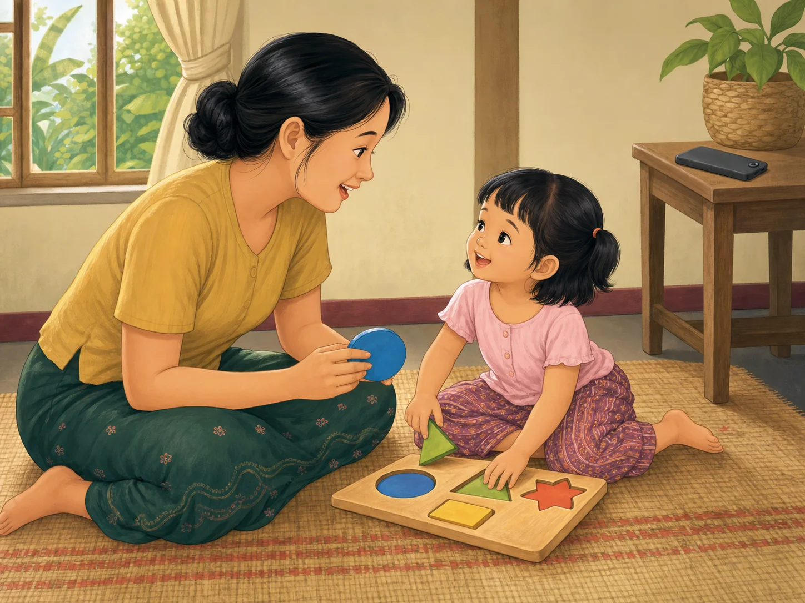

# ACE Child Grow — Published Screen-Time Lesson Illustration Review

Status: **READY FOR OWNER REVIEW — NOT DEPLOYED**

Source of truth: Production Convex `libraryContent`, filtered to `type = lesson`, tag/category `screen_time`, and `clinicalStatus = published`. Read on 2026-08-03. Production contains exactly one matching published record. `ageGroupKey`, separate summary fields, and separate safety guidance are unavailable in the production record.

## Pre-generation review

| Slug | Lesson meaning | Primary visual message | Scene | Must not show | Status |
|---|---|---|---|---|---|
| `lsn_screen_time` | Under age 2, screens should be avoided as much as possible except video calls; for older children, limit time and choose quality content. Real play and face-to-face talk better support development. | One screen slot is replaced with connected, face-to-face caregiver play. | One Myanmar caregiver and one preschool child sit safely at floor level, share warm eye contact, and use one large-piece wooden shape puzzle. One powered-off phone rests out of reach on a side table with its back facing upward. | A child holding or watching a device, a visible or active screen, television, tablet, multiple devices, text, labels, unrelated actions, small choking-size pieces, distress, or punishment. | READY |

## `lsn_screen_time`

- Myanmar title: ဖန်သားပြင်ကြည့်ချိန်ကို သင့်တင့်စွာ စီမံခြင်း
- English title: Balancing screen time
- Myanmar summary: unavailable as a separate field in Production Convex
- English summary: unavailable as a separate field in Production Convex
- Objective: ကလေးများအတွက် ဖန်သားပြင်အသုံးပြုမှု လမ်းညွှန်ချက်များကို သိရှိရန်။ / Know screen-use guidance.
- Myanmar body: အသက် ၂ နှစ်အောက် ကလေးများအတွက် မိသားစုနှင့် ဗီဒီယိုခေါ်ဆိုခြင်းမှလွဲ၍ ဖုန်း၊ တက်ဘလက်နှင့် ရုပ်မြင်သံကြား ကြည့်ချိန်ကို တတ်နိုင်သမျှ ရှောင်ရန် အကြံပြုထားသည်။ အသက်ပိုကြီးသော ကလေးများအတွက်လည်း ကြည့်ချိန်ကို ကန့်သတ်ပြီး အရည်အသွေးကောင်းသည့် အကြောင်းအရာများကို ရွေးချယ်ပေးပါ။ မျက်နှာချင်းဆိုင် ကစားခြင်းနှင့် စကားပြောခြင်းက ကလေးဖွံ့ဖြိုးမှုကို ပိုမို အထောက်အကူပြုသည်။
- English body: Under 2, avoid screens as much as possible (video calls aside). For older children, limit time and choose quality content. Real play and talk are far better for development.
- Takeaway: မျက်နှာချင်းဆိုင် ကစားခြင်းက အမြဲ ပိုကောင်းသည်။ / Real interaction always wins.
- Action today: ယနေ့ ဖန်သားပြင်ကြည့်ချိန်တစ်ချိန်အစား ကလေးနှင့်အတူ ကစားပါ။ / Swap one screen slot for play today.
- Category/tag: `screen_time`
- Age group: unavailable / unassigned in Production Convex; the image uses a preschool child to illustrate the older-child guidance without implying screen use is appropriate for a child under 2.
- Safety guidance: unavailable as a separate production field; the selected scene is floor-level, the phone is powered off and out of reach, and the puzzle pieces are too large to swallow.
- Publication status: `published`
- Asset: `/lessons/screen_time/lsn_screen_time.e95e1e09f4.webp`

## Image QA

- Main lesson meaning is visible: **PASS**
- Primary action matches `actionToday`: **PASS** — one screen slot is visibly put aside in favor of caregiver play
- Child does not hold, watch, or reach for a device: **PASS**
- Phone is powered off, screen-hidden, and out of reach: **PASS**
- Age handling: **PASS** — preschool proportions accurately represent the lesson's older-child guidance; no under-2 screen use is shown
- Anatomy, hands, fingers, legs, and feet: **PASS**
- Facial expressions and gaze: **PASS** — warm, attentive face-to-face connection
- Safe floor-level environment and large puzzle pieces: **PASS**
- No unrelated action, distress, punishment, or unsafe object: **PASS**
- No medical overclaim or stereotype: **PASS**
- No text, label, arrow, logo, UI, or watermark: **PASS**
- Myanmar/Southeast Asian cultural fit: **PASS**
- Soft educational illustration style: **PASS**
- Landscape 4:3 WebP, 1448×1086, 191,508 bytes: **PASS**
- Exact slug mapping with no category fallback: **PASS**

Final result: **READY FOR OWNER REVIEW**

## Engineering verification

- Focused lesson illustration mapping tests: **PASS** — 10 tests
- Full unit test suite: **PASS** — 97 test files, 979 tests
- TypeScript typecheck: **PASS**
- Lint: **PASS**
- Production build: **PASS**
- Exact asset included in the PWA precache: **PASS**
- Missing asset, broken import, or asset-related warning: **NONE**
- Existing React test `act(...)` warnings and Vite bundle chunk-size warning: unrelated to this illustration change

## Running-application verification

- Local application starts and loads meaningful UI: **PASS**
- Vite error overlay: **NONE**
- Browser console errors: **NONE**
- Protected lesson-detail card on local origin: **PENDING AUTHENTICATED CHECK** — the local browser has no signed-in session and correctly shows the login gate
- Desktop/mobile text-and-image card verification: **PENDING OWNER APPROVAL / AUTHENTICATED PRE-DEPLOY CHECK**

Deployment: **NOT ALLOWED / NOT PERFORMED**
