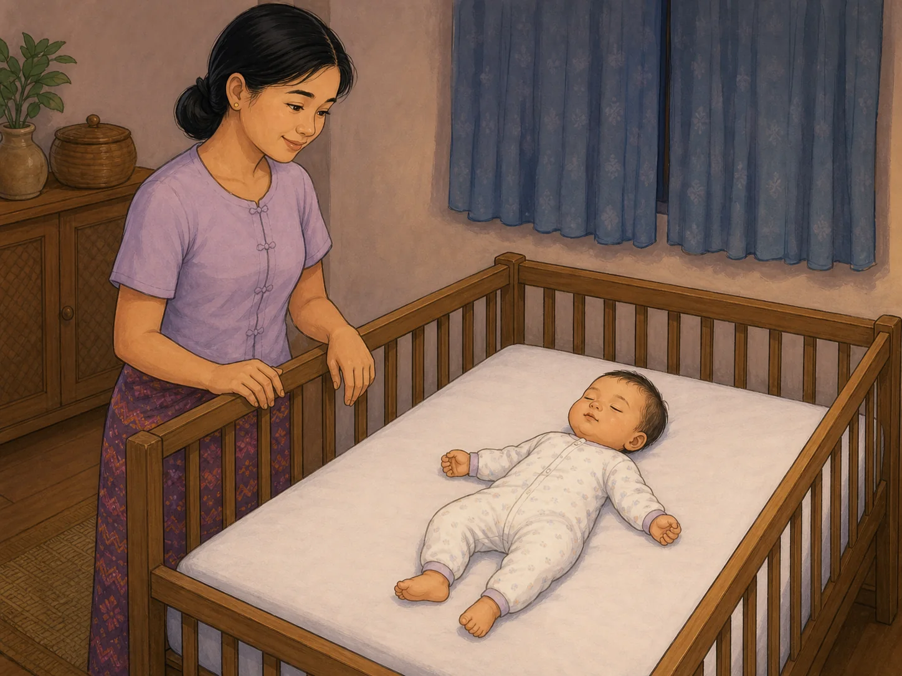

# ACE Child Grow — Published Sleep Lesson Illustration Review

Status: **READY FOR OWNER REVIEW — NOT DEPLOYED**

Source of truth: Production Convex `libraryContent`, filtered to `type = lesson`, tag/category `sleep`, and `clinicalStatus = published`. Read on 2026-08-03. Production contains exactly one matching published record. `ageGroupKey`, separate summary fields, and separate safety guidance are unavailable in the production record; safe-sleep requirements are stated directly in the published Myanmar lesson body.

## Pre-generation review

| Slug | Lesson meaning | Primary visual message | Scene | Must not show | Status |
|---|---|---|---|---|---|
| `lsn_healthy_sleep` | Consistent bedtimes and a calm routine support sleep. A baby under 12 months must sleep on the back on a firm, flat surface with no pillow, blanket, bumper, soft toy, or loose cloth. | The baby sleeps safely on the back in a firm, flat, completely empty crib while the caregiver calmly checks nearby. | One Myanmar caregiver stays outside a wooden crib while one infant under 12 months sleeps on the back in fitted pajamas on a level mattress with a tight fitted sheet. | Side or tummy sleeping, inclined mattress, pillow, blanket, bumper, teddy or stuffed toy, loose cloth, positioner, swaddle, co-sleeping, feeding, bottle, clock, text, numbers, labels, logos, or unrelated actions. | READY |

## `lsn_healthy_sleep`

- Myanmar title: ကျန်းမာသော အိပ်စက်မှု
- English title: Healthy sleep habits
- Myanmar summary: unavailable as a separate field in Production Convex
- English summary: unavailable as a separate field in Production Convex
- Objective: အိပ်ရေးအလေ့အထ ကောင်းများ သိရှိရန်။ / Learn good sleep habits.
- Myanmar body: နေ့စဉ် အိပ်ရာဝင်ချိန်ကို တတ်နိုင်သမျှ တူညီအောင်ထားပြီး ရေချိုးခြင်း၊ စာဖတ်ခြင်း၊ အိပ်ရာဝင်ခြင်းတို့ကို အစဉ်လိုက် ငြိမ်သက်စွာ လုပ်ပေးခြင်းက အိပ်စက်မှုကို ကူညီနိုင်သည်။ အသက် ၁ နှစ်မပြည့်သေးသော ကလေးကို အိပ်ချိန်တိုင်း ကျောပေါ်လှန်၍ မာကျောညီညာသော အိပ်ရာမျက်နှာပြင်ပေါ်တွင် အိပ်စေပါ။ ကလေးအိပ်ရာထဲတွင် ခေါင်းအုံး၊ စောင်ပျော့နှင့် အရုပ်ပျော့များ မထားပါနှင့်။
- English body: Consistent bedtimes and a calm routine (bath–book–bed) help sleep. Babies sleep on the back on a firm flat surface. Keep the room dark, quiet, and cool.
- Takeaway: တည်ငြိမ်ပြီး နေ့စဉ်တူညီသော အိပ်ရာဝင်လုပ်ရိုးလုပ်စဉ်က ကလေးကို အိပ်ချိန်နီးလာပြီဟု နားလည်စေသည်။ / A steady bedtime routine is key.
- Action today: ယနေ့ည အိပ်ချိန်ကို ၁၅ မိနစ် စောစေပါ။ / Move bedtime 15 minutes earlier tonight.
- Category/tag: `sleep`
- Age group: unavailable / unassigned in Production Convex; the image uses an infant under 12 months because the published body explicitly contains infant safe-sleep instructions.
- Safety guidance: unavailable as a separate production field; the published Myanmar body itself requires back sleeping, a firm flat surface, and removal of pillows, soft blankets, and soft toys.
- Publication status: `published`
- Asset: `/lessons/sleep/lsn_healthy_sleep.37bd1e6166.webp`

## Image QA

- Main lesson meaning and most important safety action are visible: **PASS**
- Infant is sleeping on the back: **PASS**
- Mattress is firm, level, and flat: **PASS**
- Crib interior is completely empty except for infant and fitted sheet: **PASS**
- No pillow, blanket, bumper, toy, loose cloth, positioner, or incline: **PASS**
- Caregiver remains outside the crib; no feeding, holding, or co-sleeping: **PASS**
- Age handling: **PASS** — infant proportions match the under-12-month safe-sleep guidance
- Anatomy, hands, fingers, legs, and feet: **PASS**
- Facial expressions: **PASS** — peaceful infant and calm attentive caregiver
- No unrelated action or unsafe object: **PASS**
- No medical overclaim or stereotype: **PASS**
- No text, clock, number, label, arrow, logo, UI, or watermark: **PASS**
- Myanmar/Southeast Asian cultural fit: **PASS**
- Soft hand-drawn 2D educational illustration style: **PASS**
- Landscape 4:3 WebP, 1448×1086, 151,060 bytes: **PASS**
- Exact slug mapping with no category fallback: **PASS**

Final result: **READY FOR OWNER REVIEW**

## Engineering verification

- Focused lesson illustration mapping tests: **PASS** — 12 tests
- Full unit test suite: **PASS** — 97 files, 981 tests
- TypeScript typecheck: **PASS**
- Lint: **PASS**
- Production build: **PASS**
- Exact asset included in the PWA precache: **PASS**
- Missing asset, broken import, or asset-related warning: **PASS** — none found
- Existing React test `act(...)` notices and the existing Vite large-chunk warning are unrelated to this asset change.

## Application verification

- Exact slug-to-image behavior and Previous/Next navigation: **PENDING OWNER-APPROVED PRE-DEPLOY CHECK**
- Authenticated desktop and mobile card screenshots: **PENDING OWNER-APPROVED PRE-DEPLOY CHECK**
- Live cache refresh check: **NOT APPLICABLE — NOT DEPLOYED**

Deployment: **NOT ALLOWED / NOT PERFORMED**
