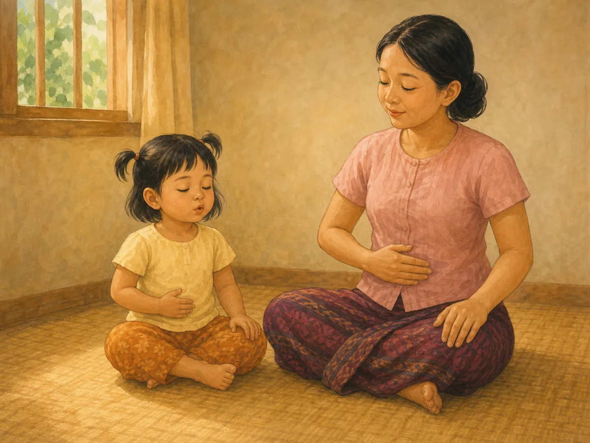
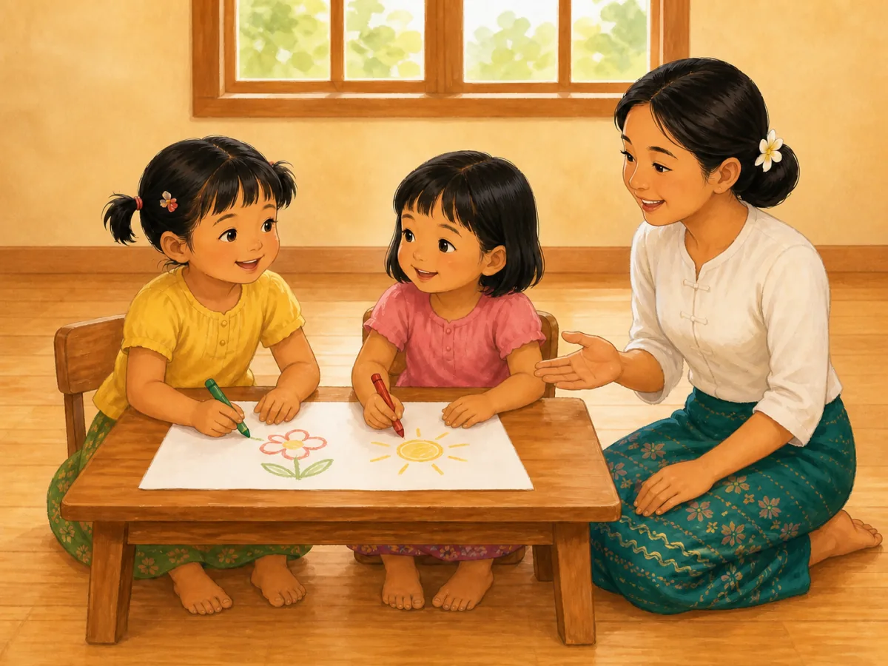

# ACE Child Grow — Published Story Illustration Review

Status: **OWNER APPROVED FOR PRODUCTION — 2026-08-09**

Source of truth: Production Convex `libraryContent`, filtered to exact `type = story` and `clinicalStatus = published`. Read directly from Production on 2026-08-09. Production contains exactly three matching records. Every available field was read; Production remained read only.

All three records are version `1`, `readingLevel = Beginner`, `readingMinutes = 3`, `durationMinutes = 3`, and carry completed education/special-needs professional review. This illustration run does not alter story text, translations, activities, questions, vocabulary, review wording, or Production data.

## Pre-generation review

| Slug | Age | Myanmar title | English title | Exact story meaning | Image scene | Must not show | Status |
|---|---|---|---|---|---|---|---|
| `st_little_seed` | `2y` | မျိုးစေ့ လေးရဲ့ ခရီး | The Little Seed’s Journey | A tiny seed slowly grows with rain and sunlight, first producing two small leaves and later a flower. | A single young flowering seedling emerging from safe garden soil after gentle rain as warm sunlight breaks through; a small cutaway shows the original seed and natural roots below, while exactly two first leaves remain visible. | Child gardening action, eating or mouthing seeds, loose small seeds, tools, chemicals, fantasy face, multiple growth stages, diagram arrows, labels or text. | READY |
| `st_when_i_feel_angry` | `3y` | စိတ်ဆိုးတဲ့အခါ | When I Feel Angry | Mimi notices anger and settles herself through slow deep breathing; feeling angry is accepted rather than punished. | A Myanmar/Southeast Asian 3-year-old sits safely at floor level, one hand resting naturally on the belly while taking a visible slow calming breath; a caregiver beside her gently models the same breathing with a warm accepting expression. | Hitting, throwing, shouting, punishment, restraint, shame, forced smile, counting fingers/numbers, unrelated toys, diagnosis, text or labels. | READY |
| `st_first_day_school` | `4y` | ကျောင်း ပထမနေ့ | My First Day at School | Su-Su begins school feeling a little scared, receives a warm teacher welcome, draws with a new friend, and becomes happy enough to return. | A Myanmar/Southeast Asian 4-year-old Su-Su calmly draws a simple wordless picture beside one new friend at a low preschool table while a smiling female teacher welcomes and supports them nearby; Su-Su now looks relaxed and happy. | Crying crisis, forced separation, distressed parent, older schoolwork, test, uniform logo, written letters/numbers, crowded classroom, unrelated play or multiple story moments. | READY |

## Pre-generation confirmation

- Each scene illustrates one clear published story beat and its exact emotional/educational meaning: **PASS**
- Age, body proportions, posture, independence and setting match `2y`, `3y` and `4y`: **PASS**
- No unrelated developmental action, diagnosis, score or medical claim is included: **PASS**
- Safety constraints are identified, including no loose seeds around a 2-year-old and floor-level calm breathing for the 3-year-old: **PASS**
- Each exact slug will receive one unique landscape 4:3 wordless illustration with no shared/category fallback: **PASS**
- Every concept is understandable without reading: **PASS**

No image was generated before this table was completed.

## Complete Production records used for QA

### `st_little_seed`

- Age/category/status: `2y` / `picture` / `published`
- Summary MM: မျိုးစေ့ငယ်လေးက မိုးရေ၊ နေရောင်ဖြင့် တဖြည်းဖြည်း ကြီးထွားလာပုံ။
- Summary EN: A tiny seed slowly grows with rain and sun.
- Body MM: မျိုးစေ့ငယ်လေးက မြေအောက်မှာ အိပ်နေတယ်။ မိုးရေ ကျလာတော့ ခေါင်းလေး ထောင်လာတယ်။ နေရောင်လေး ထိတော့ အရွက်ငယ် ၂ ရွက် ပေါ်လာတယ်။ တဖြည်းဖြည်း ကြီးလာပြီး ပန်းလေး ပွင့်တယ်။
- Body EN: A little seed slept under the soil. When the rain fell, it lifted its head. When the sun touched it, two tiny leaves appeared. Slowly it grew, and a flower bloomed.
- Question MM/EN: မျိုးစေ့ ကြီးဖို့ ဘာတွေ လိုအပ်လဲ။ / What did the seed need to grow?
- Activity MM/EN: အိမ်မှာ ပဲစေ့ တစ်လုံး စိုက်၍ ကြည့်ပါ။ / Plant a bean at home and watch it grow.
- Vocabulary: မျိုးစေ့ / seed · မိုးရေ / rain · နေရောင် / sunlight
- Review scope/note: `education` — education and special-needs professional review completed; general information only.

### `st_when_i_feel_angry`

- Age/category/status: `3y` / `emotion` / `published`
- Summary MM: စိတ်ဆိုးတဲ့အခါ အသက်ပြင်းပြင်းရှူ၍ ငြိမ်အောင် လုပ်နည်း။
- Summary EN: A gentle way to calm down when angry.
- Body MM: တစ်ခါတစ်ရံ မီမီ စိတ်ဆိုးတယ်။ ခန္ဓာကိုယ်လေး ပူလာတယ်။ မီမီက အသက်ကို ပြင်းပြင်း ရှူ၍ ၁-၂-၃ ရေတွက်တယ်။ ဖြည်းဖြည်းချင်း စိတ်လေး ငြိမ်သွားတယ်။ စိတ်ဆိုးတာ ပုံမှန်ပဲ — ငြိမ်အောင် လုပ်တတ်ရင် ရပါတယ်။
- Body EN: Sometimes Mimi feels angry. Her body feels hot. Mimi breathes in deeply and counts 1-2-3. Slowly, she feels calm. Feeling angry is okay — we can learn to settle it.
- Question MM/EN: စိတ်ဆိုးတဲ့အခါ မီမီ ဘာလုပ်လဲ။ / What did Mimi do when angry?
- Activity MM/EN: အတူတူ အသက်ပြင်းပြင်း ၃ ကြိမ် ရှူ ကြည့်ပါ။ / Take three deep breaths together.
- Vocabulary: စိတ်ဆိုး / angry · ငြိမ် / calm · အသက်ရှူ / breathe
- Review scope/note: `education` — education and special-needs professional review completed; general information only.

### `st_first_day_school`

- Age/category/status: `4y` / `school` / `published`
- Summary MM: ကျောင်းပထမနေ့ စိုးရိမ်စိတ်ကို ရင်းနှီးမှုဖြင့် ကူညီသော ပုံပြင်။
- Summary EN: Easing first-day nerves with warmth.
- Body MM: ယနေ့ ဆုဆုရဲ့ ကျောင်း ပထမနေ့ပါ။ အနည်းငယ် ကြောက်တယ်။ ဆရာမက ပြုံး၍ ကြိုဆိုတယ်။ သူငယ်ချင်းအသစ်လေးနဲ့ အတူ ပုံဆွဲကြတယ်။ နေ့လယ်ရောက်တော့ ဆုဆု ပျော်နေပြီ။ မေမေ ပြန်လာခေါ်တော့ “မနက်ဖြန် ထပ်လာမယ်” လို့ ဆိုတယ်။
- Body EN: Today is Su-Su’s first day at school. She feels a little scared. The teacher smiles and welcomes her. She draws with a new friend. By noon, Su-Su is happy. When Mommy comes, she says, “I’ll come again tomorrow.”
- Question MM/EN: ဆုဆု ကျောင်းမှာ ဘာလုပ်လဲ။ / What did Su-Su do at school?
- Activity MM/EN: ကျောင်းအကြောင်း အပြုသဘော စကားပြောပါ။ / Talk about school in a positive way.
- Vocabulary: ကျောင်း / school · ဆရာမ / teacher · သူငယ်ချင်း / friend
- Review scope/note: `education` — education and special-needs professional review completed; general information only.

## Owner review cards

### `st_little_seed`

- Myanmar title: **မျိုးစေ့ လေးရဲ့ ခရီး**
- English title: **The Little Seed’s Journey**
- Age: **2y**
- Asset: `/stories/st_little_seed.46d4e79b59.webp` — 1200×900, 68,326 bytes

QA: exact story meaning ✓ · age-appropriate visual simplicity ✓ · exactly one connected plant ✓ · one buried seed ✓ · exactly two leaves ✓ · exactly one flower ✓ · rain and sunlight ✓ · natural roots ✓ · no loose seed/tool/person/extra plant ✓ · no text/logo/watermark ✓ · wordless ✓

Rejected candidate: the first output contained several unrelated background plants and flowers and used a more realistic, detailed style that weakened the single-seed focus for a 2-year-old. It was rejected and is not mapped. The corrected output above is the final candidate.

**OWNER APPROVED FOR PRODUCTION — 2026-08-09**

### `st_when_i_feel_angry`

- Myanmar title: **စိတ်ဆိုးတဲ့အခါ**
- English title: **When I Feel Angry**
- Age: **3y**
- Asset: `/stories/st_when_i_feel_angry.939e6bd987.webp` — 1200×900, 98,158 bytes

QA: exact calm-down meaning ✓ · 3-year-old proportions/posture ✓ · slow belly-breath behavior ✓ · accepting caregiver model ✓ · anatomy ✓ · hands/fingers ✓ · legs/feet ✓ · gaze/expression ✓ · floor-level safety ✓ · no tantrum/punishment/restraint/toy/counting/text ✓ · culturally appropriate ✓ · wordless ✓

**OWNER APPROVED FOR PRODUCTION — 2026-08-09**

### `st_first_day_school`

- Myanmar title: **ကျောင်း ပထမနေ့**
- English title: **My First Day at School**
- Age: **4y**
- Asset: `/stories/st_first_day_school.a440d58f45.webp` — 1200×900, 99,886 bytes

QA: exact first-day turning point ✓ · 4-year-old proportions/posture ✓ · drawing with exactly one new friend ✓ · exactly one warm teacher ✓ · relaxed/happy expression ✓ · anatomy ✓ · hands/fingers ✓ · legs/feet ✓ · two chunky crayons ✓ · no separation crisis/crowd/older schoolwork/extra toy/text ✓ · culturally appropriate ✓ · wordless ✓

Rejected candidate: the first output included unrelated background blocks, shelves, plants, baskets and cushions. It was not saved as final. The corrected final retains the approved people, drawing behavior and anatomy while simplifying the classroom to the window, wall and floor only.

**OWNER APPROVED FOR PRODUCTION — 2026-08-09**

## Mapping and application verification

- Three published Production story slugs map directly to three unique versioned WebP files: **PASS**
- Every exact slug resolves to an existing content-hashed file under 500 KB: **PASS**
- Category, age-group, type and unknown slugs do not resolve to a fallback: **PASS**
- Existing remote/shared illustration is suppressed only when an approved exact-slug story image exists: **PASS**
- Myanmar and English title rendering uses the same exact unique asset for every slug: **PASS — 3/3**

## Engineering verification

- Focused mapping and detail-rendering tests: **PASS — 8/8**
- Full unit suite: **PASS — 1,151/1,151 across 119 test files**
- Typecheck: **PASS**
- Lint: **PASS**
- Production build/PWA precache: **PASS — 243 precache entries; no asset warning, missing import or missing file**
- Authenticated application browser verification: **BLOCKED BY LOCAL AUTHENTICATION** — the production build correctly redirected the unauthenticated localhost detail route to sign-in. No authentication control was bypassed and no preview or Production deployment was created. Exact story title/image rendering in both locales is covered by the focused component tests, and every final visual appears in this review document.

## Deployment authorization

Owner approval: **GRANTED ON 2026-08-09**

Final review result: **APPROVED FOR PRODUCTION**
